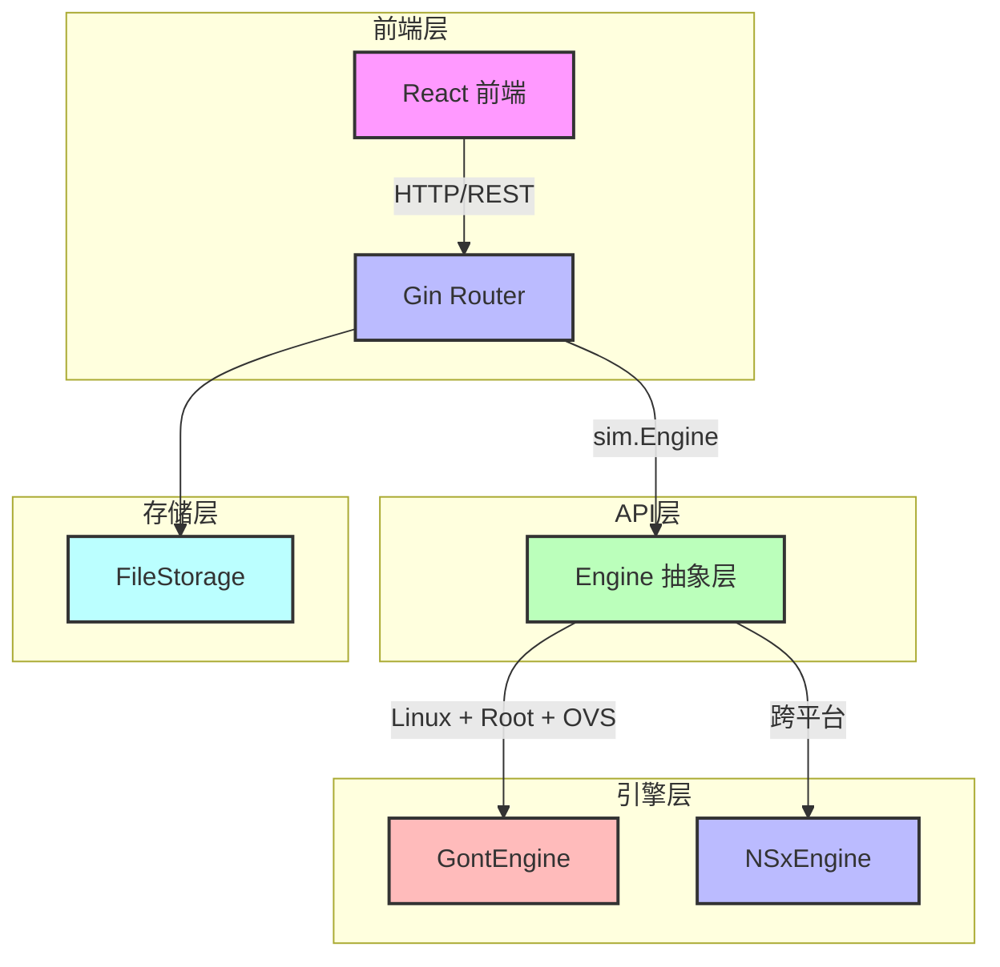

# eNSP Lab - 网络模拟器产品手册

## 目录

1. [产品概述](#一产品概述)
2. [安装与构建](#二安装与构建)
3. [快速入门](#三快速入门)
4. [核心功能详解](#四核心功能详解)
5. [API 参考手册](#五api-参考手册)
6. [配置说明](#六配置说明)
7. [开发者指南](#七开发者指南)
8. [故障排除](#八故障排除)
9. [路线图](#九路线图)

---

## 一、产品概述

### 1.1 项目背景与愿景

eNSP Lab 是一款开源的网络设备模拟器，旨在提供华为 eNSP 的跨平台替代方案。传统的 eNSP 仅支持 Windows 平台，且依赖虚拟网卡驱动和大量系统资源。eNSP Lab 采用纯 Go 语言开发，支持 Windows、Linux 和 macOS 三大平台，通过事件驱动模拟（ns-x）或真实网络命名空间（gont）实现网络设备的仿真。

**核心愿景：**
- 为网络工程师和开发者提供轻量级、跨平台的网络实验环境
- 支持 API 驱动的拓扑编排，便于自动化测试和集成
- 提供真实的网络协议模拟（ICMP、ARP、OSPF、BGP、VXLAN等）

### 1.2 核心能力一览表

| 能力 | 描述 |
|------|------|
| **拓扑编排** | 支持设备和链路的 CRUD 操作，支持多种设备类型（PC、Switch、Router、VTEP等） |
| **跨平台模拟** | Windows/macOS 使用 ns-x 纯 Go 模拟，Linux 自动降级或使用 gont 真实网络命名空间 |
| **API 驱动** | 完整的 RESTful API，支持创建、启动、Ping、抓包等操作 |
| **真实协议** | 支持 ICMP Ping、ARP、OSPF、BGP、VXLAN 等网络协议 |
| **事件流监控** | 通过 SSE 推送网络事件，实时监控数据包流转 |
| **持久化存储** | 拓扑数据自动保存为 JSON 文件，重启后自动加载 |

### 1.3 架构总览



**架构说明：**
- **前端层**：React 单页应用，提供可视化拓扑编辑器和设备管理界面
- **API层**：基于 Gin 框架的 REST API，处理 HTTP 请求和响应
- **引擎层**：核心模拟引擎，支持两种后端模式：
  - **GontEngine**：Linux 专用，使用真实网络命名空间和 Open vSwitch
  - **NSxEngine**：跨平台，使用字节跳动 ns-x 事件驱动模拟库
- **存储层**：基于文件系统的持久化存储，拓扑数据保存为 JSON 文件

---

## 二、安装与构建

### 2.1 系统要求

| 平台 | 最低要求 |
|------|----------|
| **Windows** | Windows 10/11，Go 1.26+ |
| **Linux** | Ubuntu 20.04+ 或其他发行版，Go 1.26+，需要 root 权限和 Open vSwitch |
| **macOS** | macOS 10.15+，Go 1.26+ |

### 2.2 从源码构建

```bash
# 克隆项目
git clone <repository-url>
cd ensp-lab

# 构建二进制文件（包含嵌入式前端）
go build -o ensp-lab cmd/server/main.go

# 运行
./ensp-lab
```

### 2.3 运行前置条件

#### Linux 环境（gont 模式）

```bash
# 安装 Open vSwitch 和 FRRouting
sudo apt update
sudo apt install -y openvswitch-switch frr

# 确保当前用户有 root 权限或 CAP_NET_ADMIN 权限
sudo setcap cap_net_admin=ep ./ensp-lab

# 运行（需要 sudo 或已设置权限）
sudo ./ensp-lab
```

#### Windows/macOS 环境（ns-x 模式）

无需额外依赖，直接运行即可：

```bash
./ensp-lab
```

---

## 三、快速入门

### 3.1 启动服务

```bash
# 启动服务（默认端口 8080）
go run cmd/server/main.go

# 或使用构建好的二进制
./ensp-lab
```

### 3.2 访问前端 UI

打开浏览器访问：`http://localhost:8080`

### 3.3 创建第一个拓扑

#### 使用 curl 创建

```bash
# 创建两台 PC 并连接
curl -X POST http://localhost:8080/api/topology \
  -H "Content-Type: application/json" \
  -d '{
    "name": "My First Topology",
    "nodes": [
      {"id": "pc1", "type": "pc"},
      {"id": "pc2", "type": "pc"}
    ],
    "links": [
      {"source_device": "pc1", "source_port": "eth0", "target_device": "pc2", "target_port": "eth0"}
    ]
  }'
```

**响应示例：**

```json
{
  "id": "abc123",
  "name": "My First Topology",
  "device_count": 2,
  "link_count": 1,
  "created_at": "2026-07-20T10:30:00Z"
}
```

#### 引擎启动（懒加载）

仿真引擎**无需显式启动**：首次调用 Ping 或 CLI 接口时，后端会通过 `getOrCreateEngine` 自动创建并 `eng.Start()`，整张拓扑即"上电"运行。前端无独立的"启动拓扑"按钮。

```bash
# 直接 Ping 即可触发引擎启动（无需先 POST /start）
curl "http://localhost:8080/api/topology/abc123/ping?src=pc1&dst=pc2"
```

#### 测试连通性

```bash
curl "http://localhost:8080/api/topology/abc123/ping?src=pc1&dst=pc2"
```

**响应示例：**

```json
{
  "src": "pc1",
  "dst": "pc2",
  "dst_ip": "192.168.1.2",
  "sent": 1,
  "received": 1,
  "lost": 0,
  "details": ["ICMP echo reply received"]
}
```

---

## 四、核心功能详解

### 4.1 拓扑管理

#### 设备类型

| 类型 | 描述 |
|------|------|
| `pc` | 个人电脑，自动分配 IP 地址 |
| `server` | 服务器，自动分配 IP 地址 |
| `switch` | 二层交换机 |
| `l3switch` | 三层交换机 |
| `router` | 路由器，支持路由协议 |
| `vtep` | VXLAN 隧道端点 |
| `firewall` | 防火墙 |
| `hub` | 集线器 |

#### 链路定义

链路定义包含以下字段：

| 字段 | 类型 | 描述 |
|------|------|------|
| `source_device` | string | 源设备 ID |
| `source_port` | string | 源设备端口（如 eth0） |
| `target_device` | string | 目标设备 ID |
| `target_port` | string | 目标设备端口 |
| `vxlan_vni` | int | VXLAN VNI（可选） |
| `vxlan_peer_list` | []string | VXLAN 对端列表（可选） |

### 4.2 模拟引擎

#### ns-x vs gont 对比

| 特性 | ns-x | gont |
|------|------|------|
| **跨平台** | ✅ Windows/macOS/Linux | ❌ 仅 Linux |
| **真实网络命名空间** | ❌ | ✅ |
| **Open vSwitch** | ❌ | ✅ |
| **FRR 路由** | ❌ | ✅ |
| **性能** | 中等 | 高 |
| **资源占用** | 低 | 高 |
| **权限要求** | 无 | root / CAP_NET_ADMIN |

#### 自动降级机制

引擎启动时会自动检测平台和环境：

1. 如果是 Linux 系统且满足以下条件，使用 gont 模式：
   - 当前用户有 root 权限或 CAP_NET_ADMIN 能力
   - 系统已安装 Open vSwitch（`ovs-vsctl` 可执行）

2. 否则，自动降级为 ns-x 模式：
   - Windows/macOS 默认使用 ns-x
   - Linux 无权限或缺少 OVS 时自动降级

### 4.3 Ping 测试

> **两种方式，结果一致：**
> - **界面"Ping 测试"按钮**：走 `api.pingTopology` → 仿真引擎 `nsxEngine.Ping`，发送**真实 ICMP 报文**做端到端转发验证，结果即真实可达性。
> - **CLI `ping` 命令**：`internal/cli/parser.go` 在链路图上做 BFS 可达性校验（匹配目标 IP 是否属于某台已连接设备），输出 Linux 风格结果。
>
> 两者都基于拓扑**真实 IP**。早期 CLI 曾因写死模板显示假 `192.168.1.x` 而让用户误 ping 不存在的地址，现已统一为拓扑模型真实接口（见 `docs/vxlan_verification_report.md` 第八节）。

#### 前端 Ping 测试面板

点击工具栏「**Ping 测试**」按钮会**打开/关闭**右上角的 Ping 测试面板（不再像早期版本那样固定执行 `vm-1 → vm-3`）：

- **源设备 / 目标设备下拉框**：列出拓扑中**所有设备**（带 IP 括号提示），可自由组合任意两台（如 `leaf-1 → spine-1`、`server-2 → vm-4`）。
- **包数输入框**：默认 4，决定单次测试发送多少个 ICMP 探测（后端 `count` 参数，默认 4、上限 100）。
- **连续 Ping 开关**：打开后前端每隔 1 秒调用一次 `count=1` 的接口，实时累积输出，直到点击「停止」——对应 `ping -t` 行为。
- **输出区**：标准 Linux 风格 `64 bytes from <ip>: icmp_seq=N ttl=64 X.XXms` 明细 + `round-trip min/avg/max` + 丢包率。
- **历史记录**：保存本次会话最近 50 条，格式 `[时间] 源 → 目标 ✅ 成功 (X.XXms) / ❌ 超时`。
- **拓扑联动**：面板打开时，源/目标设备会在画布上显示**橙色高亮光环**；切换拓扑自动停止 Ping 并清空输出。

> 早期版本默认固定验证 `vm-1 → vm-3`（同 BD10 / VNI 5000，经 Spine 跨 Leaf 的 VXLAN 租户互通），现已改为用户自由选取，更能覆盖实际诊断需求。

#### API 参数

| 参数 | 类型 | 必填 | 描述 |
|------|------|------|------|
| `src` | string | ✅ | 源设备 ID |
| `dst` | string | ✅ | 目标设备 ID 或 IP 地址 |
| `count` | int | ❌ | 探测包数，默认 4，最大 100。后端循环调用 `eng.Ping` 并聚合 `sent/received/lost/rtt_ms`，返回标准明细与 `round-trip min/avg/max` |

> 注：示例响应中的 `dst_ip` 为解析后的真实目标 IP（在自带 `vxlan-spine-leaf` 拓扑中租户网段为 `10.0.10.0/24`，如 `10.0.10.30`），而非 `192.168.1.x`。

#### 返回结果字段

| 字段 | 类型 | 描述 |
|------|------|------|
| `src` | string | 源设备 ID |
| `dst` | string | 目标设备 ID |
| `dst_ip` | string | 解析后的目标 IP 地址 |
| `sent` | int | 发送的数据包数量 |
| `received` | int | 收到的回复数量 |
| `lost` | int | 丢失的数据包数量 |
| `details` | []string | 详细结果描述 |

### 4.4 抓包与监控

#### /api/topology/:id/pcap

实时抓包端点，返回 PCAP 格式的数据包流。

**查询参数：**

| 参数 | 类型 | 必填 | 描述 |
|------|------|------|------|
| `device` | string | ✅ | 设备 ID |
| `interface` | string | ✅ | 接口名称（如 eth0） |

**使用示例：**

```bash
curl "http://localhost:8080/api/topology/abc123/pcap?device=pc1&interface=eth0" -o capture.pcap
```

### 4.5 队列监控

#### /api/sim/queue-depth

返回引擎事件队列深度，用于监控模拟性能。

**查询参数：**

| 参数 | 类型 | 必填 | 描述 |
|------|------|------|------|
| `topology` | string | ✅ | 拓扑 ID |

**使用示例：**

```bash
curl "http://localhost:8080/api/sim/queue-depth?topology=abc123"
```

**响应示例：**

```json
{
  "topology": "abc123",
  "queue_depth": 0
}
```

### 4.6 VXLAN 隧道管理

#### 一键创建 VXLAN Spine-Leaf 拓扑

使用 `-demo-vxlan` 参数启动服务时，系统会自动创建并启动一个完整的 VXLAN Spine-Leaf 演示拓扑：

```bash
# 启动服务并创建 VXLAN 演示拓扑
./ensp-lab -demo-vxlan

# 或使用 go run
go run cmd/server/main.go -demo-vxlan
```

**拓扑结构：**

| 设备类型 | 数量 | 描述 |
|----------|------|------|
| Spine 交换机 | 2 | spine-1、spine-2 |
| Leaf 交换机 (VTEP) | 3 | leaf-1 (10.0.10.1)、leaf-2 (10.0.10.2)、leaf-3 (2.2.2.3) |
| 服务器 | 3 | server-1、server-2、server-3 |
| 虚拟机 | 4 | vm-1 (VLAN 10)、vm-2 (VLAN 20)、vm-3 (VLAN 10)、vm-4 (VLAN 10) |

#### VTEP 配置说明

每个 Leaf 交换机作为 VTEP（VXLAN Tunnel Endpoint），配置如下：

| VTEP | IP 地址 | VNI | 头端复制列表 |
|------|---------|-----|-------------|
| leaf-1 | 10.0.10.1 | 5000 | 2.2.2.2, 2.2.2.3 |
| leaf-2 | 10.0.10.2 | 5000 | 2.2.2.3 |
| leaf-3 | 2.2.2.3 | 5000 | - |

**BD (Bridge Domain) 映射：**
- BD 10 → VNI 5000（vm-1、vm-3、vm-4 互通）
- BD 20 → 独立（仅 vm-2 使用）

#### 验证 VXLAN 隧道状态

使用 `/api/topology/:id/vxlan-status` 端点查看隧道状态：

```bash
curl http://localhost:8080/api/topology/vxlan-spine-leaf/vxlan-status
```

**响应示例：**

```json
{
  "topology_id": "vxlan-spine-leaf",
  "total_tunnels": 3,
  "total_vteps": 3,
  "tunnels": [
    {
      "vni": 5000,
      "source": "leaf-1",
      "target": "leaf-2",
      "peer_list": "2.2.2.2",
      "status": "UP"
    },
    {
      "vni": 5000,
      "source": "leaf-1",
      "target": "leaf-3",
      "peer_list": "2.2.2.3",
      "status": "UP"
    },
    {
      "vni": 5000,
      "source": "leaf-2",
      "target": "leaf-3",
      "status": "UP"
    }
  ],
  "vteps": [
    {
      "id": "leaf-1",
      "name": "leaf-1",
      "ip": "10.0.10.1",
      "bds": "5000"
    },
    {
      "id": "leaf-2",
      "name": "leaf-2",
      "ip": "10.0.10.2",
      "bds": "5000"
    },
    {
      "id": "leaf-3",
      "name": "leaf-3",
      "ip": "2.2.2.3",
      "bds": "5000"
    }
  ]
}
```

#### 隔离性测试

**同 VNI 互通测试（预期成功）：**

```bash
# vm-1 ping vm-3（同 VLAN 10，同 VNI 5000）
curl "http://localhost:8080/api/topology/vxlan-spine-leaf/ping?src=vm-1&dst=vm-3"

# vm-1 ping vm-4（同 VLAN 10，同 VNI 5000）
curl "http://localhost:8080/api/topology/vxlan-spine-leaf/ping?src=vm-1&dst=vm-4"
```

**跨 VNI 隔离测试（预期失败）：**

```bash
# vm-1 ping vm-2（不同 VLAN，不同 BD）
curl "http://localhost:8080/api/topology/vxlan-spine-leaf/ping?src=vm-1&dst=vm-2"
```

---

### 4.7 拓扑标注（Annotation）

拓扑标注用于在画布上为拓扑添加文字说明（如 VXLAN 规划、设备角色备注），纯文本（TXT）存储，包含 `text`、`position_x`、`position_y` 字段。

**API：**

| 方法 | 路径 | 说明 |
|------|------|------|
| POST | /api/topologies/:id/annotations | 新增标注（自动生成 ID 与时间戳） |
| PUT | /api/topologies/:id/annotations/:annotationId | 更新标注（可改 text / 坐标） |
| DELETE | /api/topologies/:id/annotations/:annotationId | 删除标注 |

**前端交互：** `AnnotationLayer.tsx` 在画布上叠加 HTML 层，支持拖拽定位、右下角缩放、双击就地编辑、右键/按钮删除，并通过回调与后端同步。也可通过「插入 VXLAN 规划模板」按钮一键预填一段 Spine-Leaf / VNI 5000 / VM 隔离的说明文本（来自 `frontend/src/data/vxlanTemplate.ts`）。

### 4.8 CLI 终端（类华为 eNSP）

每个设备拥有独立的 VRP 风格命令行终端，交互贴近华为 eNSP 模拟器。

**显示规则（双击设备弹出浮动窗口）：**

- 设备 CLI 终端 + 配置信息不再是页面底部固定面板，而是改为**可拖动的浮动小窗口**（类华为 eNSP 设备配置弹出窗口）——双击拓扑图中的设备，或右键设备选择「查看详情」即可弹出。
- 每个设备拥有**独立窗口**（可同时打开多个），双击同一设备不会重复创建，而是聚焦 / 还原已打开的窗口；右上角任务栏列出所有已开窗口（`设备名 ✓`，点击聚焦 / 还原）。
- 窗口可拖动到任意位置（限制在浏览器视口内）、可最小化 / 最大化 / 关闭、右下角拖拽调整大小；窗口位置与大小通过 `localStorage` 持久化（键名 `ensp-lab-windows-<拓扑ID>`），刷新页面后恢复上次布局。
- 单击设备仍是「选中 / 高亮」，与打开窗口互不冲突。

**每设备独立会话历史：**

- 每台设备的命令与输出（含提示符、回显、结果）按设备分别保留，切换设备不会互相覆盖。
- 历史通过 `localStorage` 持久化（键名 `ensp-lab-cli-sessions-<拓扑ID>`），刷新页面后依然存在，可随时回看之前的命令与对应输出。
- 终端内支持 `↑`/`↓` 键浏览本设备的历史命令（按设备独立）；`Ctrl+L` 清屏，`Ctrl+C` 取消当前输入。

**`save` 保存配置（贴近 VRP）：**

```
<leaf-1> save
The current configuration will be written to the device.
Are you sure to continue? [Y/N]y
Now saving the current configuration to the device.
Please wait for a while...
Save the configuration successfully.
```

- `save` 会先弹出 `[Y/N]` 确认，输入 `y`/`yes` 才真正写入**启动配置（startup-configuration）**；输入 `n`/`no` 取消。
- 保存内容生成为 VRP 风格快照（sysname、interface/ip address、vlan、vxlan、静态路由等），可通过 `display saved-configuration` 查看。
- `display startup` 会显示 `Configuration saved: Yes (<时间>)`。
- 保存状态与快照随拓扑 JSON 持久化（`DeviceConfigData.Saved/SavedConfig/SaveTime`），**重启服务后依然保留**。
- `reset saved-configuration` 可清除已保存的配置（同样写回磁盘）。

**相关代码：**

- 前端：`frontend/src/components/CliTerminal.tsx`（每设备 `sessions` 状态）；`FloatWindow.tsx`（浮动窗口容器，含拖拽 / 最小化 / 最大化 / 关闭）、`DeviceDetail.tsx`（窗口内容：CLI / 配置 两 Tab）、`TopologyCanvas.tsx`（`onDoubleClick` / 右键「查看详情」触发 `onOpenDevice`）、`App.tsx`（`windows` / `zMap` 多窗口状态 + 任务栏）。
- 后端：`internal/cli/parser.go` 的 `save` / `display saved-configuration` / `display startup` / `reset saved-configuration`，`doSave()` 生成快照；`internal/topology/model.go` 的 `DeviceConfigData` 新增 `saved/saved_config/save_time` 字段。

### 4.9 左侧面板（设备库 / 连线种类）

原先画布右上角的右侧「拓扑资源」面板已**移除**，所有信息整合进左侧可拖拽宽度的标签栏（默认 280px，拖右边缘分隔条可在 200–460px 间调整）。

左侧面板两个 Tab：

- **设备库**：原「添加」面板，列出可拖拽 / 点击添加的设备类型（带彩色图标），底部含「+ 添加标注」「📋 VXLAN 模板」按钮。
- **连线种类**：上半部为「连线种类选择器」（见 4.9.1），下半部为「连线清单」（见 4.9.2）。

> 说明：早期版本左侧曾有第三个「设备」Tab（列出当前拓扑设备）和一个「连线类型与约束」规则表（LinkRules），现已移除——设备高亮 / 定位直接通过画布点击或连线清单完成，约束规则改为在「连线种类」选择器的提示文案与后端校验中体现。

**布局说明：**

- 右侧无固定面板，所有信息在左侧或顶部工具栏访问，画布区域最大化。
- 切换 Tab 即时生效，数据随拓扑实时同步（增删设备 / 连线后立即反映）。

#### 4.9.1 连线种类选择器（LinkTypes）

「连线种类」Tab 顶部给出一组可选择的连线类型卡片（含「自动」），**每张卡片带线型预览**（实线 / 虚线样本）与简短说明：

- **自动（auto）**：创建连线时不指定类型，由系统按两端设备角色自动推导（见下方约束矩阵）；非法组合直接拒绝并提示「不允许 … 直接连线」。
- **物理链路 / VXLAN 隧道 / 接入链路 / 虚拟接入**：手动固定该类型；若选中的类型与设备组合非法，仍由后端 `addLink` 兜底校验返回 `400` 含中文 message。

**使用方式**：先在「连线种类」里点选一种类型（默认「自动」），再进入顶部工具栏「**连线**」模式，从**源设备按住拖到目标设备松开**即按所选类型创建连线。

**约束矩阵（自动模式按此推导，非法组合前端拒绝 + 后端 400 双重校验）：**

| 源角色 | 目标角色 | 自动推导类型 | 线型 | 默认接口 | 说明 |
|--------|----------|--------------|------|----------|------|
| Spine | Leaf | 物理链路 | 黑色实线 | 10GE1/0/1 | Underlay 互联 |
| Leaf | Leaf | VXLAN 隧道 | 红色虚线 | VNI 5000 | Overlay 隧道 |
| Leaf | Server | 接入链路 | 灰色虚线 | 10GE5/0/1 | VLAN 接入 |
| Server | VM | 虚拟接入 | 灰色虚线 | - | 虚拟机连接 |
| Spine | Spine | 物理链路 | 黑色实线 | 10GE1/0/1 | 核心互联 |
| Leaf | PC | 接入链路 | 灰色虚线 | 10GE5/0/1 | PC 接入 |
| (其他) | (其他) | ❌ 禁止 | - | - | 提示「不允许此类型连线」 |

- 接口命名规范：Spine 侧 `10GE1/0/x`，Leaf 侧 `10GE1/0/x`（或 `10GE5/0/x` 接入）；连线时按设备类型与已用接口**自动分配下一个可用编号**（如 Spine-1 已用 10GE1/0/1~3，则下次分配 10GE1/0/4）。

#### 4.9.2 连线清单（ConnectionList）

- 列出当前拓扑所有连线，每条显示 `源设备 → 目标设备`、`源端口:目标端口`、连线类型（物理链路 / VXLAN 隧道 / 接入链路 / 虚拟接入）以及 VNI（VXLAN 时）。
- **点击清单项**：画布中对应连线高亮（红色），并自动平移视口将其居中定位。
- **× 按钮**：删除该连线（弹确认框，经 `DELETE /api/topologies/:id/links/:linkId` 同步后端并实时刷新）。

#### 4.9.3 拖拽创建与端口分配

- 顶部工具栏「**连线**」按钮进入连线模式后，从**源设备按住拖拽到目标设备松开**即创建连线（非点击两次）。
- 拖拽创建时端口由 `nextAvailablePort()` 自动分配最小未占用接口。
- 自动模式下类型由约束矩阵派生（含 VXLAN 自动分配 VNI 5000+n）；手动模式以「连线种类」所选类型为准，但仍受后端非法组合校验兜底。

**相关代码：**

- 前端容器：`frontend/src/components/LeftPanel.tsx`（两个 Tab：`devices` / `linktypes`）。
- 连线种类选择器：`frontend/src/components/LinkTypes.tsx`（`LINK_TYPE_MODES` 选项数组，含 auto 与四种类型，每张卡片带 `lt-preview` 线型样本 + `lt-label` + `lt-hint-small`）。
- 连线清单：`frontend/src/components/ConnectionList.tsx`（props：`links` / `devices` / `selectedLinkId` / `onSelect` / `onLocate` / `onDelete`）。
- 拖拽连线 + 端口分配：`frontend/src/components/TopologyCanvas.tsx`（link 模式 mousedown 设源、mouseup 命中目标创建；`nextAvailablePort` 取最小未占用接口）。
- 接入：`App.tsx` 的 `LeftPanel` 挂载于 `.device-panel`（宽度走 `leftWidth` inline style + `.panel-resizer` 拖拽）；`linkTypeMode` 状态取代旧 `autoLink`/`manualLinkType`；`handleCreateLink(srcId, srcPort, dstId, dstPort)` 始终按约束校验非法组合，`linkTypeMode==='auto'` 时按矩阵派生类型；`handleLocateLink` 负责视口居中；`handleSelectDevice` 选中设备时 `setSelectedLinkId(null)` 实现互斥高亮。
- 约束逻辑：`frontend/src/types.ts` 的 `isLinkAllowed(srcType, dstType)` + `LINK_TYPE_MODES`（单一数据源，前后端共用角色映射）。
- 样式：`styles.css` 的 `.lp-*`、`.link-types*`、`.lt-*`、`.panel-resizer`、`.lp-connlist` 等系列类。

## 五、API 参考手册

### 5.1 基础信息

| 项目 | 说明 |
|------|------|
| **Base URL** | `http://localhost:8080` |
| **认证** | 无需认证（开发环境） |
| **CORS** | 允许 localhost:5173 和 localhost:8080 |

### 5.2 API 端点列表

#### POST /api/topology

创建简单拓扑（含链路）。

**请求体：**

```json
{
  "name": "string (拓扑名称)",
  "description": "string (可选，描述)",
  "nodes": [
    {
      "id": "string (设备ID)",
      "type": "string (设备类型)",
      "name": "string (可选，显示名称)"
    }
  ],
  "links": [
    {
      "source_device": "string (源设备ID)",
      "source_port": "string (源端口)",
      "target_device": "string (目标设备ID)",
      "target_port": "string (目标端口)"
    }
  ]
}
```

**响应（201 Created）：**

```json
{
  "id": "string (拓扑ID)",
  "name": "string (拓扑名称)",
  "description": "string (描述)",
  "device_count": "int (设备数量)",
  "link_count": "int (链路数量)",
  "created_at": "string (创建时间)"
}
```

> 注：仿真引擎懒加载，首次 Ping / CLI 时自动 `eng.Start()`，**已移除独立的 `POST /api/topology/:id/start` 端点**（前端也无"启动拓扑"按钮）。

#### GET /api/topology/:id/ping

Ping 测试。

**查询参数：**

| 参数 | 类型 | 必填 | 描述 |
|------|------|------|------|
| `src` | string | ✅ | 源设备 ID |
| `dst` | string | ✅ | 目标设备 ID 或 IP |
| `count` | int | ❌ | 探测包数，默认 4，最大 100（循环聚合 sent/received/lost/rtt_ms） |

**响应（200 OK）：**

```json
{
  "src": "string (源设备ID)",
  "dst": "string (目标设备ID)",
  "dst_ip": "string (目标IP)",
  "sent": "int (发送数)",
  "received": "int (接收数)",
  "lost": "int (丢失数)",
  "details": ["string (详细信息)"]
}
```

#### DELETE /api/topologies/:id

删除拓扑。

**响应（204 No Content）：**

无响应体

#### GET /health

健康检查。

**响应（200 OK）：**

```json
{
  "status": "ok",
  "platform": "string (操作系统)",
  "engine_count": "int (引擎数量)",
  "timestamp": "string (时间戳)"
}
```

#### GET /version

版本信息。

**响应（200 OK）：**

```json
{
  "version": "string (版本号)",
  "build_time": "string (构建时间)",
  "status": "ok",
  "platform": "string (操作系统)",
  "engine_count": "int (引擎数量)",
  "timestamp": "string (时间戳)"
}
```

#### GET /api/topologies

获取所有拓扑列表。

**响应（200 OK）：**

```json
[
  {
    "id": "string",
    "name": "string",
    "description": "string",
    "devices": {...},
    "links": [...],
    "created_at": "string"
  }
]
```

#### GET /api/topologies/:id

获取指定拓扑详情。

**响应（200 OK）：**

```json
{
  "id": "string",
  "name": "string",
  "description": "string",
  "devices": {...},
  "links": [...],
  "annotations": [...],
  "created_at": "string"
}
```

#### POST /api/topologies/:id/devices

添加设备。

**请求体：**

```json
{
  "id": "string (设备ID)",
  "name": "string (设备名称)",
  "type": "string (设备类型)"
}
```

#### POST /api/topologies/:id/links

添加链路。

**请求体：**

```json
{
  "source_device": "string",
  "source_port": "string",
  "target_device": "string",
  "target_port": "string"
}
```

#### GET /api/sim/events

SSE 事件流（需要 `topology` 查询参数）。

**使用示例：**

```javascript
const evtSource = new EventSource('/api/sim/events?topology=abc123');
evtSource.addEventListener('packet', function(e) {
  const event = JSON.parse(e.data);
  console.log('Packet event:', event);
});
```

#### GET /api/sim/status

获取引擎状态。

**查询参数：**

| 参数 | 类型 | 必填 | 描述 |
|------|------|------|------|
| `topology` | string | 可选 | 拓扑 ID |

**响应（200 OK）：**

```json
{
  "platform": "string (操作系统)",
  "mode": "string (引擎模式: auto/ns-x/gont)"
}
```

#### 其他常用端点

| 方法 | 路径 | 说明 |
|------|------|------|
| POST | /api/topologies/:id/devices/:deviceId/cli | 执行 VRP CLI 命令（状态记录型，仅 `ping` 真实仿真） |
| GET | /api/devices/types | 获取支持的设备类型列表 |
| GET | /version | 版本与构建信息 |
| GET | /api/topology/:id/pcap | 实时抓包数据流（SSE，?device=&interface=） |
| POST | /api/topologies/:id/simulate-packet | 包路径模拟（BFS 计算） |
| GET | /api/sim/queue-depth | 事件队列深度（?topology=） |
| GET | /api/topology/:id/vxlan-status | VXLAN 隧道状态 |
| POST | /api/topology/:id/router/:device/ospf | 下发 OSPF 配置（FRR/Linux） |
| POST | /api/topology/:id/router/:device/bgp | 下发 BGP 配置（FRR/Linux） |
| GET | /api/topology/:id/router/:device/routes | 读取路由表（FRR/Linux） |

> FRR 相关端点在非 Linux 平台或未使用 gont 引擎时返回 `501 Not Implemented`。

---

## 六、配置说明

### 6.1 命令行参数

| 参数 | 类型 | 默认值 | 描述 |
|------|------|--------|------|
| `-port` | string | 8080 | 服务端口（可被 PORT 环境变量覆盖） |
| `-data-dir` | string | ./data | 存储目录（可被 DATA_DIR 环境变量覆盖） |
| `-log-level` | string | info | 日志级别：debug, info, warn, error |
| `-log-format` | string | console | 日志格式：console, json |
| `-demo-vxlan` | bool | false | 启动时自动创建并启动 VXLAN Spine-Leaf 演示拓扑 |

### 6.2 环境变量

| 变量名 | 描述 |
|--------|------|
| `PORT` | 服务端口 |
| `DATA_DIR` | 存储目录 |

### 6.3 配置示例

```bash
# 使用命令行参数
./ensp-lab -port 9090 -data-dir /var/lib/ensp-lab -log-level debug

# 使用环境变量
export PORT=9090
export DATA_DIR=/var/lib/ensp-lab
./ensp-lab

# 启动 VXLAN 演示拓扑
./ensp-lab -demo-vxlan
```

---

## 七、开发者指南

### 7.1 项目目录结构

```
ensp-lab/
├── cmd/                    # 应用入口
│   └── server/             # HTTP 服务入口
│       └── main.go
├── internal/               # 内部包（不对外导出）
│   ├── api/                # REST API 层（handler 已按资源拆分）
│   │   ├── router.go            # Gin 路由注册（NewRouter）
│   │   ├── topology_handlers.go # 拓扑 CRUD
│   │   ├── device_handlers.go   # 设备 CRUD / 电源 / 设备类型
│   │   ├── link_handlers.go     # 链路 CRUD
│   │   ├── cli_handlers.go      # VRP CLI 执行
│   │   ├── annotation_handlers.go # 标注 CRUD
│   │   ├── system_handlers.go   # /health、/version
│   │   ├── vxlan_topo.go        # VXLAN 演示拓扑
│   │   └── api_types.go
│   ├── cli/                # 设备命令行接口模拟
│   │   ├── parser.go / capabilities.go / host.go / state.go / tools.go
│   ├── logging/            # 结构化日志（zap）
│   ├── protocol/           # 协议实现（20+ 协议）
│   ├── router/             # FRR 路由器集成（仅 Linux）
│   ├── sim/                # 模拟引擎核心
│   │   ├── engine.go       # Engine 接口定义
│   │   ├── engine_nsx.go   # ns-x 引擎实现
│   │   ├── gont_emulator.go # gont 引擎实现
│   │   └── platform.go     # 引擎工厂和平台检测
│   ├── storage/            # 存储层
│   │   ├── file_storage.go # 文件存储（JSON 持久化）
│   │   └── memory.go       # 内存存储
│   ├── testutil/           # 测试工具
│   └── topology/           # 拓扑模型
│       ├── model.go        # 设备、链路、标注等数据结构
│       ├── graph.go        # 图可视化类型
│       └── manager.go      # 拓扑管理器（线程安全）
├── data/                   # 拓扑持久化目录（默认 ./data，*.json）
│   └── vxlan-spine-leaf.json # VXLAN 演示拓扑种子
├── docs/                   # 文档
├── frontend/               # React + TypeScript 前端
│   ├── src/
│   │   ├── components/     # TopologyCanvas / AnnotationLayer / CliTerminal / PacketAnimator ...
│   │   └── data/vxlanTemplate.ts # VXLAN 规划模板
│   └── dist/               # 构建产物（由 embed.go 嵌入）
├── archive/                # 归档的废弃代码（//go:build ignore）
├── embed.go                # 静态文件嵌入（//go:embed frontend/dist）
├── go.mod                  # Go 模块依赖
└── Makefile                # 构建和测试命令
```

> 注：早期文档中的 `pkg/`（含 `pkg/api`、`pkg/topology`、`pkg/ensp`、`pkg/utils`）与 `web/` 目录**已移除**，前端静态资源统一为 `frontend/dist` 并通过 `embed.go` 内嵌。API handler 已从单一 `router.go` 拆分为多个 `*_handlers.go` 文件，`router.go` 仅保留 `NewRouter()` 路由注册，`internal/api` 可正常编译，根目录 `ensp-lab.exe` 为最新构建（含嵌入前端）。

### 7.2 扩展新设备类型

扩展新设备类型需要在以下文件中进行修改：

1. **internal/topology/model.go** - 添加设备类型常量
2. **internal/sim/engine_nsx.go** - 在 `createDevice()` 函数中添加设备处理逻辑
3. **internal/api/router.go** - 在 `getDeviceTypes()` 函数中注册新类型

### 7.3 运行测试

#### 单元测试

```bash
# 运行所有单元测试
go test -v -timeout 30s ./...

# 运行指定包的测试
go test -v -timeout 30s ./internal/sim/...
```

#### 集成测试

```bash
# 运行集成测试（需要 -tags=integration）
go test -v -timeout 60s -tags=integration ./internal/api/...
```

#### Race 检测

```bash
go test -race ./...
```

### 7.4 调试工具链

#### pprof

已内置集成，访问地址：`http://localhost:8080/debug/pprof/`

```bash
# CPU 分析
go tool pprof http://localhost:8080/debug/pprof/profile?seconds=30

# 内存分析
go tool pprof http://localhost:8080/debug/pprof/heap

# Goroutine 分析
go tool pprof http://localhost:8080/debug/pprof/goroutine
```

#### Delve

```bash
# 安装
go install github.com/go-delve/delve/cmd/dlv@latest

# 调试
dlv debug ./cmd/server -- -port=8080
```

#### staticcheck

```bash
# 安装
go install honnef.co/go/tools/cmd/staticcheck@latest

# 运行静态检查
staticcheck ./...
```

#### go-callvis

```bash
# 安装（需要 graphviz）
go install github.com/ofabry/go-callvis@latest

# 生成调用图
go-callvis -http=:7878 ./cmd/server
```

---

## 八、故障排除

### 8.1 常见问题及解决方案

#### 端口被占用

```bash
# 查找占用端口的进程
netstat -ano | findstr :8080

# 终止进程（Windows）
taskkill /PID <PID> /F

# 终止进程（Linux/macOS）
kill -9 <PID>
```

#### Linux 权限不足

**问题：** `gont requires root privileges (CAP_NET_ADMIN)`

**解决方案：**

```bash
# 方案一：使用 sudo
sudo ./ensp-lab

# 方案二：设置 CAP_NET_ADMIN 能力
sudo setcap cap_net_admin=ep ./ensp-lab
```

#### OVS 未安装

**问题：** `gont requires Open vSwitch, ovs-vsctl not found`

**解决方案：**

```bash
sudo apt install openvswitch-switch
```

#### 测试资源泄露

**问题：** 测试异常退出导致 goroutine 堆积或 netns 残留

**解决方案：**

```bash
# Linux：检查和清理残留 netns
lsns -t net | wc -l
ip netns list

# 清理超过 10 分钟的残留 netns
for ns in $(ip netns list 2>/dev/null); do
    if [[ $(ip netns exec $ns date +%s 2>/dev/null) -lt $(date -d '-10 minutes' +%s) ]]; then
        ip netns del $ns
    fi
done
```

### 8.2 日志分析指南

#### 设置 debug 日志级别

```bash
./ensp-lab -log-level debug -log-format console
```

#### 关键日志模式

| 日志模式 | 含义 |
|----------|------|
| `engine mode=gont` | 使用真实网络命名空间 |
| `engine mode=ns-x` | 使用事件驱动模拟 |
| `running in simulation-only mode` | 自动降级为 ns-x 模式 |
| `Created default topology` | 默认拓扑创建成功 |
| `Topology loaded` | 已加载的拓扑信息 |

---

## 九、路线图

### 已实现

- ✅ 基础拓扑管理（设备、链路 CRUD）
- ✅ ICMP Ping 测试（真实端到端可达性）
- ✅ ns-x 跨平台模拟引擎
- ✅ gont Linux 真实网络模拟
- ✅ 自动引擎降级机制
- ✅ 文件持久化存储（JSON，重启自动加载）
- ✅ RESTful API（含标注、CLI、版本、设备类型、仿真状态等端点）
- ✅ Web 前端 UI（拓扑画布 + Ping + 标注层）
- ✅ VXLAN Spine-Leaf 支持（`-demo-vxlan` + 前端规划模板）
- ✅ 拓扑标注（Annotation）层
- ✅ 20+ 协议建模（OSPF/BGP/VXLAN/ACL/IPsec/STP/LLDP/DHCP/DNS/HTTP/FTP/SMTP/MPLS/PPP 等）
- ✅ SSE 仿真事件流 + 队列深度监控
- ✅ Linux + FRR 真实下发 OSPF/BGP（gont 模式）
- ✅ CLI 终端：每设备独立命令历史（持久化）、`save` 保存配置（VRP Y/N 确认 + `display saved-configuration`）；双击设备 / 右键「查看详情」弹出可拖动的浮动窗口（类 eNSP），支持多窗口、最小化 / 最大化 / 关闭、位置持久化
- ✅ 左侧面板 2 Tab（设备库 / 连线种类）：连线种类选择器含 auto + 4 种线路、拖拽创建链路自动分配端口；右上角浮动窗口任务栏（设备名 ✓ 点击聚焦）

### 计划中

| 特性 | 优先级 | 描述 |
|------|--------|------|
| **OSPF 动态路由** | 高 | 在 gont 模式下支持 OSPF 路由协议 |
| **BGP 动态路由** | 高 | 在 gont 模式下支持 BGP 路由协议 |
| **CLI 工具** | 中 | 提供命令行工具管理拓扑 |
| **链路状态管理** | 中 | 支持链路 UP/DOWN 状态切换 |
| **性能优化** | 中 | 优化大规模拓扑的模拟性能 |
| **容器化部署** | 低 | 提供 Docker 镜像 |
| **多租户支持** | 低 | 支持多用户隔离 |

---

**文档版本：** v1.0  
**生成日期：** 2026-07-20  
**项目状态：** 开发中