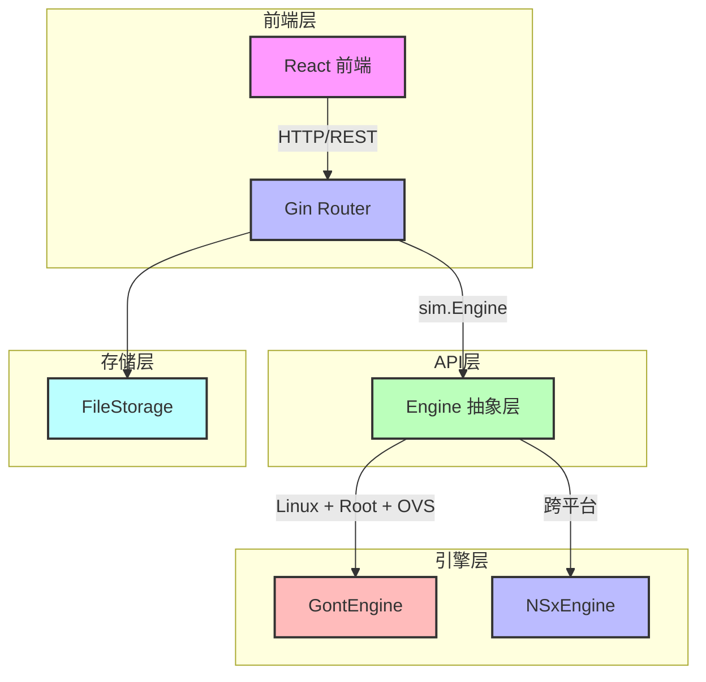

# eNSP Lab - 网络模拟器产品手册

## 目录

1. [产品概述](#一产品概述)
2. [安装与构建](#二安装与构建)
3. [快速入门](#三快速入门)
4. [核心功能详解](#四核心功能详解)
5. [API 参考手册](#五api-参考手册)
6. [配置说明](#六配置说明)
7. [开发者指南](#七开发者指南)
8. [故障排除](#八故障排除)
9. [路线图](#九路线图)

---

## 一、产品概述

### 1.1 项目背景与愿景

eNSP Lab 是一款开源的网络设备模拟器，旨在提供华为 eNSP 的跨平台替代方案。传统的 eNSP 仅支持 Windows 平台，且依赖虚拟网卡驱动和大量系统资源。eNSP Lab 采用纯 Go 语言开发，支持 Windows、Linux 和 macOS 三大平台，通过事件驱动模拟（ns-x）或真实网络命名空间（gont）实现网络设备的仿真。

**核心愿景：**
- 为网络工程师和开发者提供轻量级、跨平台的网络实验环境
- 支持 API 驱动的拓扑编排，便于自动化测试和集成
- 提供真实的网络协议模拟（ICMP、ARP、OSPF、BGP、VXLAN等）

### 1.2 核心能力一览表

| 能力 | 描述 |
|------|------|
| **拓扑编排** | 支持设备和链路的 CRUD 操作，支持多种设备类型（PC、Switch、Router、VTEP等） |
| **跨平台模拟** | Windows/macOS 使用 ns-x 纯 Go 模拟，Linux 自动降级或使用 gont 真实网络命名空间 |
| **API 驱动** | 完整的 RESTful API，支持创建、启动、Ping、抓包等操作 |
| **真实协议** | 支持 ICMP Ping、ARP、OSPF、BGP、VXLAN 等网络协议 |
| **事件流监控** | 通过 SSE 推送网络事件，实时监控数据包流转 |
| **持久化存储** | 拓扑数据自动保存为 JSON 文件，重启后自动加载 |

### 1.3 架构总览



**架构说明：**
- **前端层**：React 单页应用，提供可视化拓扑编辑器和设备管理界面
- **API层**：基于 Gin 框架的 REST API，处理 HTTP 请求和响应
- **引擎层**：核心模拟引擎，支持两种后端模式：
  - **GontEngine**：Linux 专用，使用真实网络命名空间和 Open vSwitch
  - **NSxEngine**：跨平台，使用字节跳动 ns-x 事件驱动模拟库
- **存储层**：基于文件系统的持久化存储，拓扑数据保存为 JSON 文件

---

## 二、安装与构建

### 2.1 系统要求

| 平台 | 最低要求 |
|------|----------|
| **Windows** | Windows 10/11，Go 1.26+ |
| **Linux** | Ubuntu 20.04+ 或其他发行版，Go 1.26+，需要 root 权限和 Open vSwitch |
| **macOS** | macOS 10.15+，Go 1.26+ |

### 2.2 从源码构建

> **版本注入约定**：推荐 `make build`（Linux/macOS）或 `.\build.ps1`（Windows），二者经 `-ldflags` 向 `internal/buildinfo` 注入版本（详见 7.5.1）。直接 `go build` 虽能编译，但**跳过版本注入**，使 `/version` 自报 `stale=true`——仅本地临时调试、不在意版本号时可容忍。此外 `go build` 不会自动构建前端，需先用 `make build` / `.\build.ps1` 或手动 `cd frontend && npm install && npm run build` 生成 `frontend/dist`。

```bash
# 克隆项目
git clone <repository-url>
cd ensp-lab

# 推荐：经构建脚本注入版本（并自动构建前端）
make build            # Linux/macOS
# 或（Windows）
.\build.ps1

# 快速本地调试（跳过版本注入，/version 显示 stale=true；需 frontend/dist 已存在）
go build -o ensp-lab cmd/server/main.go

# 运行
./ensp-lab
```

### 2.3 运行前置条件

#### Linux 环境（gont 模式）

```bash
# 安装 Open vSwitch 和 FRRouting
sudo apt update
sudo apt install -y openvswitch-switch frr

# 确保当前用户有 root 权限或 CAP_NET_ADMIN 权限
sudo setcap cap_net_admin=ep ./ensp-lab

# 运行（需要 sudo 或已设置权限）
sudo ./ensp-lab
```

#### Windows/macOS 环境（ns-x 模式）

无需额外依赖，直接运行即可：

```bash
./ensp-lab
```

---

## 三、快速入门

### 3.1 启动服务

```bash
# 启动服务（默认端口 8080）
go run cmd/server/main.go

# 或使用构建好的二进制
./ensp-lab
```

### 3.2 访问前端 UI

打开浏览器访问：`http://localhost:8080`（默认端口 8080，可用 `-port` 或 `PORT` 修改，详见第六章）。前端采用相对路径访问 API，故改端口后无需任何前端改动。

### 3.3 创建第一个拓扑

#### 使用 curl 创建

```bash
# 创建两台 PC 并连接
curl -X POST http://localhost:8080/api/topology \
  -H "Content-Type: application/json" \
  -d '{
    "name": "My First Topology",
    "nodes": [
      {"id": "pc1", "type": "pc"},
      {"id": "pc2", "type": "pc"}
    ],
    "links": [
      {"source_device": "pc1", "source_port": "eth0", "target_device": "pc2", "target_port": "eth0"}
    ]
  }'
```

**响应示例：**

```json
{
  "id": "abc123",
  "name": "My First Topology",
  "device_count": 2,
  "link_count": 1,
  "created_at": "2026-07-20T10:30:00Z"
}
```

#### 引擎启动（懒加载）

仿真引擎**无需显式启动**：首次调用 Ping 或 CLI 接口时，后端会通过 `getOrCreateEngine` 自动创建并 `eng.Start()`，整张拓扑即"上电"运行。前端无独立的"启动拓扑"按钮。

```bash
# 直接 Ping 即可触发引擎启动（无需先 POST /start）
curl "http://localhost:8080/api/topology/abc123/ping?src=pc1&dst=pc2"
```

#### 测试连通性

```bash
curl "http://localhost:8080/api/topology/abc123/ping?src=pc1&dst=pc2"
```

**响应示例：**

```json
{
  "src": "pc1",
  "dst": "pc2",
  "dst_ip": "192.168.1.2",
  "sent": 1,
  "received": 1,
  "lost": 0,
  "details": ["ICMP echo reply received"]
}
```

---

## 四、核心功能详解

### 4.1 拓扑管理

#### 设备类型

| 类型 | 描述 |
|------|------|
| `pc` | 个人电脑，自动分配 IP 地址 |
| `server` | 服务器，自动分配 IP 地址 |
| `switch` | 二层交换机 |
| `l3switch` | 三层交换机 |
| `router` | 路由器，支持路由协议 |
| `vtep` | VXLAN 隧道端点 |
| `firewall` | 防火墙 |
| `hub` | 集线器 |

#### 链路定义

链路定义包含以下字段：

| 字段 | 类型 | 描述 |
|------|------|------|
| `source_device` | string | 源设备 ID |
| `source_port` | string | 源设备端口（如 eth0） |
| `target_device` | string | 目标设备 ID |
| `target_port` | string | 目标设备端口 |
| `vxlan_vni` | int | VXLAN VNI（可选） |
| `vxlan_peer_list` | []string | VXLAN 对端列表（可选） |

### 4.2 模拟引擎

#### ns-x vs gont 对比

| 特性 | ns-x | gont |
|------|------|------|
| **跨平台** | ✅ Windows/macOS/Linux | ❌ 仅 Linux |
| **真实网络命名空间** | ❌ | ✅ |
| **Open vSwitch** | ❌ | ✅ |
| **FRR 路由** | ❌ | ✅ |
| **性能** | 中等 | 高 |
| **资源占用** | 低 | 高 |
| **权限要求** | 无 | root / CAP_NET_ADMIN |

#### 自动降级机制

引擎启动时会自动检测平台和环境：

1. 如果是 Linux 系统且满足以下条件，使用 gont 模式：
   - 当前用户有 root 权限或 CAP_NET_ADMIN 能力
   - 系统已安装 Open vSwitch（`ovs-vsctl` 可执行）

2. 否则，自动降级为 ns-x 模式：
   - Windows/macOS 默认使用 ns-x
   - Linux 无权限或缺少 OVS 时自动降级

### 4.3 Ping 测试

> **两种方式，结果一致：**
> - **界面"Ping 测试"按钮**：走 `api.pingTopology` → 仿真引擎 `nsxEngine.Ping`，发送**真实 ICMP 报文**做端到端转发验证，结果即真实可达性。
> - **CLI `ping` 命令**：`internal/cli/parser.go` 在链路图上做 BFS 可达性校验（匹配目标 IP 是否属于某台已连接设备），输出 Linux 风格结果。
>
> 两者都基于拓扑**真实 IP**。早期 CLI 曾因写死模板显示假 `192.168.1.x` 而让用户误 ping 不存在的地址，现已统一为拓扑模型真实接口（见 `docs/vxlan_verification_report.md` 第八节）。

#### 前端 Ping 测试面板

点击工具栏「**Ping 测试**」按钮会**打开/关闭**右上角的 Ping 测试面板（不再像早期版本那样固定执行 `vm-1 → vm-3`）：

- **源设备 / 目标设备下拉框**：列出拓扑中**所有设备**（带 IP 括号提示），可自由组合任意两台（如 `leaf-1 → spine-1`、`server-2 → vm-4`）。
- **包数输入框**：默认 4，决定单次测试发送多少个 ICMP 探测（后端 `count` 参数，默认 4、上限 100）。
- **连续 Ping 开关**：打开后前端每隔 1 秒调用一次 `count=1` 的接口，实时累积输出，直到点击「停止」——对应 `ping -t` 行为。
- **输出区**：标准 Linux 风格 `64 bytes from <ip>: icmp_seq=N ttl=64 X.XXms` 明细 + `round-trip min/avg/max` + 丢包率。
- **历史记录**：保存本次会话最近 50 条，格式 `[时间] 源 → 目标 ✅ 成功 (X.XXms) / ❌ 超时`。
- **拓扑联动**：面板打开时，源/目标设备会在画布上显示**橙色高亮光环**；切换拓扑自动停止 Ping 并清空输出。

> 早期版本默认固定验证 `vm-1 → vm-3`（同 BD10 / VNI 5000，经 Spine 跨 Leaf 的 VXLAN 租户互通），现已改为用户自由选取，更能覆盖实际诊断需求。

#### API 参数

| 参数 | 类型 | 必填 | 描述 |
|------|------|------|------|
| `src` | string | ✅ | 源设备 ID |
| `dst` | string | ✅ | 目标设备 ID 或 IP 地址 |
| `count` | int | ❌ | 探测包数，默认 4，最大 100。后端循环调用 `eng.Ping` 并聚合 `sent/received/lost/rtt_ms`，返回标准明细与 `round-trip min/avg/max` |

> 注：示例响应中的 `dst_ip` 为解析后的真实目标 IP（在自带 `vxlan-spine-leaf` 拓扑中租户网段为 `10.0.10.0/24`，如 `10.0.10.30`），而非 `192.168.1.x`。

#### 返回结果字段

| 字段 | 类型 | 描述 |
|------|------|------|
| `src` | string | 源设备 ID |
| `dst` | string | 目标设备 ID |
| `dst_ip` | string | 解析后的目标 IP 地址 |
| `sent` | int | 发送的数据包数量 |
| `received` | int | 收到的回复数量 |
| `lost` | int | 丢失的数据包数量 |
| `details` | []string | 详细结果描述 |

### 4.4 抓包与监控

#### /api/topology/:id/pcap

实时抓包端点，返回 PCAP 格式的数据包流。

**查询参数：**

| 参数 | 类型 | 必填 | 描述 |
|------|------|------|------|
| `device` | string | ✅ | 设备 ID |
| `interface` | string | ✅ | 接口名称（如 eth0） |

**使用示例：**

```bash
curl "http://localhost:8080/api/topology/abc123/pcap?device=pc1&interface=eth0" -o capture.pcap
```

### 4.5 队列监控

#### /api/sim/queue-depth

返回引擎事件队列深度，用于监控模拟性能。

**查询参数：**

| 参数 | 类型 | 必填 | 描述 |
|------|------|------|------|
| `topology` | string | ✅ | 拓扑 ID |

**使用示例：**

```bash
curl "http://localhost:8080/api/sim/queue-depth?topology=abc123"
```

**响应示例：**

```json
{
  "topology": "abc123",
  "queue_depth": 0
}
```

### 4.6 VXLAN 隧道管理

#### 一键创建 VXLAN Spine-Leaf 拓扑

使用 `-demo-vxlan` 参数启动服务时，系统会自动创建并启动一个完整的 VXLAN Spine-Leaf 演示拓扑：

```bash
# 启动服务并创建 VXLAN 演示拓扑
./ensp-lab -demo-vxlan

# 或使用 go run
go run cmd/server/main.go -demo-vxlan
```

**拓扑结构：**

| 设备类型 | 数量 | 描述 |
|----------|------|------|
| Spine 交换机 | 2 | spine-1、spine-2 |
| Leaf 交换机 (VTEP) | 3 | leaf-1 (10.0.10.1)、leaf-2 (10.0.10.2)、leaf-3 (2.2.2.3) |
| 服务器 | 3 | server-1、server-2、server-3 |
| 虚拟机 | 4 | vm-1 (VLAN 10)、vm-2 (VLAN 20)、vm-3 (VLAN 10)、vm-4 (VLAN 10) |

#### VTEP 配置说明

每个 Leaf 交换机作为 VTEP（VXLAN Tunnel Endpoint），配置如下：

| VTEP | IP 地址 | VNI | 头端复制列表 |
|------|---------|-----|-------------|
| leaf-1 | 10.0.10.1 | 5000 | 2.2.2.2, 2.2.2.3 |
| leaf-2 | 10.0.10.2 | 5000 | 2.2.2.3 |
| leaf-3 | 2.2.2.3 | 5000 | - |

**BD (Bridge Domain) 映射：**
- BD 10 → VNI 5000（vm-1、vm-3、vm-4 互通）
- BD 20 → 独立（仅 vm-2 使用）

#### 验证 VXLAN 隧道状态

使用 `/api/topology/:id/vxlan-status` 端点查看隧道状态：

```bash
curl http://localhost:8080/api/topology/vxlan-spine-leaf/vxlan-status
```

**响应示例：**

```json
{
  "topology_id": "vxlan-spine-leaf",
  "total_tunnels": 3,
  "total_vteps": 3,
  "tunnels": [
    {
      "vni": 5000,
      "source": "leaf-1",
      "target": "leaf-2",
      "peer_list": "2.2.2.2",
      "status": "UP"
    },
    {
      "vni": 5000,
      "source": "leaf-1",
      "target": "leaf-3",
      "peer_list": "2.2.2.3",
      "status": "UP"
    },
    {
      "vni": 5000,
      "source": "leaf-2",
      "target": "leaf-3",
      "status": "UP"
    }
  ],
  "vteps": [
    {
      "id": "leaf-1",
      "name": "leaf-1",
      "ip": "10.0.10.1",
      "bds": "5000"
    },
    {
      "id": "leaf-2",
      "name": "leaf-2",
      "ip": "10.0.10.2",
      "bds": "5000"
    },
    {
      "id": "leaf-3",
      "name": "leaf-3",
      "ip": "2.2.2.3",
      "bds": "5000"
    }
  ]
}
```

#### 隔离性测试

**同 VNI 互通测试（预期成功）：**

```bash
# vm-1 ping vm-3（同 VLAN 10，同 VNI 5000）
curl "http://localhost:8080/api/topology/vxlan-spine-leaf/ping?src=vm-1&dst=vm-3"

# vm-1 ping vm-4（同 VLAN 10，同 VNI 5000）
curl "http://localhost:8080/api/topology/vxlan-spine-leaf/ping?src=vm-1&dst=vm-4"
```

**跨 VNI 隔离测试（预期失败）：**

```bash
# vm-1 ping vm-2（不同 VLAN，不同 BD）
curl "http://localhost:8080/api/topology/vxlan-spine-leaf/ping?src=vm-1&dst=vm-2"
```

---

### 4.7 拓扑标注（Annotation）

拓扑标注用于在画布上为拓扑添加文字说明（如 VXLAN 规划、设备角色备注），纯文本（TXT）存储，包含 `text`、`position_x`、`position_y` 字段。

**API：**

| 方法 | 路径 | 说明 |
|------|------|------|
| POST | /api/topologies/:id/annotations | 新增标注（自动生成 ID 与时间戳） |
| PUT | /api/topologies/:id/annotations/:annotationId | 更新标注（可改 text / 坐标） |
| DELETE | /api/topologies/:id/annotations/:annotationId | 删除标注 |

**前端交互：** `AnnotationLayer.tsx` 在画布上叠加 HTML 层，支持拖拽定位、右下角缩放、双击就地编辑、右键/按钮删除，并通过回调与后端同步。也可通过「插入 VXLAN 规划模板」按钮一键预填一段 Spine-Leaf / VNI 5000 / VM 隔离的说明文本（来自 `frontend/src/data/vxlanTemplate.ts`）。

### 4.8 CLI 终端（类华为 eNSP）

每个设备拥有独立的 VRP 风格命令行终端，交互贴近华为 eNSP 模拟器。

**显示规则（双击设备弹出浮动窗口）：**

- 设备 CLI 终端 + 配置信息不再是页面底部固定面板，而是改为**可拖动的浮动小窗口**（类华为 eNSP 设备配置弹出窗口）——双击拓扑图中的设备，或右键设备选择「查看详情」即可弹出。
- 每个设备拥有**独立窗口**（可同时打开多个），双击同一设备不会重复创建，而是聚焦 / 还原已打开的窗口；右上角任务栏列出所有已开窗口（`设备名 ✓`，点击聚焦 / 还原）。
- 窗口可拖动到任意位置（限制在浏览器视口内）、可最小化 / 最大化 / 关闭、右下角拖拽调整大小；窗口位置与大小通过 `localStorage` 持久化（键名 `ensp-lab-windows-<拓扑ID>`），刷新页面后恢复上次布局。
- 单击设备仍是「选中 / 高亮」，与打开窗口互不冲突。

**每设备独立会话历史：**

- 每台设备的命令与输出（含提示符、回显、结果）按设备分别保留，切换设备不会互相覆盖。
- 历史通过 `localStorage` 持久化（键名 `ensp-lab-cli-sessions-<拓扑ID>`），刷新页面后依然存在，可随时回看之前的命令与对应输出。
- 终端内支持 `↑`/`↓` 键浏览本设备的历史命令（按设备独立）；`Ctrl+L` 清屏，`Ctrl+C` 取消当前输入。

**`save` 保存配置（贴近 VRP）：**

```
<leaf-1> save
The current configuration will be written to the device.
Are you sure to continue? [Y/N]y
Now saving the current configuration to the device.
Please wait for a while...
Save the configuration successfully.
```

- `save` 会先弹出 `[Y/N]` 确认，输入 `y`/`yes` 才真正写入**启动配置（startup-configuration）**；输入 `n`/`no` 取消。
- 保存内容生成为 VRP 风格快照（sysname、interface/ip address、vlan、vxlan、静态路由等），可通过 `display saved-configuration` 查看。
- `display startup` 会显示 `Configuration saved: Yes (<时间>)`。
- 保存状态与快照随拓扑 JSON 持久化（`DeviceConfigData.Saved/SavedConfig/SaveTime`），**重启服务后依然保留**。
- `reset saved-configuration` 可清除已保存的配置（同样写回磁盘）。

**相关代码：**

- 前端：`frontend/src/components/CliTerminal.tsx`（每设备 `sessions` 状态）；`FloatWindow.tsx`（浮动窗口容器，含拖拽 / 最小化 / 最大化 / 关闭）、`DeviceDetail.tsx`（窗口内容：CLI / 配置 两 Tab）、`TopologyCanvas.tsx`（`onDoubleClick` / 右键「查看详情」触发 `onOpenDevice`）、`App.tsx`（`windows` / `zMap` 多窗口状态 + 任务栏）。
- 后端：`internal/cli/parser.go` 的 `save` / `display saved-configuration` / `display startup` / `reset saved-configuration`，`doSave()` 生成快照；`internal/topology/model.go` 的 `DeviceConfigData` 新增 `saved/saved_config/save_time` 字段。

#### 4.8.1 DHCP 中继（DHCP Relay）命令参考

对应华为 VRP 实训课程 27。中继让跨网段客户端经中继代理向 DHCP 服务器获取地址。

**前置**：先在系统视图 `dhcp enable` 启用 DHCP 功能（未启用时配置仍能写入，仅附 `Info:` 软提示，不阻断）。`dhcp select` / `dhcp relay *` 为**接口视图**命令，仅 Router / L3Switch / Firewall / VTEP 支持配置；二层 Switch / PC / Server 配置会被拒，但 `display dhcp relay` **只读、任意设备可读**（空态输出 `Info: No DHCP relay interface configured.`）。

```
# 进入接口并指定 DHCP 模式（global | interface | relay 三态互斥，切换即级联清除旧中继键）
interface GigabitEthernet0/0/1
dhcp select relay
# 指定 DHCP 服务器地址（保序去重，上限 8；未先 select relay 直接配置会被拒绝且不写任何键）
dhcp relay server-ip 10.1.1.1
dhcp relay server-ip 10.1.1.2
# Option82 中继信息选项
dhcp relay information enable
dhcp relay information strategy replace     # drop | keep | replace（缺省 replace，current-config 不输出缺省行）
# 指定中继报文源地址
dhcp relay source-ip 10.2.2.254
```

撤销：

```
undo dhcp select relay                 # 清 dhcp-select 并级联清 dhcp-relay:* 键
undo dhcp relay server-ip 10.1.1.1     # 带参精确摘除；无参清空全部
undo dhcp relay information enable
undo dhcp relay information strategy
undo dhcp relay source-ip
```

查看（只读，任意设备可读）：

```
display dhcp relay                      # 等价 all
display dhcp relay all
display dhcp relay interface Vlanif10
```

输出含单接口详情块（`Relay mode` / `Server IP address(es)` / `Option82 (information)` / `Option82 strategy` / `Source IP address` / `Interface status` 真实值 + `Forwarding statistics` 6 字段）与汇总表。**转发统计为仿真诚实占位，恒显示 `-`**（仿真无真实 DHCP 报文转发引擎，不编造数字；`Source IP` 未配恒 `-`，不推导接口主 IP）。

**保存与重载**：上述配置随 `save` → `display current-configuration` / `display saved-configuration` 自动往返；`reload` 后配置完整复现。

**相关代码**：`internal/cli/dhcp_relay_eval.go`（纯函数评估器）/ `dhcp_relay_cmd.go`（命令落地）/ `dhcp_relay_display.go`（渲染 + 持久化）；单一事实源 `interface:<iface>:dhcp-select` + `interface:<iface>:dhcp-relay:<field>`。

#### 4.8.2 GRE 隧道（GRE Tunnel）命令参考

对应华为 VRP 实训课程 69。GRE（Generic Routing Encapsulation）在公网建立隧道承载私网报文，实现站点互联。本实现为**纠正式重构**——早期版本曾自带一条"野路子"系统视图 `gre <name> <src> <dst>` 命令并写入 `state.GRE` 字段（只写不读、与华为 VRP 形态不符），本轮已删除该命令与字段，改为标准的 Tunnel 接口视图配置。

**前置**：必须先进入 Tunnel 接口视图（`interface Tunnel0/0/1`）；若未进入 Tunnel 接口直接敲 `tunnel-protocol gre` 等命令，会提示 `Error: Please configure GRE in the Tunnel interface view. Run 'interface Tunnel0/0/1' first.` 仅 Router / L3Switch / Firewall / VTEP 支持创建 Tunnel 接口；二层 Switch / PC / Server 会被拒。

```
# 进入 Tunnel 接口并指定隧道协议（未先 tunnel-protocol gre 配置 source/destination 等会被拒绝且不写任何键）
interface Tunnel0/0/1
tunnel-protocol gre
# 隧道源 / 目的（支持 IP 地址或接口名两种形态，原样保存、不做推导）
source 10.0.0.1
source GigabitEthernet0/0/1          # 接口名形态
destination 10.0.0.2
# GRE key（范围 0–4294967295；未配时在 display 显示 '-' 而非 0）
gre key 100
# Keepalive（仅配置态，仿真不真正收发探测报文；缺省 period 5 / retry 3）
keepalive period 5 retry-times 3
```

撤销：

```
undo tunnel-protocol gre              # 级联清 interface:<if>:gre-* 精确前缀键
undo source
undo destination
undo gre key
undo keepalive
```

查看：

```
display gre tunnel                   # 等价 display gre（已重定向到本命令）；空态输出 Info: No GRE tunnel configured.
display interface Tunnel0/0/1        # 接口详情含 GRE 段落（隧道协议 / 源 / 目的 / key / keepalive）
```

**诚实占位与口径**：
- `display gre tunnel` 的 `State` 列在隧道已配置且源/目的齐全时带 `*` 标记（如 `*Up`），空态为 `Info: No GRE tunnel configured.`；汇总按接口名升序、确定性输出。
- `display interface Tunnel<x>` 的 GRE 段落含 5 个运行时字段（统计 / MTU 等），**恒显示 `-`**——仿真无真实 GRE 数据平面，不编造数字；隧道协议状态（`up/down`）在 display 时**实时派生**（仅当 `tunnel-protocol gre` + 源/目的齐全才判定 up），不写状态键。
- 末尾固定输出 `greSimNote()`：lite 引擎（如 Windows ns-x）标注"部分结果基于拓扑模拟"，full 引擎（Linux + gont）标注真实协议栈已就绪；与 `dhcpRelaySimNote()` 口径一致。
- GRE over IPv6 暂未实现（out-of-scope）；同源/同目的地址会被拒（`Error: The destination address cannot be the same as the source address.`，仅比较 IP 字面量）。
- **键碰撞红线**：本特性存储键采用精确前缀/后缀匹配（`interface:<if>:tunnel-protocol` / `interface:<if>:gre-`），**不使用** `strings.Contains(k, "gre")`；否则 H3C `Bridge-Aggregation`（聚合口键含 "gre" 子串）会被误判为 GRE 隧道而被级联清除，已用单元测试锁死。

**保存与重载**：上述配置随 `save` → `display current-configuration` / `display saved-configuration` 自动往返；`reload` 后配置完整复现（隧道逻辑口经独立输出通道 `buildSavedGREConfig` 重建，`ip address` 等接口行通过 `savedInterfaceIPLine` 读 `interface:<if>:ip` 还原，不丢行）。

**相关代码**：`internal/cli/gre_eval.go`（纯函数评估器）/ `gre_cmd.go`（命令落地）/ `gre_display.go`（渲染 + 持久化）；单一事实源 `interface:<if>:tunnel-protocol` + `interface:<if>:gre-source` + `interface:<if>:gre-destination` + `interface:<if>:gre-key` + `interface:<if>:gre-keepalive-{period,retry}`。

#### 4.8.3 AAA 本地认证（AAA Local Auth）命令参考

对应华为 VRP 实训课程 71。提供本地用户、认证/授权/计费方案与域的标准配置，延续「纯函数仿真评估 + 诚实占位」路线。

**前置**：`aaa` 为**系统视图**命令（`aaa` → `[R1-aaa]` 视图，`quit` 逐级回退）；`local-user` 仅在 `[R1-aaa]` 下配置。仅 Router / L3Switch / Firewall / VTEP 支持；二层 Switch / PC / Server 配置会被拒（`Error: AAA is not supported on <dt>`）。

```
system-view
aaa
 # 创建本地用户并设口令（cipher 为密钥形态标识，未实现 VRP 密文算法，明文存本地配置）
 local-user admin password cipher Admin@123
 local-user admin privilege level 15
 local-user admin service-type telnet                      # 多值可重复累加（ssh https telnet ...）
 # 认证方案 + 模式
 authentication-scheme default
  authentication-mode local                                  # local | radius | none
 # 域绑定方案
 domain huawei
  authentication-scheme default
```

查看（只读，任意设备可读）：

```
display aaa                 # 认证/授权/计费方案 + 域概览（按名称升序）
display local-user          # 用户列表，口令恒脱敏 ****（绝不伪造 %^%# 密文串）
display domain huawei       # 单域详情
```

**诚实占位与口径**：
- 认证运行态（成功/失败次数、在线会话、计费流量、最后登录、访问接受/拒绝）一律 `-` + `aaaSimNote()` 注记（lite/full 两态），**不编造数字 / 时间 / `Online` / `Never`**。
- 口令展示层脱敏 `****`，明文仅存于本地 JSON 配置并如实声明（见 7.5.5 安全约束）；未实现 VRP 密文算法，不输出伪密文。
- **键碰撞红线**：`aaa` / `domain` 均为合法十六进制串，禁用 `strings.Contains(k,"aaa"/"domain")`，全部走 `aaaLocalUserKey` / `aaaSchemeKey` / `aaaDomainKey` 精确 helper；端口安全粘滞 MAC 键（`00e0-fc12-0aaa` / `aaaa-bbbb-cccc`）不被误判、不被 `undo aaa` 级联清理误删。
- 引用完整性守卫：绑定不存在的方案硬拒、删被引用的方案硬拒。

**常见错误**：
- `Error: must be in system view`（在用户/接口视图敲 `aaa`）
- `Error: usage: authentication-mode local | radius | none`（参数非法）
- `Error: The local user X does not exist.`（`undo local-user X` 但 X 不存在）
- `Error: scheme X is referenced by ...`（删除被引用的方案）

**保存与重载**：随 `save` → `display current-configuration` / `display saved-configuration` 自动往返；`reload` 后完整复现（`aaa` 块经独立输出通道，缺省值不冗余输出）。

**相关代码**：`internal/cli/aaa_eval.go` / `aaa_cmd.go` / `aaa_display.go`；单一事实源 `aaa:local-user:<name>:<field>` + `aaa:authen-scheme:<name>:mode` + `aaa:author-scheme:*` + `aaa:acct-scheme:*` + `aaa:domain:<name>:<field>`。

#### 4.8.4 IPv6 命令参考

对应华为 VRP 实训课程 43-44。提供全局使能、接口地址、静态路由、RIPng 与 OSPFv3（华为真机形态），延续「纯函数仿真评估 + 诚实占位」路线。

**前置**：`ipv6` 为**系统视图**命令；`ipv6 enable` / `ipv6 address` / `ipv6 route-static` 为系统或接口视图命令；`ripng` / `ospfv3` 系统视图进进程、接口视图使能/绑区域。仅 Router / L3Switch / Firewall / VTEP 支持；PC / Server / 二层 Switch 拒（`Error: IPv6 is not supported on <dt>`）。

```
system-view
ipv6                                          # 全局使能 → IPv6 enabled
interface GigabitEthernet0/0/0
 ipv6 enable                                   # → IPv6 is enabled on GigabitEthernet0/0/0
 ipv6 address 2001:db8::1/64                  # → IPv6 address 2001:db8::1/64 configured on GigabitEthernet0/0/0
quit
ipv6 route-static 2001:db8:2::/64 2001:db8:1::2   # → Static route added（前缀/下一跳经校验归一化，幂等）
ripng 1                                        # → RIPng process 1 enabled
interface GigabitEthernet0/0/1
 ripng 1 enable                                # → RIPng process 1 enabled on GigabitEthernet0/0/1
ospfv3 1                                       # → OSPFv3 process 1 enabled
interface GigabitEthernet0/0/2
 ospfv3 1 area 0                              # → OSPFv3 process 1 area 0 enabled on GigabitEthernet0/0/2
```

查看（只读，任意设备可读）：

```
display ipv6 interface brief                    # 表头 + 已配地址接口行 + ipv6SimNote()
display ipv6 interface GigabitEthernet0/0/0     # 接口详情（current state / link-local / Global unicast 等）
display ipv6 routing-table                      # 华为格式；前缀数值升序；空态 Info: No IPv6 route.
display ripng                                   # RIPng 进程概览
display ospfv3                                  # OSPFv3 进程概览
```

**完整配置示例（经 Playwright 浏览器端到端验证）**：

```
<R1> system-view
[R1] ipv6
IPv6 enabled
[R1] interface GigabitEthernet0/0/0
[R1-GigabitEthernet0/0/0] ipv6 enable
IPv6 is enabled on GigabitEthernet0/0/0
[R1-GigabitEthernet0/0/0] ipv6 address 2001:db8::1/64
IPv6 address 2001:db8::1/64 configured on GigabitEthernet0/0/0
[R1-GigabitEthernet0/0/0] display ipv6 interface brief
*down: administratively down
^down: standby
(l): loopback
(s): spoofing
Interface            Physical   Protocol   IPv6 Address
GigabitEthernet0/0/0 up         -          2001:db8::1/64
（IPv6 为静态配置模拟（lite 引擎），无真实 ND 邻居发现 / DAD / 动态路由学习，链路本地与运行态字段不可用）
```

**诚实占位与口径**：
- IPv6 协议状态 / ND / DAD / 统计恒 `-`；link-local 仅真实 MAC 才 EUI-64 派生，否则 `SimulatedLinkLocal`；`ipv6SimNote()` 与既有口径一致。
- **键碰撞红线**：禁用 `strings.Contains(k,"ip"/"ipv6")`，全部走 `ipv6GlobalKey` / `ipv6IfaceKey` / `ipv6RouteStaticKey`（`ipv6:route-static:<prefix>:<nexthop>`）/ `ipv6RIPngKey`（`ipv6:ripng:<pid>:enabled`）/ `ipv6OSPFv3Key`（`ipv6:ospfv3:<pid>:enabled`）/ `ipv6RIPngIfaceKey` / `ipv6OSPFv3IfaceKey` 精确 helper。
- `undo ipv6` 仅清 `ipv6:` 前缀键，保留 `interface:<if>:ip`（IPv4）等异族键；`undo ipv6 address`/`undo ipv6 enable` 级联清地址但保留 ripng/ospfv3/mac；`undo ipv6 route-static <prefix>` 级联清该前缀全部下一跳，无参清空全部。

**保存与重载**：随 `save` → `display current-configuration`（含 `ipv6 address` / `ipv6 route-static` 行）/ `display saved-configuration` 自动往返；`reload` 后字节级复现（`buildSavedIPv6InterfaceConfig` / `buildSavedIPv6RouteConfig` 独立通道）。

**相关代码**：`internal/cli/ipv6_eval.go` / `ipv6_cmd.go` / `ipv6_display.go`；单一事实源见上方键清单。

#### 4.8.5 EVPN / NDP 只读展示（诚实占位）

EVPN 与 NDP 为**只读展示**，运行期不仿真，全部诚实占位（恒 `-` + 注记），不编造邻居 / 路由 / VNI 数字。

```
display evpn                       # EVPN 概览（instance / vni / peer / routing-table 子块，运行态恒 '-'）
display bgp evpn                   # BGP EVPN 地址族占位（BGP EVPN: Not configured + 各字段 '-'）
display ndp                        # NDP 邻居表：本端地址来自真实 IPv6 接口，邻居列恒 '-'
```

**输出要点**：
- `dis evpn` 输出 `EVPN instance information` / `EVPN VNI status` / `EVPN peer information` / `EVPN routing-table` 各段，运行态字段恒 `-`，末尾固定 `evpnSimNote()`：`Note: EVPN runtime state (neighbors/VNIs/routes) is not simulated by the lite engine; fields shown as '-' are placeholders.`
- `dis bgp evpn` 输出 `BGP EVPN: Not configured` + `EVPN address-family peers : -` / `EVPN routes : -` / `EVPN VNIs : -` + `evpnSimNote()`。
- `dis ndp`：已配 IPv6 接口时输出 `NDP Neighbor Table` 本端地址行、邻居列恒 `-`；无 IPv6 接口时 `Info: No IPv6 interface configured for NDP.`；末尾 `ndpSimNote()`：`Note: NDP neighbor discovery is not simulated by the lite engine; neighbor entries shown as '-' are placeholders.`

**相关代码**：`internal/cli/evpn_display.go`（`buildEVPNDisplay` / `buildEVPNBGPDisplay`）/ `ndp_display.go`（`buildNDPDisplay`），经 `display_registry.go` 的 `regEvpnDisplay` / `regBgpDisplay`（`arg1=="evpn"` 分支）/ `regNdpDisplay` 单一分发源；`TestDisplayEVPN` / `TestDisplayNDP` / `TestCompletionEVPNNDP` 锁死占位语义与补全无漂移。

### 4.9 左侧面板（设备库 / 连线种类）

原先画布右上角的右侧「拓扑资源」面板已**移除**，所有信息整合进左侧可拖拽宽度的标签栏（默认 280px，拖右边缘分隔条可在 200–460px 间调整）。

左侧面板两个 Tab：

- **设备库**：原「添加」面板，列出可拖拽 / 点击添加的设备类型（带彩色图标），底部含「+ 添加标注」「📋 VXLAN 模板」按钮。
- **连线种类**：上半部为「连线种类选择器」（见 4.9.1），下半部为「连线清单」（见 4.9.2）。

> 说明：早期版本左侧曾有第三个「设备」Tab（列出当前拓扑设备）和一个「连线类型与约束」规则表（LinkRules），现已移除——设备高亮 / 定位直接通过画布点击或连线清单完成，约束规则改为在「连线种类」选择器的提示文案与后端校验中体现。

**布局说明：**

- 右侧无固定面板，所有信息在左侧或顶部工具栏访问，画布区域最大化。
- 切换 Tab 即时生效，数据随拓扑实时同步（增删设备 / 连线后立即反映）。

#### 4.9.1 连线种类选择器（LinkTypes）

「连线种类」Tab 顶部给出一组可选择的连线类型卡片（含「自动」），**每张卡片带线型预览**（实线 / 虚线样本）与简短说明：

- **自动（auto）**：创建连线时不指定类型，由系统按两端设备角色自动推导（见下方约束矩阵）；非法组合直接拒绝并提示「不允许 … 直接连线」。
- **物理链路 / VXLAN 隧道 / 接入链路 / 虚拟接入**：手动固定该类型；若选中的类型与设备组合非法，仍由后端 `addLink` 兜底校验返回 `400` 含中文 message。

**使用方式**：先在「连线种类」里点选一种类型（默认「自动」），再进入顶部工具栏「**连线**」模式，从**源设备按住拖到目标设备松开**即按所选类型创建连线。

**约束矩阵（自动模式按此推导，非法组合前端拒绝 + 后端 400 双重校验）：**

| 源角色 | 目标角色 | 自动推导类型 | 线型 | 默认接口 | 说明 |
|--------|----------|--------------|------|----------|------|
| Spine | Leaf | 物理链路 | 黑色实线 | 10GE1/0/1 | Underlay 互联 |
| Leaf | Leaf | VXLAN 隧道 | 红色虚线 | VNI 5000 | Overlay 隧道 |
| Leaf | Server | 接入链路 | 灰色虚线 | 10GE5/0/1 | VLAN 接入 |
| Server | VM | 虚拟接入 | 灰色虚线 | - | 虚拟机连接 |
| Spine | Spine | 物理链路 | 黑色实线 | 10GE1/0/1 | 核心互联 |
| Leaf | PC | 接入链路 | 灰色虚线 | 10GE5/0/1 | PC 接入 |
| (其他) | (其他) | ❌ 禁止 | - | - | 提示「不允许此类型连线」 |

- 接口命名规范：Spine 侧 `10GE1/0/x`，Leaf 侧 `10GE1/0/x`（或 `10GE5/0/x` 接入）；连线时按设备类型与已用接口**自动分配下一个可用编号**（如 Spine-1 已用 10GE1/0/1~3，则下次分配 10GE1/0/4）。

#### 4.9.2 连线清单（ConnectionList）

- 列出当前拓扑所有连线，每条显示 `源设备 → 目标设备`、`源端口:目标端口`、连线类型（物理链路 / VXLAN 隧道 / 接入链路 / 虚拟接入）以及 VNI（VXLAN 时）。
- **点击清单项**：画布中对应连线高亮（红色），并自动平移视口将其居中定位。
- **× 按钮**：删除该连线（弹确认框，经 `DELETE /api/topologies/:id/links/:linkId` 同步后端并实时刷新）。

#### 4.9.3 拖拽创建与端口分配

- 顶部工具栏「**连线**」按钮进入连线模式后，从**源设备按住拖拽到目标设备松开**即创建连线（非点击两次）。
- 拖拽创建时端口由 `nextAvailablePort()` 自动分配最小未占用接口。
- 自动模式下类型由约束矩阵派生（含 VXLAN 自动分配 VNI 5000+n）；手动模式以「连线种类」所选类型为准，但仍受后端非法组合校验兜底。

**相关代码：**

- 前端容器：`frontend/src/components/LeftPanel.tsx`（两个 Tab：`devices` / `linktypes`）。
- 连线种类选择器：`frontend/src/components/LinkTypes.tsx`（`LINK_TYPE_MODES` 选项数组，含 auto 与四种类型，每张卡片带 `lt-preview` 线型样本 + `lt-label` + `lt-hint-small`）。
- 连线清单：`frontend/src/components/ConnectionList.tsx`（props：`links` / `devices` / `selectedLinkId` / `onSelect` / `onLocate` / `onDelete`）。
- 拖拽连线 + 端口分配：`frontend/src/components/TopologyCanvas.tsx`（link 模式 mousedown 设源、mouseup 命中目标创建；`nextAvailablePort` 取最小未占用接口）。
- 接入：`App.tsx` 的 `LeftPanel` 挂载于 `.device-panel`（宽度走 `leftWidth` inline style + `.panel-resizer` 拖拽）；`linkTypeMode` 状态取代旧 `autoLink`/`manualLinkType`；`handleCreateLink(srcId, srcPort, dstId, dstPort)` 始终按约束校验非法组合，`linkTypeMode==='auto'` 时按矩阵派生类型；`handleLocateLink` 负责视口居中；`handleSelectDevice` 选中设备时 `setSelectedLinkId(null)` 实现互斥高亮。
- 约束逻辑：`frontend/src/types.ts` 的 `isLinkAllowed(srcType, dstType)` + `LINK_TYPE_MODES`（单一数据源，前后端共用角色映射）。
- 样式：`styles.css` 的 `.lp-*`、`.link-types*`、`.lt-*`、`.panel-resizer`、`.lp-connlist` 等系列类。

### 4.10 诊断网关（真实仿真引擎）

统一诊断网关（`diagnostic_handlers.go`）把「真实仿真引擎 / 系统能力」以结构化 JSON 暴露给前端，前端只负责渲染、不再解析 CLI 文本或编造数据。三个端点共用同一套校验：

- `src` 设备必须**已开机**，否则返回 `400`（信息含「未开机」供前端识别）；
- `dst` 可为**设备 ID 或 IP 字面量**，非法地址返回 `400`；
- DNS 解析失败时如实返回 `404` + 原始错误，**绝不返回假 IP**。

| 端点 | 方法 | 说明 |
|------|------|------|
| `/api/diagnostic/:id/ping` | POST | 真实 ping（默认 4 次探测），返回 RTT 统计 |
| `/api/diagnostic/:id/traceroute` | POST | 真实拓扑路径发现，返回逐跳列表 |
| `/api/diagnostic/:id/dns` | POST | 系统 DNS 解析（失败如实 404） |

> 早期前端曾用 `Math.random` 编造带宽 / 抓包数据，已在「消除前端假数据」工作中移除——`DiagnosticBandwidth` 与 `DiagnosticPCAP` 面板改为**诚实占位提示**（真实数据源未接入时显示「未接入」，不返回编造数值）。诊断网关的所有结果均来自真实引擎。

**请求 / 响应示例：**

```bash
# Ping：src 设备ID，dst 设备ID 或 IP，count 可选（默认 4，最大 100）
curl -X POST http://localhost:8080/api/diagnostic/abc123/ping \
  -H "Content-Type: application/json" \
  -d '{"src":"pc1","dst":"192.168.1.2","count":4}'
# → {"success":true,"output":"...","rtt":{"min":4.83,"avg":5.06,"max":5.44,"loss":0}}

# Traceroute
curl -X POST http://localhost:8080/api/diagnostic/abc123/traceroute \
  -H "Content-Type: application/json" \
  -d '{"src":"pc1","dst":"192.168.1.2"}'
# → {"reachable":true,"hops":[{"hop":1,"ip":"10.0.10.1","device":"r1","rtt":0}]}

# DNS
curl -X POST http://localhost:8080/api/diagnostic/abc123/dns \
  -H "Content-Type: application/json" \
  -d '{"src":"pc1","domain":"www.baidu.com"}'
# → {"ip":"110.242.69.21","ips":["110.242.69.21",...]}
```

**前端联动**：`DiagnosticTools.tsx` 顶部根据 `GET /api/system/status` 的 `engine_mode`（见 5.2）渲染 🔵/🟡 标签——`full` 表示真实协议栈（Linux + gont），`lite` 表示仿真子集（如 Windows 的 ns-x），lite 模式下会提示「部分结果基于拓扑模拟」。

---

## 五、API 参考手册

### 5.1 基础信息

| 项目 | 说明 |
|------|------|
| **Base URL** | `http://localhost:8080`（默认端口 8080，可经 `-port` 参数或 `PORT` 环境变量修改，详见第六章） |
| **认证** | 无需认证（本地单用户实验工具，非远程多租户服务） |
| **CORS** | 允许任意 `localhost` / `127.0.0.1` 源（端口无关，放行所有本地端口）；跨域仅用于本地开发（如 Vite dev server） |

### 5.2 API 端点列表

#### POST /api/topology

创建简单拓扑（含链路）。

**请求体：**

```json
{
  "name": "string (拓扑名称)",
  "description": "string (可选，描述)",
  "nodes": [
    {
      "id": "string (设备ID)",
      "type": "string (设备类型)",
      "name": "string (可选，显示名称)"
    }
  ],
  "links": [
    {
      "source_device": "string (源设备ID)",
      "source_port": "string (源端口)",
      "target_device": "string (目标设备ID)",
      "target_port": "string (目标端口)"
    }
  ]
}
```

**响应（201 Created）：**

```json
{
  "id": "string (拓扑ID)",
  "name": "string (拓扑名称)",
  "description": "string (描述)",
  "device_count": "int (设备数量)",
  "link_count": "int (链路数量)",
  "created_at": "string (创建时间)"
}
```

> 注：仿真引擎懒加载，首次 Ping / CLI 时自动 `eng.Start()`，**已移除独立的 `POST /api/topology/:id/start` 端点**（前端也无"启动拓扑"按钮）。

#### GET /api/topology/:id/ping

Ping 测试。

**查询参数：**

| 参数 | 类型 | 必填 | 描述 |
|------|------|------|------|
| `src` | string | ✅ | 源设备 ID |
| `dst` | string | ✅ | 目标设备 ID 或 IP |
| `count` | int | ❌ | 探测包数，默认 4，最大 100（循环聚合 sent/received/lost/rtt_ms） |

**响应（200 OK）：**

```json
{
  "src": "string (源设备ID)",
  "dst": "string (目标设备ID)",
  "dst_ip": "string (目标IP)",
  "sent": "int (发送数)",
  "received": "int (接收数)",
  "lost": "int (丢失数)",
  "details": ["string (详细信息)"]
}
```

#### DELETE /api/topologies/:id

删除拓扑。

**响应（204 No Content）：**

无响应体

#### GET /health

健康检查。

**响应（200 OK）：**

```json
{
  "status": "ok",
  "platform": "string (操作系统)",
  "engine_count": "int (引擎数量)",
  "timestamp": "string (时间戳)"
}
```

#### GET /version

版本信息。

**响应（200 OK）：**

```json
{
  "version": "string (版本号)",
  "build_time": "string (构建时间)",
  "status": "ok",
  "platform": "string (操作系统)",
  "engine_count": "int (引擎数量)",
  "timestamp": "string (时间戳)"
}
```

#### GET /api/topologies

获取所有拓扑列表。

**响应（200 OK）：**

```json
[
  {
    "id": "string",
    "name": "string",
    "description": "string",
    "devices": {...},
    "links": [...],
    "created_at": "string"
  }
]
```

#### GET /api/topologies/:id

获取指定拓扑详情。

**响应（200 OK）：**

```json
{
  "id": "string",
  "name": "string",
  "description": "string",
  "devices": {...},
  "links": [...],
  "annotations": [...],
  "created_at": "string"
}
```

#### POST /api/topologies/:id/devices

添加设备。

**请求体：**

```json
{
  "id": "string (设备ID)",
  "name": "string (设备名称)",
  "type": "string (设备类型)"
}
```

#### POST /api/topologies/:id/links

添加链路。

**请求体：**

```json
{
  "source_device": "string",
  "source_port": "string",
  "target_device": "string",
  "target_port": "string"
}
```

#### GET /api/sim/events

SSE 事件流（需要 `topology` 查询参数）。

**使用示例：**

```javascript
const evtSource = new EventSource('/api/sim/events?topology=abc123');
evtSource.addEventListener('packet', function(e) {
  const event = JSON.parse(e.data);
  console.log('Packet event:', event);
});
```

#### GET /api/sim/status

获取引擎状态。

**查询参数：**

| 参数 | 类型 | 必填 | 描述 |
|------|------|------|------|
| `topology` | string | 可选 | 拓扑 ID |

**响应（200 OK）：**

```json
{
  "platform": "string (操作系统)",
  "mode": "string (引擎模式: auto/ns-x/gont)"
}
```

#### 其他常用端点

| 方法 | 路径 | 说明 |
|------|------|------|
| POST | /api/topologies/:id/devices/:deviceId/cli | 执行 VRP CLI 命令（状态记录型，仅 `ping` 真实仿真） |
| GET | /api/topologies/:id/devices/:deviceId/ip-config | 读取接口 IP 配置（?interface= 可选） |
| POST | /api/topologies/:id/devices/:deviceId/ip-config | 设置接口 IP 配置（IP / 网关 / DNS 经 IPv4 校验） |
| GET | /api/devices/types | 获取支持的设备类型列表 |
| POST | /api/topologies/import | 导入拓扑（JSON 体，同快速创建） |
| GET | /api/topologies/:id/export | 导出拓扑 JSON |
| GET | /version | 版本与构建信息 |
| GET | /api/topology/:id/pcap | 实时抓包数据流（SSE，?device=&interface=） |
| POST | /api/topologies/:id/simulate-packet | 包路径模拟（BFS 计算） |
| GET | /api/sim/queue-depth | 事件队列深度（?topology=） |
| GET | /api/topology/:id/vxlan-status | VXLAN 隧道状态 |
| POST | /api/topology/:id/router/:device/ospf | 下发 OSPF 配置（FRR/Linux） |
| POST | /api/topology/:id/router/:device/bgp | 下发 BGP 配置（FRR/Linux） |
| GET | /api/topology/:id/router/:device/routes | 读取路由表（FRR/Linux） |
| POST | /api/diagnostic/:id/ping | 诊断网关：真实 ping，返回 RTT 统计 |
| POST | /api/diagnostic/:id/traceroute | 诊断网关：真实路径发现，返回逐跳 |
| POST | /api/diagnostic/:id/dns | 诊断网关：系统 DNS 解析（失败如实 404） |
| GET | /api/system/status | 后端全局状态（engine_mode: full/lite、资源读数） |
| GET | /api/system/metrics | 进程资源使用率与引擎活动计数（含尖峰诊断） |

> FRR 相关端点在非 Linux 平台或未使用 gont 引擎时返回 `501 Not Implemented`。

#### POST /api/diagnostic/:id/{ping,traceroute,dns}

统一诊断网关（详见 4.10），返回结构化 JSON，前端据此渲染，不编造数据。

**Ping 请求体：**

```json
{ "src": "pc1", "dst": "192.168.1.2", "count": 4 }
```

**Ping 响应（200 OK）：**

```json
{ "success": true, "output": "64 bytes from ...", "rtt": { "min": 4.83, "avg": 5.06, "max": 5.44, "loss": 0 } }
```

**Traceroute 请求体：** `{ "src": "pc1", "dst": "192.168.1.2" }`
**Traceroute 响应：** `{ "reachable": true, "hops": [{ "hop": 1, "ip": "10.0.10.1", "device": "r1", "rtt": 0 }] }`

**DNS 请求体：** `{ "src": "pc1", "domain": "www.baidu.com" }`
**DNS 响应（成功）：** `{ "ip": "110.242.69.21", "ips": ["110.242.69.21"] }`
**DNS 响应（失败）：** `404 { "error": "DNS 解析失败：..." }`

> 所有诊断端点均要求 `src` 已开机（否则 `400`），`dst`/`domain` 非法返回 `400`。

#### GET /api/system/status

返回后端全局状态，前端据此展示引擎能力标签（🔵 full / 🟡 lite）。

**响应（200 OK）：**

```json
{
  "engine_mode": "lite",
  "platform": "windows",
  "engine_count": 1,
  "goroutines": 12,
  "cpu_percent": 0.3,
  "heap_alloc_mb": 8.1,
  "timestamp": "2026-07-28T10:00:00Z"
}
```

> `engine_mode` 由构建 tag 决定：启用 gont 的 Linux 构建为 `full`（真实协议栈），其余（含 Windows 的 ns-x 仿真子集）为 `lite`。

#### GET /api/system/metrics

返回进程资源使用率与引擎活动计数的完整快照，用于实时观测与尖峰归因。轮询此端点即可看到 CPU%、goroutine、heap、GC，以及 `rebuilds_last_10s` / `pings_active` 等业务计数；`diagnosis` 字段会直接给出最可能的尖峰成因（R1–R5）。

**响应（200 OK，节选）：**

```json
{
  "goroutines": 12,
  "cpu_percent": 0.3,
  "heap_alloc_mb": 8.1,
  "gc_count": 3,
  "rebuilds_last_10s": 0,
  "pings_active": 0,
  "diagnosis": "nominal"
}
```

---

## 六、配置说明

### 6.1 命令行参数

| 参数 | 类型 | 默认值 | 描述 |
|------|------|--------|------|
| `-port` | string | 8080 | 服务端口（可被 PORT 环境变量覆盖） |
| `-data-dir` | string | ./data | 存储目录（可被 DATA_DIR 环境变量覆盖） |
| `-log-level` | string | info | 日志级别：debug, info, warn, error |
| `-log-format` | string | console | 日志格式：console, json |
| `-demo-vxlan` | bool | false | 启动时自动创建并启动 VXLAN Spine-Leaf 演示拓扑 |

### 6.2 环境变量

| 变量名 | 描述 |
|--------|------|
| `PORT` | 服务端口 |
| `DATA_DIR` | 存储目录 |

### 6.3 配置示例

```bash
# 使用命令行参数
./ensp-lab -port 9090 -data-dir /var/lib/ensp-lab -log-level debug

# 使用环境变量
export PORT=9090
export DATA_DIR=/var/lib/ensp-lab
./ensp-lab

# 启动 VXLAN 演示拓扑
./ensp-lab -demo-vxlan
```

---

## 七、开发者指南

### 7.1 项目目录结构

```
ensp-lab/
├── cmd/                    # 应用入口
│   └── server/             # HTTP 服务入口
│       └── main.go
├── internal/               # 内部包（不对外导出）
│   ├── api/                # REST API 层（handler 已按资源拆分）
│   │   ├── router.go            # Gin 路由注册（NewRouter）
│   │   ├── topology_handlers.go # 拓扑 CRUD
│   │   ├── device_handlers.go   # 设备 CRUD / 电源 / 设备类型
│   │   ├── link_handlers.go     # 链路 CRUD
│   │   ├── cli_handlers.go      # VRP CLI 执行
│   │   ├── annotation_handlers.go # 标注 CRUD
│   │   ├── system_handlers.go   # /health、/version
│   │   ├── vxlan_topo.go        # VXLAN 演示拓扑
│   │   └── api_types.go
│   ├── cli/                # 设备命令行接口模拟
│   │   ├── parser.go / capabilities.go / host.go / state.go / tools.go
│   ├── logging/            # 结构化日志（zap）
│   ├── protocol/           # 协议实现（20+ 协议）
│   ├── router/             # FRR 路由器集成（仅 Linux）
│   ├── sim/                # 模拟引擎核心
│   │   ├── engine.go       # Engine 接口定义
│   │   ├── engine_nsx.go   # ns-x 引擎实现
│   │   ├── gont_emulator.go # gont 引擎实现
│   │   └── platform.go     # 引擎工厂和平台检测
│   ├── storage/            # 存储层
│   │   ├── file_storage.go # 文件存储（JSON 持久化）
│   │   └── memory.go       # 内存存储
│   ├── testutil/           # 测试工具
│   └── topology/           # 拓扑模型
│       ├── model.go        # 设备、链路、标注等数据结构
│       ├── graph.go        # 图可视化类型
│       └── manager.go      # 拓扑管理器（线程安全）
├── data/                   # 拓扑持久化目录（默认 ./data，*.json）
│   └── vxlan-spine-leaf.json # VXLAN 演示拓扑种子
├── docs/                   # 文档
├── frontend/               # React + TypeScript 前端
│   ├── src/
│   │   ├── components/     # TopologyCanvas / AnnotationLayer / CliTerminal / PacketAnimator ...
│   │   └── data/vxlanTemplate.ts # VXLAN 规划模板
│   └── dist/               # 构建产物（由 embed.go 嵌入）
├── archive/                # 归档的废弃代码（//go:build ignore）
├── embed.go                # 静态文件嵌入（//go:embed frontend/dist）
├── go.mod                  # Go 模块依赖
└── Makefile                # 构建和测试命令
```

> 注：早期文档中的 `pkg/`（含 `pkg/api`、`pkg/topology`、`pkg/ensp`、`pkg/utils`）与 `web/` 目录**已移除**，前端静态资源统一为 `frontend/dist` 并通过 `embed.go` 内嵌。API handler 已从单一 `router.go` 拆分为多个 `*_handlers.go` 文件，`router.go` 仅保留 `NewRouter()` 路由注册，`internal/api` 可正常编译，根目录 `ensp-lab.exe` 为最新构建（含嵌入前端）。

### 7.2 扩展新设备类型

扩展新设备类型需要在以下文件中进行修改：

1. **internal/topology/model.go** - 添加设备类型常量
2. **internal/sim/engine_nsx.go** - 在 `createDevice()` 函数中添加设备处理逻辑
3. **internal/api/router.go** - 在 `getDeviceTypes()` 函数中注册新类型

### 7.3 运行测试

#### 单元测试

```bash
# 运行所有单元测试
go test -v -timeout 30s ./...

# 运行指定包的测试
go test -v -timeout 30s ./internal/sim/...
```

#### 集成测试

```bash
# 运行集成测试（需要 -tags=integration）
go test -v -timeout 60s -tags=integration ./internal/api/...
```

#### Race 检测

```bash
go test -race ./...
```

### 7.4 调试工具链

#### pprof

已内置集成，访问地址：`http://localhost:8080/debug/pprof/`

```bash
# CPU 分析
go tool pprof http://localhost:8080/debug/pprof/profile?seconds=30

# 内存分析
go tool pprof http://localhost:8080/debug/pprof/heap

# Goroutine 分析
go tool pprof http://localhost:8080/debug/pprof/goroutine
```

#### Delve

```bash
# 安装
go install github.com/go-delve/delve/cmd/dlv@latest

# 调试
dlv debug ./cmd/server -- -port=8080
```

#### staticcheck

```bash
# 安装
go install honnef.co/go/tools/cmd/staticcheck@latest

# 运行静态检查
staticcheck ./...
```

#### go-callvis

```bash
# 安装（需要 graphviz）
go install github.com/ofabry/go-callvis@latest

# 生成调用图
go-callvis -http=:7878 ./cmd/server
```

### 7.5 开发机制

本节汇总日常开发必须遵循的机制与红线，避免在"能编译"与"符合项目约定"之间走偏。所有约定均与 `build.ps1`、`internal/buildinfo`、`internal/cli/display_registry.go` 等真实实现保持一致。

#### 7.5.1 构建与版本机制

- **构建入口**：Windows 用 `./build.ps1`，其余平台用 `make build`；二者经 `-ldflags` 向 `internal/buildinfo` 注入版本。**直接 `go build` 也能编译，但跳过注入，使 `/version` 自报 `stale=true`**——凡需正确版本号或待发布的交付物必须走 `./build.ps1` / `make build`（仅本地临时调试、不在意版本号时可容忍 `stale`）。
- **版本注入原理**：`build.ps1` / `Makefile` 通过 `-ldflags` 向 `internal/buildinfo` 注入四个字符串变量——
  - `Version`：`git describe --tags --always` 结果（如 `v0.9.0-1-gca8aa87`），未注入时兜底为 `dev`；
  - `BuildTime`：RFC3339 UTC 构建时刻（如 `2026-02-11T03:04:05Z`），未注入时为 `unknown`；
  - `Commit`：构建时 git 短 SHA，未注入时为 `unknown`；
  - `Dirty`：构建时工作树是否有未提交改动（`"true"` / `"false"`）。
- **stale 四规则**（`internal/buildinfo.detectStale`）：
  1. `BuildTime` 仍为默认值 → 绕过 make/build.ps1 直接 `go build` → 陈旧，原因"构建信息未注入（疑似直接 go build 绕过 make / build.ps1）"；
  2. git 不可用 / 不在 git 工作区 / 注入的 `Commit` 不属于当前仓库（典型为产物被拷到别处运行）→ 无从判断，**不**误报，仅记录原因；
  3. 运行时 `HEAD` 与注入的 `Commit` 不一致 → 二进制落后于当前分支 → 陈旧，原因"二进制构建自 X，当前 HEAD 为 Y"；
  4. `git status --porcelain` 非空（工作树有未提交改动）→ 陈旧，原因"工作树存在未提交改动，源码可能已变更"。
- **单一交付物**：仅 `ensp-lab(.exe)` 一个二进制；`server.exe` 已删除，勿重建第二份二进制。

#### 7.5.2 CLI 开发范式（三件套）

所有 VRP 命令特性统一采用 **eval / cmd / display 三件套** + `DeviceConfig` 单一事实源：

- **`xxx_eval.go`**：纯函数评估器，**无副作用**，只读 `state.DeviceConfig` 派生只读视图；不修改 `sim` 引擎、不 import `internal/protocol`、零新增第三方依赖、可单测。
- **`xxx_cmd.go`**：**副作用唯一出口**，仅此处写 `state.DeviceConfig`。
- **`xxx_display.go`**：仅渲染，不写状态。
- **键命名空间**：配置以 `DeviceConfig` 精确键存储（如 `ipv6:enabled`、`interface:<if>:ipv6-address`、`aaa:<...>`）。
- **⚠️ 键碰撞红线**：**严禁** `strings.Contains(k, "gre" / "ipv6" / "aaa" / "domain")` 这类子串匹配，必须用语义精确的**前缀 / 中缀**辅助函数（如完整段比对），避免误伤 `Bridge-Aggregation`、`00e0-fc12-0aaa`、`aaaa-bbbb-cccc` 等合法值。
- **display 单一分发源**：`internal/cli/display_registry.go` 的 `displayRegistry` 是 `dis` 子命令的唯一事实源，每个条目为 `regXxxDisplay(state, cmd, arg0, arg1)`；新增 display 命令**只改这一处**。回归测试 `TestDisplayRegistryDispatch` 锁死无退化。
- **Tab 补全**：后端 `cli.Complete(state, tokens)` 计算候选（注册表 key + 视图感知关键字表 + 真实接口名），前端零命令提交；`TestCompletionNoDrift` 锁死候选表与 parser 实际 case 一致。
- **诚实占位**：lite 引擎运行期字段（协议状态 / 统计 / ND / DAD 等）恒为 `-`，**不编造数字**；涉及真实协议栈才填真实值。

#### 7.5.3 仿真引擎模式

- **lite（默认，Windows）**：`engine_nsx.go`，ns-x 事件驱动，不触及真实协议栈——因此内核级包过滤、真实路由收敛等**架构上不可行**，对应显示恒为诚实占位。
- **full（Linux，build tag）**：`gont_emulator.go` + FRR，真实网络命名空间；需 `CAP_NET_ADMIN`、OVS 等系统依赖（见 §8.1）。
- 引擎由 `platform.go` 工厂按平台自动选择；远程 / 容器部署注意平台差异。

#### 7.5.4 质量门禁

- **`go vet` 清零**：提交前 `go vet ./...` 必须退出 0，零 unreachable / 零可疑构造。
- **测试全绿**：`go test ./internal/...` 全量通过；新增特性须带回归测试（如 `TestDisplayRegistryDispatch`、`TestCompletionNoDrift`、`TestP0R1*`）。
- **⚠️ 浏览器端到端验证铁律**：所有 UI / CLI 行为验证**必须经由 MCP 浏览器（Playwright）执行**真实点击 / 输入 / 截图，**禁止仅用 curl 或假设判定就宣称"已验证"**。起服务须绑 `127.0.0.1`（默认即 localhost only），勿开 `0.0.0.0`。
- **autosave 回滚须知**：服务运行时每 5 秒 `StartAutoSave` 将内存拓扑刷回 `data/*.json`。**运行中对其文件原地改盘会被秒回滚**——需先停服务再改，或经 API（`PUT /api/topologies/:id/...`）更新内存模型。

#### 7.5.5 安全约束

- **本地单用户、无鉴权 / CSRF**：设计为本地实验工具，仅 `localhost` CORS（放行任意本地端口）。**若要开放远程访问，必须先补认证 + CSRF**，否则为高危。
- **明文存储事实**：拓扑与 CLI 配置以明文 JSON 存于 `data/*.json`（AAA 已如实声明明文）。文档须诚实陈述此现状，勿暗示已加密。
- **输入校验与注入防护**：外部输入经 `internal/api/validation.go` 集中校验；FRR 配置注入点在 `applyOSPFConfig` / `applyBGPConfig` / `streamSimEvents` 等处有防护；写类 handler 须先 `Topology.Clone()` 或深拷贝，禁止原地改共享指针（已修复 `executeCLI` 数据竞争）。

#### 7.5.6 提交与发布纪律

- **commit + tag 解除 stale**：文档 / 代码变更须提交并打 tag（如 `v0.11.x`），否则 `/version` 因工作树未提交或 HEAD 漂移而 `stale=true`。
- **CHANGELOG 格式**：遵循 Keep a Changelog，每版补齐 `Added / Changed / Deprecated / Removed / Fixed / Security` 全分类；当前 `CHANGELOG.md` 滞后于代码版本（止步 v0.9.0，代码已 v0.11.0），发布前须补全。
- **单一交付物**：仅 `ensp-lab(.exe)`；构建走 `build.ps1` / `make build` 保证版本注入。

---

## 八、故障排除

### 8.1 常见问题及解决方案

#### 端口被占用

```bash
# 查找占用端口的进程
netstat -ano | findstr :8080

# 终止进程（Windows）
taskkill /PID <PID> /F

# 终止进程（Linux/macOS）
kill -9 <PID>
```

#### Linux 权限不足

**问题：** `gont requires root privileges (CAP_NET_ADMIN)`

**解决方案：**

```bash
# 方案一：使用 sudo
sudo ./ensp-lab

# 方案二：设置 CAP_NET_ADMIN 能力
sudo setcap cap_net_admin=ep ./ensp-lab
```

#### OVS 未安装

**问题：** `gont requires Open vSwitch, ovs-vsctl not found`

**解决方案：**

```bash
sudo apt install openvswitch-switch
```

#### 测试资源泄露

**问题：** 测试异常退出导致 goroutine 堆积或 netns 残留

**解决方案：**

```bash
# Linux：检查和清理残留 netns
lsns -t net | wc -l
ip netns list

# 清理超过 10 分钟的残留 netns
for ns in $(ip netns list 2>/dev/null); do
    if [[ $(ip netns exec $ns date +%s 2>/dev/null) -lt $(date -d '-10 minutes' +%s) ]]; then
        ip netns del $ns
    fi
done
```

### 8.2 日志分析指南

#### 设置 debug 日志级别

```bash
./ensp-lab -log-level debug -log-format console
```

#### 关键日志模式

| 日志模式 | 含义 |
|----------|------|
| `engine mode=gont` | 使用真实网络命名空间 |
| `engine mode=ns-x` | 使用事件驱动模拟 |
| `running in simulation-only mode` | 自动降级为 ns-x 模式 |
| `Created default topology` | 默认拓扑创建成功 |
| `Topology loaded` | 已加载的拓扑信息 |

---

## 九、路线图

### 已实现

- ✅ 基础拓扑管理（设备、链路 CRUD）
- ✅ ICMP Ping 测试（真实端到端可达性）
- ✅ ns-x 跨平台模拟引擎
- ✅ gont Linux 真实网络模拟
- ✅ 自动引擎降级机制
- ✅ 文件持久化存储（JSON，重启自动加载）
- ✅ RESTful API（含标注、CLI、版本、设备类型、仿真状态等端点）
- ✅ Web 前端 UI（拓扑画布 + Ping + 标注层）
- ✅ VXLAN Spine-Leaf 支持（`-demo-vxlan` + 前端规划模板）
- ✅ 拓扑标注（Annotation）层
- ✅ 20+ 协议建模（OSPF/BGP/VXLAN/ACL/IPsec/STP/LLDP/DHCP/DNS/HTTP/FTP/SMTP/MPLS/PPP 等）
- ✅ SSE 仿真事件流 + 队列深度监控
- ✅ Linux + FRR 真实下发 OSPF/BGP（gont 模式）
- ✅ CLI 终端：每设备独立命令历史（持久化）、`save` 保存配置（VRP Y/N 确认 + `display saved-configuration`）；双击设备 / 右键「查看详情」弹出可拖动的浮动窗口（类 eNSP），支持多窗口、最小化 / 最大化 / 关闭、位置持久化
- ✅ 左侧面板 2 Tab（设备库 / 连线种类）：连线种类选择器含 auto + 4 种线路、拖拽创建链路自动分配端口；右上角浮动窗口任务栏（设备名 ✓ 点击聚焦）
- ✅ GRE 隧道（course 69）：Tunnel 接口视图配置 `tunnel-protocol gre` / `source` / `destination` / `gre key` / `keepalive`，`display gre tunnel` / `display interface Tunnel`；纠正式重构（删除野路子 `gre` 系统视图命令与 `state.GRE` 字段），纯函数仿真评估 + 诚实占位

### 计划中

| 特性 | 优先级 | 描述 |
|------|--------|------|
| **OSPF 动态路由** | 高 | 在 gont 模式下支持 OSPF 路由协议 |
| **BGP 动态路由** | 高 | 在 gont 模式下支持 BGP 路由协议 |
| **CLI 工具** | 中 | 提供命令行工具管理拓扑 |
| **链路状态管理** | 中 | 支持链路 UP/DOWN 状态切换 |
| **性能优化** | 中 | 优化大规模拓扑的模拟性能 |
| **容器化部署** | 低 | 提供 Docker 镜像 |
| **多租户支持** | 低 | 支持多用户隔离 |

---
## 十、错误码与排障

本项目的错误反馈分两层：**API 层**以 HTTP 状态码 + JSON `{"error": "..."}` 返回；**CLI 层**以 VRP 风格 `Error: ...` 字符串回显。以下汇总覆盖全部高频异常场景；CLI 错误串的完整定义见各 `internal/cli/*_eval.go` 常量，新增特性须同步补充。

### 10.1 API 错误响应（HTTP 状态码语义）

| 状态码 | 含义 | 常见触发 | 处理建议 |
|--------|------|----------|----------|
| `200 OK` | 成功（查询 / CLI 执行 / 诊断） | 正常响应 | 读取响应体 |
| `201 Created` | 资源已创建 | `POST /api/topology` 成功 | 取响应 `id` 继续 |
| `204 No Content` | 删除成功 | `DELETE /api/topologies/:id` | 无需解析响应体 |
| `400 Bad Request` | 请求校验失败 / 参数缺失 / 类型非法 | 设备类型不在枚举、拓扑 ID 格式错、CLI 命令用法错、`src`/`dst` 缺填、诊断 `src` 未开机、非法 IP/CIDR/ASN/Area | 读取 `error` 文案，按提示修正字段后重发 |
| `404 Not Found` | 资源不存在 | `Topology not found` / `Device not found` / `Annotation not found` / DNS 解析失败（`404 { "error": "DNS 解析失败：..." }`） | 确认 ID 拼写 / 资源是否已创建；DNS 失败请检查域名拼写或网络 |
| `500 Internal Server Error` | 服务端内部错误 | 引擎返回空结果、内部异常（`internal server error`，细节仅入日志不外露） | 查看服务端日志定位；属真机引擎路径时才可能触发（lite 仿真子集通常返回确定结果） |
| `501 Not Implemented` | 平台 / 引擎不支持 | FRR 相关端点（OSPF/BGP 下发、路由表读取）在非 Linux 或未启用 gont 时返回 | 改用 `full` 引擎（Linux + gont + FRR，见 7.5.3 / 8.1） |

> 统一错误响应 `clientError` 不向客户端泄露内部堆栈；所有用户可见 `error` 文案均为受控中文/英文提示。路径穿越防护：`topology id` 与导出文件名经 `sanitizeForFilename` 处理。

### 10.2 CLI 错误串分类表

所有 CLI 错误串均以 `Error: ` 前缀回显，按模块归类如下（✅ 表示已带单元测试锁死）。

#### 通用 / 视图守卫
| 错误串 | 触发条件 | 处理建议 |
|--------|----------|----------|
| `Error: unrecognized command` | 子命令无法识别（含 `ipv6 foo`、`ipv6 router rip` 等）✅ | 核对命令拼写 / 视图；参考 4.8 各特性 |
| `Error: must be in interface view` | 接口视图命令在系统/用户视图执行（如系统视图 `ipv6 address`）✅ | 先 `interface <if>` 进入接口视图 |
| `Error: must be in system view` | 系统视图命令在错误视图执行（如非系统视图 `aaa`） | 先 `system-view` |
| `Error: must be in VTY user interface view` | VTY 相关命令不在 VTY 视图 | 进入 `user-interface vty` 后重试 |
| `Error: usage: ...` | 缺参 / 参数形态错（如 `local-user` 仅给名字、`authentication-mode` 非法值）✅ | 按 `usage:` 提示补全参数 |

#### AAA（course 71）
| 错误串 | 触发条件 | 处理建议 |
|--------|----------|----------|
| `Error: AAA is not supported on <dt>` | PC / Server / 二层 Switch 配置 AAA✅ | 仅 Router/L3Switch/Firewall/VTEP 支持 |
| `Error: Please configure it in the AAA view. Run 'aaa' first.` | 未进 `[R1-aaa]` 直接配子项 | 先 `system-view` → `aaa` |
| `Error: The authentication scheme %s does not exist.` | 绑定/删除不存在的方案 | 先 `authentication-scheme <name>` 创建 |
| `Error: The authentication scheme %s is referenced by domain %s and cannot be deleted.` | 删被域引用的方案 | 先解除域绑定再删 |
| `Error: The domain %s does not exist.` | 操作不存在的域 | 先 `domain <name>` |
| `Error: Privilege level must be between 0 and 15.` | 特权级越界 | 取 0–15 |
| `Error: Invalid service-type %s. Available: ...` | 非法 service-type | 取 telnet/ssh/ftp/http/terminal/ppp |
| `Error: The password length must be between 8 and 128.` | 口令长度不合规 | 8–128 位 |
| `Error: The local user %s does not exist.` | `undo local-user` 目标不存在 | 核对用户名 |

#### IPv6（course 43-44）
| 错误串 | 触发条件 | 处理建议 |
|--------|----------|----------|
| `Error: IPv6 is not supported on <dt>` | PC/Server/二层 Switch 配 IPv6✅ | 仅 L3 设备支持 |
| `Error: Please run 'ipv6' in system view to enable IPv6 globally, or 'ipv6 enable' in interface view.` | 系统视图敲 `ipv6 enable` | 先 `ipv6` 全局使能，再进接口 `ipv6 enable` |
| `Error: Please run 'ipv6 enable' on %s first.` | 未 `ipv6 enable` 配地址（C1 前置）✅ | 先 `ipv6 enable` |
| `Error: Invalid IPv6 address %s` / `Error: Invalid IPv6 prefix %s` | 地址/前缀形态非法 | 用合法 IPv6 文本（如 `2001:db8::1/64`） |
| `Error: Invalid IPv6 prefix length %s (0-128)` | 前缀长度越界 | 取 0–128 |
| `Error: invalid interface '%s'` | 接口不存在（display）✅ | 核对接口名（如 `GigabitEthernet0/0/0`） |
| `Error: usage: ipv6 route-static <prefix>/<len> <nexthop>` | 静态路由缺参 | 补全前缀+下一跳 |

#### GRE（course 69）/ DHCP 中继（course 27）/ 其它
| 错误串 | 触发条件 | 处理建议 |
|--------|----------|----------|
| `Error: Please configure GRE in the Tunnel interface view. Run 'interface Tunnel0/0/1' first.` | 未进 Tunnel 接口配 GRE | 先 `interface Tunnel0/0/1` |
| `Error: The destination address cannot be the same as the source address.` | GRE 源/目同地址 | 改用不同地址 |
| `Info: No DHCP relay interface configured.` | 无中继配置（display 空态，非错误） | 按需配置 `dhcp select relay` |
| `Info: No GRE tunnel configured.` / `Info: No IPv6 route.` / `Info: No local user configured.` / `Info: No AAA configuration.` / `Info: No domain configured.` | 各 display 空态（非错误） | 按需配置对应特性 |

> **键碰撞红线（排障相关）**：IPv6 / AAA / GRE 配置键均禁止 `strings.Contains` 子串匹配，改用精确 helper；历史曾因误匹配误伤 `Bridge-Aggregation` / 端口安全粘滞 MAC，已单测锁死（见 4.8.2 / 4.8.3 / 4.8.4）。

### 10.3 排障速查

- **`/version` 报 `stale=true`**：构建未走 `build.ps1`/`make build`（直 `go build`），或工作树有未提交改动，或 HEAD 漂移 → 见 7.5.1 / 7.5.6。
- **IPv6/GRE 命令「unrecognized」**：确认已在正确视图（系统/接口）且设备为 L3 类型。
- **CLI 配置改了但 reload 丢**：确认经 `save` 落盘；逻辑口（Tunnel/GRE）有独立重建通道，正常不丢。
- **FRR 下发 501**：切换到 Linux + gont `full` 引擎（需 root / CAP_NET_ADMIN + OVS）。
- **诊断 `400 未开机`**：先通过 UI/API 给 `src` 设备开机。


---

## 十一、安全与合规

ensp-lab 定位为**本地单用户网络实验工具**，非远程多租户服务。本节集中陈述安全事实与边界，便于合规评估——所有结论与 7.5.5 一致，且以「诚实陈述现状」为第一原则，**不暗示已实现未做的安全措施**。

### 11.1 威胁模型与适用边界

- **适用**：个人在本地（localhost）做华为 VRP CLI 仿真、拓扑实验、教学演示。
- **不适用**：多用户共享、公网暴露、生产网络管控。开放远程访问前必须先补齐 11.4 所列控制。

### 11.2 数据存储（明文，如实声明）

- 拓扑与 CLI 配置以**明文 JSON** 持久化于 `data/*.json`（每拓扑一个文件）；AAA 口令、密钥等同样明文存于本地配置文件——已在 `display` 输出层脱敏（`****`）展示，但**磁盘上是明文**。
- **风险告知**：任何能读取本机 `data/` 目录的主体均可看到全部配置（含口令）。请勿在共享/多用户主机上存放含真实凭据的实验数据；本工具不提供静态加密。
- 秘钥在 `display current-configuration` 中已脱敏，仅 `data/*.json` 落盘明文。

### 11.3 传输层

- 服务默认绑 `127.0.0.1`（localhost only），**不开 `0.0.0.0`**；前端经相对路径访问 API，改端口无需前端改动。
- CORS 仅放行任意 `localhost` / `127.0.0.1` 源（端口无关），用于本地开发（如 Vite dev server）；非跨域信任外部站点的授权机制。
- 未启用 TLS——因仅本地回环通信，传输层风险低；一旦开放远程访问须自行前置反向代理 + TLS（见 11.4）。

### 11.4 远程访问红线（强制）

> ⚠️ **若要开放远程 / 公网访问，必须先补以下控制，否则为高危配置：**
> 1. **身份认证**：增加登录会话 / token，禁止匿名访问 API 与管理 UI；
> 2. **CSRF 防护**：写类请求加同源/令牌校验；
> 3. **传输加密**：前置反向代理启用 HTTPS（TLS）；
> 4. **授权与审计**：按角色限制能力，记录操作日志（见 11.5）。

当前代码**未实现**上述任何一项；本地单用户场景下因无外部暴露面而未触发风险。

### 11.5 审计日志（现状）

- **当前无操作审计日志**：本工具不记录「谁在何时执行了哪条 CLI / 改了哪个拓扑」。所有行为仅即时执行，无留存。
- 服务端仅有技术运行日志（引擎模式、拓扑加载、错误堆栈），**不含用户操作审计语义**，不应被当作审计依据。
- 若合规要求操作审计，须在远程访问前置层（反向代理 / 网关）或扩展后端实现，超出本工具当前范围。

### 11.6 输入校验与注入防护（已实现）

- 外部输入经 `internal/api/validation.go` 集中校验：拓扑 ID 正则、设备类型枚举、控制字符拒绝、`net.ParseIP`/`ParseCIDR`、OSPF Area / ASN / Finite、拓扑负载结构校验。
- FRR 配置注入点在 `applyOSPFConfig` / `applyBGPConfig` / `streamSimEvents` 等处有防护，避免恶意配置穿透到后端进程。
- 写类 handler 须先 `Topology.Clone()` 或深拷贝，禁止原地改共享指针（已修复 `executeCLI` 后台 `StartAutoSave` 并发数据竞争，见 7.5.5 / CHANGELOG `[Unreleased]`）。
- 路径穿越防护：`topology id` 与导出文件名经 `sanitizeForFilename` 处理；统一错误响应 `clientError` 不向客户端泄露内部细节；pprof token 守卫（空则自动生成并 Warn）。

### 11.7 安全变更汇总

各版本的安全相关改动集中在 CHANGELOG 的 `### Security` 段：

- **v0.9.0**：AAA 诚实占位 + 口令脱敏 + 键碰撞红线。
- **v0.8.0**：GRE 诚实占位 + 键碰撞红线（禁 `Contains(k,"gre")`）。
- **v0.6.0**：NAT/端口安全/VRRP/STP 诚实占位 + 密钥脱敏。
- **v0.5.0**：ACL 默认 `deny any` + lite 引擎诚实占位。
- **v0.4.0**：写类 handler 全量深拷贝、CORS 收紧、集中校验器、统一错误响应、pprof token 守卫、CI 安全门禁（SAST/依赖扫描/secrets 扫描）。
- **[Unreleased]**：安全审计（2026-08-12）V-1~V-5 带回归测试修复。


---


**文档版本：** v1.0  
**生成日期：** 2026-07-20  
**项目状态：** 开发中