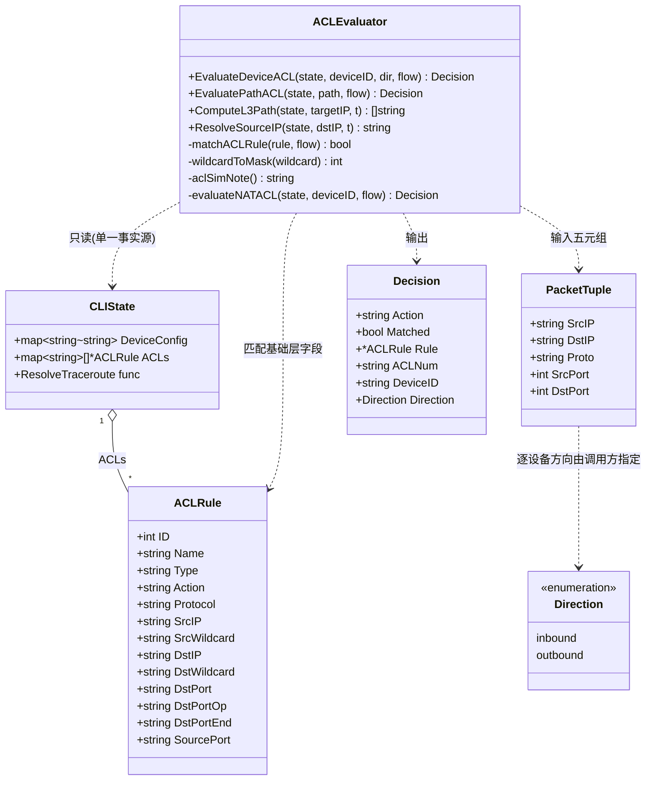
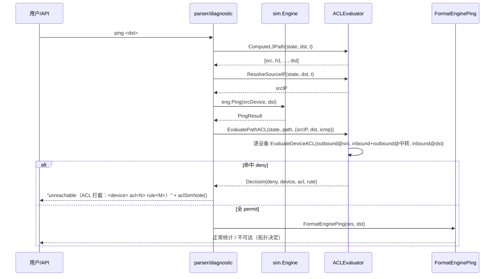
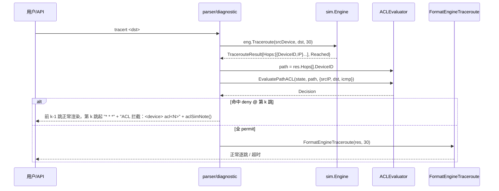
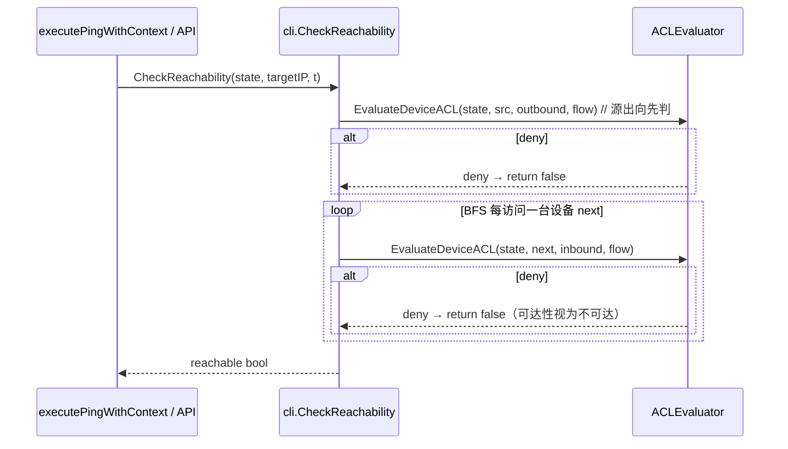

# ensp-lab P1-C「Firewall 真实过滤」系统架构设计 + 任务分解

> 文档类型：实现前技术设计（架构师 高见远）
> 路线基线：定调文档 §已确认决策（路线 B：CLIState 层仿真 ACL 评估器；基础层语义；全路径介入；CLIState 单一事实源）
> 配套输入：`docs/p1c-firewall-prd.md`、`docs/firewall-route-decision.md`
> 语言：中文。不含实现代码，仅给类型/函数签名与伪代码。

---

## 1. 实现方案 + 框架选型

### 1.1 总体定位

在 `cli` 包内新增一个**纯函数 ACL 评估器**，只读 `cli.CLIState.ACLs`（`state.go:51`，类型 `map[string][]*ACLRule`）与 `DeviceConfig["traffic-filter:<dir>:<acl>"]`（`parser.go:1211-1213`）作为单一事实源，在三条路径上做 permit/deny 判定；命中 `deny` 如实改写为丢包/不可达（延续 Bandwidth/PCAP「诚实占位」先例）。

- **不修改 `sim` 引擎**（`engine_nsx.go` / `gont_emulator.go` 零改动），符合定调 §6 理由 5。
- **lite / full 通用**：评估器是纯 Go 逻辑，仅依赖 `cli.CLIState` + 拓扑图，与 `sim.EngineModeName()` 无关（定调「覆盖 Windows 默认用户」）。
- **不接入另两套 ACL 模型**：`protocol.Firewall`（`firewall.go:362` 空桩）与 `protocol.ProtocolSimulator.MatchACL`（`protocol.go:526`，未被调用）本期**旁路/不接线**。CLIState 评估器是唯一消费方（定调开放项 #4，见 §7 / §8）。

### 1.2 为什么是纯函数

评估器签名形如 `EvaluateDeviceACL(state *CLIState, deviceID string, dir Direction, flow PacketTuple) Decision`：

- 无副作用：只读 `state`（不写 ACLs / DeviceConfig），不碰引擎，可单测、可回归。
- 单次调用只评估「一台设备在某方向上的 traffic-filter ACL」，组合由上层（路径遍历）负责 → 易测、易定位。
- 通配符匹配逻辑在 `cli` 包内自包含实现一份 `wildcardToMask`，**位级对齐** `protocol.wildcardToMask`（`protocol.go:586-603`），不引入 `cli → protocol` 依赖（见 §7 共享约定）。

### 1.3 框架 / 库选型

- **不引入任何新依赖**：评估器仅用 Go 标准库（`net`、`strings`、`strconv`）。
- 复用现有：`cli.CLIState` / `cli.ACLRule`（`state.go:158-172`）、`sim.PingResult` / `sim.TracerouteResult`（`sim/types.go:88,115`）、`sim.EngineModeName()`（`engine_mode_other.go:10`）、拓扑 BFS 思路（参考 `cli.CheckReachability` `parser.go:93`）。

### 1.4 核心方向模型（落地开放项 #1 的提议方案）

> 这是方案层给出的**可落地简化模型**，最终以主理人/用户拍板为准（见 §8 待明确 #1）。

`traffic-filter inbound acl N`：作用于「报文进入该设备」；`outbound acl N`：作用于「报文离开该设备」。对一条流 `path = [src, h1, h2, ..., dst]`：

| 设备在路径中的位置 | 评估方向 | 说明 |
|---|---|---|
| `src`（索引 0） | `outbound` | 报文离开发送方 |
| `h_i`（0 < i < 末）中转设备 | `inbound` + `outbound` | 既进入本跳（inbound）又离开本跳（outbound）|
| `dst`（末位） | `inbound` | 报文抵达目的 |

**逐跳评估、首 deny 即停**（即「沿途所有设备取交集，任一 deny 即丢」，对应定调 §8 #6 的取交集模型）。评估只在 **L3 设备**（router / L3Switch / firewall，见 `capabilities.go:91-94`）上进行；L2 交换机透明跳过（其不参与 ACL）。

**隐式默认动作（2026-08-05 拍板：隐式 deny any）**：真实华为 VRP ACL 末尾是**隐式 deny any**，原 §1.4「未匹配=permit」方案已废弃。明确两态：
- 设备**未绑定**任何 ACL/traffic-filter → **放行（permit）**（评估器直接返回，不经 `DefaultACLTerminalAction`）；
- 设备**已绑定** ACL/traffic-filter，但报文**未命中任何 permit 规则** → **丢弃（deny，隐式 deny any）**。
以常量 `DefaultACLTerminalAction = "deny"` 表达（见 §3.2、§7 约定 #2）。

### 1.5 源 IP 推导（基础层必要输入）

评估需要「流五元组」的 `SrcIP`。推导策略（`ResolveSourceIP`）：

- 终端类（PC / Client / Server）：取 `state.HostIP`（`host.go:28`）。
- L3 设备：按 `state.Routes` 对 `dstIP` 做最长前缀匹配，取命中路由的出口 `Interface` 的 IP；无命中回退到首个 `Interfaces` IP；再无则回退拓扑模型中该设备的首个 IP。
- 该推导是 P0 简化假设（见 §8 待明确 #4），不影响 deny 判定正确性（deny 往往覆盖整段网段）。

---

## 2. 文件列表及相对路径

| 文件 | 操作 | 责任（一行） |
|---|---|---|
| `internal/cli/acl_eval.go` | **新增** | ACL 评估器核心：类型 `PacketTuple`/`Direction`/`Decision`、纯函数 `EvaluateDeviceACL`/`EvaluatePathACL`/`ComputeL3Path`/`ResolveSourceIP`、通配符匹配 `wildcardToMask`/`matchACLRule`、诚实占位 `aclSimNote`、P2 预留 hook `evaluateNATACL`（空桩，注释说明）。 |
| `internal/cli/acl_eval_test.go` | **新增** | 评估器单测：通配符匹配、协议号匹配（ip/icmp/tcp/udp）、多规则顺序、未命中默认动作、路径取交集首 deny、方向模型。 |
| `internal/cli/traceroute.go` | **修改** | 新增 `RenderTracerouteWithACL(state, res, target, maxTTL)` 与 `RenderPingWithACL(state, res, target, t)`：在 `FormatEngineTraceroute`/`FormatEnginePing` 之上叠加 ACL 判定与「不可达(ACL 拦截)」渲染（沿用现有如实渲染风格 `traceroute.go:24-32,76-83`）。 |
| `internal/cli/parser.go` | **修改** | ① `tracert` 分支（`parser.go:1129-1131`）改调 `RenderTracerouteWithACL`；② `executePingWithContext`（`parser.go:83`）做 ACL 预判；③ `CheckReachability`（`parser.go:93-131`）BFS 逐跳注入 `EvaluateDeviceACL`。 |
| `internal/api/cli_handlers.go` | **修改** | `renderEnginePing`（`cli_handlers.go:293-305`）/`renderEngineTraceroute`（`cli_handlers.go:311-323`）在拿到引擎结果后，取源设备 `state := r.getOrInitCLIState(...)` 并改调 `RenderPingWithACL`/`RenderTracerouteWithACL`，携带 ACL 拦截原因。 |
| `internal/api/diagnostic_handlers.go` | **修改（P1）** | `diagnosticPing`（`diagnostic_handlers.go:108-209`）/`diagnosticTraceroute`（`diagnostic_handlers.go:218-283`）响应体新增 `blockedBy` 字段，统一体现「ACL 拦截」原因（开放项 #5 / P1-2）。 |

> 说明：`state.go` 的 `ACLRule`（`state.go:158-172`）与 `DeviceConfig` 已就绪，**本期不修改**；`protocol.Firewall`、`protocol.ProtocolSimulator.MatchACL` 不修改、不调用（旁路）。

---

## 3. 数据结构和接口（类图 + 签名）

### 3.1 类图（Mermaid）



### 3.2 核心类型与函数签名（落在 `acl_eval.go`）

```go
// PacketTuple 描述被评估的流五元组；基础层只用前 4 个，SrcPort/DstPort 为 advanced 预留占位。
type PacketTuple struct {
    SrcIP   string // 已推导出的源 IP（见 ResolveSourceIP）
    DstIP   string // 目的 IP
    Proto   string // 协议名：ip|icmp|tcp|udp（对齐 ACLRule.Protocol 取值）
    SrcPort int    // 占位，本期忽略
    DstPort int    // 占位，本期忽略
}

// Direction 表示 ACL 评估方向（对齐 DeviceConfig["traffic-filter:<dir>:<acl>"] 的 dir）。
type Direction string
const (
    DirInbound  Direction = "inbound"
    DirOutbound Direction = "outbound"
)

// Decision 是单次（单设备单方向）ACL 评估结果。
type Decision struct {
    Action    string   // "permit" | "deny"
    Matched   bool     // 是否命中某条规则
    Rule      *ACLRule // 命中的规则（未命中为 nil）
    ACLNum    string   // 命中的 ACL 编号/名称（未命中为 ""）
    DeviceID  string   // 评估的设备
    Direction Direction // 评估方向
}

// DefaultACLTerminalAction 设备「已绑定」ACL/traffic-filter 但报文未命中任何 permit 规则时的默认动作。
// 真实华为 VRP 为隐式 deny any（2026-08-05 拍板）：已绑定却无 permit 命中 → 丢弃（deny）。
// 注意：设备「未绑定」ACL/traffic-filter 时评估器直接返回 permit，不经此常量（见 EvaluateDeviceACL）。
const DefaultACLTerminalAction = "deny"

// EvaluateDeviceACL 评估单台设备在某方向上的 traffic-filter ACL。
// 读取 state.ACLs 与 state.DeviceConfig["traffic-filter:<dir>:<acl>"]；无绑定→permit；
// 命中 deny→deny；遍历完未命中→DefaultACLTerminalAction。无副作用（纯函数）。
func EvaluateDeviceACL(state *CLIState, deviceID string, dir Direction, flow PacketTuple) Decision

// EvaluatePathACL 沿「源→目的」有序设备路径逐跳评估，返回首个 deny（或全 permit）。
// 方向规则：src=outbound；中转=inbound+outbound；dst=inbound。仅对 L3 设备评估，L2 跳过。首 deny 即停。
func EvaluatePathACL(state *CLIState, path []string, flow PacketTuple) Decision

// ComputeL3Path 由拓扑 BFS 计算 src→dst 的有序设备路径（含 src、dst），供 ping 无路径结果时复用评估。
func ComputeL3Path(state *CLIState, targetIP string, t *topology.Topology) []string

// ResolveSourceIP 推导本机（state 所属设备）作为 ping 源的出接口 IP（终端取 HostIP；L3 取最长前缀路由出口 IP）。
func ResolveSourceIP(state *CLIState, dstIP string, t *topology.Topology) string

// 内部纯函数：
func matchACLRule(rule *ACLRule, flow PacketTuple) bool          // 基础层：src/dst IP 通配符 + 协议号
func wildcardToMask(wildcard string) int                         // 通配符→掩码位数，位级对齐 protocol.wildcardToMask
func aclSimNote() string                                         // 诚实占位注记：lite 引擎标注「模拟过滤，非内核级真实过滤」
func evaluateNATACL(state *CLIState, deviceID string, flow PacketTuple) Decision // P2 预留空桩 hook
```

> 评估器**只用** `cli.ACLRule` 的基础字段 `SrcIP/SrcWildcard/DstIP/DstWildcard/Protocol/Action`（`state.go:164-167`），**不读** `DstPort/SourcePort` 等 advanced 字段（本期排除，定调开放项 #3）。

---

## 4. 程序调用流程（时序图）

### 4.1 ping 路径（CLI 文本 + API 两条入口共用 `EvaluatePathACL`）



- **CLI 文本入口**：`parser.go:83`（`executePingWithContext`）在 `CheckReachability` 之前先 `EvaluatePathACL`，命中 deny 直接返回不可达(ACL)。
- **API 入口**：`cli_handlers.go:293-305`（`renderEnginePing`）拿到 `PingResult` 后，取 `state := r.getOrInitCLIState(topoID, deviceId, dt)` 并改调 `RenderPingWithACL(state, res, targetIP, t)`。

### 4.2 tracert 路径（路径来自 `TracerouteResult.Hops`）



- **CLI 文本入口**：`parser.go:1129-1131` 将 `FormatEngineTraceroute(res, 30)` 改为 `RenderTracerouteWithACL(state, res, target, 30)`。
- **API 入口**：`cli_handlers.go:311-323`（`renderEngineTraceroute`）改调 `RenderTracerouteWithACL(state, res, targetIP, 30)`，`state` 来自 `getOrInitCLIState`。

### 4.3 `cli.CheckReachability` 路径（BFS 逐跳注入）



- 切入点：`parser.go:93` 函数体，在 `visited[next]=true` 之后、`queue=append` 之前插入 inbound 评估；函数开头插源 outbound 评估。`flow` 的 `SrcIP` 由 `ResolveSourceIP(state, targetIP, t)` 推导，`Proto="icmp"`。

### 4.4 跨跳方向语义落点（呼应 §1.4）

`EvaluatePathACL` 内部按索引应用方向（`src→outbound`；`0<i<末→inbound+outbound`；`末→inbound`），任一 `deny` 立即返回——即「沿途所有设备取交集，任一 deny 即丢」。评估仅在 L3 设备执行（对照 `capabilities.go:91-94`）。

---

## 5. 任务列表（有序、含依赖、按 P0/P1/P2 分期）

> 任务总数 ≤ 5（P0 核心 + 3 条路径介入 + P1），P2 仅做接口预留、不单列编号任务。

### P0-核心：T01 实现 ACL 评估器（纯函数 + 单测）
- **涉及文件**：`internal/cli/acl_eval.go`（新增）、`internal/cli/acl_eval_test.go`（新增）；只读复用 `internal/cli/state.go`（`ACLRule`/`DeviceConfig` 类型）。
- **依赖**：无（地基任务）。
- **内容**：实现 §3.2 全部类型与纯函数；`wildcardToMask` 位级对齐 `protocol.wildcardToMask`（`protocol.go:586`）；`DefaultACLTerminalAction="deny"`（隐式 deny any，2026-08-05 拍板，见 §9）；`evaluateNATACL` 空桩（P2 hook）；`aclSimNote()` 依据 `sim.EngineModeName()` 返回占位文案。
- **优先级**：P0。

### P0-路径：T02 介入 tracert 路径
- **涉及文件**：`internal/cli/parser.go`（`parser.go:1129-1131` 改调）、`internal/cli/traceroute.go`（新增 `RenderTracerouteWithACL`）、`internal/api/cli_handlers.go`（`cli_handlers.go:322` 改调）、`internal/cli/acl_eval.go`（依赖 T01）。
- **依赖**：T01。
- **内容**：在 `parser.go:1130` 拿到 `res` 后改调 `RenderTracerouteWithACL(state, res, target, 30)`；`RenderTracerouteWithACL` 用 `res.Hops[].DeviceID` 组路径 → `EvaluatePathACL` → 命中 deny 渲染「前 k-1 跳 + 第 k 跳起 * * * + ACL 拦截注记」；API 侧 `renderEngineTraceroute` 取 `state := r.getOrInitCLIState(...)` 后改调同一函数。
- **优先级**：P0。

### P0-路径：T03 介入 ping 路径
- **涉及文件**：`internal/cli/parser.go`（`parser.go:83` 改判）、`internal/cli/traceroute.go`（新增 `RenderPingWithACL`）、`internal/api/cli_handlers.go`（`cli_handlers.go:304` 改调）、`internal/cli/acl_eval.go`（依赖 T01）。
- **依赖**：T01。
- **内容**：`executePingWithContext`（`parser.go:83`）先 `ComputeL3Path`+`ResolveSourceIP`+`EvaluatePathACL`，命中 deny → 返回不可达(ACL)；否则回落 `CheckReachability`。API 侧 `renderEnginePing` 拿 `PingResult` 后取源 `state` 改调 `RenderPingWithACL(state, res, targetIP, t)`。
- **优先级**：P0。

### P0-路径：T04 介入 `cli.CheckReachability` + 诚实占位落地
- **涉及文件**：`internal/cli/parser.go`（`parser.go:93-131` BFS 注入）、`internal/cli/acl_eval.go`（依赖 T01，复用 `EvaluateDeviceACL`）、`internal/cli/traceroute.go`（`aclSimNote()` 注记复用）。
- **依赖**：T01。
- **内容**：`CheckReachability` 函数开头加源 outbound 评估；BFS 每访问 `next` 加 inbound 评估；命中 deny → `return false`。所有 deny 渲染统一追加 `aclSimNote()`（lite 标注「模拟过滤，非内核级真实过滤」）。
- **优先级**：P0。

### P1：T05 方向语义正式落地 + 诊断面板/下游统一可见性
- **涉及文件**：`internal/api/diagnostic_handlers.go`（`diagnostic_handlers.go:108-209`、`218-283` 响应体加 `blockedBy`）、`internal/api/cli_handlers.go`（渲染函数携带拦截原因）、`internal/cli/acl_eval.go`（方向模型 unit test 加固）。
- **依赖**：T02、T03、T04。
- **内容**：`diagnosticPing`/`diagnosticTraceroute` 在 `EvaluatePathACL` 返回 deny 时，于 JSON 响应新增 `blockedBy: {device, acl, rule, direction}` 字段，供前端诊断面板统一呈现「ACL 拦截」；确认 §1.4 方向模型并补单测（中转设备 inbound+outbound 双评估、首 deny 即停）。
- **优先级**：P1。

### P2（下期，仅接口预留，不单列任务）
- **hook 位置**：`acl_eval.go` 的 `evaluateNATACL(state, deviceID, flow) Decision` 空桩；在 `EvaluatePathACL` 对「带 NAT 出向的设备」调用点预留 `// TODO(P2): 接入 NAT 顺序与转换前/后 IP 语义`。
- **范围**：先 ACL 后 NAT / 先 NAT 后 ACL、源/目的 IP 转换前/后参与匹配——待主理人拍板（开放项 #2，见 §8）。

---

## 6. 依赖包列表

- **无新增第三方依赖**。评估器仅使用 Go 标准库：`net`、`strings`、`strconv`。
- 复用现有包（已在仓库内）：`internal/cli`（state/parser/traceroute）、`internal/sim`（`PingResult`/`TracerouteResult`/`EngineModeName`）、`internal/topology`（`Topology`/`Device`/`Link`）。
- **明确不新增** `cli → protocol` 依赖：通配符匹配在 `cli` 内自包含实现（见 §7），避免与 `protocol.MatchACL`（`protocol.go:526`）耦合或双写。

---

## 7. 共享知识（跨文件约定）

1. **评估器 ↔ CLIState 契约**：评估器只读 `state.ACLs`（`map[string][]*ACLRule`）与 `state.DeviceConfig["traffic-filter:<dir>:<acl>"]`（`dir∈{inbound,outbound}`）。`DeviceConfig` 的 key 形如 `traffic-filter:inbound:2000`，value 为 ACL 编号字符串（`parser.go:1211`）。评估器**不写**任何状态。
2. **隐式默认动作约定（2026-08-05 拍板：隐式 deny any）**：设备**未绑定** ACL/traffic-filter → 放行（permit，评估器直接返回，不经此常量）；设备**已绑定** ACL 但报文**未命中任何 permit 规则** → **丢弃（deny）**，由 `DefaultACLTerminalAction = "deny"` 表达。原「未匹配即 permit」方案已废弃。
3. **通配符匹配统一约定**：`cli.wildcardToMask` 必须与 `protocol.wildcardToMask`（`protocol.go:586-603`）**位级一致**（同算法：通配符每个八位的 0 位计为掩码位）。两处实现各自独立但行为必须等价；若将来 `protocol.wildcardToMask` 变更，需同步 `cli` 副本（已在代码注释标注）。
4. **协议号取值约定**：`PacketTuple.Proto` 与 `ACLRule.Protocol` 统一使用小写 `ip|icmp|tcp|udp`；`matchACLRule` 对 `Protocol==""` 视为「不限制协议」（与 `protocol.matchRule` `protocol.go:545` 一致）。
5. **序列化/持久化**：ACL 已随 `DeviceConfig` + `ACLs` 经 `SerializeToDeviceConfigData`/`LoadFromDeviceConfigData` 持久化（定调 §2）。本期**不改**序列化逻辑，新增评估器为纯运行时计算，无新增持久化字段。
6. **另两套 ACL 模型处置**：`protocol.Firewall`（`firewall.go:362` 空桩 `HandlePacket` 返回 nil）与 `protocol.ProtocolSimulator.MatchACL`（`protocol.go:526`）本期**不调用、不接线、不废弃删除**（保留以便后续收敛），任何新代码**不得**新建对它们的调用；CLIState 评估器是唯一消费方（定调开放项 #4）。
7. **诚实占位口径**：所有 deny 渲染统一追加 `aclSimNote()`；lite 引擎返回「ACL 为模拟过滤（lite 引擎），非内核级真实过滤」，full 引擎返回较轻量注记。沿用 Bandwidth/PCAP 占位先例，绝不伪造成功。
8. **L3 设备判定**：ACL 评估只对 router / L3Switch / firewall 生效（`capabilities.go:91-94` 声明 acl/traffic-filter 能力的三类设备）；L2 交换机跳过。

---

## 8. 待明确事项（需主理人/用户拍板）

1. **【开放项 #1 方向 + 默认动作】** §1.4 提出的「src=outbound；中转=inbound+outbound；dst=inbound；首 deny 即停；未命中=permit」模型是否接受？尤其是两点：(a) 中转设备是否同时评估 inbound+outbound（还是仅 inbound）；(b) 默认动作用 `permit` 还是 `deny any`。**这是 P0 评估器正确性的前提，请优先拍板**。
2. **【开放项 #2 NAT 范围】** P2 是否纳入本期？若纳入，ACL 与 NAT 先后顺序、源/目的 IP 转换前/后参与匹配——本期仅留 `evaluateNATACL` 空桩，不实现。
3. **【开放项 #5 下游可见性范围】** P1-2 的 `blockedBy` 仅加到 `diagnosticPing`/`diagnosticTraceroute` 响应体是否足够？还是需同步 `display` 类命令（如 `display acl`/可达性显示）也统一呈现拦截原因？请明确覆盖范围。
4. **【源 IP 推导精度】** §1.5 的 `ResolveSourceIP`（终端取 HostIP；L3 取最长前缀路由出口 IP）作为基础层简化是否可接受？是否会因源 IP 推导偏差影响 deny 判定（通常 deny 覆盖整段网段，影响有限，但需确认）。
5. **【开放项 #4 收敛方式】** `protocol.Firewall` 与 `protocol.ProtocolSimulator.MatchACL` 本期「保留旁路」是否可接受？还是要求加 `// Deprecated: superseded by cli ACL evaluator` 注释明确标注，避免后续维护者误接线？
6. **【P1 是否全做】** P1-1（方向语义正式落地，实际在 P0 已部分实现）与 P1-2（诊断面板可见性）是否本期全做，还是只做其一？建议两者本期同做（工作量小、价值高）。

---

## 附：关键 file:line 证据索引（供实现直接定位）

- `internal/cli/state.go:51` `ACLs map[string][]*ACLRule`；`state.go:158-172` `ACLRule`；`state.go:98` `ResolveTraceroute` 钩子。
- `internal/cli/parser.go:869-898` `acl`；`900-936` `rule`；`982-1011` `nat outbound`；`1206-1219` `traffic-filter`。
- `internal/cli/parser.go:93-131` `cli.CheckReachability`（BFS 不查 ACL）；`parser.go:83` ping 调用点；`parser.go:1129-1131` tracert 调用点。
- `internal/cli/traceroute.go:20` `FormatEnginePing`；`:66` `FormatEngineTraceroute`（如实渲染不可达/超时）。
- `internal/api/cli_handlers.go:293-305` `renderEnginePing`；`:311-323` `renderEngineTraceroute`；`:159` `getOrInitCLIState`（取带 ACL 的持久化 state）。
- `internal/api/diagnostic_handlers.go:108-209` `diagnosticPing`；`:218-283` `diagnosticTraceroute`（下游可见性落点）。
- `internal/protocol/protocol.go:526-603` `MatchACL`/`matchRule`/`matchIP`/`wildcardToMask`（**不接入**，仅对齐算法）；`protocol.go:636-675` `CheckReachability`（不查 ACL）。
- `internal/protocol/firewall.go:12-42` `Firewall`/`ACL`/`ACLRule`；`:362-364` `HandlePacket` 空桩（**不接入**）。
- `internal/sim/types.go:88` `PingResult`；`:115` `TracerouteResult`；`engine_mode_other.go:10` `EngineModeName()`。
- `internal/cli/capabilities.go:91-94` acl/rule/traffic-filter 能力（router/L3Switch/firewall）。

---

## 9. 拍板结论（2026-08-05 用户确认）

> 本节记录用户对 §8 全部待明确项的正式拍板结果，作为实现的唯一范围基线。**仅记结论，不含实现代码。**

### 已拍板的 7 项决策

1. **方向模型（开放项 #1）**：采纳标准模型——`src=outbound`、`中转=inbound+outbound`、`dst=inbound`、**首 deny 即停（沿途取交集，任一 deny 即丢）**；评估仅对 L3 设备（router/L3Switch/firewall），L2 跳过。与 §1.4 / §4.4 一致，无需更改。

2. **默认动作纠正（关键）**：原 §1.4「未匹配=permit（VRP 语义）」**已确认为错误**。真实华为 VRP ACL 末尾是**隐式 deny any**。本拍板确立两态：
   - 设备**未绑定**任何 ACL/traffic-filter → **放行（permit）**（评估器直接返回，不经 `DefaultACLTerminalAction`）；
   - 设备**已绑定** ACL/traffic-filter，但报文**未命中任何 permit 规则** → **丢弃（deny，隐式 deny any）**。
   - `DefaultACLTerminalAction` 由 `"permit"` 改为 `"deny"`（见 §3.2）；§1.4、§7 约定 #2 已同步纠正，原「未匹配即 permit」表述已删除。

3. **P1 全做（开放项 #6）**：T05 两件事本期都做——(a) 方向语义单测加固；(b) 诊断面板 `blockedBy` 下游可见性（`diagnosticPing` / `diagnosticTraceroute` 响应体新增 `blockedBy` 字段）。

4. **NAT 范围（开放项 #2）**：本期**不纳入** P2 的 NAT 交互；仅保留 `acl_eval.go` 的 `evaluateNATACL` 空桩 hook + `// TODO(P2)` 注释，留待下期实现。

5. **下游可见性范围（开放项 #5）**：`blockedBy` **仅**加到 `diagnosticPing` / `diagnosticTraceroute` 响应体；`display acl` 等是配置展示命令，本期**不改**。

6. **源 IP 推导（开放项 #4 前半）**：接受 §1.5 的简化（`ResolveSourceIP`：终端取 `HostIP`，L3 取最长前缀路由出口 IP）。deny 通常覆盖整段网段，推导偏差影响有限，可接受。

7. **收敛方式（开放项 #4 后半）**：`protocol.Firewall`（`firewall.go:362`）与 `protocol.ProtocolSimulator.MatchACL`（`protocol.go:526`）本期**保留旁路**，但需加 `// Deprecated: superseded by cli ACL evaluator` 注释标注，避免后续维护者误接线；任何新代码**不得**新建对它们的调用（与 §7 约定 #6 一致）。

### 文档状态

- §8 全部 6 项待明确已闭合，本节为最终结论；实现阶段以本节为准。
- 实现任务保持 §5 的 5 个编号（T01–T05），P2 仍仅为接口预留；T05 范围按本拍板 #3/#5 锁定。

