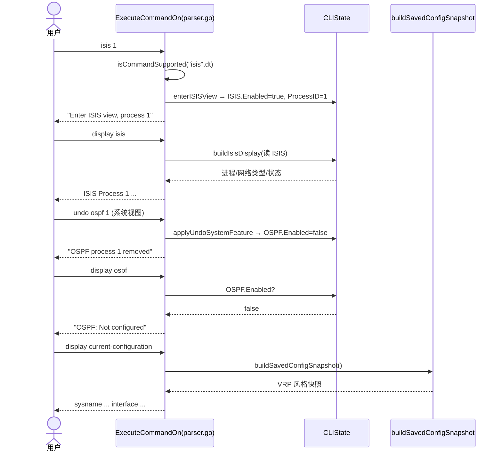

# ensp-lab P1-F（VRP CLI 命令广度扩展）系统架构设计与任务分解

> 文档类型：架构设计 + 任务分解（纯设计，无实现代码）
> 架构师：高见远（Gao）
> 范围：`internal/cli/`（CLI 仿真器），不牵动 sim 引擎核心算法
> 技术栈：Go 1.26.5 + Gin v1.12.0，单体前后端（`go:embed`），前端 `CliTerminal.tsx` 透传后端字符串（本期不改）
> 上游：依据 `docs/p1f-cli-prd.md` 及源码核查（parser.go / state.go / host.go / capabilities.go / traceroute.go）

---

## 1. 实现方案 + 框架选型

**框架已定，无新增依赖**：纯 Go CLI 仿真，命令解析与渲染全部在 `internal/cli/` 内完成。本期**不引入任何第三方库**，仅用标准库（`fmt`/`strings`/`sort`/`strconv`/`time`）+ 既有 `internal/topology`、`internal/sim`（`traceroute.go` 已 import `sim` 且无循环依赖）。

**核心改动范式**：在 `ExecuteCommandOn`（parser.go:158 起的大 `switch`）内**新增/扩展 `case`**，使每一个在 `capabilities.go` 矩阵中"声明支持"的顶层命令都有对应分支（落实主理人决策 #5："矩阵声明支持 = 必须有 parser 分支"）。新增分支一律**先做能力校验**（函数入口已有 `isCommandSupported`，parser.go:182），再按设备类型/视图做分支。

**逐项扩展策略（基于真实代码锚点，非预设）**：

| 命令/能力 | 处理方式 | 落点 | 性质 |
|---|---|---|---|
| `isis` | **新增顶层 `case "isis":`** | parser.go（大 switch 内，靠近 `bgp`/`rip`） | P0 最小启用 + P1 真实配置 |
| `quit-cli` | **新增顶层 `case "quit-cli":`** | parser.go | P0，返回会话关闭提示 |
| `vlanif` | **新增顶层 `case "vlanif":`**（引导，决策 #4 方案 A） | parser.go | P0，保留矩阵声明 |
| `port-security` | **新增顶层 `case "port-security":`**，委托既有 `port security` 逻辑（parser.go:672） | parser.go + 抽取 `applyPortSecurity` helper | P0，复用 |
| `nslookup` | **新增顶层 `case "nslookup":`**，路由到 host.go 新增 helper | parser.go + host.go | P0 |
| `http`/`https`/`dns`/`ftp` | **新增顶层 `case`**，对齐 `smtp`（parser.go:2192）回显风格 | parser.go | P0 |
| `undo`（系统视图） | **扩展既有 `case "undo":`**（parser.go:823），新增 `ViewSystem` 分支 | parser.go | P1 |
| `display current-configuration` | **改写既有 `case "current-configuration":`**（parser.go:2549），复用 `buildSavedConfigSnapshot`（parser.go:4032） | parser.go | P1，决策 #6 |
| `display isis` / `display bgp peer` / `display diagnostic-information` | **扩展 `display`/`dis` 子 `switch`**（parser.go:2478 起） | parser.go | P1 |
| `tracert`/`traceroute` 兜底 | **改写 `case "tracert","traceroute":`**（parser.go:1139 硬编码）→ 接入真实引擎 `FormatEngineTraceroute` | parser.go + traceroute.go | P1，决策 #1 |

**零回归约束**：未知命令兜底 `return fmt.Sprintf("Error: unknown command '%s'", cmd.Command)`（parser.go:3906）**行为不变**；既有的 `display` 家族、`bgp`/`rip`、`tracert` API 主路径等回显不得破坏。

---

## 2. 文件列表及相对路径（按模块分组）

```
internal/cli/
├── parser.go          ★ 主战场：所有顶层 case / display 子命令 / undo / tracert 兜底
│   ├─ ExecuteCommandOn 大 switch（新增 isis/quit-cli/vlanif/port-security/nslookup/http/https/dns/ftp 顶层 case）
│   ├─ case "undo":        (≈line 823) 扩展 ViewSystem 分支（P1）
│   ├─ case "display","dis": 子 switch（≈line 2478）
│   │    ├─ "current-configuration" (≈2549) → 复用 buildSavedConfigSnapshot（P1）
│   │    ├─ "isis"   (新增, P1)
│   │    ├─ "bgp"    (≈3614) 增加 "peer" 子命令分支（P1）
│   │    └─ "diagnostic-information" (新增, P1)
│   ├─ case "tracert","traceroute": (≈1139) 接入真实引擎（P1）
│   ├─ GetPrompt (≈3909) 增加 ViewISIS 分支
│   └─ 新增 helper：applyPortSecurity / buildHostNslookup(实际放 host.go) /
│                    buildIsisDisplay / buildBGPPeerDisplay / buildDiagnosticInfo /
│                    applyUndoSystemFeature / executeServerService
├── state.go           ★ 状态与序列化
│   ├─ 新增常量 ViewISIS ViewType = "isis"
│   ├─ 新增 struct ISISConfig
│   ├─ CLIState 新增字段 ISIS *ISISConfig
│   ├─ newCLIStateWithType 初始化 ISIS
│   └─ SerializeToDeviceConfigData / LoadFromDeviceConfigData 同步（见 §3、共享知识③）
├── host.go            ★ 终端命令
│   └─ 新增 buildHostNslookup(state, host) string（nslookup 渲染，复用 state.HostDNS）
├── capabilities.go    ★ 能力矩阵（本期**不删**任何声明；vlanif 保留，决策 #4）
│   └─ 仅当发现"确有声明却无分支且决定不下发"时才微调；本期零改动即可满足一致性（9 条均补分支）
├── traceroute.go      （已存在，本期不改算法；仅被 parser 兜底引用）
└── tools.go           （可选：若 helper 过多可迁移；本期优先就近放在 parser.go / host.go）
```

**说明**：`capabilities.go` 本期**无需改动**——9 条缺口命令均已声明，补齐 parser 分支后即满足"声明=分支"一致性（决策 #5），无需为消除声明而删功能。

---

## 3. 数据结构与接口变更

### 3.1 CLIState 字段变更（state.go）

```go
// 新增视图常量（与 ViewBGP 等并列）
const (
    // ... 既有常量 ...
    ViewISIS ViewType = "isis"   // 新增：IS-IS 协议视图
)

// 新增 IS-IS 配置结构体（P1 真实配置用；P0 仅置 Enabled）
type ISISConfig struct {
    Enabled       bool
    ProcessID     int
    NetworkType   string   // "level-1" / "level-2" / "level-1-2"，默认 "level-2"
    ImportRoutes  []string // import-route 引入的协议列表，如 ["static","ospf"]
}

// CLIState 新增字段（紧邻 BGP 之后）
type CLIState struct {
    // ... 既有字段 ...
    BGP  *BGPConfig
    ISIS *ISISConfig   // 新增
    // ...
}
```

`newCLIStateWithType` 中初始化：
```go
ISIS: &ISISConfig{ Enabled: false, NetworkType: "level-2" },
```

### 3.2 新增 / 扩展 helper 函数签名

```go
// parser.go —— IS-IS 视图进入 + 真实配置
func enterISISView(state *CLIState, processID int) string
// 在 case "isis" 内：校验 ViewSystem → 置 state.ISIS.Enabled=true、ProcessID、写
// DeviceConfig["isis:enabled"]="true" / ["isis:process-id"] → CurrentView=ViewISIS,
// CurrentSub=fmt.Sprintf("isis-%d", processID) → 返回 "Enter ISIS view, process <id>"

// parser.go —— display isis 渲染
func buildIsisDisplay(state *CLIState) string
// ISIS==nil||!Enabled → "ISIS: Not configured"
// 否则输出：
//   ISIS Process <id>
//     Network Type: <level-1/level-2/level-1-2>
//     State: Running
//     Neighbors: 0
//     Import Routes: <逗号列表 或 none>

// parser.go —— display bgp peer 渲染
func buildBGPPeerDisplay(state *CLIState) string
// 逐邻居表：Peer IP / Remote AS / State(Established/Idle) / Type(EBGP/IBGP)

// parser.go —— display diagnostic-information 聚合
func buildDiagnosticInfo(state *CLIState) string
// 组合：version + device + cpu-usage + memory + 关键协议状态小结
// （实现时复用 display 子分支的渲染逻辑，或提取为可复用函数）

// parser.go —— undo 系统视图特征清理
func applyUndoSystemFeature(state *CLIState, args []string) string
// 分发 ospf / vlan / acl / stp / dhcp / bgp / ipv6；未知 → Error: undo '<x>' is not supported

// parser.go —— Server 应用层服务统一启用（对齐 smtp）
func executeServerService(state *CLIState, proto string, args []string) string
// proto ∈ {http,https,dns,ftp}；ViewSystem + "enable" → 写 DeviceConfig["<proto>:enabled"]="true"
// 返回 "<PROTO> service enabled"（如 "HTTP service enabled"）

// parser.go —— port-security 顶层委托（复用既有 port security 逻辑）
func applyPortSecurity(state *CLIState, args []string) string
// 从 case "port-security" 与既有 "port security" 分支共用；限定 CurrentView==ViewInterface

// host.go —— nslookup 渲染（复用 state.HostDNS）
func buildHostNslookup(state *CLIState, host string) string
// HostDNS=="" → "*** Can't find server name for address ... DNS server not configured."
// 否则返回模拟解析（见 PRD §4.1 样例）
```

### 3.3 关键输出结构

**`display isis`（buildIsisDisplay）**
```
ISIS Process 1
  Network Type: level-2
  State: Running
  Neighbors: 0
  Import Routes: static, ospf
```

**`display bgp peer`（buildBGPPeerDisplay）**
```
BGP Local Router ID : <RouterID>
Local AS number : <AS>
Total number of peers : <n>
Peer            RemoteAS      State      Type
10.0.0.2        65002         Established EBGP
```

**`display diagnostic-information`（buildDiagnosticInfo）**
```
===== Device Diagnostic Information =====
<display version 摘要>
<display device 摘要>
<display cpu-usage 摘要>
<display memory 摘要>
----- Protocol Status -----
  OSPF: <Running/Not configured>
  BGP : <Running/Not configured>
  ISIS: <Running/Not configured>
  STP : <Enabled/Disabled>
  DHCP: <Enabled/Disabled>
========================================
```

### 3.4 状态变更 → 序列化映射（重要，见共享知识③）

`ISISConfig` 同时**镜像到 `state.DeviceConfig` 键**，以便随既有序列化路径落盘：
- `isis:enabled` = `"true"` / 缺失
- `isis:process-id` = 进程号
- `isis:network-type` = `level-1` / `level-2` / `level-1-2`
- `isis:import-route` = 逗号拼接的协议列表

`SerializeToDeviceConfigData`（parser.go:3938）当前**只拷贝 `interface:` 前缀键**到 `cfg.Interfaces`，导致 `ospf:*`/`bgp:*`/`isis:*` 等非接口键在 save/reload 后丢失。本期在 T01 中**将该拷贝循环放宽为拷贝全部 `DeviceConfig` 键**（接口键的恢复逻辑 `HostIP/HostDNS/VXLAN` 保持不变），使 ISIS（以及既有 OSPF/BGP）配置可随拓扑保存/重载而保留。

`LoadFromDeviceConfigData`（parser.go:3969）中**新增 ISIS 重建**：扫描 `isis:*` 键重建 `state.ISIS`（Enabled/ProcessID/NetworkType/ImportRoutes），与 VXLAN 重建（≈3997）同风格。

---

## 4. 程序调用流程（文字 + 时序）

### 4.1 `isis 1` → 进视图 → `display isis`

```
用户敲 isis 1
  → ExecuteCommandOn: isCommandSupported("isis", dt) 通过（l3Devices）
  → case "isis": 校验 CurrentView==ViewSystem（否则 "Error: ..."）
  → enterISISView: ISIS.Enabled=true; ProcessID=1;
       DeviceConfig["isis:enabled"]="true"; ["isis:process-id"]="1"
       CurrentView=ViewISIS; CurrentSub="isis-1"
  → 返回 "Enter ISIS view, process 1"
用户敲 network level-2（P1）
  → case "isis": 校验 CurrentView==ViewISIS → ISIS.NetworkType="level-2"
用户敲 display isis
  → case "display": arg0="isis" → buildIsisDisplay → 输出进程/网络类型/状态
```

### 4.2 `undo ospf 1` → 清理 state → `display ospf` 显示 Not configured

```
系统视图敲 undo ospf 1
  → case "undo": CurrentView==ViewSystem → applyUndoSystemFeature(["ospf","1"])
  → OSPF.Enabled=false; 清 OSPF.ProcessID/AreaID; 删 DeviceConfig["ospf:*"]
  → 返回 "OSPF process 1 removed"
敲 display ospf
  → case "display": arg0="ospf" → OSPF.Enabled==false → "OSPF: Not configured"
```

### 4.3 `display current-configuration` 风格化（复用快照）

```
敲 display current-configuration
  → case "display": arg0="current-configuration"
  → 旧：遍历 DeviceConfig 原始直排（parser.go:2549，非 VRP 风格）
  → 新：out = state.buildSavedConfigSnapshot()  // VRP 风格（sysname/interface/route/vlan/vxlan）
       out += protocolBlocks(state)             // 追加 OSPF/BGP/ISIS 启用块，避免信息回退
  → 返回华为 VRP 一致快照
```

### 4.4 `tracert` 兜底清理（接入真实引擎）

```
直连 ExecuteCommandOn 敲 tracert 1.1.1.1
  → 旧：case "tracert","traceroute" 硬编码 2 跳（parser.go:1139）
  → 新：尝试通过引擎解析（见 T07 / 待明确③）；
       成功 → FormatEngineTraceroute(res, 30)
       无引擎上下文 → FormatEngineTraceroute(nil,30) 风格提示
       （API 主路径 cli_handlers.go:66 已真实化，此仅一致性清理）
```

### 4.5 时序图（Mermaid）



---

## 5. 任务列表（核心交付 · 有序 · 含依赖）

> 依赖图：T01 → T02 → T03；T04/T05/T06/T07 互相独立，但建议在 T01/T02 落地后实施。
> 优先级：P0 = 一致性补齐（9 条）；P1 = 真实落地与功能补齐。
> 每项含：目标文件 / 具体改动 / 验证方式。

### T01 〔P0〕状态与视图基础（state.go + parser.go GetPrompt）
- **目标文件**：`internal/cli/state.go`、`internal/cli/parser.go`（GetPrompt ≈3909）
- **具体改动**：
  1. 新增 `ViewISIS ViewType = "isis"` 常量。
  2. 新增 `ISISConfig{ Enabled bool; ProcessID int; NetworkType string; ImportRoutes []string }`。
  3. `CLIState` 新增字段 `ISIS *ISISConfig`（位于 BGP 之后）。
  4. `newCLIStateWithType` 初始化 `ISIS: &ISISConfig{Enabled:false, NetworkType:"level-2"}`。
  5. `GetPrompt` 增加 `case ViewISIS: return fmt.Sprintf("[%s-%s]", deviceName, state.CurrentSub)`。
  6. **序列化同步（共享知识③）**：`SerializeToDeviceConfigData` 将 DeviceConfig 拷贝循环放宽为拷贝**全部键**（非仅 `interface:` 前缀），使 `isis:*`/`ospf:*`/`bgp:*` 落盘；`LoadFromDeviceConfigData` 新增扫描 `isis:*` 重建 `state.ISIS`。
- **验证方式**：`go build ./...` 通过；单测：构造带 `isis:enabled=true` 的 DeviceConfigData → `NewCLIStateFromDeviceConfig` 后 `state.ISIS.Enabled==true`；`GetPrompt` 在 ViewISIS 返回 `[Name-isis-1]`；保存/重载后 ISIS 配置不丢。
- **依赖**：无。
- **优先级**：P0。

### T02 〔P0〕顶层命令补齐（一致性 9 条）
- **目标文件**：`internal/cli/parser.go`（大 switch）、`internal/cli/host.go`（buildHostNslookup）
- **具体改动**（在 `ExecuteCommandOn` 大 switch 内新增/扩展 case，均先过 `isCommandSupported`）：
  1. `case "isis":` —— P0 最小启用：校验 `ViewSystem` → `enterISISView`（写 `isis:enabled`/`isis:process-id`，置 ViewISIS，返回 `Enter ISIS view, process <id>`）。（真实配置留 T03）
  2. `case "quit-cli":` —— 返回 `Session closed.`（语义等同退出 CLI，前端透传）。
  3. `case "vlanif":` —— 决策 #4 方案 A：返回引导 `Use 'interface Vlanif <id>' to create the Layer 3 interface.`（保留 capabilities 声明，不移除）。
  4. `case "port-security":` —— 抽取 `applyPortSecurity(state, args)` helper；顶层 case 校验 `CurrentView==ViewInterface` 后委托之（写 `interface:<cur>:port-security` 等），与既有 `port security` 分支共用。
  5. `case "nslookup":` —— 路由到 `buildHostNslookup(state, cmd.Args[0])`（host.go 新增，复用 `state.HostDNS`；无 DNS 返回 not configured 提示）。
  6. `case "http":` / `case "https":` / `case "dns":` / `case "ftp":` —— 统一调用 `executeServerService(state, proto, cmd.Args)`：校验 `ViewSystem` + `enable` → 写 `DeviceConfig["<proto>:enabled"]="true"`，返回 `<PROTO> service enabled`（对齐 `smtp` parser.go:2192）。
- **验证方式**：在各自矩阵声明设备类型上分别敲入：
  - Router 敲 `isis 1` → 非 unknown，返回进视图提示；
  - 任意设备敲 `quit-cli` → 返回 `Session closed.`；
  - L3Switch 敲 `vlanif 10` → 返回引导提示；
  - Switch 接口视图敲 `port-security enable` 与顶层 `port-security enable` 均生效；
  - PC 配 `ip dns` 后敲 `nslookup a.com` → 返回解析回显；无 DNS → not configured；
  - Server 敲 `http enable`/`https enable`/`dns enable`/`ftp enable` → 各自返回 `service enabled` 且 `display current-configuration`（T05 后）可见对应键。
  - 回归：未知命令仍 `Error: unknown command '<cmd>'`。
- **依赖**：T01（isis 写 struct；其余不依赖 struct）。
- **优先级**：P0。

### T03 〔P1〕ISIS 真实配置 + display isis
- **目标文件**：`internal/cli/parser.go`（扩展 `case "isis":`、`display` 子 switch）
- **具体改动**：
  1. `case "isis":` 增加 `ViewISIS` 子命令：`network <level-1|level-2|level-1-2>`（写 `ISIS.NetworkType` + `isis:network-type`）、`import-route <proto>`（追加 `ISIS.ImportRoutes` + `isis:import-route`）。
  2. `display` 子 switch 新增 `case "isis":` → `buildIsisDisplay(state)`（§3.3 结构；未配置 → `ISIS: Not configured`）。
- **验证方式**：Router `isis 1` → `network level-2` → `import-route static` → `display isis` 输出进程/网络类型/状态/引入路由；`undo`（T04）或重载后状态保持。
- **依赖**：T01、T02（isis 视图已建立）。
- **优先级**：P1。

### T04 〔P1〕undo 系统视图扩展
- **目标文件**：`internal/cli/parser.go`（扩展 `case "undo":` ≈823）
- **具体改动**：将 `case "undo":` 现有 `if CurrentView != ViewInterface` 守卫改为 `switch state.CurrentView`，新增 `case ViewSystem: return applyUndoSystemFeature(state, cmd.Args)`，原有接口视图逻辑保留于 `case ViewInterface:`。`applyUndoSystemFeature` 分发：
  - `ospf [<id>]` → `OSPF.Enabled=false`、清 ProcessID/AreaID、删 `ospf:*` 键 → `OSPF process removed`；
  - `vlan <id>` → `delete(VLANs, id)`、删相关键 → `VLAN <id> removed`；
  - `acl <num|name>` → `delete(ACLs, ...)` → `ACL ... removed`；
  - `stp` → `STP.Enabled=false` → `STP disabled`；
  - `dhcp` → `DHCP.Enabled=false` → `DHCP disabled`；
  - `bgp [<as>]` → `BGP.Enabled=false`、清 ASNumber/Neighbors → `BGP process removed`；
  - `ipv6` → 删 `DeviceConfig["ipv6:enabled"]` → `IPv6 disabled`；
  - 其它 → `Error: undo '<x>' is not supported`。
- **验证方式**：系统视图 `undo ospf 1` → `display ospf` 显示 `Not configured`；`undo vlan 10`/`undo acl 2000`/`undo stp`/`undo dhcp`/`undo bgp`/`undo ipv6` 分别清理对应 state；`undo xyz` 返回 not supported；接口视图 `undo shutdown` 等既有行为不变。
- **依赖**：无（逻辑独立；建议 T02 后实施）。
- **优先级**：P1。

### T05 〔P1〕display current-configuration 风格化
- **目标文件**：`internal/cli/parser.go`（改写 `case "current-configuration":` ≈2549）
- **具体改动**：将原始 `DeviceConfig` 直排替换为 `state.buildSavedConfigSnapshot()`（VRP 风格），并**追加** `protocolBlocks(state)` 输出 OSPF/BGP/ISIS 启用块，避免较现行版本丢失协议启用信息（决策 #6 + 零回归）。`buildSavedConfigSnapshot` 本体**不改**（复用既有快照逻辑）。
- **验证方式**：`display current-configuration`（或 `dis cur`）输出以 `sysname` 开头、`#` 分隔、接口/路由/VLAN/VXLAN 块、末尾 `!configuration saved at ...` 的 VRP 风格；含 OSPF/BGP/ISIS 启用说明；与 `display saved-configuration` 视觉一致；既有 key-value 直排不再出现。
- **依赖**：无（复用既有函数）。
- **优先级**：P1。

### T06 〔P1〕display bgp peer + display diagnostic-information
- **目标文件**：`internal/cli/parser.go`（`display` 子 switch）
- **具体改动**：
  1. `case "bgp":`（≈3614）增加 `arg1=="peer"` 分支 → `buildBGPPeerDisplay(state)`（§3.3 邻居明细表；无邻居输出空表头）。
  2. 新增 `case "diagnostic-information":` → `buildDiagnosticInfo(state)`（聚合 version/device/cpu-usage/memory + 协议状态小结，复用 display 子分支渲染逻辑）。
- **验证方式**：`display bgp peer` 出邻居明细表（`display bgp` 概要行为不变）；`display diagnostic-information` 一次性输出设备"体检报告"；非 L3 设备按既有约束返回 not supported。
- **依赖**：无（建议 T02 后实施）。
- **优先级**：P1。

### T07 〔P1〕tracert parser 兜底清理（接入真实引擎）
- **目标文件**：`internal/cli/parser.go`（`case "tracert","traceroute":` ≈1139）、`internal/cli/traceroute.go`（仅引用，不改算法）
- **具体改动**：移除硬编码 2 跳，改为优先走真实引擎渲染 `FormatEngineTraceroute(res, 30)`；无引擎上下文时返回与该函数一致的提示（nil res 分支）。**不改** `traceroute.go` 算法（决策 #1）。
- **验证方式**：经 API 主路径的 tracert 行为不变；直连 `ExecuteCommandOn` 的 tracert 不再恒 2 跳，输出与拓扑一致或如实报告不可达/超时。
- **依赖**：无（见待明确③关于引擎上下文获取方式）。
- **优先级**：P1。

---

## 6. 依赖包列表

**无任何新增第三方依赖。** 仅使用：
- 标准库：`fmt`、`strings`、`sort`、`strconv`、`time`（均已在使用）。
- 既有内部包：`ensp-lab/internal/topology`（DeviceConfigData、DeviceType、HistoryEntry）、`ensp-lab/internal/sim`（TracerouteResult；`traceroute.go` 已 import，无循环依赖）。
- 构建/测试：`go test`（既有，无需新增）。

---

## 7. 共享知识（跨文件约定）

1. **capabilities 与 parser case 一一对应规则**：`capabilities.go` 中声明 `true` 的顶层命令，**必须**在 `ExecuteCommandOn` 大 switch 中存在对应 `case`（至少返回有意义回显）。新增命令时：先在 `capabilities.go` 补声明，再在 parser 补 `case`，二者设备类型集合必须一致。反之，若某命令确无分支且决定不下发，应移除声明（本期不删任何声明）。
2. **Server 应用层启用回显统一风格（对齐 `smtp`，parser.go:2192）**：`http`/`https`/`dns`/`ftp` 等 Server 服务启用一律写 `DeviceConfig["<proto>:enabled"]="true"` 并返回 `<PROTO> service enabled`（如 `HTTP service enabled`）。视图限定 `ViewSystem`。
3. **新增 state 字段的序列化必须同步（Serialize/Load，DeviceConfigData 互转）**：`CLIState` 新增字段若需跨 save/reload 保留，必须：① 镜像到 `state.DeviceConfig` 键（如 `isis:*`），② 在 `SerializeToDeviceConfigData` 中随 DeviceConfig 落盘（本期放宽拷贝全部键），③ 在 `LoadFromDeviceConfigData` 中重建（如 VXLAN 重建范例 ≈3997）。**否则拓扑保存/重载丢配置。**
4. **未知命令兜底行为不变**：`ExecuteCommandOn` 末尾 `return fmt.Sprintf("Error: unknown command '%s'", cmd.Command)`（parser.go:3906）保持原样；所有新增 case 均不得"静默返回空串"。
5. **视图守卫一致性**：进入协议视图（BGP/ISIS 等）前校验 `CurrentView==ViewSystem`；接口相关命令校验 `ViewInterface`；委托既有逻辑（如 `port-security`→`port security`）时复用同一守卫。

---

## 8. 待明确事项

1. **ISISConfig 字段取舍**：当前设计取最小集 `{Enabled, ProcessID, NetworkType, ImportRoutes}`。是否还需 `CircuitType`/`AreaAddress`/`Level` 等？建议维持最小集，避免过度仿真（主理人已拍板 ISIS P1 仅 network/import-route）。
2. **undo 持久化到 DeviceConfigData 的边界**：本期通过 T01 放宽 DeviceConfig 全量拷贝，使 `ospf:*`/`bgp:*`/`isis:*` 等键随 save 落盘。但 **OSPF/BGP 当前并未写这些键**（仅改内存结构体），故 reload 后 OSPF/BGP 仍可能丢失——此为既有问题，非本期引入。是否需要为 OSPF/BGP 补写 DeviceConfig 键以彻底对齐，请主理人拍板（建议：本期仅在 ISIS 上做到全链路，OSPF/BGP 留作后续一致性专项）。
3. **tracert 真实引擎上下文获取方式（T07 关键风险）**：`ExecuteCommandOn(state, cmd, dt)` **当前无 `sim.Engine` 入参**，而 `FormatEngineTraceroute` 需要 `sim.TracerouteResult`。获取引擎的推荐方案（二选一，请拍板）：
   - (a) 在 `CLIState` 上挂一个可选的引擎解析钩子（如 `EngineResolver func(dt, target) *sim.TracerouteResult`），由 `api` 层在构造 CLIState 时注入；parser 不直接 import 引擎实例，保持解耦；
   - (b) 不改 parser 签名，仅在无钩子时返回 `FormatEngineTraceroute(nil, 30)` 风格提示（"no result from engine"），真实路径仍由 API 主路径 `cli_handlers.go:66` 承担。
   - **建议采用 (a) 的轻量钩子**，既能让直连 `ExecuteCommandOn` 也走真实路径，又不破坏现有调用链。
4. **`buildSavedConfigSnapshot` 是否需增补协议块**：当前快照仅覆盖 sysname/interface/route/vlan/vxlan。T05 用 `protocolBlocks` 追加 OSPF/BGP/ISIS 摘要以保证不回退；是否要进一步把 OSPF/BGP/ISIS 完整配置也纳入快照（更贴近真实 `display current-configuration`）？建议本期仅追加摘要块（低风险），完整化留 P2。
5. **`vlanif` 矩阵声明**：按决策 #4 保留 `vlanif` 声明并补引导分支（本期已如此设计），不移除。若后续确认纯冗余可再议。→ **本期无动作，已明确。**

> 结论：**待明确事项仅 1–4 需主理人/用户拍板；第 5 项已按决策落实，无需拍板。** 其余设计可立即进入实现。
