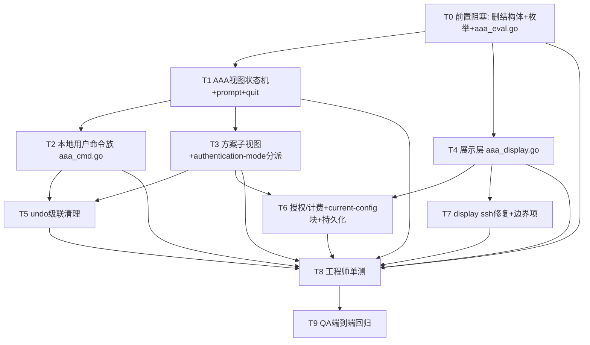
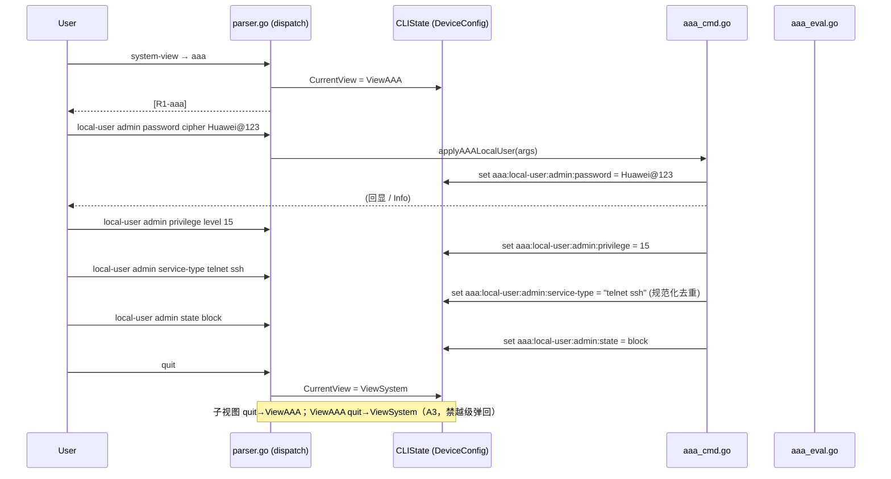
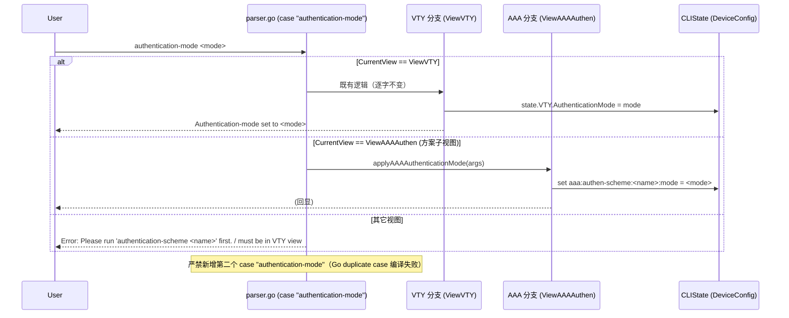
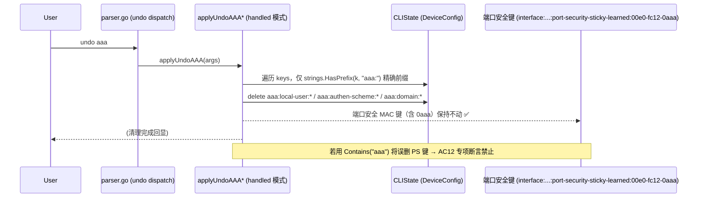
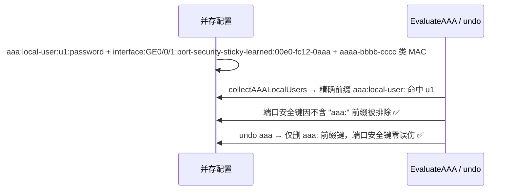
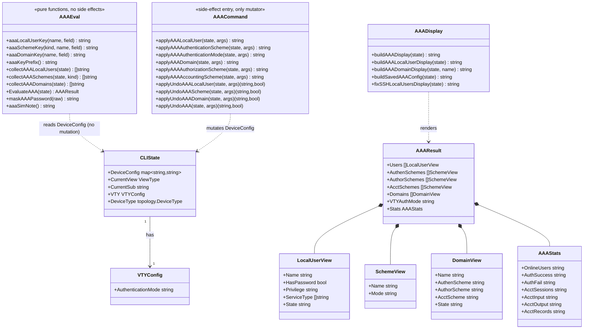

# ensp-lab P2 第八项：AAA 本地认证（华为 VRP 课程 71）增量设计 + 任务分解

> 本文档据 `docs/p2-aaa-prd.md`（PRD，511 行）落地；C1–C10 已由主理人拍板（§0），设计据此收敛，不再议。
> 文档结构**严格镜像** `docs/p2-gre-design.md`（§0 拍板汇总 → §0.1 架构裁决 → §1 背景现状 → §2 改动点表 → §3 任务分解 → §4 精确签名/键约定/常量 → §5 时序图/类图 → §6 依赖 → §7 共享知识 → §8 风险 → §9 待明确）。
> **核心范式**：Go CLI 三件套 `aaa_eval.go`（纯函数评估器，无副作用）/ `aaa_cmd.go`（副作用唯一出口）/ `aaa_display.go`（渲染），零新增第三方依赖、零改 `sim` 引擎、不 import `internal/protocol`、`capabilities.go` 零改动。
> 单一事实源 = `DeviceConfig` 键（`aaa:` 命名空间）；删除 `state.LocalUsers` / `LocalUser` 结构体（架构铁律，对照 GRE 删 `state.GRE`）。

---

## 0. 拍板汇总（不可再议的前提，设计据此落地）

> 以下 10 项为 PRD §8 待确认项，主理人已逐条拍板（标注 `(a)` 为 PM 建议且被采纳）。设计**直接落地，不再议**。

| 项 | 待确认问题（节选自 PRD §8） | 拍板结论（据以设计） |
|----|---------------------------|---------------------|
| **C1** | 是否删除 `state.LocalUsers` / `LocalUser` 结构体事实源？ | **(a) 删除**。系统视图下 `local-user` → `Error: Please configure it in the AAA view. Run 'aaa' first.`（替换现状 `parser.go:1784-1786` 的 `must be in system view`，该提示与真机相反，属教错）。 |
| **C2** | 授权（authorization）/ 计费（accounting）本期做到什么程度？ | **(a) 认证 P0 + 授权 P1 + 计费 P2**。三者同构共用「方案子视图 + `aaa:<kind>-scheme:<name>:mode` 键」，增量极小（见 P1-4 / P2-1）。 |
| **C3** | `authentication-mode radius` 如何处置？ | **(a) 接受为配置态**：如实存 `aaa:authen-scheme:<name>:mode=radius` + `aaaSimNote()` 诚实注记；**绝不联动**现存自造 `radius` 命令与 `state.RADIUS`（运行态恒 `-`）。 |
| **C4** | 用户名 `user@domain` 形态？ | **(a) 允许用户名含 `@`**，原样存 `aaa:local-user:<name>:*`，**不做登录期域解析**（无登录流程，见 P2-4）。 |
| **C5** | 口令校验强度？ | **(a) 仅校验长度 8–128**，不校验复杂度（不强制大小写/数字/特殊字符）。 |
| **C6** | `service-type` 多值存储顺序？ | **(a) 按固定枚举顺序 `telnet/ssh/ftp/http/terminal/ppp` 规范化去重存储**；**覆盖语义**（一条 `service-type` 命令即全集声明，非追加）。 |
| **C7** | 删除仍被域引用的方案？ | **(a) 硬拒绝**：`Error: The authentication scheme <name> is referenced by domain <domain> and cannot be deleted.`，方案键保留（与 P0-10「先建后绑」教学点对称）。 |
| **C8** | 一批缺省值与规格数字 | privilege 范围 **0–15**（未配置显示 `-` 非 `0`）；`state` 缺省 `active`（生效缺省，**键不落盘**）；**不设数量上限**；`authentication-mode` 缺省 `local`（生效缺省，键不落盘）。 |
| **C9** | 是否预置真机缺省域/方案？ | **(a) 不预置** `default` / `default_admin` 域与 `default` 方案（空态即真空态，避免「未经用户配置的既成事实」）。 |
| **C10** | 运行态统计占位？ | **(a) 保留** `--- Authentication runtime statistics ---` 分组，7 个运行态字段全 `-` + `aaaSimNote()` 注记（对齐 `greSimNote()`）。 |

---

## 0.1 架构裁决（A1–A12，对拍板未覆盖细节的收敛，非推翻拍板）

> 下列 A1–A12 是拍板落地时的工程收敛点，均在 §6 铁律与 C1–C10 框架内，不推翻任何拍板。

- **A1（🔴 键碰撞红线 · 最高危）**：**严禁 `strings.Contains(k, "aaa")` 或 `strings.Contains(k, "domain")` 模糊匹配**。`aaa` 是任意十六进制串，`interface:<if>:port-security-sticky-learned:<mac>` 的 MAC 段含 `0aaa`/`aaaa`（`p2_portsec_qa_t07_test.go:275` 即存 `00e0-fc12-0aaa`）。全部键解析走 `aaaLocalUserKey` / `aaaSchemeKey` / `aaaDomainKey` / `aaaKeyPrefix` 精确 helper（精确前缀 `aaa:` + 精确分段），口径同 `gre_eval.go:24-83`。
- **A2（🔴 顶层 token 冲突 · 最高危代码冲突）**：`authentication-mode` 在 `parser.go:1741` 已存在顶层 `case` 且硬守卫 `ViewVTY`。本期**必须改为按 `CurrentView` 分派**（ViewVTY → 既有 VTY 逻辑逐字不变；ViewAAA 方案子视图 → AAA 逻辑；其它 → 合并报错）。**严禁新增第二个 `case "authentication-mode"`**（Go 编译期 duplicate）。`parser.go:4637` 的 `authentication-mode` 位于 VRRP 内层 switch，不受影响、不得改动。
- **A3（quit 链越级弹回风险）**：`parser.go:283-296` 的 `quit` if-else 链末尾 `else` 一律回 `ViewSystem`。AAA 嵌套子视图须**显式加分支**：方案/域子视图 `quit` → 回 `ViewAAA`（非系统视图）；`ViewAAA` `quit` → 回 `ViewSystem`（AC1③ 专项断言）。
- **A4（诚实占位红线）**：运行态字段**类型恒 `string` 且值恒 `-`**（从类型层面杜绝填数字，对照 GRE `Stats` / DHCP `RelayStats`）；`aaaSimNote()` 严格对齐 `greSimNote()` / `portSecSimNote()`（读 `sim.EngineModeName()`，lite/full 两态）；口令脱敏恒 `****`，**严禁输出伪造 VRP 密文串**（`%^%#...`）。
- **A5（capabilities.go 零改动）**：`capabilities.go:46` 已有 `"local-user": l3Devices()`，本期**保持零改动**；新命令 `aaa`/`authentication-scheme`/`authorization-scheme`/`accounting-scheme`/`domain` 未在矩阵声明 → `isCommandSupported`（`:141-146`）**默认放行**；设备守卫必须做在**分支内部**复用 `l3Devices()`（`:174-181`，严禁重定义）。`display aaa`/`display local-user`/`display domain` 为只读命令、任意设备可读，空态放行 `Info:`。
- **A6（删除 `state.LocalUsers` 安全性）**：全仓仅 **9 处**引用（`parser.go:1792/1793/1795/1796/1803/1804/1809` 写、`:3419/:3422` 读、均在本期重构范围；`state.go:65/317-323/498`），`internal/api`/`internal/protocol`/前端零引用，且**零测试覆盖**（`grep -rn "LocalUser" --include=*_test.go` 零命中）→ 删字段后 `go build` 立即暴露遗漏，破坏风险≈0。`SSHUser`/`state.SSH.Users` 独立体系，本期不动。
- **A7（键命名空间精确 helper）**：最终键名见 §4.1；所有拼键/解键**唯一**走 §4.2 helper，禁止裸字符串拼接。
- **A8（生效缺省 = 键不落盘）**：privilege 未配、state 缺省 active、authentication-mode 缺省 local 均**不写键**，仅由 `EvaluateAAA` 在展示期回退到缺省渲染值（`-` / `active` / `local`）。差异值口径对齐 GRE keepalive 缺省。
- **A9（持久化零新增）**：AAA 键经既有 `SerializeToDeviceConfigData` ↔ `LoadFromDeviceConfigData`（`parser.go:5148-5176` 复制全部 DeviceConfig 键）自动往返，`save`→`reload` 零新增代码。`buildSavedAAAConfig` 仅控制 `display current-configuration` 文本块（不可回灌，与 STP/GRE 快照定位一致）。
- **A10（引用完整性守卫 · 教学点）**：域子视图绑定不存在的方案 → `Error: The authentication scheme <name> does not exist.`，**不写任何键、不隐式创建**（与 GRE「未 `tunnel-protocol gre` 配 `source` 硬拒绝」、DHCP 拍板 #1 一致）。
- **A11（口令脱敏 + 现状 display ssh 同步修复）**：所有 `display`（含 `display ssh` 的 `Local Users` 段、`display current-configuration`）口令一律 `****`；`display ssh` 的 `Local Users` 段由「map 随机遍历 + `Privilege: %d` 死字段假 0」改为读新事实源 + 确定性排序 + 脱敏（P0-13）。
- **A12（`authentication-scheme` 一词两义分派）**：同一 token 在 **AAA 视图**＝创建方案并进视图；在**域子视图**＝引用已有方案做绑定（不得隐式创建）。必须按 `CurrentView` 分派（与 `domain` 同理，见 P0-9）。

---

## 1. 背景与现状（缺陷说明 + 删除安全性论证 + 键碰撞实证）

### 1.1 总体定位：纠错型重构，不是从零新建

本期是**纠错型重构**（对照 GRE 那轮）：基线已有一套「自造 system-view `local-user` + 结构体事实源 `state.LocalUsers`」的错误实现，需替换为「真机 AAA 视图 + `DeviceConfig` 键单一事实源」。不引入新引擎、不新增依赖。

### 1.2 缺陷① 自造非 VRP 命令（`parser.go:1783-1814`）

现状 `local-user` 在**系统视图**创建用户，弱解析循环仅支持 `password cipher` / `service-type`，**双写明文**（`PasswordCipher = Password`），自造回显 `Local user %s created`。与真机「`aaa` 视图内 `local-user`」完全不符，且提示 `must be in system view` 与真机相反（教错，C1）。

### 1.3 缺陷② 结构体事实源 `state.LocalUsers`（不落盘，`save`→`reload` 100% 丢失）

`state.go:65` `LocalUsers map[string]*LocalUser`、`state.go:317-323` `LocalUser{Name,Password,PasswordCipher,ServiceType,PrivilegeLevel}`、`state.go:498` 构造器初始化。该结构体**不是 DeviceConfig 键**，故 `save` 后 `reload` 配置全丢（与 GRE 删 `state.GRE` 同源缺陷）。

### 1.4 缺陷③ `display ssh` map 随机遍历 + `Privilege: %d` 死字段假 0（`parser.go:3417-3427`）

`LocalUser.PrivilegeLevel` 全仓**只读不写**（grep 仅命中声明 `state.go:321` 与渲染 `parser.go:3427`），无任何写点 → `display` 恒输出 `Privilege: 0`，把结构体零值伪装成真实配置（与 GRE `Key: 0` 同源，GRE PRD P1-1 已明令禁止复制）。

### 1.5 缺陷④ 跨包死代码（`internal/protocol`）—— 本期不动

既有自造 `radius` 命令与 `state.RADIUS` 在 `internal/protocol` 侧，本期**绝不联动**（C3/A4）。AAA 仅走 `DeviceConfig` 键 + `CLIState.VTY.AuthenticationMode`（只读）。

### 1.6 删除 `state.LocalUsers` / `LocalUser` 的安全性论证（本设计再次 grep 复核）

- 写点 8 处：`parser.go:1792/1793/1795/1796/1803/1804/1809`（均在 P0-4/5/6/7 重构范围内，随 T2 一并删除）。
- 读点 2 处：`parser.go:3419/3422`（P0-13 `display ssh` 修复时移除）。
- 结构体定义/字段/构造器 3 处：`state.go:65/317-323/498`（T0 删除）。
- `internal/api`、`internal/protocol`、前端**零引用**；测试 `_test.go` **零命中**。
- 结论：删除后 `go build` 立即暴露任何遗漏，破坏风险≈0。

### 1.7 🔴 键碰撞核查（本期最高危项，A1 的实证依据）

- `aaa` 是合法十六进制串片段；端口安全粘滞 MAC 键 `interface:<if>:port-security-sticky-learned:<mac>` 的 `<mac>` 段为十六进制。
- 仓库现存测试数据：`p2_portsec_qa_t07_test.go:275` 实存键 `interface:GigabitEthernet0/0/1:port-security-sticky-learned:00e0-fc12-0aaa`（含 `0aaa`）；`aaaa-bbbb-cccc` 为最常用示教 MAC。
- 若 `undo aaa` 级联清理用 `strings.Contains(k,"aaa")`，将**误删端口安全粘滞 MAC 键**（P1-3 红线，AC12 专项断言）。同理 `strings.Contains(k,"domain")` 会命中 m-lag 域相关键（`parser.go:1282` 内层）。
- **结论**：必须精确前缀 `aaa:` + 精确分段 helper；解键亦须精确分段，禁止子串匹配。

### 1.8 顶层 token 冲突复核（采信 PRD §附，已复验）

- `aaa` / `authentication-scheme` / `authorization-scheme` / `accounting-scheme` / `domain` 在 `parser.go` 顶层 `switch` **均无既有 case**（grep 逐个核过）→ 可安全新增。
- 唯一冲突：`authentication-mode`（`parser.go:1741` 顶层 + ViewVTY 守卫）→ 按 A2 改为视图分派。
- `parser.go:1282` 的 `case "domain"`（m-lag 内层）、`parser.go:4637` 的 `case "authentication-mode"`（VRRP 内层）均在内层 switch，不受影响、不得改动。

### 1.9 框架 / 库选型

| 维度 | 选型 | 理由 |
|------|------|------|
| 语言 | Go（既有） | 不引入新语言 |
| CLI 引擎 | 既有 `internal/cli` `parser.go` 分发 + `CLIState.DeviceConfig` | 复用既有的三件套范式（`gre_*` / `portsec_*` / `dhcp_relay_*`） |
| 评估层 | 纯函数 `aaa_eval.go` | 无副作用、不 import `internal/protocol`、可单测 |
| 渲染层 | `aaa_display.go` | 输出确定性、脱敏、诚实占位 |
| 持久化 | 复用 `SerializeToDeviceConfigData` / `LoadFromDeviceConfigData` | 零新增持久化代码（A9） |
| 测试 | `testing` 标准库 | 工程师单测 + QA 端到端 |
| **新增第三方依赖** | **无** | 全部改动在既有依赖内 |

---

## 2. 改动点表（每点含 file:line 落点、现状缺陷、改动内容、归属任务）

> 行号据 PRD §附 grep 复核；落地时以 `Grep` 复验最新行号为准。

| # | 落点（file:line） | 现状缺陷 | 改动内容 | 归属任务 | 优先级 |
|---|------------------|---------|---------|---------|-------|
| #1 | `state.go:65` | `LocalUsers map[string]*LocalUser` 结构体事实源 | 删除字段 | T0 | P0 |
| #2 | `state.go:317-323` | `LocalUser` 类型不落盘 | 删除类型定义 | T0 | P0 |
| #3 | `state.go:498` | 构造器 `LocalUsers: make(...)` | 删除初始化 | T0 | P0 |
| #4 | `state.go:19-30` | `ViewType` 枚举无 AAA 视图 | 新增 `ViewAAA` / `ViewAAAAuthen` / `ViewAAADomain` 常量 | T1 | P0 |
| #5 | `internal/cli/aaa_eval.go`（新） | 无纯函数评估器 | 新增 `aaaLocalUserKey`/`aaaSchemeKey`/`aaaDomainKey`/`aaaKeyPrefix`/`collect*`/`EvaluateAAA`/`maskAAAPassword`/`aaaSimNote` | T0 | P0 |
| #6 | `parser.go:5117-5145` | `GetPrompt` 无 AAA 视图提示符 | 加 `[<sysname>-aaa]` / `[<sysname>-aaa-authen-<name>]` / `[<sysname>-aaa-domain-<name>]` | T1 | P0 |
| #7 | `parser.go:283-296` | `quit` 链末尾 `else` 回 `ViewSystem`，子视图越级弹回 | 加 `ViewAAAAuthen`/`ViewAAADomain` → `ViewAAA`、`ViewAAA` → `ViewSystem` 分支 | T1 | P0 |
| #8 | `parser.go:2458-2481`（display 分发）、`case "gre":3545` | 无 `display aaa/local-user/domain` | 加 `case "aaa"/"local-user"/"domain"` 调 `buildAAA*` | T4 | P0 |
| #9 | `parser.go:1783-1814` | 系统视图自造 `local-user` + 双写明文 + 自造回显 | 重构：系统视图 → C1 重定向错误；AAA 视图 → `applyAAALocalUser` 写 DeviceConfig 键 | T2 | P0 |
| #10 | `parser.go:1741-1754` | `authentication-mode` 顶层 case 硬守卫 `ViewVTY` | 改为按 `CurrentView` 分派（ViewVTY 逐字不变 / ViewAAA 方案子视图 → AAA 逻辑 / 其它报错），**禁重复 case** | T3 | P0 |
| #11 | `parser.go` 顶层（紧邻 #9 之后） | 无 `authentication-scheme`/`authorization-scheme`/`accounting-scheme`/`domain` 顶层 case | 新增 4 个顶层 case，按 `CurrentView` 分派（AAA 视图建方案/域；域子视图建绑定，A12） | T3/T6 | P0/P1/P2 |
| #12 | `aaa_cmd.go`（新）分支内 | 设备守卫未在分支内 | 复用 `l3Devices()` 做分支内守卫；视图/参数守卫矩阵（P0-11） | T1/T2/T3 | P0 |
| #13 | `internal/cli/aaa_cmd.go`（新） | 无副作用出口 | `applyAAALocalUser`/`applyAAAAuthenticationScheme`/`applyAAAAuthenticationMode`/`applyAAADomain`/`applyAAAAuthorization*`/`applyAAAAccounting*`/`applyUndoAAA*` | T2/T3/T6 | P0/P1/P2 |
| #14 | `internal/cli/aaa_display.go`（新） | 无渲染层 | `buildAAADisplay`/`buildAAALocalUserDisplay`/`buildAAADomainDisplay`/`buildSavedAAAConfig`/`fixSSHLocalUsersDisplay` | T4/T6/T7 | P0/P1 |
| #15 | `parser.go:829-896`（undo 分发）、`applyUndoSystemFeature:5013` | 无 `undo aaa/local-user/authentication-scheme/domain` | 加 handled 模式分支（`applyUndoGREInterface` 同款），未命中交回既有分支 | T5 | P1 |
| #16 | `parser.go:5379-5498`（`buildSavedConfigSnapshot`，挂载点 `:5392` 系统级块区、接口循环前） | 无 AAA 块 | 挂 `buildSavedAAAConfig`（参照 STP 块 `:5392-5395`），输出顺序见 PRD §4.5 | T6 | P1 |
| #17 | `parser.go:3417-3427`（`display ssh` Local Users 段） | map 随机遍历 + `Privilege: %d` 死字段假 0 | 改读 `EvaluateAAA` 新事实源 + 名称升序 + 脱敏 `****` + 诚实注记 | T7 | P0 |
| #18 | `parser.go:5148-5176`（`Serialize`/`Load`） | — | **零改动**（AAA 键随全部 DeviceConfig 键自动往返，A9） | — | — |
| #19 | `capabilities.go:46/141-153/174-181` | — | **零改动**（A5 已论证） | T7（仅确认） | P0 |

### ★ 改动点 #18 补充论证：为什么 `LoadFromDeviceConfigData` 零改动（A9）

`SerializeToDeviceConfigData` 复制 `DeviceConfig` **全部**键，`LoadFromDeviceConfigData` 全量还原。AAA 键属 `DeviceConfig` 子集，故 `save`→`reload` 自动持久化，**无需**在任一函数加 AAA 特例。仅 `buildSavedConfigSnapshot`（文本展示）需挂 AAA 块（#16），且该文本**不可回灌**（与 STP/GRE 快照定位一致）。

---

## 3. 任务分解（T0–T9，含依赖关系与实现顺序，映射 P0/P1/P2）

> 任务按**实现依赖顺序**排列；每个任务标注其承载的 PRD 需求 ID（P0-1..P0-16 / P1-1..P1-8 / P2-1..P2-6），便于工程师对照与 QA 追踪。T8/T9 为测试任务，与功能任务解耦。

### 3.1 文件列表（相对路径 + 职责 + 新增/修改标记）

| 文件 | 职责 | 标记 |
|------|------|------|
| `internal/cli/aaa_eval.go` | 纯函数评估器：键 helper、collect*、EvaluateAAA、maskAAAPassword、aaaSimNote | **新增** |
| `internal/cli/aaa_cmd.go` | 副作用唯一出口：local-user/方案/域/认证模式/undo 命令族 | **新增** |
| `internal/cli/aaa_display.go` | 渲染：display aaa/local-user/domain、buildSavedAAAConfig、display ssh 修复 | **新增** |
| `internal/cli/state.go` | 扩展 `ViewType` 枚举（ViewAAA/ViewAAAAuthen/ViewAAADomain）；删除 `LocalUsers`/`LocalUser` | **修改** |
| `internal/cli/parser.go` | GetPrompt/quit 链/display 分发/local-user 重构/authentication-mode 分派/新顶层 case/undo 分发/buildSavedConfigSnapshot 挂载/display ssh 修复 | **修改** |
| `internal/cli/capabilities.go` | 能力矩阵 | **零改动**（A5，仅文档注明） |
| `internal/cli/aaa_eval_test.go` | 工程师纯函数单测（键 helper/collect/EvaluateAAA/脱敏/键碰撞） | **新增** |
| `internal/cli/aaa_test.go` | 工程师命令族 + 展示集成单测（AC1–AC13） | **新增** |
| `internal/cli/p2_aaa_qa_test.go` | QA 端到端回归（独立于工程师，含 AC12 键碰撞专项） | **新增**（QA 另写） |

### 3.2 `parser.go` 改动点明细（已 grep 复核行号）

- 提示符：`GetPrompt` `:5117-5145` 加 AAA 三档提示符（#6）。
- quit 链：`:283-296` 加 `ViewAAAAuthen`/`ViewAAADomain`→`ViewAAA`、`ViewAAA`→`ViewSystem`（#7）。
- display 分发：`:2458-2481` 的 `arg0` switch 加 `aaa`/`local-user`/`domain`；参照 `case "gre":3545`（#8）。
- local-user 重构：`:1783-1814` 改为 C1 重定向 + 调 `applyAAALocalUser`（#9）。
- authentication-mode 分派：`:1741-1754` 改视图分派（#10）。
- 新顶层 case：紧邻 #9 之后加 `authentication-scheme`/`authorization-scheme`/`accounting-scheme`/`domain`（#11）。
- undo 分发：`:829-896` 加 handled 模式；`applyUndoSystemFeature:5013` switch 加 AAA 分支（#15）。
- buildSavedConfigSnapshot：`:5379-5498`，系统级块挂载点 `:5392`（接口循环前）挂 `buildSavedAAAConfig`（#16）。
- display ssh 修复：`:3417-3427` 改读 `EvaluateAAA` + 脱敏（#17）。

### T0 ｜ 前置阻塞：删结构体事实源 + 扩展视图枚举 + `aaa_eval.go` 纯函数地基

- **承载需求**：P0-2、P0-3、P0-16。
- **源文件**：`state.go`（#1/#2/#3）、`aaa_eval.go`（#5）。
- **依赖**：无（最先）。
- **优先级**：P0。
- **内容**：删除 `state.LocalUsers`/`LocalUser`（字段/类型/构造器）；新增 `aaa_eval.go` 全部纯函数（键 helper、collect*、EvaluateAAA、maskAAAPassword、aaaSimNote）；`aaaKeyPrefix()` 返回 `"aaa:"`；所有键构造走精确 helper（A1/A7）。**本任务使 `go build` 先暴露所有 `LocalUsers` 遗漏引用**，是后续一切的地基。
- **验收**：`go build ./...` 通过；`aaa_eval_test.go` 键 helper / collect 升序 / EvaluateAAA 缺省渲染（`-`/`active`/`local`）全绿。

### T1 ｜ AAA 视图状态机 + prompt + quit 链分支 + 能力守卫确认

- **承载需求**：P0-1、P0-15（capabilities 零改动落地点）、P0-11（视图级守卫一部分）。
- **源文件**：`state.go`（#4 枚举）、`parser.go`（#6 GetPrompt、#7 quit 链）、`capabilities.go`（#19 仅确认零改动）。
- **依赖**：T0。
- **优先级**：P0。
- **内容**：新增 `ViewAAA`/`ViewAAAAuthen`/`ViewAAADomain`；`GetPrompt` 三档提示符；`quit` 链显式分支（子视图→`ViewAAA`→`ViewSystem`，A3）；确认 `capabilities.go` 零改动、新命令默认放行、设备守卫将来在分支内做（A5）。
- **验收**：进入/退出 AAA 视图提示符与层级正确；子视图 `quit` 不越级弹回（AC1③）。

### T2 ｜ 本地用户命令族（`aaa_cmd.go` 副作用出口）

- **承载需求**：P0-4、P0-5、P0-6、P0-7、P0-11（系统视图守卫 + C1）、C1、C4、C5、C6、C8。
- **源文件**：`aaa_cmd.go`（#13 `applyAAALocalUser`）、`parser.go`（#9 local-user 重构为 C1 重定向 + 调 `applyAAALocalUser`）。
- **依赖**：T0、T1。
- **优先级**：P0。
- **内容**：`applyAAALocalUser` 写 `aaa:local-user:<name>:password|privilege|service-type|state`（A7）；用户名允许含 `@`（C4）；口令长度 8–128（C5）；`service-type` 按固定枚举规范化去重 + 覆盖语义（C6）；`state` 缺省 active 键不落盘（C8）；`password` 后必须 `cipher`，`simple` → `Error: unrecognized command`；未知子属性 → `Error: unrecognized command` 且不创建用户；系统视图 `local-user` → C1 重定向错误。
- **验收**：AC2/AC3/AC4/AC5a–5d；用户名含 `@` 原样存；口令长度越界报错；service-type 多值确定性顺序。

### T3 ｜ 方案子视图 + `authentication-mode` 视图分派（最高危）

- **承载需求**：P0-8、P0-9、P0-10、P0-11（方案/域视图守卫）、C2、C3、A2、A10、A12。
- **源文件**：`parser.go`（#10 authentication-mode 分派、#11 新顶层 case）、`aaa_cmd.go`（#13 `applyAAAAuthenticationScheme`/`applyAAAAuthenticationMode`/`applyAAADomain`）。
- **依赖**：T1、T2。
- **优先级**：P0。
- **内容**：`authentication-mode` 顶层 case 改为按 `CurrentView` 分派（ViewVTY 逐字不变；ViewAAA 方案子视图 → 写 `aaa:authen-scheme:<name>:mode`，支持 local/radius/none；**禁新增同名 case** A2）；`authentication-scheme <name>` 进方案子视图（AAA 视图建方案）；`domain <name>` 进域子视图；域子视图 `authentication-scheme <name>` 绑定（引用完整性守卫 A10，不隐式创建，A12）；`authentication-mode radius` 接受为配置态 + `aaaSimNote()` 注记，不联动 `state.RADIUS`（C3）。
- **验收**：AC6①/②/③/④；authentication-mode 视图分派正确；VTY 既有用例零回归；引用不存在方案硬拒绝。

### T4 ｜ 展示层 `aaa_display.go`（display + 脱敏 + 诚实占位）

- **承载需求**：P0-12、P0-13、P0-14、P1-7、P1-8、P2-5。
- **源文件**：`aaa_display.go`（#14 `buildAAADisplay`/`buildAAALocalUserDisplay`/`buildAAADomainDisplay`）、`parser.go`（#8 display 分发）。
- **依赖**：T0、T1。
- **优先级**：P0。
- **内容**：`display aaa`/`display local-user`/`display domain [<name>]` 按名称升序确定性输出（禁 map 随机遍历）；口令一律 `****`（P0-13）；末尾附 `aaaSimNote()`（P0-14）；`display domain <name>` 跨对象解引用展示被绑方案实际 mode（P1-7，方案不存在显示 `- (not found)`）；`display aaa` 体现 VTY `AuthenticationMode`（读 `state.VTY.AuthenticationMode` 只读不写，P1-8，只展示引用关系不模拟登录）；空态 `Info:`；指定不存在域 → `Error: The domain <name> does not exist.`；文案统一 `Error:`/`Info:` 前缀（P2-5）。
- **验收**：AC7/AC8/AC9/AC10/AC11；脱敏恒 `****`；运行态字段全 `-`；诚实注记两态正确。

### T5 ｜ undo 级联清理（精确前缀，键碰撞红线）

- **承载需求**：P1-1、P1-2、P1-3、C7。
- **源文件**：`parser.go`（#15 undo 分发 + `applyUndoSystemFeature`）、`aaa_cmd.go`（#13 `applyUndoAAA*`）。
- **依赖**：T2、T3。
- **优先级**：P1。
- **内容**：`undo local-user <name>` 级联清理 `aaa:local-user:<name>:` 精确前缀全部键；属性级 `undo local-user <name> privilege level|service-type|state` 清单个键；`undo authentication-scheme <name>`/`undo domain <name>` 清理对应精确前缀键；**删除仍被域引用的方案 → C7 硬拒绝**（方案键保留）；`undo aaa`（系统视图）级联清理 `aaa:` 精确前缀全部键（**最高危键碰撞触发点**，必须精确前缀，AC12）。挂钩 `applyUndoGREInterface` 的 handled 模式，未命中交回既有分支，零回归。
- **验收**：AC12（键碰撞专项，构造并存端口安全 MAC 键 `00e0-fc12-0aaa`，`undo aaa` 不误删）；引用完整性拒绝；属性级 undo 正确。

### T6 ｜ 授权/计费方案同构增量 + `display current-configuration` AAA 块 + 持久化贯通

- **承载需求**：P1-4、P1-5、P1-6、P2-1、C2。
- **源文件**：`aaa_cmd.go`（#13 `applyAAAAuthorization*`/`applyAAAAccounting*`）、`aaa_display.go`（#14 `buildSavedAAAConfig`）、`parser.go`（#16 `buildSavedConfigSnapshot` 挂载）。
- **依赖**：T3、T4。
- **优先级**：P1/P2。
- **内容**：`authorization-scheme <name>` + `authorization-mode <local|none>` 写 `aaa:author-scheme:<name>:mode`（P1-4，同构共用方案机制）；`accounting-scheme <name>` + `accounting-mode <none|radius>` 写 `aaa:acct-scheme:<name>:mode`（P2-1，纯配置态）；`buildSavedAAAConfig` 按 VRP 顺序输出 AAA 块（缺省值不冗余），挂入系统级块区（#16）；AAA 键随 `Serialize`/`Load` 自动往返（A9）；多用户/多方案/多域并存隔离（P1-6）。
- **验收**：AC6（授权/计费方案）、`display current-configuration` 含 AAA 块且字节级一致；save→reload 后渲染一致。

### T7 ｜ `display ssh` 同步修复 + 能力守卫落地确认 + 边界项收尾

- **承载需求**：P0-13（display ssh 修复）、P0-15（分支内守卫确认）、P2-2、P2-3、P2-4、P2-6。
- **源文件**：`parser.go`（#17 display ssh 修复、#19 capabilities 确认）、`aaa_cmd.go`（P2-3 `irreversible-cipher` → `Error: unrecognized command`）。
- **依赖**：T4。
- **优先级**：P2。
- **内容**：`display ssh` 的 `Local Users` 段改读 `EvaluateAAA` 新事实源 + 名称升序 + 脱敏 `****` + 诚实注记（P0-13/A11）；分支内设备守卫复用 `l3Devices()` 落地确认（P0-15/A5）；`local-user <name> password irreversible-cipher <pwd>` → `Error: unrecognized command`（P2-3）；用户名 `@` 仅合法性校验、不做域解析（P2-4/C4）；不预置 default 域/方案（P2-2/C9）；前端零变更确认（P2-6）。
- **验收**：display ssh Local Users 段确定性+脱敏；边界命令报错正确；空态即真空态。

### T8 ｜ 工程师单元 / 集成单测

- **承载需求**：AC1–AC13 全量断言。
- **源文件**：`aaa_eval_test.go`、`aaa_test.go`。
- **依赖**：T0–T7。
- **优先级**：P0。
- **内容**：键 helper 精确匹配（禁 Contains）、collect 升序去重、EvaluateAAA 缺省渲染、maskAAAPassword 恒 `****`、`aaaSimNote` 两态、视图状态机（quit 不越级）、local-user 全属性、authentication-mode 分派与 VTY 零回归、引用完整性、display 确定性+脱敏+诚实占位、undo 级联（含 AC12 键碰撞专项）、buildSavedAAAConfig 顺序与持久化字节一致。

### T9 ｜ QA 端到端回归验收（独立于工程师）

- **承载需求**：PRD §4 主操作流程端到端、AC 全量、与 GRE/端口安全/STP 同存无回归。
- **源文件**：`p2_aaa_qa_test.go`（QA 另写）。
- **依赖**：T8。
- **优先级**：P0。
- **内容**：课程 71 主线操作流端到端；AC12 键碰撞专项（端口安全 MAC 键 `00e0-fc12-0aaa` 与 `aaaa-bbbb-cccc` 并存时 AAA 配置/undo 零误伤）；跨特性（GRE/LAG/STP/端口安全/DHCP 中继）回归。

### 3.3 需求 → 任务映射表（P0-1..P0-16 / P1-1..P1-8 / P2-1..P2-6）

| 需求 ID | 标题 | 归属任务 |
|---------|------|---------|
| P0-1 | 新建 AAA 视图 ViewAAA 及子视图 | T1 |
| P0-2 | 删除结构体事实源 state.LocalUsers/LocalUser | T0 |
| P0-3 | AAA 键命名空间（精确匹配，防前缀碰撞） | T0 |
| P0-4 | local-user password cipher（AAA 视图） | T2 |
| P0-5 | local-user privilege level <0-15> | T2 |
| P0-6 | local-user service-type 多值 | T2 |
| P0-7 | local-user state active\|block | T2 |
| P0-8 | authentication-scheme + authentication-mode 视图分派 | T3 |
| P0-9 | domain + authentication-scheme 绑定 | T3 |
| P0-10 | 引用完整性守卫 | T3 |
| P0-11 | 视图/设备/参数守卫矩阵 | T1/T2/T3 |
| P0-12 | display aaa/local-user/domain | T4 |
| P0-13 | 口令脱敏 + display ssh 同步修复 | T4/T7 |
| P0-14 | aaaSimNote() 诚实占位 | T0/T4 |
| P0-15 | 能力矩阵与分支内守卫（capabilities 零改动） | T1/T7 |
| P0-16 | aaa_eval.go 纯函数评估器 | T0 |
| P1-1 | undo local-user + 属性级 undo | T5 |
| P1-2 | undo authentication-scheme/domain + 引用完整性 | T5 |
| P1-3 | undo aaa 级联清理（键碰撞红线） | T5 |
| P1-4 | authorization-scheme + authorization-mode | T6 |
| P1-5 | display current-configuration AAA 块 + save→reload 贯通 | T6 |
| P1-6 | 多用户/多方案/多域并存与隔离 | T6 |
| P1-7 | display domain <name> 详情视图 | T4 |
| P1-8 | VTY ↔ AAA 引用关系可见 | T4 |
| P2-1 | accounting-scheme + accounting-mode | T6 |
| P2-2 | 缺省域/方案预置（拍板：不预置） | T7 |
| P2-3 | irreversible-cipher（拍板：不实现） | T7 |
| P2-4 | user@domain 形态（仅校验，不做域解析） | T7 |
| P2-5 | 文案语言与一致性 | T4/T7 |
| P2-6 | 前端无变更 | T7 |

### 3.4 任务依赖图（Mermaid）



---

## 4. 精确类型签名、键约定与常量（工程师可直接照抄，仅签名不含实现）

### 4.1 最终键名（单一事实源，A7 红线：精确匹配专用）

```
用户：   aaa:local-user:<name>:password
        aaa:local-user:<name>:privilege        // 值: "0".."15"；未配置=键不存在
        aaa:local-user:<name>:service-type     // 值: 规范化去重列表, 如 "telnet ssh"
        aaa:local-user:<name>:state            // 值: "active"|"block"；缺省 active=键不存在
认证方案: aaa:authen-scheme:<name>:mode         // 值: "local"|"radius"|"none"；缺省 local=键不存在
授权方案: aaa:author-scheme:<name>:mode         // 值: "local"|"none"
计费方案: aaa:acct-scheme:<name>:mode           // 值: "none"|"radius"
域：     aaa:domain:<name>:authen-scheme        // 值: 方案名
        aaa:domain:<name>:author-scheme
        aaa:domain:<name>:acct-scheme
        aaa:domain:<name>:state                 // 值: "active"|"block"
```
> **精确前缀**：`aaa:`（含尾冒号）。任何扫描/清理必须 `strings.HasPrefix(k, "aaa:")` + 精确分段，禁 `Contains("aaa")` / `Contains("domain")`（A1）。

### 4.2 类型与函数签名（纯函数层 `aaa_eval.go`）

```go
package cli

// —— 键构造 helper（A7，全仓拼键/解键唯一素材）——
func aaaKeyPrefix() string                                    // 返回 "aaa:"
func aaaLocalUserKey(name, field string) string               // aaa:local-user:<name>:<field>
func aaaSchemeKey(kind, name, field string) string           // kind∈{authen,author,acct}; aaa:<kind>-scheme:<name>:<field>
func aaaDomainKey(name, field string) string                  // aaa:domain:<name>:<field>

// —— 收集器（精确前缀 + 精确分段扫描，返回名称升序去重）——
func collectAAALocalUsers(state *CLIState) []string
func collectAAASchemes(state *CLIState, kind string) []string // kind∈{authen,author,acct}
func collectAAADomains(state *CLIState) []string

// —— 评估主入口 ——
type LocalUserView struct {
    Name        string
    HasPassword bool
    Privilege   string // "-" 当未配置
    ServiceType []string
    State       string // "active" | "block" | "-"
}
type SchemeView struct {
    Name string
    Mode string // "local" | "radius" | "none" | "-"
}
type DomainView struct {
    Name         string
    AuthenScheme string // 方案名; 不存在显示 "- (not found)"
    AuthorScheme string
    AcctScheme   string
    State        string
}
type AAAStats struct {
    OnlineUsers  string // 恒 "-"
    AuthSuccess  string // 恒 "-"
    AuthFail     string // 恒 "-"
    AcctSessions string // 恒 "-"
    AcctInput    string // 恒 "-"
    AcctOutput   string // 恒 "-"
    AcctRecords  string // 恒 "-"
}
type AAAResult struct {
    Users         []LocalUserView
    AuthenSchemes []SchemeView
    AuthorSchemes []SchemeView
    AcctSchemes   []SchemeView
    Domains       []DomainView
    VTYAuthMode   string // 读 state.VTY.AuthenticationMode（只读）
    Stats         AAAStats
}
func EvaluateAAA(state *CLIState) AAAResult // 仅读 DeviceConfig，派生只读视图

// —— 脱敏 + 诚实占位 ——
func maskAAAPassword(raw string) string    // 恒返回 "****"
func aaaSimNote() string                   // 读 sim.EngineModeName(); lite/full 两态
```

### 4.3 副作用层 / 渲染层签名（`aaa_cmd.go` / `aaa_display.go`，仅签名）

```go
// aaa_cmd.go —— 副作用唯一出口
func applyAAALocalUser(state *CLIState, args []string) string
func applyAAAAuthenticationScheme(state *CLIState, args []string) string
func applyAAAAuthenticationMode(state *CLIState, args []string) string
func applyAAADomain(state *CLIState, args []string) string
func applyAAAAuthorizationScheme(state *CLIState, args []string) string
func applyAAAAuthorizationMode(state *CLIState, args []string) string
func applyAAAAccountingScheme(state *CLIState, args []string) string
func applyAAAAccountingMode(state *CLIState, args []string) string
// undo（handled 模式，未命中交回既有分支）
func applyUndoAAALocalUser(state *CLIState, args []string) (string, bool)   // ok=是否已处理
func applyUndoAAAScheme(state *CLIState, args []string) (string, bool)
func applyUndoAAADomain(state *CLIState, args []string) (string, bool)
func applyUndoAAA(state *CLIState, args []string) (string, bool)           // 系统视图 undo aaa 级联

// aaa_display.go —— 渲染
func buildAAADisplay(state *CLIState) string
func buildAAALocalUserDisplay(state *CLIState) string
func buildAAADomainDisplay(state *CLIState, name string) string
func buildSavedAAAConfig(state *CLIState) string       // display current-configuration AAA 块
func fixSSHLocalUsersDisplay(state *CLIState) string   // display ssh 的 Local Users 段
```

### 4.4 常量与规格数字（C5/C6/C8）、错误文案常量

```go
// 规格（C5/C6/C8）
const (
    AAAPasswordMinLen = 8
    AAAPasswordMaxLen = 128
    AAAPrivilegeMin   = 0
    AAAPrivilegeMax   = 15
    AAAStatPlaceholder        = "-"      // 运行态恒 "-"
    AAANotConfiguredPlaceholder = "-"    // 未配置字段渲染 "-"
    AAADefaultUserState   = "active"     // 生效缺省，键不落盘
    AAADefaultAuthMode    = "local"      // 生效缺省，键不落盘
)
// service-type 固定枚举顺序（C6，规范化去重依据）
var AAAServiceTypeOrder = []string{"telnet", "ssh", "ftp", "http", "terminal", "ppp"}

// 错误文案常量（QA 逐字断言）
const (
    ErrAAAViewFirst        = "Error: Please configure it in the AAA view. Run 'aaa' first."
    ErrMustBeInVTY         = "Error: must be in VTY user interface view"
    ErrAuthSchemeFirst     = "Error: Please run 'authentication-scheme <name>' first."
    ErrSchemeNotExist      = "Error: The authentication scheme %s does not exist."
    ErrSchemeReferenced    = "Error: The authentication scheme %s is referenced by domain %s and cannot be deleted."
    ErrDomainNotExist      = "Error: The domain %s does not exist."
    ErrPrivilegeRange      = "Error: Privilege level must be between 0 and 15."
    ErrServiceType         = "Error: Invalid service-type %s. Available: telnet, ssh, ftp, http, terminal, ppp."
    ErrStateUsage          = "Error: usage: local-user <name> state { active | block }"
    ErrPasswordUsage       = "Error: usage: local-user <name> password cipher <password>"
    ErrUnrecognized        = "Error: unrecognized command"
)
```

---

## 5. 时序图（Mermaid）

### 5.1 AAA 视图状态机 + 命令流（P0-1/4/5/6/7）



### 5.2 `authentication-mode` 视图分派流（最高危，P0-8 / A2）



### 5.3 undo 级联清理流（精确前缀，绝不误伤端口安全 MAC，P1-1/2/3 / A1）



### 5.4 键碰撞隔离流（AC12 专项实证）



### 5.5 类图（classDiagram，数据结构与接口）



---

## 6. 依赖包与运行环境

- **语言/运行时**：Go（既有版本，无升级）。
- **新增第三方依赖**：**无**。
- **复用既有包**：`internal/cli`（parser/state/capabilities）、`internal/sim`（`sim.EngineModeName()`，仅读，零改）、`topology`（`DeviceType`、`l3Devices` 复用）。
- **不引入**：`internal/protocol`（AAA 不联动既有 radius 死代码，C3）、任何 i18n 框架（P2-5）、前端框架（P2-6）。
- **测试**：标准库 `testing`，无新测试框架。

---

## 7. 共享知识（给工程师的硬性约定）

### 7.1 键命名约定（唯一事实源）

- 全部 AAA 配置落 `aaa:` 命名空间 DeviceConfig 键；**严禁**在 `CLIState` 新增任何 AAA/LocalUser/Domain/Scheme 内嵌结构体（架构铁律，对照 GRE AC12 静态断言）。
- 拼键/解键**唯一**走 `aaaLocalUserKey`/`aaaSchemeKey`/`aaaDomainKey`/`aaaKeyPrefix`（§4.2），禁止裸串拼接。
- 生效缺省（privilege 未配 / state=active / auth-mode=local）**键不落盘**，由 `EvaluateAAA` 回退渲染（A8）。

### 7.2 错误文案清单（QA 逐字断言用，见 §4.4 常量）

`ErrAAAViewFirst` / `ErrMustBeInVTY` / `ErrAuthSchemeFirst` / `ErrSchemeNotExist` / `ErrSchemeReferenced` / `ErrDomainNotExist` / `ErrPrivilegeRange` / `ErrServiceType` / `ErrStateUsage` / `ErrPasswordUsage` / `ErrUnrecognized`。**文案统一 `Error:` / `Info:` 英文前缀；诚实注记用中文括注**（对齐 `greSimNote()`）。

### 7.3 诚实占位红线（CRITICAL，P0-14 / AC13）

- 所有运行态统计字段**类型恒 `string` 且值恒 `-`**（从类型层面杜绝填数字）。
- `aaaSimNote()` 两态注记（lite/full）必须附在 `display aaa`/`display local-user`/`display domain` 末尾。
- **严禁输出伪造 VRP 密文串**（`%^%#...`）；口令脱敏恒 `****`。
- 不得声称「用户被授权执行 Y」「该用户被拒绝登录 N 次」「当前在线用户」「上次登录时间」等任何会话态/运行态（C3/A4/P1-8）。

### 7.4 复用 helper 清单（禁止重定义，否则编译冲突）

- `l3Devices()`（`capabilities.go:174-181`）—— 分支内设备守卫**复用**，严禁重定义（A5）。
- `applyUndoGREInterface` 的 handled 模式（`parser.go:828+`）—— undo 分发复用同款，未命中交回既有分支（A9 同族）。
- `sim.EngineModeName()` —— `aaaSimNote()` 只读调用，零改 sim 引擎。
- 键 helper 范式对齐 `gre_eval.go:24-83` 精确常量段。

### 7.5 回显与幂等口径

- `local-user <name>` 命令族：用户名不存在则**隐式创建**（真机同此），属性命令幂等覆盖（含 `service-type` 覆盖语义，C6）。
- 视图进入/退出：`quit` 子视图→`ViewAAA`→`ViewSystem` 显式分支（A3）；`return` 一律 `ViewUser`（既有不变）。
- `display` 输出**确定性**（名称升序，禁 map 随机遍历）；空态 `Info:`；指定不存在域/方案显示 `- (not found)` 而非崩溃。
- `display current-configuration` 文本快照**不可回灌**（与 STP/GRE 一致），口令行输出 `password cipher ****` 但与 DeviceConfig 明文键字节级一致（A9）。

---

## 8. 风险登记

| 风险 | 等级 | 缓解 |
|------|------|------|
| 键碰撞误删端口安全 MAC 键（含 `0aaa`/`aaaa`） | 🔴 最高 | A1 精确前缀 + AC12 专项断言；禁 `Contains` |
| `authentication-mode` 重复顶层 case 编译失败 | 🔴 高 | A2 改为视图分派，禁新增同名 case；VTY 逻辑逐字不变 |
| quit 链越级弹回（子视图静默弹回系统视图） | 🔴 高 | A3 显式分支；AC1③ 断言 |
| 删除 `state.LocalUsers` 遗漏引用导致 build 失败 | 🟡 中 | T0 先删，go build 立即暴露；9 处引用全在重构范围 |
| 诚实占位被违反（伪造运行态/密文） | 🔴 高 | §7.3 红线 + `Stats` 类型 string + aaaSimNote 强制 |
| `authentication-mode radius` 误联动 `state.RADIUS` | 🟡 中 | C3 纯配置态，不 import `internal/protocol` |
| capabilities.go 被误改导致 VTY 用例回归 | 🟡 中 | A5 零改动，设备守卫分支内复用 l3Devices |
| 引用完整性被绕过（隐式创建方案） | 🟡 中 | A10/P0-10 硬拒绝且不写键 |

---

## 9. 待明确事项（仅列本期确实无法闭合的）

**无。** C1–C10 主理人已拍板并落入 §0；§6 铁律与 A1–A12 裁决已闭合所有 PRD 明示的实现风险；键碰撞、authentication-mode 分派、quit 链、诚实占位、capabilities 零改动均已写入对应章节与任务项。所有 file:line 落点经 PRD §附 grep 复核，工程师落地时以 `Grep` 复验最新行号即可。

---

## 附录：与 GRE / 端口安全 同族对照速查

| 维度 | GRE（P2 第七项） | 端口安全（P2 第六项） | **AAA（P2 第八项）** |
|------|----------------|---------------------|---------------------|
| 三件套 | `gre_eval/cmd/display.go` | `portsec_eval.go` | **`aaa_eval/cmd/display.go`** |
| 事实源 | 删 `state.GRE` → DeviceConfig 键 | DeviceConfig 键 | **删 `state.LocalUsers` → `aaa:` 键** |
| 键碰撞红线 | 禁 `Contains("gre")`（`Ag-gre-gation`） | MAC 键含 `0aaa` | **禁 `Contains("aaa")`/`("domain")`** |
| 诚实占位 | `greSimNote()` | `portSecSimNote()` | **`aaaSimNote()`（同两态）** |
| undo 模式 | `applyUndoGREInterface` handled | — | **`applyUndoAAA*` handled 同款** |
| 持久化 | `Serialize`/`Load` 自动往返 | 同 | **同（零新增）** |
| 能力矩阵 | 零改动，分支内 `l3Devices()` | 同 | **同（A5）** |
