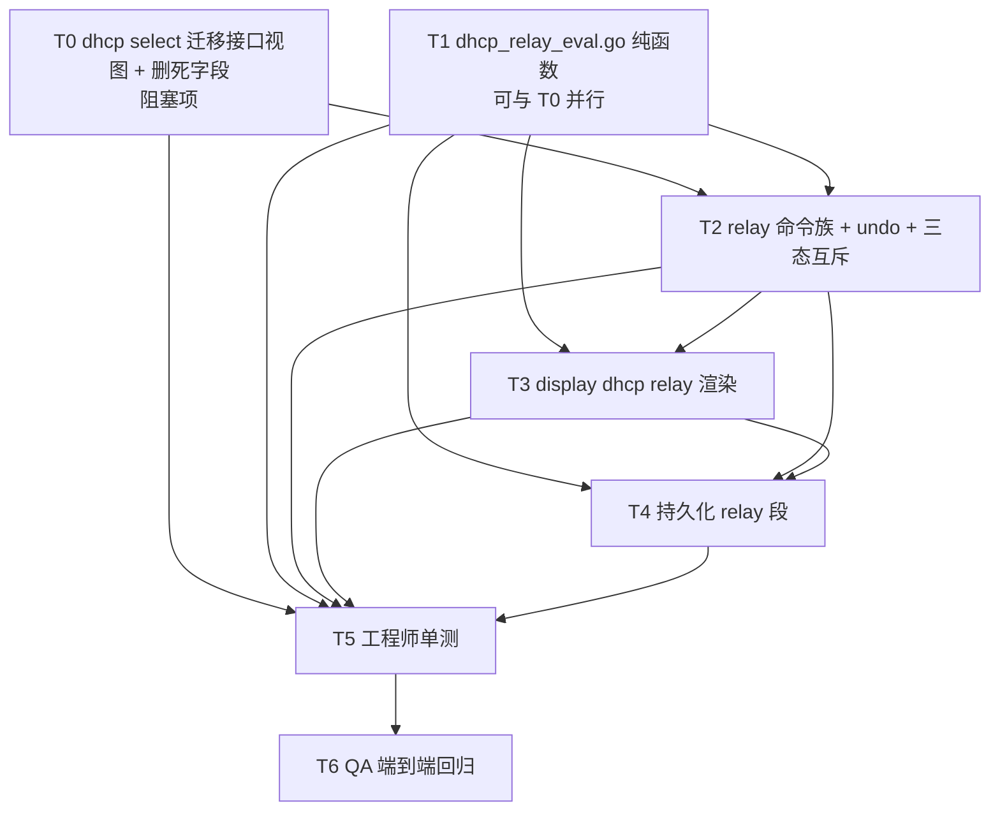
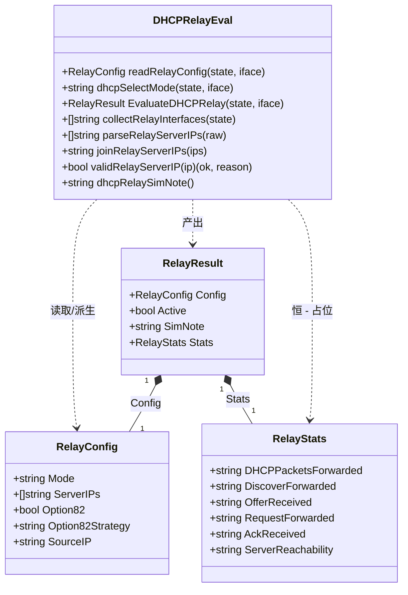
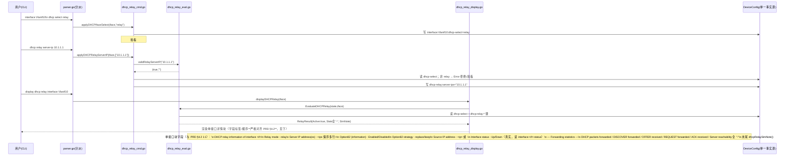
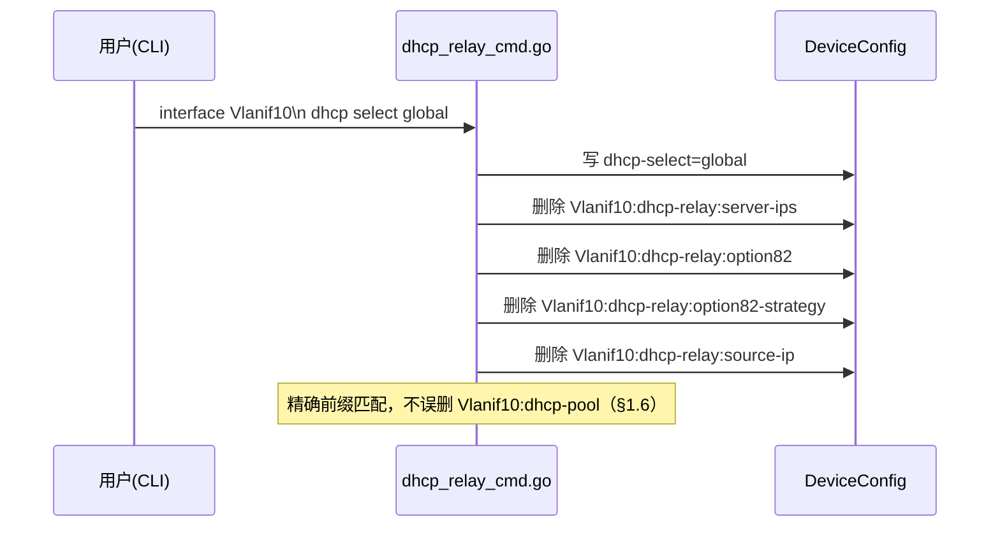
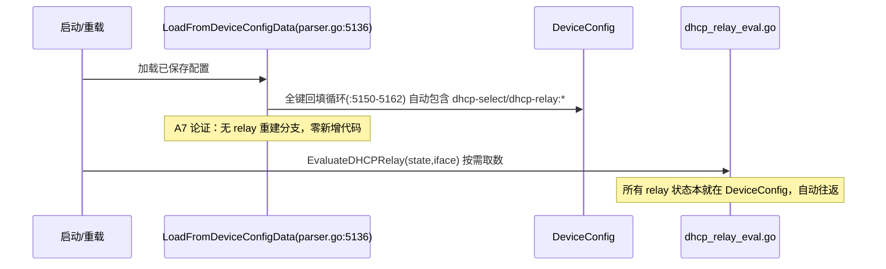

# ensp-lab P2 第六项：DHCP 中继 DHCP Relay（华为 VRP 课程 27）增量设计 + 任务分解

> 文档类型：实现前技术设计（架构师 高见远 / Gao）
> 关联输入：`docs/p2-dhcp-prd.md`（许清楚）、`docs/p2-lag-design.md`（结构与详略对齐基准）、`internal/cli/parser.go` / `state.go` / `capabilities.go` / `lag_eval.go` / `lag_cmd.go` / `lag_display.go` / `stp_eval.go` / `vrrp_eval.go`（已逐条 grep 核验代码基线）
> 基线：P1-C / P1-F / NAT / 端口安全 / VRRP / STP / 链路聚合「CLIState 层纯函数、单一事实源 `DeviceConfig`、诚实占位、零改动 `sim` 引擎、零新增第三方依赖」——本期**完全沿用**，DHCP 中继仅作为 `cli` 包内增量
> 语言：中文。仅含类型/函数签名与伪代码，**不含实现代码**（实现是工程师下一阶段）。

---

## 0. 拍板汇总（不可再议的前提，设计据此落地）

主理人已对 PRD §6 逐条拍板，以下 6 条为**已决事项**，设计严格照此执行，不再开放讨论。完整固化见 §9.1。

| # | 拍板内容 | 对应 PRD §6 项 | 落点 |
|---|---|---|---|
| 1 | **server-ip 依赖顺序**：未 `dhcp select relay` 就配 `dhcp relay server-ip` → **明确报错拒绝、不写任何键**（方案 a，状态机最干净） | #1 | §2 改动点 #2、T2 |
| 2 | **`dhcp select` 迁移（T0 前置重构）**：从系统视图迁到**接口视图**；**删除 `state.DHCPSelectMode` 字段**；改写 `interface:<if>:dhcp-select` 键（每接口一值）；系统视图旧用法 → 报错引导 | #2 / P2-2 | §2 改动点 #1、T0 |
| 3 | **三态互斥上提 P0**：`global`/`interface`/`relay` 后配覆盖时**级联清理 `interface:<if>:dhcp-relay:*` 全部键**（避免幽灵配置，同 LAG `Bridge-Aggregation` 幽灵组同类坑） | #3（P2-1 → **P0**） | §2 改动点 #6、T2 |
| 4 | **运行态展示（诚实占位）**：保留 `Forwarding statistics` 分组与 6 个字段，**恒 `-`**；末尾 `dhcpRelaySimNote()` 与 `lagSimNote()` 同源；`Source IP` 未配恒 `-`，**不得推导接口主 IP**（推导即臆造） | #4 | §2 改动点 #7、T1/T3 |
| 5 | **能力矩阵**：顶层 `"dhcp"` 保持 `switchAndL3()` **不动**；`case "dhcp"` 分支内部对 `select relay` / `relay *` 做**三层守卫**（接口视图 + 设备类型 + relay 前置条件）；`display dhcp relay` 为**只读，任意设备可读** | #5 | §2 改动点 #5、T2/T3 |
| 6 | **缺省值一揽子**：option82 strategy 缺省 `replace`；未 `dhcp enable` 时配 relay → **软提示 `Info:` 不阻断**；server-ip 上限 **8**（保序去重）；`undo dhcp relay server-ip` 无参 = 清空全部；`display dhcp relay` 无参 = 等价 `all` | #6 | §2 改动点 #8/#9、T1/T2/T3 |

> ⚠️ **拍板 #6 的「软提示」推翻 PRD P0-7 第一条与 AC5 ①**（PRD 写的是 `Error: DHCP is not enabled...` 硬拒绝）。**以拍板为准**，AC5 ① 须改写为「断言 `Info:` 提示存在 **且** 键已写入」。详见 §9.2 C1。
> ⚠️ **拍板 #5 的「display 任意设备可读」推翻 PRD AC10 中「PC / Server 上 `display dhcp relay all` 返回能力拒绝」的断言**。**以拍板为准**，AC10 须拆分：配置命令拒绝、display 放行（PC 上输出 `Info: No DHCP relay interface configured.`）。详见 §9.2 C2。

---

## 0.1 架构师补充裁定（对拍板未覆盖细节的收敛，非推翻拍板）

主理人 6 条拍板闭合了 PRD §6 全部 6 项。为使工程师可直接执行，架构师按「与拍板一致、范围收敛、诚实优先、单一事实源」原则，对以下**拍板未显式覆盖**的细节裁定如下（§9.2 列出需主理人知悉/复核项）：

| 项 | 裁定 | 理由 |
|---|---|---|
| **A1 `dhcp-relay:mode` 键是否存在** | **不存在**。接口 DHCP 模式的**唯一事实源 = `interface:<if>:dhcp-select`**；`RelayConfig.Mode` 是从该键**派生的结构体字段**，不落独立键 | 拍板 #2 已把模式定在 `dhcp-select`；若再落 `dhcp-relay:mode` 即**双写事实源**（LAG `:members` 双写同类坑）。且与拍板 #3「切模式时级联删 `dhcp-relay:*`」直接冲突——模式键会把自己删掉。**该点消歧是本设计的必要收敛** |
| **A2 relay 命令的设备类型集合** | **`l3Devices()`**（Router / L3Switch / Firewall / VTEP，`capabilities.go:174` **直接复用，严禁重定义**） | 中继是三层特性；PRD §6 #5 已给该候选集；顶层 `"dhcp"` 不动故二层 Switch 的 `dhcp enable` / `dhcp pool` 零回归 |
| **A3 `dhcp select global\|interface` 是否同受 A2 守卫** | **是**，与 `select relay` 同一守卫 | 现状该命令是**零读取死字段**、`*_test.go` 零覆盖，收窄破坏风险为 0；一个守卫覆盖整个接口视图 `dhcp` 分支，实现最简、无分叉 |
| **A4 P2-4 特殊 IPv4 地址** | **本期纳入**（`0.0.0.0` / `255.255.255.255` / `127.0.0.0/8` / `224.0.0.0/4` 拒绝，文案 `Error: <x> is not a valid DHCP server address.`） | 逻辑全部落在 `validRelayServerIP` 一个纯函数内，增量 ≈5 行、可单测、零额外风险；不纳入反而要在 §9 留悬案 |
| **A5 `Option82 strategy` 未配时显示什么** | 显示**生效缺省值 `replace`**（拍板 #6 已定缺省），**不显示 `-`** | `-` 表示「无数据源 / 不可产出」，缺省值是**确定可知的事实**，用 `-` 反而不诚实；`current-configuration` 仍**不输出**缺省行（VRP 只落差异值，对齐 `buildSavedLAGInterfaceConfig` 口径） |
| **A6 副作用层落哪个文件** | 新增 `dhcp_relay_cmd.go`（副作用唯一出口）+ `dhcp_relay_display.go`（渲染 + 持久化 helper），**不把逻辑堆进 `parser.go`** | 严格复刻 LAG 三件套 `lag_eval.go` / `lag_cmd.go` / `lag_display.go` 分层；`parser.go` 现已 **5822 行**，继续堆积不可维护。`parser.go` 仅保留**分派**（≈30 行） |
| **A7 `LoadFromDeviceConfigData` 是否需要 relay 重建分支** | **不需要，零改动**（附论证，§2 改动点 #4） | relay 状态**本就只在 DeviceConfig**，`LoadFromDeviceConfigData:5150-5162` 已全键回填；`Interface status` 读 `interface:<if>:status` 键（同样自动往返）。这是单一事实源方案的直接红利（同 VRRP / STP） |
| **A8 系统视图 `undo dhcp select ...`** | 与正向命令同口径 → `Error: Please run 'undo dhcp select' in interface view.` | 正向报错引导、反向静默成功会造成认知割裂 |

---
## 1. 背景与现状（含 `dhcp select` 双重缺陷与删字段安全性论证）

### 1.1 总体定位

在 `cli` 包内**新建**一条 DHCP 中继链路：DHCP 中继在代码基线中**100% 缺失**（`grep -in "relay" internal/cli/*.go` 无任何中继实现，`grep -in "display dhcp" internal/cli/*.go` 无命中）。但**不是**从零另起炉灶——既有 `dhcp select` 命令存在**两处必须先修的架构缺陷**，中继必须挂在接口上，故这两处是本期的**前置阻塞项（T0）**。

严格遵循既有架构基线（与 STP / VRRP / LAG 完全同构）：

- **不修改 `sim` 引擎**（engine 零改动，中继语义在 CLIState 层做，引擎不感知）；
- **纯函数 `EvaluateDHCPRelay`** 与 `EvaluateLAG` / `EvaluateSTP` / `EvaluateVRRP` 同一契约：只读 `DeviceConfig` / `Interfaces`，无副作用、不写引擎、**不 import `internal/protocol`**、可单测；
- **副作用一律由命令处理器执行**：`dhcp_relay_cmd.go` 的 `apply*` 解析后写 `DeviceConfig` 键，`dhcp_relay_display.go` 读键渲染并调纯函数拿派生结果。

### 1.2 现状缺陷一：`dhcp select` 错位在系统视图（relay 落地的直接阻塞点）

```go
// parser.go:1554-1556  ← 硬守卫，把整个 dhcp 分支锁死在系统视图
// 系统视图下的 DHCP 命令
if state.CurrentView != ViewSystem {
    return "Error: must be in system view"
}
```

官方 VRP `dhcp select { global | interface | relay }` 是**接口视图**命令（课程 27 操作流：`interface GE0/0/1` → `dhcp select relay` → `dhcp relay server-ip ...`）。现状硬守卫导致：

1. **`dhcp select relay` 在接口视图根本无法进入 `case "dhcp"` 分支**（会被 `:1555` 直接拒绝）；
2. 中继的全部参数（server-ip / option82 / source-ip）都是**接口维度**语义，无法挂到系统视图的全局单值上。

→ **不先做视图迁移，relay 命令族无处安放。** 这是 T0 必须先行的唯一原因。

### 1.3 现状缺陷二：`state.DHCPSelectMode` 是只写不读的死字段

```go
// state.go:84
DHCPSelectMode string   // DHCP 模式: global 或 interface

// parser.go:1588-1597 —— 全仓唯一写入点
case "select":
    if len(cmd.Args) < 2 { return "Error: usage: dhcp select global|interface" }
    mode := strings.ToLower(cmd.Args[1])
    if mode != "global" && mode != "interface" { return "Error: usage: dhcp select global|interface" }
    state.DHCPSelectMode = mode          // ← :1596 唯一写入，此后无任何读取
    return fmt.Sprintf("DHCP %s selected", mode)
```

四重缺陷叠加：

| 缺陷 | 后果 |
|---|---|
| **全局单值** | 无法表达「每接口一种 DHCP 模式」的真实语义——而中继正是接口维度 |
| **只写不读** | 该功能**当前完全没有实际效果**（写完就丢，无任何消费方） |
| **不写 `DeviceConfig`** | 不随 `SerializeToDeviceConfigData` 落盘 → `save`→`reload` 后配置丢失 |
| **不接受 `relay`** | `:1593` 枚举只有 `global` / `interface`，`dhcp select relay` 直接 usage 报错 |

### 1.4 删除 `state.DHCPSelectMode` 的安全性论证（本设计再次 grep 复核，确认无误）

```
$ grep -rn "DHCPSelectMode" --include=*.go .
internal/cli/state.go:84       DHCPSelectMode string   // 声明
internal/cli/parser.go:1596    state.DHCPSelectMode = mode   // 唯一写入
```

| 论证维度 | 结论 |
|---|---|
| **读取点** | **0 个**（全仓 `.go` 文件仅 2 处命中：1 声明 + 1 写入） |
| **测试覆盖** | **0 个**（`*_test.go` 对 `DHCPSelectMode` / `dhcp select` 零命中） |
| **持久化面** | **无**（不在 `DeviceConfig`，不进 `SerializeToDeviceConfigData` 快照，无历史配置包袱） |
| **API / 前端消费** | **无**（`internal/api`、前端均不引用该字段） |
| **编译期保护** | 删字段后若有遗漏引用，`go build` **立即失败**（Go 静态类型强校验，不存在运行时才炸的隐患） |
| **先例** | STP 已「直接移除 `state.STP`」、LAG 已「直接改键名不做旧键迁移」，同族处置 |

→ **删除风险 ≈ 0，且是唯一能承载 relay 的正确架构。** 拍板 #2 成立。

### 1.5 配置单一事实源 = `DeviceConfig`（架构铁律 1）

**严禁在 `CLIState` / `DHCPConfig` 新增内嵌 relay 结构体（如 `state.DHCPRelay`）。** 已核实 `state.go:140-143` 的 `DHCPConfig{Enabled, Pools}` 现无任何 relay 字段，本期**保持**。理由与 STP / VRRP / LAG 方案 A 完全同构：

- `SerializeToDeviceConfigData`（`parser.go:5105`）/ `LoadFromDeviceConfigData`（`parser.go:5136`，回填循环在 `:5150-5162`）遍历**全部** `state.DeviceConfig` 键往返，**凡存于 DeviceConfig 的配置自动 roundtrip** → 本期对 relay 键**零新增序列化代码**（§2 改动点 #4 / A7）；
- 内嵌结构体 = 双写事实源 = 结构体漂移根因（`state.STP` 已在 P2 #4 移除，`interface:<trunk>:members` 已在 P2 #5 废弃）。

### 1.6 键命名空间与既有键的碰撞核查

已核实仓库内**唯一**的 `interface:*:dhcp*` 既有键是：

```
parser.go:2646   interface:<Vlanif<id>>:dhcp-pool     ← display ip pool 的地址池绑定键（既有，本期不动）
```

本期新增键（§7.1 完整表）：`interface:<if>:dhcp-select`、`interface:<if>:dhcp-relay:<field>`。

> ⚠️ **工程师必读**：`dhcp-pool` / `dhcp-select` / `dhcp-relay:` 三者**共享 `interface:<if>:dhcp` 前缀**。因此 `collectRelayInterfaces` **必须用精确后缀 `:dhcp-select` 匹配**（`strings.HasSuffix`），**严禁用 `strings.Contains(k, ":dhcp")` 之类的模糊前缀扫描**——否则会把地址池绑定键误判为中继接口（幽灵接口，与 LAG 幽灵组同类缺陷）。级联清理同理：只删 `interface:<if>:dhcp-relay:` **精确前缀**键，**绝不误删 `dhcp-pool` / `dhcp-select`**。

### 1.7 框架 / 库选型

- **不引入任何新依赖**：仅 Go 标准库（`fmt`、`strings`、`sort`、`net`）+ 仓库内既有 `internal/cli`、`internal/sim`（仅读 `EngineModeName()` 决定 lite/full 注记）。
- **明确不新增 `cli → protocol` 依赖**：`dhcp_relay_eval.go` 只消费 `state.DeviceConfig`，不 import `internal/protocol`（`internal/protocol` 本期零改动）。
- **复用既有 helper（重要：同包内严禁重复定义，否则编译冲突）**：

| 既有符号 | 位置 | 本期用途 |
|---|---|---|
| `l3Devices()` | `capabilities.go:174` | A2 设备类型守卫集合（**直接复用，不得重定义**） |
| `switchAndL3()` | `capabilities.go:227` | 顶层 `"dhcp"` 现值，**本期零改动** |
| `isCommandSupported(top, dt)` | `capabilities.go:141` | 分支内守卫复用同一判定入口（同 `lagDeviceSupported`，`lag_cmd.go:45`） |
| `isPortDown(state, iface)` | `stp_eval.go:175` | `Interface status` 唯一判定源（**直接复用，不得重定义**） |
| `sortedInterfaceNames(state)` | `stp_eval.go:304` | 参照其排序口径；本期 relay 接口列表用 `sort.Strings`（对齐 `vrrpInterfaces`，`vrrp_eval.go:133`） |
| `sim.EngineModeName()` | `lag_eval.go:787` 用法 | `dhcpRelaySimNote()` lite/full 两态判定 |
| `net.ParseIP` + `.To4()` | `parser.go:4539`（VRRP virtual-ip） | IPv4 校验唯一范式 |
| `buildSavedVRRPConfig` + `vrrpInterfaces` **独立输出通道范式** | `parser.go:5415-5427`（挂载点 `:5400-5412`） | §2 改动点 #4 的持久化模板 |
| `buildSavedLAGInterfaceConfig` **只输出差异值**口径 | `lag_display.go:332-368` | relay 段「缺省值不冗余输出」的口径模板 |
| `applyUndoLAGInterface(state, args) (string, bool)` **handled 模式** | `lag_cmd.go:773`，挂载 `parser.go:827` | 接口视图 undo 的挂钩范式 |

---

## 2. 改动点表（每点含 file:line 落点、现状缺陷、改动内容、归属任务）

> 说明：`internal/protocol` **零改动、不 import**；`sim` 引擎零改动；`capabilities.go` **零改动**（拍板 #5）；`state.go` **仅删 1 行**（拍板 #2）；`tools.go` 零改动。

| # | 主题 | 落点（file:line） | 现状缺陷 | 改动 | 任务 |
|---|---|---|---|---|---|
| **#1** | **前置迁移：`dhcp select` 系统视图 → 接口视图 + 删死字段** | `parser.go:1554-1556`（系统视图硬守卫）<br>`parser.go:1588-1597`（`dhcp select` 分支）<br>`state.go:84`（`DHCPSelectMode` 声明） | 硬守卫锁死系统视图（§1.2）；写只写不读全局死字段（§1.3） | ① `:1554-1556` 改为**按视图分派**：`ViewDHCPPool` 保持既有池子命令不变 → `ViewInterface` 走新 `applyDHCPInterfaceCmd` → `ViewSystem` 处理 `enable`/`disable`/`pool` 且 `select` 报错引导 → 其它视图按子命令给对应视图错误；② `:1588-1597` 系统视图 `select` 分支**重写为报错引导**（`Error: Please run 'dhcp select' in interface view.`）；③ **删除 `state.go:84`**；④ 接口视图 `dhcp select {global\|interface\|relay}` 写 `interface:<if>:dhcp-select`（每接口一值） | **T0** |
| **#2** | **relay 配置命令族（接口视图）** | `parser.go:1475` `case "dhcp"` 内新增 `ViewInterface` 分派 → **新文件** `dhcp_relay_cmd.go` | 中继命令族 100% 缺失 | 新增 `applyDHCPInterfaceCmd` 分派 → `applyDHCPSelect` / `applyDHCPRelayServerIP` / `applyDHCPRelayInformation` / `applyDHCPRelaySourceIP`。**拍板 #1**：未 `select relay` 配 `server-ip` → `Error: Please run 'dhcp select relay' on this interface first.` **且不写任何键**。server-ip 保序去重、上限 8（拍板 #6）。IPv4 校验走 `validRelayServerIP`（P0-5 + A4） | **T2** |
| **#3** | **`display dhcp relay { interface <if> \| all }`** | `parser.go:2462` `switch arg0` 新增 `case "dhcp"`（现**无任何 `display dhcp` 分支**，grep 零命中）→ **新文件** `dhcp_relay_display.go` | display 完全缺失；参照物 `display ip pool`（`:2643/2662/2679`）是 **map 随机遍历**的反面教材 | 新增 `buildDHCPRelayDisplay(state, args)`：无参 = `all`（拍板 #6）；`interface <if>` 单接口详情块；`all` 汇总表。**接口按名称升序**（`sort.Strings`）、**server-ip 按配置序**，输出确定性（AC7 要求连续 10 次字节级一致）。**唯一数据源 = `EvaluateDHCPRelay` / `collectRelayInterfaces`**，不直接读散落键 | **T3** |
| **#4** | **持久化：`current-configuration` relay 段 + save→reload 贯通** | 挂载点 `parser.go:5400-5412`（接口块内，VRRP/STP/LAG 三行之后）<br>独立通道范式 `parser.go:5415-5427`（`vrrpInterfaces`）/ `:5428-5433`（`buildSavedLAGConfig`）<br>`LoadFromDeviceConfigData` `parser.go:5136` | 快照全文无 relay 段；reload 后 `state.Interfaces` 可能不含中继接口 → 只遍历 `state.Interfaces` 会丢配置（LAG 曾踩同坑） | ① 新增 `buildSavedDHCPRelayInterfaceConfig(state, iface)`（落 `dhcp_relay_display.go`），按 VRP 顺序输出 ` dhcp select relay` / ` dhcp relay server-ip <ip>`（每地址一行）/ ` dhcp relay information enable` / ` dhcp relay information strategy <x>` / ` dhcp relay source-ip <ip>`，**缺省值不冗余输出**（A5，对齐 `buildSavedLAGInterfaceConfig`）；② 挂入 `:5400-5412` 接口块；③ 新增 `buildSavedDHCPRelayConfig(state)` 独立输出通道，为「有 relay 配置但 `state.Interfaces` 未重建」的接口补齐 `interface <if>` 块（复用 VRRP 范式）；④ **`LoadFromDeviceConfigData` 零改动**（论证见下方 ★） | **T4** |
| **#5** | **能力矩阵与三层守卫** | `capabilities.go:64` `"dhcp": switchAndL3()` **零改动**<br>守卫落 `dhcp_relay_cmd.go`（复用 `capabilities.go:174` `l3Devices()`） | 顶层收窄会**误伤**二层 Switch 既有 `dhcp enable` / `dhcp pool`（`parser.go:1563-1587`）；`isCommandSupported` 按**首 token** 匹配（`:141`），`relay` 是参数不是首 token，独立矩阵键不可行 | 顶层 `"dhcp"` 保持 `switchAndL3()`；`case "dhcp"` 的 **`ViewInterface` 分支内**做三层守卫：① 视图守卫（非接口视图 → `Error: Please run 'dhcp select' in interface view.`）；② 设备守卫（非 `l3Devices()` → `Error: DHCP relay is not supported on <DeviceType>`，A2/A3）；③ relay 前置守卫（拍板 #1）。**`display dhcp relay` 只读、任意设备可读**（拍板 #5），PC 上输出空态 `Info:` | **T2/T3** |
| **#6** | **三态互斥 + 级联清理（P2-1 上提 P0）** | `dhcp_relay_cmd.go` `applyDHCPSelect` | 无（新增）。风险原型 = LAG 的 `Bridge-Aggregation` 幽灵组 | `dhcp select` 后配覆盖先配；**切到 `global` / `interface`（即非 `relay`）时，级联删除该接口 `interface:<if>:dhcp-relay:` 精确前缀的全部键**（server-ips / option82 / option82-strategy / source-ip）；`undo dhcp select relay` 同样级联清理。避免「模式是 global 但 display / current-configuration 里还挂着 server-ip」的幽灵配置 | **T2** |
| **#7** | **诚实占位（CRITICAL 红线）** | `dhcp_relay_eval.go` `dhcpRelaySimNote()` + `RelayStats`<br>渲染 `dhcp_relay_display.go` | 无（新增） | 保留 `--- Forwarding statistics ---` 分组与 6 字段，**值恒字符串 `-`**（`RelayStats` 六个字段全部 `string` 类型硬编码 `"-"`，**不留任何数值路径**）；`Server reachability` 恒 `-`（**严禁** `Reachable`/`Up`/`Active`）；汇总表 `Fwd` 列恒 `-`；`Source IP` 未配恒 `-`（**不推导接口主 IP**，拍板 #4）；全部 `display dhcp relay*` 输出末尾附 `dhcpRelaySimNote()` | **T1/T3** |
| **#8** | **undo 语义完整** | 接口视图 undo 分派 `parser.go:815-858`（在 `:827` `applyUndoLAGInterface` 之后插入同款 handled 钩子）<br>系统视图 `parser.go:5031-5035` `case "dhcp"` | 接口视图 undo 无 dhcp 分支（`:856` 落 `Error: undo '%s' is not supported`）；系统视图 `undo dhcp` 仅置 `Enabled=false` | 新增 `applyUndoDHCPInterface(state, args) (string, bool)`（**handled 模式**，`lag_cmd.go:773` 范式）覆盖：`undo dhcp select [relay]`（清 `dhcp-select` + 级联清 relay 键）/ `undo dhcp relay server-ip [<ip>]`（带参精确摘除并保序，不存在 → `Error: The specified server IP address does not exist.`；**无参 = 清空全部**，拍板 #6；删至空则**删键而非留空串**）/ `undo dhcp relay information enable` / `undo dhcp relay information strategy` / `undo dhcp relay source-ip`。系统视图 `undo dhcp` **保持既有行为**，仅新增 `undo dhcp select ...` 报错引导（A8） | **T2** |
| **#9** | **缺省值与规格常量** | `dhcp_relay_eval.go` 常量区（§4.4） | 无（新增） | `DefaultOption82Strategy = "replace"`；`MaxRelayServerIPs = 8`；`DefaultOption82Enabled = false`；未 `dhcp enable` → **软提示 `Info:` 不阻断**（拍板 #6，**覆盖 PRD AC5 ①**）；`display dhcp relay` 无参 = `all`；`undo ... server-ip` 无参 = 清空全部 | **T1/T2/T3** |

### ★ 改动点 #4 补充论证：为什么 `LoadFromDeviceConfigData` 零改动

已逐行核验 `parser.go:5136-5315`：

1. `:5150-5162` 的 `for k, v := range cfg.Interfaces { state.DeviceConfig[k] = v }` **无条件回填全部键** → `interface:<if>:dhcp-select` 与 `interface:<if>:dhcp-relay:*` 自动往返，**无需新增分支**；
2. 全文**无任何 DHCP 相关重建分支** → 删除 `DHCPSelectMode` 字段**不需要**在此处删代码（本就没有读取，§1.4）；
3. `display dhcp relay` 的数据全部来自 `collectRelayInterfaces` / `EvaluateDHCPRelay`（直读 `DeviceConfig`），**不依赖 `state.Interfaces` 是否被重建** → 无需像 LAG 那样新增逻辑口重建分支（`:5250-5266`）；
4. `Interface status` 读 `interface:<if>:status` 键（既有键，同样自动往返），未配时默认 `Up`（复用 `isPortDown` 语义）。

> 这是单一事实源方案的直接红利，与 VRRP / STP「无需新增粘滞回填分支」同构。**T4 需要为此写一条反向断言测试**：reload 前后 `interface:*:dhcp-*` 键集逐键（含 server-ips 顺序）完全一致（AC2 ①）。

---
## 3. 任务分解（T0–T6，含依赖关系与实现顺序）

> 共 **7 个任务**。核心逻辑分层落在 **3 个新文件**（`dhcp_relay_eval.go` 纯函数 / `dhcp_relay_cmd.go` 副作用 / `dhcp_relay_display.go` 渲染+持久化 helper，A6），`parser.go` 仅做**分派**与挂载；`state.go` 删 1 行；`capabilities.go` / `tools.go` / `sim` / `protocol` **零改动**。单测 T5、QA T6。与 STP/VRRP/LAG 的 T0x-T06 团队约定对齐。

### 文件列表（相对路径 + 职责 + 新增/修改标记）

| 文件 | 操作 | 责任（一行） | 归属任务 |
|---|---|---|---|
| `internal/cli/state.go` | **修改（删 1 行）** | 删除 `:84` `DHCPSelectMode string`。**严禁新增任何 relay 内嵌结构体**（架构铁律 1，AC11 静态断言 `grep -n "Relay" internal/cli/state.go` 无命中） | T0 |
| `internal/cli/dhcp_relay_eval.go` | **新增（核心纯函数）** | ① `RelayConfig` / `RelayResult` / `RelayStats` 类型；② `EvaluateDHCPRelay`；③ `collectRelayInterfaces` / `readRelayConfig` / `dhcpSelectMode`；④ `parseRelayServerIPs` / `joinRelayServerIPs`；⑤ `validRelayServerIP`；⑥ `dhcpRelaySimNote()`；⑦ 键 helper `dhcpSelectKey` / `dhcpRelayKey` + 全部缺省常量 | T1 |
| `internal/cli/dhcp_relay_cmd.go` | **新增（副作用唯一出口）** | `applyDHCPInterfaceCmd` 分派 + `applyDHCPSelect`（含三态互斥级联清理）/ `applyDHCPRelayServerIP` / `applyDHCPRelayInformation` / `applyDHCPRelaySourceIP` / `applyUndoDHCPInterface`（handled 模式）+ 三层守卫 `dhcpRelayDeviceSupported` | T0/T2 |
| `internal/cli/dhcp_relay_display.go` | **新增（渲染 + 持久化 helper）** | `buildDHCPRelayDisplay`（单接口块 / 汇总表 / 空态）+ `buildSavedDHCPRelayInterfaceConfig` + `buildSavedDHCPRelayConfig`（独立输出通道） | T3/T4 |
| `internal/cli/parser.go` | **修改（4 处，分属 T0/T2/T3/T4）** | 见下方「parser.go 改动点明细」 | T0/T2/T3/T4 |
| `internal/cli/capabilities.go` | **不改（拍板 #5）** | `:64` `"dhcp": switchAndL3()` 保持；`l3Devices()`（`:174`）仅被复用，**不新增、不重定义** | — |
| `internal/cli/tools.go` | **不改** | `normalizeDisplaySubCmd` 对未命中项原样返回，`display dhcp relay` 无需别名（可选缩写留 Roadmap，§9.2 O3） | — |
| `internal/cli/dhcp_relay_eval_test.go` | **新增（T5，单测）** | 纯函数契约、`parseRelayServerIPs` 保序去重、`validRelayServerIP` 边界、`dhcpRelaySimNote` lite/full、无副作用 deep-equal | T5 |
| `internal/cli/p2_dhcp_test.go` | **新增（T5，单元/集成）** | AC1/AC2/AC3/AC4/AC5/AC6/AC9/AC12 | T5 |
| `internal/cli/p2_dhcp_qa_test.go` | **新增（T6，QA 验收）** | AC7/AC8/AC10/AC11 + T0 迁移回归面 | T6 |

### parser.go 改动点明细（已 grep 复核行号）

| # | 位置 | 现状 | 改动 | 任务 |
|---|---|---|---|---|
| 1 | `:1554-1556` | `if state.CurrentView != ViewSystem { return "Error: must be in system view" }` | 改为**按视图分派**（§2 #1），`ViewInterface` → `applyDHCPInterfaceCmd(state, cmd.Args)` | T0 |
| 2 | `:1588-1597` | 系统视图 `dhcp select global\|interface` 写死字段 | 重写为报错引导（`Error: Please run 'dhcp select' in interface view.`），**删除 `state.DHCPSelectMode` 赋值** | T0 |
| 3 | `:2462` `switch arg0` | 无 `case "dhcp"` | 新增 `case "dhcp":` → `arg1 == "relay"` 时 `buildDHCPRelayDisplay(state, cmd.Args[2:])`；其它 `display dhcp <x>` → `Error: unrecognized command` | T3 |
| 4 | `:827` 之后（接口视图 undo） | 仅 vrrp / lag / shutdown / ip address / description | 插入 `if msg, handled := applyUndoDHCPInterface(state, cmd.Args); handled { return msg }` | T2 |
| 5 | `:5400-5412` + `:5428-5433` 之后 | 快照无 relay 段 | 接口块内挂 `buildSavedDHCPRelayInterfaceConfig`；块外挂 `buildSavedDHCPRelayConfig` 独立通道 | T4 |
| 6 | `:5031-5035` 系统视图 `undo dhcp` | 仅 `Enabled=false` | **保持既有行为**，仅在 `args[1] == "select"` 时返回报错引导（A8） | T2 |

---

### T0 ｜ 前置重构：`dhcp select` 迁移到接口视图 + 删除死字段（阻塞项，必须先行）

- **涉及文件**：`internal/cli/parser.go`（改动点 1、2）、`internal/cli/state.go`（删 `:84`）、`internal/cli/dhcp_relay_cmd.go`（新增骨架 `applyDHCPInterfaceCmd` + `applyDHCPSelect` 的 `global`/`interface` 两态 + 三层守卫）。
- **依赖**：无（**地基任务，绝对先行**——不完成则 relay 命令无处安放，§1.2）。
- **内容（对齐 P0-1 / P2-2 / AC1 反向断言 / 拍板 #2、#5）**：
  1. `parser.go:1554-1556` 硬守卫改为**按视图分派**：`ViewDHCPPool`（既有池子命令，**逐行不动**）→ `ViewInterface`（新增）→ `ViewSystem`（`enable`/`disable`/`pool` **逐行不动**，`select` 报错引导）→ 其它视图（`select`/`relay` 子命令给接口视图错误，其余保持 `Error: must be in system view`）。
  2. `parser.go:1588-1597` 重写为报错引导；**删除 `state.DHCPSelectMode = mode`**。
  3. **删除 `state.go:84`**；`go build ./...` 全绿即证明零遗留引用（§1.4 编译期保护）。
  4. `applyDHCPSelect(state, iface, mode)`：枚举校验 `{global|interface|relay}`（非法 → `Error: usage: dhcp select { global | interface | relay }`）；写 `interface:<if>:dhcp-select`；**重复执行幂等**（不报错、不产生重复键）。级联清理逻辑（拍板 #3）在 T2 补齐——T0 阶段先留 TODO 钩子，避免 T0/T2 改同一函数造成合并冲突。
  5. 三层守卫落地：视图守卫 + 设备守卫（`l3Devices()`，A2/A3）。
- **回归要求（关键）**：二层 Switch 上 `dhcp enable` / `dhcp disable` / `dhcp pool <name>` / `ViewDHCPPool` 全部子命令（`parser.go:1477-1552`）**行为逐字不变**（AC10 回归断言）。
- **行数估计**：`parser.go` 约 +45 / -25 行；`state.go` -1 行；`dhcp_relay_cmd.go` 约 +120 行。
- **优先级**：**P0（阻塞）**。

### T1 ｜ `dhcp_relay_eval.go` 纯函数评估器（地基，可与 T0 并行）

- **涉及文件**：`internal/cli/dhcp_relay_eval.go`（**新增**）。
- **依赖**：无（纯函数只读 `DeviceConfig`，不依赖 T0 的分派改造，可**并行开工**）。
- **内容（对齐 P0-9 / P0-11 / AC8 / AC11 / 拍板 #4、#6 / A1、A4、A5）**：
  1. 类型 `RelayConfig` / `RelayResult` / `RelayStats`（§4.1）；全部缺省常量（§4.4）。
  2. `EvaluateDHCPRelay(state, iface) RelayResult`、`collectRelayInterfaces(state) []string`、`readRelayConfig(state, iface) RelayConfig`、`dhcpSelectMode(state, iface) string`。
  3. `parseRelayServerIPs(raw) []string` / `joinRelayServerIPs(ips) string`（**保序去重**，过滤空串，AC3 严格顺序断言）。
  4. `validRelayServerIP(ip) (bool, string)`：`net.ParseIP(x) != nil && x.To4() != nil`（**范式锚定 `parser.go:4539`**）+ A4 特殊地址拒绝。
  5. `dhcpRelaySimNote()`（lite/full 两态，读 `sim.EngineModeName()`，口径同 `lagSimNote()` `lag_eval.go:786`）。
  6. `dhcpSelectKey` / `dhcpRelayKey` 键 helper（§7.1，**全仓拼键唯一出口**，禁止各处手写 `fmt.Sprintf`）。
  7. **复用既有 helper（严禁重定义）**：`isPortDown`（`stp_eval.go:175`）；接口列表排序用 `sort.Strings`（对齐 `vrrpInterfaces`，`vrrp_eval.go:133`）。
  8. **纯函数铁律**：不写任何 state 字段、不 import `internal/protocol`、不碰 `internal/sim` 引擎实例（仅调 `EngineModeName()`）、零新增 go.mod 依赖。
- **⚠️ 红线实现约束（AC8）**：`RelayStats` 六个字段**类型为 `string` 且恒赋 `"-"`**，结构体内**不得出现任何 `int` / 计数器 / 随机数路径**——从类型层面杜绝「日后有人填数字」。
- **行数估计**：约 +230 行。
- **优先级**：P0。

### T2 ｜ relay 配置命令族 + undo + 三态互斥级联清理

- **涉及文件**：`internal/cli/dhcp_relay_cmd.go`（主体）、`internal/cli/parser.go`（改动点 4、6）。
- **依赖**：**T0**（视图分派与守卫已就位）、**T1**（消费 `dhcpSelectKey`/`dhcpRelayKey` 键约定 + `validRelayServerIP` + `parseRelayServerIPs`/`joinRelayServerIPs` + 常量）。
- **内容（对齐 P0-3~P0-7 / P1-1、P1-2、P1-5、P1-6 / AC3/AC4/AC5/AC9 / 拍板 #1、#3、#6）**：
  1. `applyDHCPRelayServerIP`：**前置守卫（拍板 #1）**——`dhcpSelectMode(state, iface) != "relay"` → `Error: Please run 'dhcp select relay' on this interface first.` **且不写任何键**；**先 `validRelayServerIP` 校验通过后才写键**（非法 IP / 越界被拒时**绝不残留空串键**，对齐 PRD AC4「不得留下空串键」）；校验通过 → 追加到 `dhcp-relay:server-ips` 逗号串**尾部保序**、重复地址**幂等不追加**；超过 `MaxRelayServerIPs=8` → `Error: The number of DHCP relay server IP addresses exceeds the upper limit (8).`；缺参 → `Error: usage: dhcp relay server-ip <ip-address>`。
  2. `applyDHCPRelayInformation`：`enable` → 写 `dhcp-relay:option82="true"`；`strategy {drop|keep|replace}` → 严格枚举校验（非法 → `Error: unrecognized command`）写 `dhcp-relay:option82-strategy`；**未 `information enable` 时配 strategy → 允许 + `Info:` 提示**（拍板 #6，避免顺序强耦合）。
  3. `applyDHCPRelaySourceIP`：单值后配覆盖；同走 `validRelayServerIP`；写 `dhcp-relay:source-ip`。
  4. **三态互斥级联清理（拍板 #3，补齐 T0 的 TODO 钩子）**：`applyDHCPSelect` 在写入 `global`/`interface` 时，**删除 `interface:<if>:dhcp-relay:` 精确前缀的全部键**（§1.6 碰撞警告：绝不误删 `dhcp-pool`）。
  5. **软提示（拍板 #6）**：`state.DHCP == nil || !state.DHCP.Enabled` 时执行任何 `dhcp select` / `dhcp relay ...` → 在成功回显前附 `Info: DHCP is not enabled. Run 'dhcp enable' in system view to activate this configuration.`，**不阻断、键照写**。
  6. `applyUndoDHCPInterface(state, args) (string, bool)`（**handled 模式**，`lag_cmd.go:773` 范式，挂 `parser.go:827` 之后）：覆盖 §2 改动点 #8 全部 undo 分支；`undo dhcp select [relay]` 同样**级联清理** relay 键；`undo dhcp relay server-ip` 删至空列表时 **`delete(map, key)` 而非留空串**（AC9 断言 `_, ok := DeviceConfig[key]; ok == false`）。
  7. `parser.go:5031` 系统视图 `undo dhcp`：**保持既有行为**，仅新增 `select` 子命令的报错引导（A8）。
- **回显口径（P2-3 / 对齐 LAG P0-18）**：配置成功一律 **VRP 静默或规范短回显**，失败才 `Error:`；**禁止**自造 `Relay server added OK!` 式欢快文案。
- **行数估计**：约 +330 行（`dhcp_relay_cmd.go`）/ `parser.go` +12 行。
- **优先级**：P0。

### T3 ｜ `display dhcp relay` 渲染（全新命令）

- **涉及文件**：`internal/cli/dhcp_relay_display.go`（主体）、`internal/cli/parser.go`（改动点 3）。
- **依赖**：**T1**（读 `EvaluateDHCPRelay` / `collectRelayInterfaces` / `dhcpRelaySimNote`）、**T2**（键已正确写入，可端到端验证）。
- **内容（对齐 P0-8 / P0-9 / P1-4 / P1-7 / AC6/AC7/AC8 / 拍板 #4、#5、#6）**：
  1. `buildDHCPRelayDisplay(state, args)`：**无参 = `all`**（拍板 #6）；`all` → 汇总表（§6.2）；`interface <if>` → 单接口详情块（§6.1）；指定接口存在但未配中继 → 明确提示（非空串）；接口名不存在 → `Error:`；无任何中继接口 → `Info: No DHCP relay interface configured.`。
  2. **唯一数据源 = `EvaluateDHCPRelay`**，**不直接读散落的 `DeviceConfig` 键**（杜绝 `display ip pool` `:2643/2662/2679` 的 map 随机遍历缺陷）。
  3. **确定性**：接口按名称升序（`sort.Strings`）、server-ip 按配置序（`parseRelayServerIPs` 保序）——AC7 要求同一状态连续 10 次输出**字节级完全一致**。
  4. **诚实占位**：保留 `--- Forwarding statistics ---` 分组与 6 字段恒 `-`；汇总表 `Fwd` 列恒 `-`；末尾附 `dhcpRelaySimNote()`。
  5. **只读、任意设备可读**（拍板 #5）：**不加设备类型守卫**；PC / Server 上因无中继键而输出空态 `Info:`。
- **行数估计**：约 +200 行（`dhcp_relay_display.go`）/ `parser.go` +10 行。
- **优先级**：P0。

### T4 ｜ 持久化：`current-configuration` relay 段 + save→reload 贯通

- **涉及文件**：`internal/cli/dhcp_relay_display.go`（追加两个 helper）、`internal/cli/parser.go`（改动点 5）。
- **依赖**：**T1**（键约定）、**T2**（键已写入）、**T3**（复用渲染文件与 display 口径）。
- **内容（对齐 P0-10 / AC2 / A7）**：
  1. `buildSavedDHCPRelayInterfaceConfig(state, iface) string`（**纯函数，只读**）：按 VRP 固定顺序输出**已缩进**行（无 `interface` 包装，口径完全对齐 `buildSavedVRRPConfig` `parser.go:5572` 与 `buildSavedLAGInterfaceConfig` `lag_display.go:332`）：
     ```
      dhcp select relay
      dhcp relay server-ip 10.1.1.1
      dhcp relay server-ip 10.1.1.2
      dhcp relay information enable
      dhcp relay information strategy replace
      dhcp relay source-ip 10.2.2.254
     ```
     **缺省值不冗余输出**（A5：`option82-strategy == "replace"` 缺省时不输出该行）。`select global`/`select interface` 同样输出对应 ` dhcp select <mode>` 行。
  2. 挂载到 `parser.go:5400-5412` 接口块（VRRP / STP / LAG 三行之后，保持既有顺序不变）。
  3. `buildSavedDHCPRelayConfig(state) string` **独立输出通道**（复用 `parser.go:5415-5427` VRRP 范式 + `:5428-5433` LAG 范式）：遍历 `collectRelayInterfaces`，对 `state.Interfaces` 未包含的接口补齐 `interface <if>` 块，保证 reload 后 `display current-configuration` 完整复现（AC2 ③）。**输出按接口名升序**。
  4. **`LoadFromDeviceConfigData` 零改动**——须写一条**反向断言测试**证明（§2 ★）：reload 前后 `interface:*:dhcp-select` / `interface:*:dhcp-relay:*` 键集**逐键完全一致（含 server-ips 顺序）**。
- **行数估计**：约 +110 行 / `parser.go` +10 行。
- **优先级**：P0。

### T5 ｜ 工程师单元 / 集成单测

- **涉及文件**：`internal/cli/dhcp_relay_eval_test.go`（新增）、`internal/cli/p2_dhcp_test.go`（新增）。
- **依赖**：T0、T1、T2、T3、T4。
- **内容（对齐 AC1/AC2/AC3/AC4/AC5/AC6/AC9/AC12）**：
  - `dhcp_relay_eval_test.go`：`parseRelayServerIPs` 保序去重 / 空串过滤；`validRelayServerIP` 正例（`10.1.1.1`/`172.16.0.254`/`192.168.1.1`）与反例（`300.1.1.1`/`10.1.1`/`abc`/`10.1.1.1/24`/`2001:db8::1` + A4 特殊地址）；`EvaluateDHCPRelay` 缺省合并；`dhcpRelaySimNote` lite/full；**纯函数无副作用**（调用前后 `DeviceConfig` deep-equal、连续两次结果一致）。
  - `p2_dhcp_test.go`：AC1（键写入 + **反向断言 `state.DHCPSelectMode` 字段已不存在**——以「`grep` 静态断言 + 编译通过」形式，Go 无法运行时断言已删字段）；AC2（save→reload 三重断言）；AC3（保序/去重/上限 8）；AC4（IPv4 校验 + 键未污染）；AC5（**逐条子串断言**，注意 ① 已按拍板 #6 改为 `Info:` + 键已写入，见 §9.2 C1）；AC6（逐字段断言）；AC9（undo 三分支）；AC12（多接口隔离 + `Vlanif10`）。
- **⚠️ 测试纪律**：**禁止恒真断言**（如「返回非空」），每条必须断言**具体子串 / 具体键值 / 具体顺序**。
- **行数估计**：约 +420 行。
- **优先级**：P0。

### T6 ｜ QA 端到端回归验收

- **涉及文件**：`internal/cli/p2_dhcp_qa_test.go`（新增）。
- **依赖**：T5（单测通过后做端到端）。
- **内容（对齐 AC7/AC8/AC10/AC11 + T0 迁移回归面）**：
  - **AC8（红线）**：正则断言 6 个转发统计字段值**恒 `-`**——**不匹配** `\d+`、**不匹配** `Reachable|Unreachable|Up|Down|Active`；汇总表 `Fwd` 列同样恒 `-`；所有 `display dhcp relay*` 均含 `dhcpRelaySimNote()` 注记。
  - **AC7**：3 接口（`GigabitEthernet0/0/1` / `GigabitEthernet0/0/2` / `Vlanif10`）配置后连续 10 次 `display dhcp relay all` **字节级完全一致**；接口升序；空态提示。
  - **AC10（按拍板 #5 拆分，见 §9.2 C2）**：PC / Server 上 `dhcp select relay` / `dhcp relay server-ip` **被拒**；`display dhcp relay all` **放行**并输出空态 `Info:`；Router / L3Switch / Firewall / VTEP 放行配置。
  - **AC11**：静态断言 `grep -n "Relay" internal/cli/state.go` **无命中**（架构铁律 1）；`dhcp_relay_eval.go` **不 import `internal/protocol`**；`go.mod` 零新增依赖。
  - **T0 迁移回归面（本期新增专项）**：① 二层 Switch 上 `dhcp enable` / `dhcp pool <name>` / `ViewDHCPPool` 全部池子命令行为**逐字不变**；② 系统视图 `dhcp select global` → 报错引导文案；③ `display ip pool` 既有行为不受影响。
  - **§1.6 键碰撞专项**：同一 `Vlanif10` 同时存在 `dhcp-pool` 绑定键与 `dhcp-relay:*` 键时，`collectRelayInterfaces` / 级联清理 **互不误伤**。
- **行数估计**：约 +300 行。
- **优先级**：P1（验收收口）。

### 3.1 任务依赖图（Mermaid）



> **关键路径（critical path）**：`T0 → T2 → T3 → T4 → T5 → T6`（6 阶段串行）。**T1 可与 T0 完全并行**（纯函数只读 `DeviceConfig`，不依赖视图分派改造），是本期唯一的并行窗口。

---

## 4. 数据结构 / 接口（类图 + 类型与函数签名）

> 全部类型与函数仅落于新增文件 `dhcp_relay_eval.go` / `dhcp_relay_cmd.go` / `dhcp_relay_display.go`。**`state.go` 不新增任何 Relay 结构体**（架构铁律 1），中继状态仅以 `interface:<if>:dhcp-relay:<field>` DeviceConfig 键存在。`EvaluateDHCPRelay` 系列为**纯函数**：只读 `state.DeviceConfig` / `state.Interfaces`，无副作用、不写引擎、不 import `internal/protocol`。

### 4.1 键名约定（单一事实源，必读）

| 键 | 含义 | 写入方 | 读取方 | 缺省 |
|---|---|---|---|---|
| `interface:<if>:dhcp-select` | 接口 DHCP 模式，**唯一事实源**；值 ∈ `global` / `interface` / `relay` | `dhcp select <mode>`（T0 改写；原 `state.DHCPSelectMode` 删除） | `dhcpSelectMode` / `readRelayConfig` | 不存在=未配 |
| `interface:<if>:dhcp-relay:server-ips` | 逗号串，保序去重，上限 8 | `dhcp relay server-ip` / `undo` | `parseRelayServerIPs` | 空 |
| `interface:<if>:dhcp-relay:option82` | `true` / `false` | `dhcp relay option82 enable` / `disable` | `readRelayConfig` | `false` |
| `interface:<if>:dhcp-relay:option82-strategy` | `replace` / `keep` | `dhcp relay option82 strategy <s>` | `readRelayConfig` | `replace`（显示生效，落盘仅差异值） |
| `interface:<if>:dhcp-relay:source-ip` | 合法 IPv4 | `dhcp relay source-ip <ip>` | `readRelayConfig` | 空=恒 `-` |

> ⚠️ **键碰撞（§1.6 红线）**：既有 `interface:<if>:dhcp-pool`（parser.go:2646，pool 绑定键）与新增 `:dhcp-select` / `:dhcp-relay:` 共享 `:dhcp` 前缀。**所有键解析一律用「精确前缀/后缀匹配」**，禁止「含 `dhcp` 子串即命中」，否则级联清理会误删 dhcp-pool 绑定。

### 4.2 类型定义

```go
// ---- dhcp_relay_eval.go ---- 仅承载纯类型与纯函数

const (
    DefaultOption82Strategy = "replace" // 拍板 #6
    MaxRelayServerIPs       = 8          // 拍板 #6
    DefaultOption82Enabled = false      // 拍板 #6
)

// 中继配置（从 DeviceConfig 派生，不落独立键；A1）
type RelayConfig struct {
    Mode             string   // 派生自 interface:<if>:dhcp-select；"relay"|"global"|"interface"|""（未配）
    ServerIPs        []string // 有序、去重、≤8
    Option82         bool     // interface:<if>:dhcp-relay:option82
    Option82Strategy string   // 生效值，未配即 DefaultOption82Strategy（A5：显示 replace，不显示 -）
    SourceIP         string   // 未配即 ""（渲染恒 -，不得推导主 IP，拍板 #4）
}

// 单接口评估结果（EvaluateDHCPRelay 返回值）
type RelayResult struct {
    Config  RelayConfig // 已合并缺省值的完整配置
    Active  bool        // Mode=="relay" 且 ServerIPs 非空
    SimNote string      // dhcpRelaySimNote() 同源注记
    Stats   RelayStats  // 诚实占位：6 字段恒 "-"
}

// 转发统计（诚实占位，拍板 #4）。全部恒 "-" 不臆造。
// 字段名与 PRD §4.2 的 6 个显示标签 1:1 对应（渲染时直接拼标签，避免二次翻译错配 AC8）
type RelayStats struct {
    DHCPPacketsForwarded string // 显示 "DHCP packets forwarded"   恒 "-"
    DiscoverForwarded    string // 显示 "DISCOVER forwarded"       恒 "-"
    OfferReceived        string // 显示 "OFFER received"           恒 "-"
    RequestForwarded     string // 显示 "REQUEST forwarded"        恒 "-"
    AckReceived          string // 显示 "ACK received"             恒 "-"
    ServerReachability   string // 显示 "Server reachability"      恒 "-"（严禁 Reachable/Up/Active）
}

// 注：Interface status 为**真实字段**（非占位），读既有 interface:<if>:status 键（复用 shutdown/undo shutdown），
// 不归入 RelayStats；渲染标签 "Interface status"，缺省 Up。
```

### 4.3 函数签名（CLIState 层纯函数）

```go
// ---- dhcp_relay_eval.go（纯函数，只读，无副作用）----

// 键构造 helper（统一 dhcp-relay: 前缀，§7 共享知识）
func dhcpSelectKey(iface string) string               // "interface:<if>:dhcp-select"
func dhcpRelayKey(iface, field string) string         // field∈server-ips|option82|option82-strategy|source-ip

// 读取端
func readRelayConfig(state *CLIState, iface string) RelayConfig // 合并缺省值（A5）
func dhcpSelectMode(state *CLIState, iface string) string       // 仅读 dhcp-select 键；无键返 ""

// 评估主入口
func EvaluateDHCPRelay(state *CLIState, iface string) RelayResult // 返回 Config/Active/Stats（Stats 恒 -）

// 多接口聚合（display xxx all 用）
func collectRelayInterfaces(state *CLIState) []string // 升序；精确匹配 dhcp-relay: 键，不误伤 dhcp-pool

// 解析/校验纯函数（T5 单测核心）
func parseRelayServerIPs(raw string) []string      // 逗号拆、空串滤、保序去重
func joinRelayServerIPs(ips []string) string       // 逗号串（落盘/回显）
func validRelayServerIP(ip string) (bool, string)  // IPv4 校验 + A4 特殊地址拒绝；ok=false 带 Error 文案
func dhcpRelaySimNote() string                     // 与 lagSimNote() 同源；lite/full 两态
```

### 4.4 类图（Mermaid classDiagram）



---

## 5. 程序调用流程（时序图）

### 5.1 配置主链路：`dhcp select relay` → `dhcp relay server-ip` → `display dhcp relay`



### 5.2 级联清理（切 `global`/`interface` 时清 `relay` 键，拍板 #3 / A1）



### 5.3 加载/持久化（单一事实源红利，A7：零改动）



---

## 6. 依赖包（无新增第三方依赖）

| 包 | 用途 | 是否新增 |
|---|---|---|
| `net`（标准库） | `net.ParseIP` + `.To4()` 做 IPv4 校验（A4 / `validRelayServerIP`） | 否（已使用） |
| `fmt` / `strings` / `sort` | 键构造、逗号串、升序 | 否 |
| `internal/cli` 既有 helper | `switchDevices()` / `l3SwitchOnly()` / `switchAndL3()`、`EngineModeName()`、`buildSaved` 范式 | 否 |
| `internal/protocol` | **禁止 import**（架构铁律：纯函数不感知引擎） | — |
| `sim` 引擎 | **零改动** | — |
| `go.mod` | **零新增依赖** | — |

> §9.2 C3：本期不引入任何第三方包；所有判断用标准库即可。

---

## 7. 共享知识（工程师必读约定，跨 T0–T6）

- **键前缀唯一**：中继键一律 `interface:<if>:dhcp-relay:<field>`；接口模式键 `interface:<if>:dhcp-select`。禁止引入 `dhcp-relay:mode` 独立键（A1）。
- **模式唯一事实源** = `dhcp-select` 键；`RelayConfig.Mode` 是读出派生的，不写回。
- **缺省值口径（A5 + 拍板 #6）**：`Option82Strategy` 未配显示 `replace`（display 展示生效值），但 `current-configuration` 仅输出**差异值**（未配不输出该行，对齐 `buildSavedLAGInterfaceConfig`）。`SourceIP` 未配恒 `-`，**绝不推导主 IP**（拍板 #4）。
- **server-ip 处理**：`parseRelayServerIPs` 保序去重，上限 8（第 9 个报错）；`joinRelayServerIPs` 落盘/回显；`undo dhcp relay server-ip` 无参 = 清空全部（拍板 #6）。
- **三态互斥级联**：切 `global`/`interface` 即删该接口全部 `dhcp-relay:*` 键（拍板 #3）；精确前缀匹配，不误伤 `dhcp-pool`（§1.6）。
- **能力三层守卫（拍板 #5）**：① 接口视图；② 设备类型 `l3Devices()`（A2）；③ relay 前置（`dhcp-select==relay` 才能配 `server-ip`，否则报错拒绝，拍板 #1）。顶层 `"dhcp"` 矩阵保持 `switchAndL3()` 不动（A3）。
- **诚实占位（拍板 #4，红线）**：`Forwarding statistics` 6 字段恒 `-`；`display dhcp relay*` 末尾必带 `dhcpRelaySimNote()`；不得出现任何运行态数字（`Server reachability` 严禁 `Reachable`/`Up`/`Active`）。
- **display 渲染标签/列宽以 PRD §4.2/§4.3 为准（本期协调结论）**：`display dhcp relay interface <if>` 单接口块字段标签与顺序 = PRD §4.2（`Relay mode` / `Server IP address(es)` / `Option82 (information)` / `Option82 strategy` / `Source IP address` / `Interface status` 真实 + `Forwarding statistics` 6 占位）；`display dhcp relay all` 汇总表列 = PRD §4.3（`Interface` / `Mode` / `Servers` / `Primary Server` / `Option82` / `Source IP` / `Fwd`）。设计文档**不另定列宽**，工程师严格照 PRD 样例实现，确保 AC6/AC12 子串断言命中。
- **复用 helper**：`l3Devices()`（`capabilities.go:174`，严禁重定义）、`EngineModeName()`、`buildSaved*` 仅输出差异值范式、`vrrpInterfaces` 独立 channel（`parser.go:5415`）。
- **文件分工（A6）**：`dhcp_relay_eval.go`=纯函数只读；`dhcp_relay_cmd.go`=副作用唯一出口（写键）；`dhcp_relay_display.go`=渲染 + 持久化 helper；`parser.go` 仅留分派（≈30 行）。

---

## 8. 风险

| # | 风险 | 影响 | 缓解（落点任务） |
|---|---|---|---|
| R1 | **删除 `state.DHCPSelectMode` 回归**：虽 grep 0 读取点，但删字段后需全量编译 + 迁移测试覆盖 | 中（编译期即暴露） | T0 删字段 + 编译；T5 AC1 静态 `grep` 断言字段已不存在；T6 迁移回归面（二层 Switch dhcp 行为不变） |
| R2 | **display 确定性**：`collectRelayInterfaces` 若用 `map` 遍历，多接口顺序漂移 → AC7 字节级一致失败 | 高 | 强制升序（`sort.Strings`），对齐 `display ip pool` 既有 map 遍历反模式（parser.go:2620）**勿复用** |
| R3 | **级联清理正确性 vs `select global`**：切模式时若用子串匹配会误删 `dhcp-pool` 绑定键（§1.6） | 高 | 精确前缀 `dhcp-relay:` 匹配；T6 §1.6 专项断言同一接口 `dhcp-pool`+`dhcp-relay` 共存互不误伤 |
| R4 | **三态互斥幽灵配置**：切换未级联清理 → 残留 `dhcp-relay:*` 键被 `collectRelayInterfaces` 当成活跃接口 | 中（同 LAG `Bridge-Aggregation` 幽灵组坑） | 拍板 #3 级联清理；T6 AC9 undo 三分支断言 |
| R5 | **`current-configuration` 差异值口径偏差**：option82-strategy 未配若误输出 `-` 行，与 A5 矛盾 | 低 | `buildSavedDHCPRelayInterface` 仅输出非缺省值；T5 AC5 逐字段断言 |
| R6 | **`dhcp enable` 软提示被当阻断**：拍板 #6 改 `Info:` 但 PRD AC5① 原写 `Error` | 中（C1，**已闭合**） | PM 已改 AC5① 为「`Info:`+键已写入」+ 补 `dhcp enable` 后生效断言；T5 AC5 按新文案 |
| R7 | **`display` 任意设备可读与 AC10 冲突**：PC/Server 上 display 放行但配置拒绝 | 中（C2，**已闭合**） | PM 已拆分 AC10a/b/c；T6 AC10 按新口径 |

---

## 9. 待明确事项

### 9.1 主理人 6 拍板固化（已拍板，设计据此落地，不可再议）

| 拍板 | 固化结论 | 设计落点 |
|---|---|---|
| #1 server-ip 依赖顺序 | 未 `select relay` 配 `server-ip` → **报错拒绝、不写键** | T2 / `applyDHCPRelayServerIP` 前置校验 |
| #2 dhcp select 迁移 | 迁接口视图；**删 `state.DHCPSelectMode`**；写 `dhcp-select` 键；系统视图旧用法报错引导 | T0 |
| #3 三态互斥 P0 | 后配覆盖时**级联清 `dhcp-relay:*` 全部键** | T2 / §5.2 流程 |
| #4 运行态诚实占位 | `Forwarding statistics` 6 字段恒 `-`；`dhcpRelaySimNote()` 同源；`Source IP` 未配恒 `-` 不推导 | T1/T3 |
| #5 能力矩阵 | 顶层 `"dhcp"` 不动；分支内三层守卫；`display dhcp relay` 任意设备只读 | T2/T3 |
| #6 缺省值 | option82 strategy `replace`；未 `dhcp enable` 软 `Info:`；server-ip 上限 8；undo 无参清空；display 无参=`all` | T1/T2/T3 |

> 据此，PRD §6 全部 6 项已闭合，**无未决设计问题需回 PM**。

### 9.2 冲突收敛与闭环状态（全部已闭合 ✅）

> 全部 C1/C2/C3 已由 PM 在 `docs/p2-dhcp-prd.md`（383 行）落位并校验（作废断言残留 0）。设计文档自始按拍板新口径写，无需回改。

| 编号 | 冲突 | 裁定（以拍板为准） | 闭环状态 |
|---|---|---|---|
| **C1** | 拍板 #6 软提示 `Info:` **推翻** PRD P0-7 第一条 + AC5①（PRD 原写 `Error` 硬拒） | AC5① 改写为「断言 `Info:` + `DHCP is not enabled` + `dhcp-select` 键已写入 `relay`」；补「补敲 `dhcp enable` 后生效、无需重配」防覆盖坑；原 `Error:` 断言标注作废 | ✅ **已闭合**：PM 已改 PRD（含 §4.1 示例拆硬拒绝/软提示两段） |
| **C2** | 拍板 #5「display 任意设备可读」**推翻** PRD AC10「PC/Server display 被拒」 | AC10 拆分 a/b/c：a 配置命令 PC/Server/二层Switch 拒绝（设备集=`l3Devices()`）；b display 放行输出空态 `Info:` 且断言不含 `is not supported on`；c 二层Switch 既有 dhcp 行为不变 + 断言 `capabilities.go` 零改动 | ✅ **已闭合**：PM 已拆分 AC10a/b/c |
| **C3** | 架构铁律「`state.go` 不新增 Relay 结构体」与 PRD §6 未明示的「是否新增 Relay 状态结构」 | 不新增，全部走 DeviceConfig 键（A1 / 铁律 1）；PM 已将「不得落 `dhcp-relay:mode` 键」写入 P0-2 | ✅ **已闭合**：PM 已同步 A1 消歧入 P0-2 |

### 9.3 架构师已自行收敛、无需升级的细节（§0.1 裁定）

A1（无 `dhcp-relay:mode` 键）/ A2（relay 设备=`l3Devices()` 复用）/ A3（`global`/`interface` 同受守卫）/ A4（P2-4 特殊 IPv4 纳入）/ A5（option82-strategy 显示生效缺省 `replace`）/ A6（三文件分层不堆 `parser.go`）/ A7（`LoadFromDeviceConfigData` 零改动）/ A8（系统视图 `undo dhcp select` 报错引导）——均已在 §0.1 固化，工程师直接执行，**无需主理人再拍板**。

> **汇报结论（最终）**：设计文档已闭合全部 PRD 需求与 6 拍板，§9.2 三项冲突（C1/C2/C3）**已于 2026-08-09 由 PM 在 PRD 落位并校验通过，全部闭环**。本期另与设计协调：display 渲染标签/列宽以 PRD §4.2/§4.3 为准（§7 已绑定），`RelayStats` 字段名已 1:1 对齐 PRD 的 6 个转发统计显示标签（避免 AC8 错配）。**无遗留设计歧义、无待升级项**。任务总数 **T0–T6（7 项）**，关键路径 `T0→T2→T3→T4→T5→T6`，T1 可与 T0 并行。


