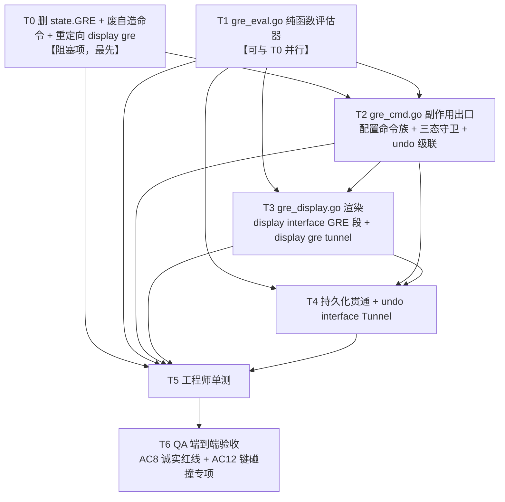
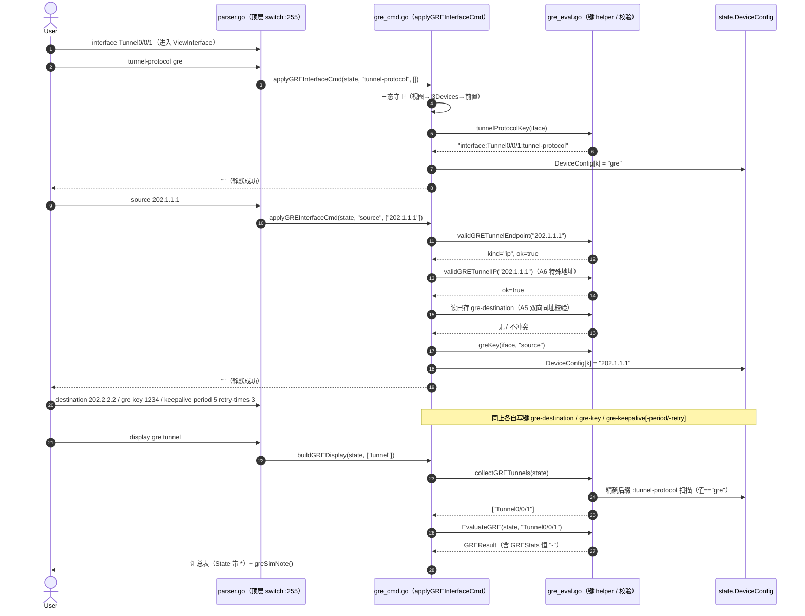
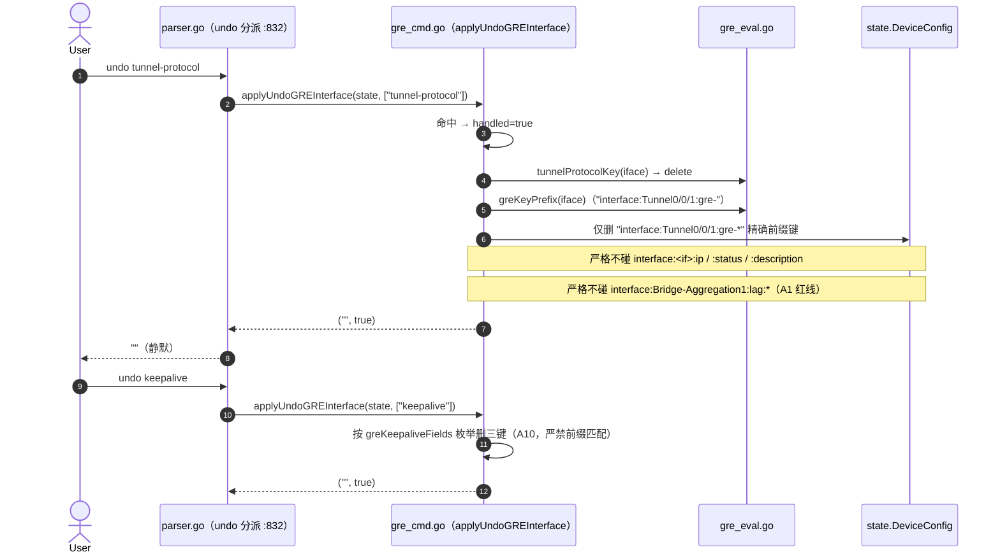
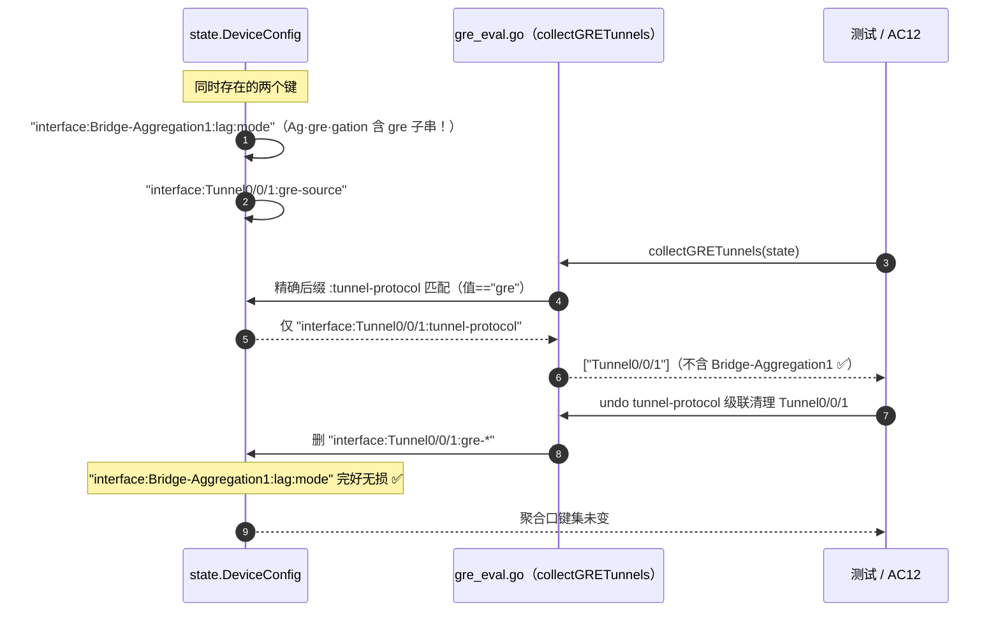

# ensp-lab P2 第七项：GRE 隧道（华为 VRP 课程 69）增量设计 + 任务分解

> 文档类型：实现前技术设计（架构师 高见远 / Gao）
> 关联输入：`docs/p2-gre-prd.md`（许清楚）、`docs/p2-dhcp-design.md`（结构与详略对齐基准）、`internal/cli/parser.go` / `state.go` / `capabilities.go` / `lag_eval.go` / `lag_cmd.go` / `dhcp_relay_eval.go` / `dhcp_relay_cmd.go` / `dhcp_relay_display.go`（已逐条 grep 核验代码基线到 file:line）
> 基线：P1-C / P1-F / NAT / 端口安全 / VRRP / STP / 链路聚合 / DHCP 中继「CLIState 层纯函数、单一事实源 `DeviceConfig`、诚实占位、零改动 `sim` 引擎、零新增第三方依赖、不 import `internal/protocol`」——本期**完全沿用**，GRE 仅作为 `cli` 包内增量
> 语言：中文。仅含类型/函数签名与伪代码，**不含实现代码**（实现是工程师下一阶段）。

---

## 0. 拍板汇总（不可再议的前提，设计据此落地）

主理人已对 PRD §6 的 C1–C9 **逐条拍板**，以下 9 条为**已决事项**，设计严格照此执行，不再开放讨论。

| # | PRD §6 项 | 拍板结论 | 设计落点 |
|---|---|---|---|
| **C1** | 旧自造命令与 `state.GRE` 处置 | **(a) 直接删除**：删 `state.GRE` / `GREConfig`（`state.go:72` / `:382-387` / `:521` 三处）；系统视图旧 `gre <name> <src> <dst>` 改为报错引导 `Error: Please configure GRE in the Tunnel interface view. Run 'interface Tunnel0/0/1' first.` | §2 #1、**T0** |
| **C2** | keepalive 是否真实计时 | **(a) 仅配置态**：只落键、只展示；收发计数恒 `-`；**不引入 timer / goroutine** | §2 #7、T1/T3 |
| **C3** | `source` 形态 | **(b) IP + 接口名双形态**，且 `destination` **同样支持**：IP 走 `net.ParseIP + To4()` 校验；接口名形态**如实存原样、display 原样回显、绝不推导 IP** | §2 #3、A3、T1/T2 |
| **C4** | Tunnel 口协议态口径 | **(a) 本地派生 + 诚实限定语**，且**纯 display 期派生、不写状态键**：完整 → `UP (config complete, peer not verified)`；缺配 → `DOWN (source/destination not configured)`。**不污染既有 `interface:<if>:status` 管理态** | §2 #5、A4、T1/T3 |
| **C5** | source == destination | **(a) `Error:` 硬拒绝**：`Error: The destination address cannot be the same as the source address.`；写键前校验；接口名形态可比对，**仅当两端均为同一 IP 时拒** | §2 #3、A5、T2 |
| **C6** | 旧 `display gre` 处置 | **(a) 重定向到 `display gre tunnel` 新实现**（只读命令，无副作用，零挫败感） | §2 #6、T0/T3 |
| **C7** | 缺省值与规格数字 | **采纳 PM 建议**：`gre key` 范围 `0`–`4294967295`（未配显 `-` **不显 `0`**）；keepalive 缺省 period `5` / retry `3`，范围 period `1`–`32767` / retry `1`–`255`；**Tunnel 口不设数量上限**；`tunnel-protocol none` **不实现**（`undo tunnel-protocol` 即回落） | §4.4 常量区、T1/T2 |
| **C8** | GRE over IPv6 / IPv6 over GRE | **明确 out-of-scope** | §9.3 |
| **C9** | 运行态统计分组与 MTU | **保留 `--- Tunnel runtime statistics ---` 分组**，5 个字段恒 `-` + `greSimNote()` 注记；**不输出 GRE 专有 1476 MTU 行**（基础接口 MTU 沿用既有 `display interface`，不编造标称值） | §2 #5、A11、T3 |

> ⚠️ **C3 扩展面**：拍板把「接口名双形态」同时授予 `destination`，**推翻 PRD P0-6「仅接受 IPv4 地址，不接受接口名」**。以拍板为准，详见 §9.2 X1（AC4 断言仍成立，论证见该条）。
> ⚠️ **C9 的 MTU 处置**：**推翻 PRD §4.2 样例中的 `Route Port,The Maximum Transmit Unit is 1476` 行**。以拍板为准，详见 §9.2 X2。

---

## 0.1 架构裁决（A1–A12，对拍板未覆盖细节的收敛，非推翻拍板）

主理人 C1–C9 闭合了 PRD §6 全部 9 项。为使工程师可直接执行，架构师按「与拍板一致、范围收敛、诚实优先、单一事实源、零回归」原则，对**拍板未显式覆盖**的细节裁定如下。**A1 为本期最高危项，列首。**

| 项 | 裁定 | 理由 |
|---|---|---|
| **A1 键碰撞（🔴 最高危，A 级红线）** | **严禁 `strings.Contains(k, "gre")` 任何形式的模糊匹配。** 全部键解析必须走精确 helper：`:tunnel-protocol` **精确后缀**、`:gre-` **精确中缀**、`interface:<if>:gre-` **精确前缀**。级联清理只清 `interface:<if>:gre-` 精确前缀 | **已实证**：`lag_eval.go:392` 的 `interface:Bridge-Aggregation%d:lag:%s` 中 `Ag·gre·gation` **本身含 `gre` 子串**（本设计已 `grep -o` 复验命中）。模糊扫描会把 H3C 聚合口键**全部误判为 GRE 隧道**（幽灵隧道），且级联清理会**误删聚合配置** —— 比 DHCP 那轮误删 `dhcp-pool` 严重一个量级。AC12 已设专项断言 |
| **A2 GRE 命令的设备类型集合** | **`l3Devices()`**（`capabilities.go:174`，**直接复用，严禁重定义**）。`capabilities.go` 本期**零改动**（`:61` `"gre": l3Devices()` 保持原样），守卫做在**分支内部** | 顶层 `isCommandSupported` 按**首 token** 匹配且**未声明默认放行**（`:141-152`），而新命令首 token 是 `tunnel-protocol`/`source`/`destination`/`keepalive`，均未声明 → 必然放行；故守卫只能落分支内。口径完全对齐 DHCP 拍板 #5 |
| **A3 `source`/`destination` 双形态判定与错误文案** | 新增纯函数 `validGRETunnelEndpoint(s) (kind, ok, reason)`，`kind ∈ ip \| interface`。判定序：① 能 `net.ParseIP + To4()` → IP 形态，再过 A6 特殊地址；② 否则匹配接口名正则 → 接口形态，**原样存储**；③ 均不匹配 → **统一返回 `Error: Invalid IP address <x>`** | ③ 统一文案是为**保住 PRD AC4 的子串断言**（`300.1.1.1` / `10.1.1` / `abc` / `10.1.1.1/24` / `2001:db8::1` 全部既非合法 IPv4 也非合法接口名 → 仍命中 `Invalid IP address`）。见 §9.2 X1 |
| **A4 协议态派生不落键** | `greLineProtocolState(cfg) string` 为**纯函数，display 期调用**；**不写任何 `DeviceConfig` 键**，尤其**不写 `interface:<if>:status`** | 拍板 C4 已定「不写状态键」。`status` 键语义是**管理态**（`shutdown`/`undo shutdown` 的事实源），与协议态混写即双写事实源 + 污染既有语义。**故本期不沿用 LAG 的 `syncLAGTrunkIfaceStatus` 实时派生范式** |
| **A5 C5 同址校验做成双向** | 不仅 `destination` 写键前比对已存 `gre-source`，**`source` 写键前同样比对已存 `gre-destination`**，文案一致 | 拍板只点名 `destination` 侧；但学员若先配 `destination` 再配同址 `source`，单向校验会漏放一个必错配置。**这是对拍板的对称补强，不推翻其语义**（仍是「两端均为同一 IP 时拒」） |
| **A6 特殊 IPv4 地址** | **本期纳入**：`0.0.0.0` / `255.255.255.255` / `127.0.0.0/8` / `224.0.0.0/4` 拒绝，文案 `Error: <x> is not a valid tunnel address.`；逻辑落在 `validGRETunnelIP` 单个纯函数内 | PRD P2-4 建议纳入；增量 ≈5 行、可单测、零额外风险。口径完全对照 DHCP 设计 A4 / `validRelayServerIP`（`dhcp_relay_eval.go:352-371`） |
| **A7 未配 GRE key 显示 `-` 而非 `0`（option82 同族口径）** | `GRETunnelConfig.Key` 类型为 **`string`**（规范化十进制串），未配即 `""`，渲染层显示 `-`。**严禁用 `int` + 零值** | 现状 `parser.go:3525` `Key: %d` 正是「零值 `0` 与未配置不可区分」的缺陷。用 `string` 从**类型层面**杜绝复现。范围校验在写入端用 `strconv.ParseUint(s, 10, 32)`（**不可用既有 `parseNum`**——其 `int` 语义会放过 `-1`） |
| **A8 三文件拆分（不堆 `parser.go`）** | 新增 `gre_eval.go`（纯函数只读）/ `gre_cmd.go`（副作用唯一出口）/ `gre_display.go`（渲染 + 持久化 helper）。`parser.go` **仅保留分派**（≈45 行） | 严格复刻 LAG / DHCP 中继三件套分层（DHCP 设计 A6）。`parser.go` 现已 **5800+ 行**，继续堆积不可维护 |
| **A9 `LoadFromDeviceConfigData` 零改动** | **不需要新增任何 GRE 重建分支**（论证见 §2 ★） | GRE 状态**本就只在 `DeviceConfig`**，回填循环无条件全键回填；`display gre tunnel` 数据全部来自 `collectGRETunnels` / `EvaluateGRE`（直读 `DeviceConfig`），不依赖 `state.Interfaces` 是否重建。单一事实源直接红利，同 VRRP / STP / DHCP |
| **A10 二阶前缀碰撞（自有命名空间内）** | `undo keepalive` **必须按字段名逐个枚举删除** `gre-keepalive` / `gre-keepalive-period` / `gre-keepalive-retry` 三键，**严禁 `strings.HasPrefix(k, greKey(iface,"keepalive"))`** | `gre-keepalive` **本身是** `gre-keepalive-period` 的前缀。前缀匹配虽在此处「碰巧正确」，但一旦将来新增 `gre-keepalive-xxx` 语义不同的键即静默出错。**枚举式删除是唯一可长期成立的写法**（`greKeepaliveFields` 常量数组） |
| **A11 `display interface <if>` 采用「追加块」而非重写骨架** | **不重写**既有 `display interface <if>` 输出骨架（`parser.go:2999-3045`）。GRE 段以**追加块**插入既有 `Internet Address is ...` 行之后、`Statistics last cleared` 之前；同时把 `:3001` 硬编码 `Line protocol current state : UP` **仅对 Tunnel 口**改为派生值。**非 Tunnel 口输出逐字不变** | 既有骨架与 PRD §4.2 样例（`Description: HUAWEI, AR Series` / `Encapsulation TUNNEL` / `Route Port`）差异较大，重写回归面覆盖全部接口类型，风险与收益严重不成比例。追加块可**完整满足 AC6 / AC9 的全部断言子串**（论证见 §9.2 X2） |
| **A12 类型名不复用 `GREConfig`** | 评估层配置视图类型命名为 **`GRETunnelConfig`**，**禁止复用被删除的 `GREConfig` 名字** | `GREConfig` 是 T0 要删除的结构体事实源名。复用同名会让 reviewer 与 `grep` 误判「结构体没删干净」，且与 AC1/AC12 的静态断言语义冲突 |

---

## 1. 背景与现状（四重缺陷说明 + 删除安全性论证 + 键碰撞实证）

### 1.1 总体定位：纠错型重构，不是从零新建

GRE 在代码基线中**并非缺失，而是以「错误形态」存在**，改造力度**高于 DHCP 那轮**（DHCP 是 1 个死字段，GRE 是**一整条自造命令链路 + 一份跨包死代码**）。全仓 GRE 相关命中仅 13 处，已逐条核验：

```
$ grep -rn "GRE\|\"gre\"" internal/cli/*.go | grep -v _test.go
capabilities.go:61   "gre": l3Devices(),              ← 复用基线，本期零改动
parser.go:2263       case "gre":                      ← 缺陷① 自造命令入口
parser.go:2284       state.GRE[tunnelName] = &GREConfig{  ← 缺陷② 结构体事实源写入
parser.go:2290       return "GRE tunnel %s created%s"     ← 缺陷① 自造欢快文案
parser.go:2292       return "Error: invalid GRE config"
parser.go:3517       case "gre":                      ← 缺陷③ display 入口
parser.go:3519/3521  len(state.GRE) / range state.GRE ← 缺陷③ map 随机遍历
parser.go:3529       "GRE: Not configured\n"
state.go:72          GRE map[string]*GREConfig        ← 缺陷② 字段声明
state.go:382         type GREConfig struct            ← 缺陷② 类型声明
state.go:521         GRE: make(map[string]*GREConfig) ← 缺陷② 构造器
tools.go:269         ... "gre", ...                   ← ACL 协议关键字表，与本期无关，零改动
```

### 1.2 缺陷① 自造非 VRP 命令（`parser.go:2263-2292`）

```go
case "gre":
    if state.CurrentView != ViewSystem {          // :2264  硬守卫锁死系统视图
        return "Error: must be in system view"
    }
    if len(cmd.Args) >= 3 {
        tunnelName := cmd.Args[0]                 // :2268  位置参数，非 VRP 具名子命令
        srcIP := cmd.Args[1]
        destIP := cmd.Args[2]
        ...
        if n, err := parseNum(cmd.Args[3]); err == nil {
            key = n
        } else {
            warn.WriteString(...)                 // :2279  非法 key 仅 warn 不报错
        }
        state.GRE[tunnelName] = &GREConfig{...}   // :2284
        return fmt.Sprintf("GRE tunnel %s created%s", ...)  // :2290 自造欢快文案
    }
```

四重错误叠加：① 华为 VRP **根本不存在**该命令（真机是 Tunnel 接口视图命令族）；② 硬守卫在**系统视图**；③ **位置参数**语义；④ 非法 key **静默降级为 0**（该缺陷正是 A7 用 `string` 类型根治的对象）。

### 1.3 缺陷② 结构体事实源 `state.GRE`（不落盘，`save`→`reload` 100% 丢失）

```go
// state.go:72
GRE            map[string]*GREConfig
// state.go:382-387
type GREConfig struct { SourceIP string; DestIP string; Key int; Keepalive bool }
// state.go:521
GRE: make(map[string]*GREConfig),
```

四重缺陷：**不入 `DeviceConfig`** → 不进 `SerializeToDeviceConfigData` → `save`→`reload` 配置**全丢**；**无法表达** `tunnel-protocol` / keepalive period-retry / 隧道口 IP；`Key int` 零值歧义（A7）；`Keepalive bool` 无参数。

### 1.4 缺陷③ `display gre` map 随机遍历（`parser.go:3517-3531`）

```go
case "gre":
    if len(state.GRE) > 0 {
        out.WriteString("GRE Tunnels:\n")
        for name, tunnel := range state.GRE {        // :3521 map 随机遍历，输出顺序不确定
            out.WriteString(fmt.Sprintf("    Key: %d\n", tunnel.Key))       // :3525 零值歧义
            out.WriteString(fmt.Sprintf("    Keepalive: %t\n", tunnel.Keepalive))
        }
    }
```

与 `display ip pool` 同款缺陷（DHCP 那轮 AC7 已明令禁止复制）；且**无隧道状态字段、无诚实注记**。

### 1.5 缺陷④ 跨包死代码（`internal/protocol/protocol.go:1370-1409`）—— 本期不动

`EnableGRE` / `DisableGRE` / `AddGRETunnel` / `GetGREStatus` + `GRETunnel{Status: "up"}`（`:1388` **硬编码编造隧道状态**），**全仓零调用点**。
**本期红线：不 import / 不调用 / 不修改 `internal/protocol`。** 仅登记为独立技术债（§9.3），建议另开工单删除。

### 1.6 删除 `state.GRE` / `GREConfig` 的安全性论证（本设计再次 grep 复核）

| 论证维度 | 结论 |
|---|---|
| **引用点** | **3 处**，且**全部在本期重构范围内**：`parser.go:2284`（写，T0 删除）、`parser.go:3519`/`:3521`（读，T0 重定向） |
| **测试覆盖** | **0 个**。`grep -rln "state.GRE" internal/cli/*_test.go` 零命中；`grep -l "gre" *_test.go` 的 3 处命中经复验**全部是 `Bridge-Ag·gre·gation` 子串**（`p2_lag_test.go` / `p2_lag_qa_test.go` / `acl_eval_qa_t04_test.go`），与 GRE 功能无关 |
| **持久化面** | **无**。不在 `DeviceConfig`，不进快照，无历史配置包袱（现状本就 reload 全丢，**没有可保护的用户配置**） |
| **API / 前端消费** | **无**。`internal/api` 与前端零引用 |
| **编译期保护** | 删字段后若有遗漏引用，`go build ./...` **立即失败**（Go 静态强类型，无运行时才炸的隐患） |
| **先例** | DHCP 删 `state.DHCPSelectMode`、STP 移除 `state.STP`、LAG 直接改键名，三个同族先例 |

→ **删除风险 ≈ 0**。C1(a) 成立。

### 1.7 🔴 键碰撞核查（本期最高危项，A1 的实证依据）

```
$ echo "interface:Bridge-Aggregation1:lag:mode" | grep -o "gre"
gre                                    ← Bridge-Ag·gre·gation 命中！
```

`lag_eval.go:391-393`：

```go
func lagBridgeTrunkKey(trunkID int, field string) string {
    return fmt.Sprintf("interface:Bridge-Aggregation%d:lag:%s", trunkID, field)
}
```

| 若使用模糊匹配 | 后果 |
|---|---|
| `strings.Contains(k, "gre")` | `interface:Bridge-Aggregation1:lag:mode` **命中** → `collectGRETunnels` 返回幽灵隧道 `Bridge-Aggregation1` → `display gre tunnel` 出现学员从未配置的隧道 |
| 级联清理用 `Contains` | `undo tunnel-protocol` **误删整组聚合配置** → 用户 Eth-Trunk / BAGG 配置静默丢失（**不可恢复的数据破坏**） |

**本期新增键与既有键的完整隔离核查**：

| 既有键形态 | 是否含 `gre` 子串 | 精确后缀 `:tunnel-protocol` 命中？ | 精确中缀 `:gre-` 命中？ |
|---|---|---|---|
| `interface:Bridge-Aggregation<id>:lag:<field>` | ✅ **含**（Ag·gre·gation） | ❌ 否 | ❌ 否 |
| `interface:Eth-Trunk<id>:lag:<field>` | ❌ | ❌ | ❌ |
| `interface:<if>:dhcp-relay:<field>` | ❌ | ❌ | ❌ |
| `interface:<if>:status` / `:ip` / `:description` | ❌ | ❌ | ❌ |

→ **精确后缀 `:tunnel-protocol` + 精确中缀 `:gre-` 对全部既有键 100% 隔离。** AC12 专项断言据此设立。

### 1.8 顶层 token 冲突复核（采信 PM 并已复验）

```
$ grep -n 'case "source"\|case "destination"\|case "keepalive"\|case "tunnel-protocol"' internal/cli/*.go
parser.go:946    case "source", "src":        ← ACL rule 参数内层 switch
parser.go:952    case "destination", "dest":  ← ACL rule 参数内层 switch
parser.go:1295   case "keepalive":            ← m-lag 子命令内层 switch
```

顶层 `switch command {`（**`parser.go:255`**）中 `tunnel-protocol` / `source` / `destination` / `keepalive` **均无既有 case**，与内层 switch 不在同一层级 → **零冲突**，可安全新增。

### 1.9 框架 / 库选型

- **不引入任何新依赖**：仅 Go 标准库（`fmt`、`strings`、`sort`、`net`、`strconv`、`regexp`）+ 仓库内既有 `internal/cli`、`internal/sim`（仅读 `EngineModeName()`）。
- **明确不新增 `cli → protocol` 依赖**：`gre_eval.go` 只消费 `state.DeviceConfig`，**不 import `internal/protocol`**。
- **复用既有 helper（同包内严禁重复定义，否则编译冲突）**：

| 既有符号 | 位置 | 本期用途 |
|---|---|---|
| `l3Devices()` | `capabilities.go:174` | A2 设备类型守卫集合（**直接复用，不得重定义**） |
| `isCommandSupported(top, dt)` | `capabilities.go:141` | 分支内守卫复用同一判定入口 |
| `sim.EngineModeName()` | `dhcp_relay_eval.go:383` 用法 | `greSimNote()` lite/full 两态判定 |
| `net.ParseIP` + `.To4()` | `parser.go:4539`（VRRP）/ `dhcp_relay_eval.go:357-365` | IPv4 校验唯一范式 |
| `sortedKeys(set)` | `dhcp_relay_eval.go:277` | 接口名升序输出（确定性，**直接复用，不得重定义**） |
| `applyUndoLAGInterface(...) (string, bool)` **handled 模式** | `lag_cmd.go:773`，挂载 `parser.go:827` | 接口视图 undo 挂钩范式 |
| `applyUndoDHCPInterface(...) (string, bool)` | `dhcp_relay_cmd.go:316`，挂载 `parser.go:832` | 同上，本期紧随其后插入 |
| `buildSavedDHCPRelayInterfaceConfig` **只输出差异值**口径 | `dhcp_relay_display.go:287` | GRE 段「缺省值不冗余输出」模板 |
| `buildSavedDHCPRelayConfig` **独立输出通道**范式 | `dhcp_relay_display.go:319`，挂载 `parser.go:5462` | `buildSavedGREConfig` 模板 |
| `applyUndoInterfaceTrunk(state, args)` | `lag_cmd.go:736`，调用点 `parser.go:5043` | P1-6 的扩展锚点（**本期零改动该函数**，见 §2 #8） |

---

## 2. 改动点表（每点含 file:line 落点、现状缺陷、改动内容、归属任务）

> 说明：`internal/protocol` **零改动、不 import**；`sim` 引擎零改动；`capabilities.go` **零改动**（A2）；`lag_cmd.go` **零改动**（#8）；`tools.go` 零改动；`state.go` **仅删 3 处**（C1）。

| # | 主题 | 落点（file:line） | 现状缺陷 | 改动 | 任务 |
|---|---|---|---|---|---|
| **#1** | **前置迁移：删结构体事实源 + 废自造命令 + 重定向旧 display** | `state.go:72` / `:382-387` / `:521`<br>`parser.go:2263-2292`（`case "gre"`）<br>`parser.go:3517-3531`（`display gre`） | §1.2 / §1.3 / §1.4 三重缺陷；双写事实源风险 | ① **删除** `state.go` 三处（字段 / 类型 / 构造器）；② `parser.go:2263` `case "gre"` 改为**按视图分派**：`ViewInterface` → `applyGREInterfaceCmd(state, "gre", cmd.Args)`（处理 `gre key` / `gre checksum`）；`ViewSystem` → **报错引导** `errGRESystemViewGuide`；其它视图 → `Error: must be in interface view`；③ `parser.go:3517` `case "gre"` **整块替换**为 `return buildGREDisplay(state, cmd.Args[1:])`（C6 重定向）。**T0 必须先行**——否则新旧两套写入路径并存即双写事实源 | **T0** |
| **#2** | **`gre_eval.go` 纯函数评估器（地基）** | **新文件** `internal/cli/gre_eval.go` | 无（新增） | 键 helper（A1 精确匹配）+ `collectGRETunnels` / `EvaluateGRE` / `isTunnelInterface` / `validGRETunnelEndpoint` / `validGRETunnelIP` / `greLineProtocolState` / `greSimNote` + 全部常量。**无副作用、不 import `internal/protocol`、零新增依赖、可单测** | **T1** |
| **#3** | **GRE 配置命令族（Tunnel 接口视图）** | `parser.go:255` 顶层 switch 新增合并 case → **新文件** `internal/cli/gre_cmd.go` | 命令族 100% 缺失（现状是自造系统视图命令） | 顶层新增 `case "tunnel-protocol", "source", "destination", "keepalive":` → `applyGREInterfaceCmd(state, strings.ToLower(cmd.Command), cmd.Args)`。分派到 `applyTunnelProtocol` / `applyGRESource` / `applyGREDestination` / `applyGREKey` / `applyGREKeepalive` / `applyGREChecksum`（P2）。**三态守卫**（视图 → `l3Devices()` → GRE 前置条件）+ **C5 同址双向拒**（A5）+ **C3 双形态**（A3） | **T2** |
| **#4** | **接口视图 `undo` 语义完整（handled 模式）** | `parser.go:832` 之后（紧随 `applyUndoDHCPInterface`） | 接口视图 undo 无 GRE 分支 → 落 `:860` `Error: undo '%s' is not supported` | 插入 `if msg, handled := applyUndoGREInterface(state, cmd.Args); handled { return msg }`。覆盖 `undo tunnel-protocol`（**级联清理** `interface:<if>:gre-` 精确前缀全部键）/ `undo source` / `undo destination` / `undo gre key` / `undo keepalive`（**A10 枚举式删三键**）/ `undo gre checksum`。**未命中交回既有分支，零回归** | **T2** |
| **#5** | **`display interface Tunnel<x>` GRE 段 + 协议态诚实派生** | `parser.go:3000-3001`（`Line protocol current state : UP` 硬编码）<br>`parser.go:3036` 之后（`Internet Address is` 行后）→ **新文件** `internal/cli/gre_display.go` | `:3001` **无条件硬编码 `UP`** —— Tunnel 是逻辑口，真机协议态取决于配置完整性，无条件 `Up` 即编造 | **A11 追加块口径**：① `:3001` 仅当 `isTunnelInterface(name)` 时改为 `greLineProtocolState(...)` 派生值（C4，**不写键**），非 Tunnel 口逐字不变；② `Internet Address is` 行后追加 `buildGREInterfaceSection(state, iface)`：`Tunnel source ..., destination ...` / `Tunnel protocol/transport GRE/IP` / `GRE key` / `Keepalive` / `Checksumming of packets` / **`--- Tunnel runtime statistics ---` 5 字段恒 `-`（C9）** / `greSimNote()`；③ Tunnel 口但未配 `tunnel-protocol` → 仅追加 `Info: GRE is not configured on this interface.`（不输出统计分组）；④ **不输出 1476 MTU 行**（C9） | **T3** |
| **#6** | **`display gre tunnel` 汇总表（替代自造 `display gre`）** | `parser.go:3517`（C6 重定向落点，T0 已改）→ `gre_display.go` | 旧实现 map 随机遍历 + 零值歧义 + 无注记 | `buildGREDisplay(state, args)`：`args` 为空（旧 `display gre`，C6）或 `args[0]=="tunnel"` → 汇总表；其它 → `Error: unrecognized command`。**接口名升序**（复用 `sortedKeys`）、列定义严格照 PRD §4.3、`State` 列**必须带 `*` 与脚注**、空态 `Info: No GRE tunnel configured.`、末尾 `greSimNote()`。**唯一数据源 = `EvaluateGRE` / `collectGRETunnels`**，不直接读散落键 | **T3** |
| **#7** | **诚实占位（CRITICAL 红线）** | `gre_eval.go` `GREStats` + `greSimNote()`；渲染 `gre_display.go` | 无（新增）。反面教材 = `protocol.go:1388` `Status:"up"` | `GREStats` **5 个字段类型全部为 `string` 且恒赋 `"-"`**，结构体内**不得出现任何 `int` / 计数器 / 随机数路径**（C2 + C9，从类型层面解决问题）；`Peer reachability` 恒 `-`（**严禁** `Reachable`/`Up`/`Active`）；汇总表 `State` 列**不得裸 `Up`**；接口名形态的 source/destination **原样回显，绝不推导 IP**（C3）；全部 GRE 输出末尾附 `greSimNote()` | **T1/T3** |
| **#8** | **`undo interface Tunnel<x>`（系统视图，P1-6）** | `parser.go:5043`（`return applyUndoInterfaceTrunk(state, args)`）→ `gre_cmd.go` | `lag_cmd.go:744-747` 对非聚合口名直接 `Error: undo interface '<x>' is not supported` | **不改 `lag_cmd.go`**：在 `parser.go:5043` **之前**插入 `if msg, handled := applyUndoInterfaceTunnel(state, args); handled { return msg }`，未命中再落既有 `applyUndoInterfaceTrunk`。清理 `interface:Tunnel<x>:` **全部键** + `state.Interfaces` 条目 + 复位 `CurrentSub`。**Eth-Trunk 分支代码零触碰 → 结构性零回归**（优于「扩展 `applyUndoInterfaceTrunk` 内部分派」方案） | **T4** |
| **#9** | **持久化：`current-configuration` Tunnel 块 + save→reload 贯通** | 挂载点 `parser.go:5433-5436`（接口块内，DHCP 行之后）<br>独立通道 `parser.go:5462-5465` 之后<br>`LoadFromDeviceConfigData`（**零改动**，A9） | 快照全文无 GRE 段；reload 后 `state.Interfaces` 可能不含 Tunnel 口 → 只遍历 `state.Interfaces` 会丢配置 | ① `buildSavedGREInterfaceConfig(state, iface)`（落 `gre_display.go`），按 VRP 顺序输出 ` tunnel-protocol gre` / ` source <x>` / ` destination <x>` / ` gre key <n>` / ` keepalive [period <p> retry-times <r>]` / ` gre checksum`，**缺省值不冗余输出**；② 挂入接口块（`ip address` 行由既有逻辑输出，天然满足 P1-7 顺序）；③ `buildSavedGREConfig(state)` **独立输出通道**，为「有 GRE 键但 `state.Interfaces` 未重建」的 Tunnel 口补齐 `interface Tunnel<x>` 块；④ **`LoadFromDeviceConfigData` 零改动**（★） | **T4** |
| **#10** | **Tunnel 口创建不写假 Protocol** | `parser.go:403-411` | `state.Interfaces[ifName] = &InterfaceConfig{Name, Status:"Up", Protocol:"Up"}` —— Tunnel 逻辑口的 `Protocol:"Up"` 是**编造**（AC9③ 静态断言对象） | 新增 Tunnel 分支：`interface:<if>:status = "Up"` **保留**（管理态，真实，`shutdown` 可改写，C4 明确不污染）；但 `state.Interfaces[ifName]` 只写 `{Name, Status:"Up"}`，**不写 `Protocol` 字段**。协议态一律 display 期派生（A4）。**物理口 / Vlanif / Eth-Trunk 分支逐字不变** | **T2** |
| **#11** | **brief 类 display 覆盖 Tunnel 口（P1-8）** | `parser.go:2960-2981`（`display interface brief` 数据行） | `protocol := physical`（由 Status 推出），Tunnel 口会显示无条件 `up` | Tunnel 口 `Protocol` 列改为 `greLineProtocolState` 的短态：完整 → `up*`，缺配 → `down`；**仅当输出中至少存在一个 Tunnel 口时**在表尾追加脚注 `* Tunnel protocol state is derived from local configuration only.`。**无 Tunnel 口时输出逐字不变 → 零回归** | **T3** |
| **#12** | **常量与规格数字（C7）** | `gre_eval.go` 常量区（§4.4） | 无（新增） | `GREKeyMin=0` / `GREKeyMax=4294967295`；`DefaultGREKeepalivePeriod=5` / `DefaultGREKeepaliveRetry=3`；`GREKeepalivePeriodMin=1` / `Max=32767`；`GREKeepaliveRetryMin=1` / `Max=255`；**Tunnel 口无数量上限**；`tunnel-protocol` 仅接受 `gre`（`none`/`ipv4-ipv6`/`mpls` → `Error: unrecognized command`） | **T1** |

### ★ 改动点 #9 补充论证：为什么 `LoadFromDeviceConfigData` 零改动（A9）

1. 回填循环 `for k, v := range cfg.Interfaces { state.DeviceConfig[k] = v }` **无条件回填全部键** → `interface:<if>:tunnel-protocol` 与 `interface:<if>:gre-*` 自动往返，**无需新增分支**；
2. 全文**无任何 GRE 相关重建分支** → 删除 `state.GRE` 字段**不需要**在此处删代码（本就没有读取，§1.6）；
3. `display gre tunnel` / `display interface Tunnel<x>` 的 GRE 段数据全部来自 `collectGRETunnels` / `EvaluateGRE`（直读 `DeviceConfig`），**不依赖 `state.Interfaces` 是否被重建** → 无需像 LAG 那样新增逻辑口重建分支；
4. 隧道口 IP 读 `interface:<if>:ip`（既有键，同样自动往返）；管理态读 `interface:<if>:status`（既有键）。

> 这是单一事实源方案的直接红利，与 VRRP / STP / DHCP 中继「无需新增粘滞回填分支」同构。**T4 必须为此写一条反向断言测试**：reload 前后 `interface:*:tunnel-protocol` 与 `interface:*:gre-*` 键集**逐键完全一致**（AC2 ①）。

---

## 3. 任务分解（T0–T6，含依赖关系与实现顺序）

> 共 **7 个任务**。核心逻辑分层落在 **3 个新文件**（`gre_eval.go` 纯函数 / `gre_cmd.go` 副作用 / `gre_display.go` 渲染+持久化 helper，A8），`parser.go` 仅做**分派**与挂载；`state.go` 删 3 处；`capabilities.go` / `lag_cmd.go` / `tools.go` / `sim` / `protocol` **零改动**。单测 T5、QA T6。与 STP / VRRP / LAG / DHCP 的 T0–T6 团队约定对齐。

### 3.1 文件列表（相对路径 + 职责 + 新增/修改标记）

| 文件 | 操作 | 责任（一行） | 归属任务 |
|---|---|---|---|
| `internal/cli/state.go` | **修改（删 3 处）** | 删除 `:72` `GRE map[string]*GREConfig`、`:382-387` `type GREConfig struct`、`:521` 构造器初始化。**严禁新增任何 GRE / Tunnel 内嵌结构体**（架构铁律 1，AC12 静态断言 `grep -n "GREConfig\|Tunnel.*struct" internal/cli/state.go` 无命中） | T0 |
| `internal/cli/gre_eval.go` | **新增（核心纯函数）** | ① `GRETunnelConfig` / `GREKeepalive` / `GREResult` / `GREStats` 类型；② `EvaluateGRE`；③ `collectGRETunnels` / `collectGREConfiguredInterfaces` / `readGREConfig`；④ 键 helper `tunnelProtocolKey` / `greKey` / `greKeyPrefix` + 反解析 `ifaceFromTunnelProtocolKey` / `ifaceFromGREKey`；⑤ `isTunnelInterface` / `validGRETunnelEndpoint` / `validGRETunnelIP` / `normalizeGREKeyValue`；⑥ `greLineProtocolState` / `greLineProtocolBrief`；⑦ `greSimNote()`；⑧ 全部常量与错误文案 | T1 |
| `internal/cli/gre_cmd.go` | **新增（副作用唯一出口）** | `applyGREInterfaceCmd` 分派 + `applyTunnelProtocol` / `applyGRESource` / `applyGREDestination` / `applyGREKey` / `applyGREKeepalive` / `applyGREChecksum` + `applyUndoGREInterface`（handled 模式）+ `applyUndoInterfaceTunnel`（handled 模式）+ `clearGREKeys` 级联清理 + 三态守卫 `greDeviceSupported` / `greTunnelViewGuard` / `greProtocolConfigured` | T0/T2 |
| `internal/cli/gre_display.go` | **新增（渲染 + 持久化 helper）** | `buildGREDisplay`（汇总表 / 空态）+ `buildGREInterfaceSection`（`display interface Tunnel<x>` 追加块）+ `buildSavedGREInterfaceConfig` + `buildSavedGREConfig`（独立输出通道） | T3/T4 |
| `internal/cli/parser.go` | **修改（8 处，分属 T0/T2/T3/T4）** | 见 §3.2 明细 | T0/T2/T3/T4 |
| `internal/cli/capabilities.go` | **不改（C7 / A2）** | `:61` `"gre": l3Devices()` 保持；`l3Devices()`（`:174`）仅被复用，**不新增、不重定义** | — |
| `internal/cli/lag_cmd.go` | **不改（#8）** | `applyUndoInterfaceTrunk`（`:736`）**逐字不动**，Tunnel 分派在调用点之前拦截 | — |
| `internal/cli/tools.go` | **不改** | `:269` 的 `"gre"` 是 ACL 协议关键字，与本期无关 | — |
| `internal/cli/gre_eval_test.go` | **新增（T5，单测）** | 纯函数契约、键 helper 精确匹配、`validGRETunnelEndpoint` 边界、`greSimNote` lite/full、无副作用 deep-equal | T5 |
| `internal/cli/p2_gre_test.go` | **新增（T5，单元/集成）** | AC1 / AC2 / AC4 / AC5 / AC6 / AC9 / AC10 | T5 |
| `internal/cli/p2_gre_qa_test.go` | **新增（T6，QA 验收）** | AC3 / AC7 / AC8 / AC11 / AC12 + T0 迁移回归面 | T6 |

### 3.2 `parser.go` 改动点明细（已 grep 复核行号）

| # | 位置 | 现状 | 改动 | 任务 |
|---|---|---|---|---|
| 1 | `:2263-2292` `case "gre"` | 自造系统视图命令，写 `state.GRE` | 改为按视图分派：`ViewInterface` → `applyGREInterfaceCmd(state,"gre",cmd.Args)`；`ViewSystem` → 报错引导；其它 → `Error: must be in interface view`。**删除全部 `state.GRE` 写入** | T0 |
| 2 | `:3517-3531` `case "gre"`（display） | map 随机遍历 + 零值歧义 | 整块替换为 `return buildGREDisplay(state, cmd.Args[1:])` | T0 |
| 3 | `:255` 顶层 `switch command` | 无 `tunnel-protocol`/`source`/`destination`/`keepalive` case | 新增合并 case → `applyGREInterfaceCmd(state, strings.ToLower(cmd.Command), cmd.Args)` | T2 |
| 4 | `:832` 之后（接口视图 undo） | 仅 vrrp / lag / dhcp / shutdown / ip address / description | 插入 `if msg, handled := applyUndoGREInterface(state, cmd.Args); handled { return msg }` | T2 |
| 5 | `:403-411`（接口创建） | Tunnel 口写 `InterfaceConfig{Status:"Up", Protocol:"Up"}` | 新增 Tunnel 分支，**不写 `Protocol` 字段**（改动点 #10） | T2 |
| 6 | `:3000-3001`（display interface 详情） | `Line protocol current state : UP` 硬编码 | Tunnel 口改派生；`Internet Address is` 行后追加 `buildGREInterfaceSection` | T3 |
| 7 | `:2960-2981`（brief 数据行） | `protocol := physical` | Tunnel 口改诚实短态 + 条件脚注（改动点 #11） | T3 |
| 8 | `:5043`（系统视图 undo interface） | 直落 `applyUndoInterfaceTrunk` | **之前**插入 `applyUndoInterfaceTunnel` handled 钩子 | T4 |
| 9 | `:5433-5436` + `:5462-5465` 之后 | 快照无 GRE 段 | 接口块内挂 `buildSavedGREInterfaceConfig`；块外挂 `buildSavedGREConfig` 独立通道 | T4 |

---

### T0 ｜ 前置重构：删除结构体事实源 + 废除自造命令 + 重定向旧 display（阻塞项，必须最先）

- **涉及文件**：`internal/cli/state.go`（删 3 处）、`internal/cli/parser.go`（改动点 1、2）、`internal/cli/gre_cmd.go`（新增骨架：`applyGREInterfaceCmd` 分派壳 + 三态守卫 + `errGRESystemViewGuide` 常量）。
- **依赖**：无（**地基任务，绝对先行**）。
- **为什么必须先行**：若先做 T2 新命令而不删 `state.GRE`，则**新旧两条写入路径并存**（新命令写 `DeviceConfig`、旧命令写结构体），`display` 读哪一份都错，正是 LAG `:members` 与 STP `state.STP` 已被清理掉的**双写事实源**坑。
- **内容（对齐 P0-1 / P0-2 / C1 / C6 / AC1 反向断言 / AC3）**：
  1. **删除** `state.go:72` 字段、`:382-387` 类型、`:521` 构造器初始化；`go build ./...` 全绿即证明零遗留引用（§1.6 编译期保护）。
  2. `parser.go:2263` `case "gre"` 重写为视图分派；`ViewSystem` 分支返回
     `Error: Please configure GRE in the Tunnel interface view. Run 'interface Tunnel0/0/1' first.`
     **且不写任何键**（AC3 ① 断言 `DeviceConfig` 中无任何 `gre-` 键）。
  3. `parser.go:3517` `case "gre"` 整块替换为 `buildGREDisplay(state, cmd.Args[1:])`（C6）。**T0 阶段 `buildGREDisplay` 可先返回空态 `Info: No GRE tunnel configured.` 占位**，完整实现在 T3——避免 T0/T3 改同一函数造成合并冲突。
  4. `gre_cmd.go` 骨架：`applyGREInterfaceCmd(state, top string, args []string) string` 分派壳 + 三态守卫函数 + 错误文案常量。子命令实现留 T2。
- **回归要求（关键）**：`display gre`（旧形态）不再出现 `Key: 0` / `Keepalive: false` 等零值字段；系统视图其它 `case`（`qos` / `pbr` / `ipsec` …）行为逐字不变。
- **行数估计**：`state.go` −8 行；`parser.go` 约 +25 / −45 行；`gre_cmd.go` 约 +90 行。
- **优先级**：**P0（阻塞）**。

### T1 ｜ `gre_eval.go` 纯函数评估器（地基，**可与 T0 并行**）

- **涉及文件**：`internal/cli/gre_eval.go`（**新增**）。
- **依赖**：无（纯函数只读 `DeviceConfig`，不依赖 T0 的分派改造，可**并行开工**——本期唯一并行窗口）。
- **内容（对齐 P0-3 / P0-10 / P0-11 / P0-13 / C2 / C3 / C4 / C7 / C9 / A1 / A6 / A7 / A10 / A12）**：
  1. 类型 `GRETunnelConfig` / `GREKeepalive` / `GREResult` / `GREStats`（§4.2）；全部常量（§4.4）。
  2. **键 helper（A1 红线，全仓拼键唯一出口）**：`tunnelProtocolKey(iface)` / `greKey(iface, field)` / `greKeyPrefix(iface)`；反解析 `ifaceFromTunnelProtocolKey(key)` / `ifaceFromGREKey(key)`（**精确后缀 / 精确中缀**，接口名段不得含 `:`）。
  3. `collectGRETunnels(state) []string`：**严格口径**——按精确后缀 `:tunnel-protocol` 扫描**且值为 `gre`**，升序去重（复用 `sortedKeys`，`dhcp_relay_eval.go:277`）。
  4. `collectGREConfiguredInterfaces(state) []string`：**并集口径**——`:tunnel-protocol` 键存在 **或** 存在任意 `:gre-` 中缀键；**仅供持久化独立通道（T4）与 QA 幽灵残留检测使用**。
  5. `readGREConfig(state, iface) GRETunnelConfig`：合并缺省值（keepalive period/retry 未配时填生效缺省 5/3，口径对照 DHCP A5）。
  6. `EvaluateGRE(state, iface) GREResult`。
  7. `isTunnelInterface(name) bool`：**精确前缀** `Tunnel` / `Tun` 且**其后紧跟数字**（范式对照 `isTrunkFamilyInterface`，`lag_eval.go:181`——`ET` 前缀误判 `Ethernet` 的同类风险）。**不得用 `strings.Contains`**。
  8. `validGRETunnelEndpoint(s) (kind string, ok bool, reason string)`（A3 双形态）+ `validGRETunnelIP(ip) (bool, string)`（A6 特殊地址）。
  9. `normalizeGREKeyValue(s) (string, bool)`：`strconv.ParseUint(s, 10, 32)` 校验 + 规范化十进制串（A7；**不得用 `parseNum`**）。
  10. `greLineProtocolState(cfg) string` / `greLineProtocolBrief(cfg) string`（C4 / A4，**纯 display 期派生，不写键**）。
  11. `greSimNote() string`（读 `sim.EngineModeName()`，lite/full 两态，口径同 `dhcpRelaySimNote()` `dhcp_relay_eval.go:382`）。
  12. **复用既有 helper（严禁重定义）**：`sortedKeys`（`dhcp_relay_eval.go:277`）、`l3Devices()`（在 `gre_cmd.go` 消费）。
- **⚠️ 红线实现约束（AC8 / AC12）**：
  - `GREStats` **5 个字段类型为 `string` 且恒赋 `"-"`**，结构体内**不得出现任何 `int` / 计数器 / 随机数路径**。
  - **不得出现任何 `strings.Contains(k, "gre")`**（A1）。
  - **不 import `internal/protocol`**；不碰 `sim` 引擎实例（仅调 `EngineModeName()`）；`go.mod` 零新增依赖。
- **行数估计**：约 +290 行。
- **优先级**：P0。

### T2 ｜ `gre_cmd.go` 副作用出口：配置命令族 + 三态守卫 + undo 级联清理

- **涉及文件**：`internal/cli/gre_cmd.go`（主体）、`internal/cli/parser.go`（改动点 3、4、5）。
- **依赖**：**T0**（视图分派与骨架已就位）、**T1**（消费键 helper / 校验函数 / 常量）。
- **内容（对齐 P0-4 ~ P0-8 / P1-1 / P1-2 / P1-3 / P1-5 / C3 / C5 / C7 / A5 / A10）**：
  1. **三态守卫（顺序固定，先视图后设备后前置）**：
     - ① **视图守卫**：非 `ViewInterface` → `Error: must be in interface view`；`ViewInterface` 但当前接口非 Tunnel → `Error: This command is only supported on Tunnel interfaces.`
     - ② **设备守卫**：`state.DeviceType` ∉ `l3Devices()` → `Error: GRE is not supported on <DeviceType>`（**复用 `capabilities.go:174`，严禁重定义**，A2）。
     - ③ **GRE 前置守卫**：`source` / `destination` / `gre key` / `keepalive` / `gre checksum` 在 `interface:<if>:tunnel-protocol != "gre"` 时 → `Error: Please run 'tunnel-protocol gre' on this interface first.` **且不写任何键**（AC5 ① 断言键未写入）。
  2. `applyTunnelProtocol`：仅接受 `gre`（C7：`none`/`ipv4-ipv6`/`mpls` → `Error: unrecognized command`）；写 `interface:<if>:tunnel-protocol = "gre"`；**重复执行幂等**（不报错、不产生重复键）；成功**静默**（返回 `""`）。
  3. `applyGRESource` / `applyGREDestination`（C3 双形态，A3）：走 `validGRETunnelEndpoint`；IP 形态再过 `validGRETunnelIP`（A6）；接口名形态**原样存储**；单值后配覆盖。**校验通过后才写键**（非法输入**绝不残留空串键**，AC4）。
  4. **C5 同址硬拒（A5 双向）**：写 `gre-destination` 前读已存 `gre-source`；写 `gre-source` 前读已存 `gre-destination`。**仅当两端均为 IP 形态且数值相等**时返回 `Error: The destination address cannot be the same as the source address.` 并**不写键**。
  5. `applyGREKey`：`gre key <0-4294967295>`，走 `normalizeGREKeyValue`；非法 → `Error: Invalid GRE key <x>`；缺参 → `Error: usage: gre key <0-4294967295>`。
  6. `applyGREKeepalive`：`keepalive [period <p>] [retry-times <r>]`；裸 `keepalive` → 仅写 `gre-keepalive="true"`；**显式指定时才写** `gre-keepalive-period` / `gre-keepalive-retry`（A-keepalive 差异值口径，见 §7）；范围校验 period 1–32767 / retry 1–255，越界 → `Error: Invalid keepalive period <p>` / `Error: Invalid keepalive retry-times <r>`。
  7. `applyGREChecksum`（P2-1）：`gre checksum` → 写 `gre-checksum="true"`。
  8. `applyUndoGREInterface(state, args) (string, bool)`（**handled 模式**，`lag_cmd.go:773` / `dhcp_relay_cmd.go:316` 范式，挂 `parser.go:832` 之后）：
     - `undo tunnel-protocol` → 删 `tunnel-protocol` 键 + **级联清理** `greKeyPrefix(iface)` **精确前缀**全部键（A1；**绝不误删** `interface:<if>:ip` / `:status` / `:description`）。
     - `undo source` / `undo destination` / `undo gre key` / `undo gre checksum` → `delete(map, key)`，**删键而非留空串**（AC10 ① 断言 `_, ok := DeviceConfig[key]; ok == false`）。
     - `undo keepalive` → **按 `greKeepaliveFields` 枚举删三键**（A10，**严禁前缀匹配**）。
     - 未命中 → `handled=false`，交回既有分支（**零回归**）。
  9. `parser.go:403-411` 改动点 #10：Tunnel 口创建不写 `Protocol` 字段。
- **回显口径（P2-3 / 对齐 LAG / DHCP）**：配置成功一律 **VRP 静默或规范短回显**，失败才 `Error:`；**禁止**自造 `GRE tunnel created` 式欢快文案（现状 `parser.go:2290` 即此缺陷）。
- **行数估计**：约 +380 行（`gre_cmd.go`）/ `parser.go` +25 行。
- **优先级**：P0。

### T3 ｜ `gre_display.go` 渲染：`display interface Tunnel<x>` GRE 段 + `display gre tunnel` 汇总

- **涉及文件**：`internal/cli/gre_display.go`（主体）、`internal/cli/parser.go`（改动点 6、7）。
- **依赖**：**T1**（读 `EvaluateGRE` / `collectGRETunnels` / `greLineProtocolState` / `greSimNote`）、**T2**（键已正确写入，可端到端验证）。
- **内容（对齐 P0-9 / P0-10 / P0-11 / P1-4 / P1-8 / C4 / C6 / C9 / A11 / AC6 / AC7 / AC8 / AC9）**：
  1. `buildGREInterfaceSection(state, iface) string`（**A11 追加块**）：字段标签与顺序**严格照 PRD §4.2**；`--- Tunnel runtime statistics ---` 分组保留、5 字段恒 `-`（C9）；末尾 `greSimNote()`。**不输出 1476 MTU 行**。
  2. `parser.go:3001` 协议态：Tunnel 口 → `greLineProtocolState`；**非 Tunnel 口逐字不变**。
  3. `buildGREDisplay(state, args) string`：空 args（C6 旧 `display gre`）或 `args[0]=="tunnel"` → 汇总表；其它 → `Error: unrecognized command`。
  4. **确定性**：接口按名称**升序**（`collectGRETunnels` 已保证）——AC7 要求同一状态连续 10 次输出**字节级完全一致**。
  5. **诚实占位**：`State` 列取 `greLineProtocolBrief`，完整 → `Up*`、缺配 → `Down`；表尾脚注 `* State 仅由本端配置完整性派生，未与对端协商`；末尾 `greSimNote()`。**严禁裸 `Up`**。
  6. 空态 → `Info: No GRE tunnel configured.`；Tunnel 口存在但未配 GRE → `Info: GRE is not configured on this interface.`；接口不存在 → `Error: Interface <x> does not exist`（复用既有文案）。
  7. **只读、任意设备可读**（AC11b）：**不加设备类型守卫**；PC / Server 上因无 GRE 键而输出空态 `Info:`，**不得返回 `is not supported on`**。
  8. P1-8 brief 覆盖（改动点 #11）：条件脚注，无 Tunnel 口时输出逐字不变。
- **行数估计**：约 +250 行（`gre_display.go`）/ `parser.go` +20 行。
- **优先级**：P0。

### T4 ｜ 持久化贯通 + `undo interface Tunnel<x>`

- **涉及文件**：`internal/cli/gre_display.go`（追加两个 helper）、`internal/cli/gre_cmd.go`（追加 `applyUndoInterfaceTunnel`）、`internal/cli/parser.go`（改动点 8、9）。
- **依赖**：**T1**（键约定）、**T2**（键已写入）、**T3**（复用渲染文件与口径）。
- **内容（对齐 P0-12 / P1-6 / P1-7 / AC2 / AC10 ③ / A9）**：
  1. `buildSavedGREInterfaceConfig(state, iface) string`（**纯函数，只读**）：按 VRP 固定顺序输出**已缩进**行（无 `interface` 包装，口径对齐 `buildSavedDHCPRelayInterfaceConfig` `dhcp_relay_display.go:287`）：
     ```
      tunnel-protocol gre
      source 202.1.1.1
      destination 202.2.2.2
      gre key 1234
      keepalive period 5 retry-times 3
     ```
     **缺省值不冗余输出**：未配 key / keepalive / checksum 时不输出对应行；keepalive 无显式 period/retry 键时只输出 ` keepalive`。
  2. 挂入 `parser.go:5433-5436` 接口块（DHCP 行之后）。` ip address` 行由**既有逻辑**输出且位置在前 → 天然满足 P1-7 的 VRP 顺序，**无需额外处理**。
  3. `buildSavedGREConfig(state) string` **独立输出通道**（复用 `buildSavedDHCPRelayConfig` `dhcp_relay_display.go:319` 范式）：遍历 `collectGREConfiguredInterfaces`，对 `state.Interfaces` 未包含的 Tunnel 口补齐 `interface Tunnel<x>` 块，保证 reload 后完整复现（AC2 ③）。**按接口名升序**。
  4. `applyUndoInterfaceTunnel(state, args) (string, bool)`（**handled 模式**，挂 `parser.go:5043` **之前**）：仅当 `isTunnelInterface(name)` 时 `handled=true`；清理 `interface:Tunnel<x>:` **全部键** + `delete(state.Interfaces, name)` + 复位 `CurrentSub`；成功静默。**`lag_cmd.go` 零改动 → Eth-Trunk 分支结构性零回归**（AC10 ③）。
  5. **`LoadFromDeviceConfigData` 零改动**——须写**反向断言测试**证明（§2 ★）：reload 前后 `interface:*:tunnel-protocol` 与 `interface:*:gre-*` 键集**逐键完全一致**。
- **行数估计**：约 +160 行 / `parser.go` +12 行。
- **优先级**：P0。

### T5 ｜ 工程师单元 / 集成单测

- **涉及文件**：`internal/cli/gre_eval_test.go`（新增）、`internal/cli/p2_gre_test.go`（新增）。
- **依赖**：T0、T1、T2、T3、T4。
- **内容（对齐 AC1 / AC2 / AC4 / AC5 / AC6 / AC9 / AC10）**：
  - `gre_eval_test.go`：键 helper 精确匹配正反例；`isTunnelInterface`（`Tunnel0/0/1` ✅ / `Tun0/0/1` ✅ / `TunnelX` ❌ / `Ethernet0/0/1` ❌）；`validGRETunnelEndpoint` 正例（`202.1.1.1` / `172.16.0.254` / `GigabitEthernet0/0/0`）与反例（`300.1.1.1` / `10.1.1` / `abc` / `10.1.1.1/24` / `2001:db8::1` + A6 特殊地址）；`normalizeGREKeyValue` 边界（`0` ✅ / `4294967295` ✅ / `4294967296` ❌ / `-1` ❌ / `abc` ❌）；`greLineProtocolState` 两态；`greSimNote` lite/full；**纯函数无副作用**（调用前后 `DeviceConfig` deep-equal、连续两次结果一致）。
  - `p2_gre_test.go`：AC1（键写入 + **反向断言 `state.GRE` 已不存在**，以「静态 `grep` 断言 + 编译通过」形式）；AC2（save→reload 三重断言 + **改造前对照断言**）；AC4（IPv4 校验 + 键未污染）；AC5（**逐条子串断言** ①~⑤）；AC6（逐字段断言，**含未配 key 时为 `-` 而非 `0`**）；AC9（协议态两态 + **断言不存在裸 `UP` 无限定语**）；AC10（undo 三分支 + Eth-Trunk 零回归）。
- **⚠️ 测试纪律**：**禁止恒真断言**（如「返回非空」），每条必须断言**具体子串 / 具体键值 / 具体顺序**。
- **行数估计**：约 +480 行。
- **优先级**：P0。

### T6 ｜ QA 端到端回归验收（独立于工程师）

- **涉及文件**：`internal/cli/p2_gre_qa_test.go`（新增）。
- **依赖**：T5（单测通过后做端到端）。
- **内容（对齐 AC3 / AC7 / AC8 / AC11 / AC12 + T0 迁移回归面）**：
  - **AC8（红线，最高优先）**：正则断言 5 个运行态字段值**恒 `-`**——**不匹配** `\d+`、**不匹配** `Reachable|Unreachable|Active`；汇总表 `State` 列**不得出现裸 `Up`**（必须带 `*`）；所有 `display gre tunnel` 与 `display interface Tunnel<x>` GRE 段均含 `greSimNote()` 注记。
  - **AC12（键碰撞专项，本期最高危）**：构造同时存在 `interface:Bridge-Aggregation1:lag:mode` 与 `interface:Tunnel0/0/1:gre-source` 的状态 → ① `collectGRETunnels` **只返回 `Tunnel0/0/1`**，**不含 `Bridge-Aggregation1`**；② 对 `Tunnel0/0/1` 执行 `undo tunnel-protocol` 级联清理后，**`interface:Bridge-Aggregation1:lag:mode` 键完好无损**；③ 静态断言 `grep -n 'Contains(.*"gre"' internal/cli/gre_*.go` **零命中**。
  - **AC7**：3 个 Tunnel 口配置后连续 10 次 `display gre tunnel` **字节级完全一致**；接口升序；空态提示。
  - **AC3（T0 迁移专项）**：系统视图 `gre Tunnel0/0/1 202.1.1.1 202.2.2.2` → 含 `Tunnel interface view` 的 `Error:` **且 `DeviceConfig` 无任何 `gre-` 键**；静态断言 `grep -rn "state.GRE" internal/cli/` **零命中**；`display gre` 输出含 `GRE tunnel information` 且**不含** `Key: 0`。
  - **AC11**：a 配置命令在 PC / Server / 二层 Switch 上拒绝，Router / L3Switch / Firewall / VTEP 放行；b `display gre tunnel` 在 PC 上放行输出 `Info: No GRE tunnel configured.` 且**不含** `is not supported on`；c 断言 `capabilities.go` **零改动**、`lag_cmd.go` **零改动**、既有 Eth-Trunk / Vlanif / 物理口接口视图命令行为逐字不变。
  - **架构基线断言**：`grep -n "GREConfig\|Tunnel.*struct" internal/cli/state.go` 无命中；`gre_*.go` **不 import `internal/protocol`**；`go.mod` 零新增依赖。
  - **T0 迁移回归面**：`display interface brief` 在**无 Tunnel 口**时输出逐字不变；`display current-configuration` 在无 GRE 配置时逐字不变。
- **行数估计**：约 +340 行。
- **优先级**：P1（验收收口）。

### 3.3 任务依赖图（Mermaid）



> **关键路径（critical path）**：`T0 → T2 → T3 → T4 → T5 → T6`（6 阶段串行）。
> **T1 可与 T0 完全并行**（纯函数只读 `DeviceConfig`，不依赖视图分派改造），是本期唯一并行窗口。

---

## 4. 精确类型签名、键约定与常量（工程师可直接照抄，仅签名不含实现）

### 4.1 最终键名（单一事实源，A1 红线：精确匹配专用）

| 语义 | 键名 | 备注 |
|---|---|---|
| Tunnel 协议 | `interface:<if>:tunnel-protocol` | 值固定 `"gre"`（精确后缀 `:tunnel-protocol`） |
| 源端 | `interface:<if>:gre-source` | 原样存 IP 或接口名（C3/A3） |
| 目的端 | `interface:<if>:gre-destination` | 原样存 IP 或接口名（C3/A3） |
| GRE key | `interface:<if>:gre-key` | 规范化十进制串，未配缺省缺键（A7，严禁 int 零值） |
| keepalive 开关 | `interface:<if>:gre-keepalive` | `"true"` / 缺键 |
| keepalive 周期 | `interface:<if>:gre-keepalive-period` | 仅显式指定时存在 |
| keepalive 重试 | `interface:<if>:gre-keepalive-retry` | 仅显式指定时存在 |
| 校验和 | `interface:<if>:gre-checksum` | P2-1，`"true"` / 缺键 |

> 拼接/解析**只走** §4.2 三个 helper。键空间与既有 `interface:<if>:ip` / `:status` / `:description` / `Bridge-Aggregation%d:lag:%s` **零重叠**（§1.7 实证）。

### 4.2 类型与函数签名（纯函数层 `gre_eval.go`）

```go
// —— 评估层配置视图（禁止复用被删的 GREConfig 名，A12） ——

type GRETunnelConfig struct {
    Interface      string        // Tunnel 口名，如 "Tunnel0/0/1"
    TunnelProtocol string        // "gre"（来自 interface:<if>:tunnel-protocol）
    Source         string        // 原样存储：IP 或接口名（C3/A3）
    Destination    string        // 原样存储：IP 或接口名（C3/A3）
    Key            string        // 规范化十进制串；未配为 "" → 显示 "-"；严禁 int（A7）
    Keepalive      GREKeepalive
    Checksum       bool          // P2-1；true 表示配置 gre checksum
}

type GREKeepalive struct {
    Enabled bool // interface:<if>:gre-keepalive == "true"
    Period  int  // 生效值：显式 period 或 DefaultGREKeepalivePeriod（C7）
    Retry   int  // 生效值：显式 retry-times 或 DefaultGREKeepaliveRetry（C7）
}

type GREResult struct {
    Config        GRETunnelConfig
    LineProtocol  string // greLineProtocolState 派生值（C4/A4，带诚实限定语）
    Brief         string // greLineProtocolBrief 短态（C4/A4）
    Stats         GREStats // 恒 "-" 占位（C2/C9）
}

// 5 个运行态字段，类型必须为 string 且恒 "-"（AC8 红线）
// 结构体内部禁止出现任何 int / 计数器 / 随机数路径
type GREStats struct {
    InputPackets  string // 恒 "-"
    OutputPackets string // 恒 "-"
    InputBytes    string // 恒 "-"
    OutputBytes   string // 恒 "-"
    PeerReachable string // 恒 "-"；严禁 "Reachable"/"Up"/"Active"（C2）
}

// —— 键 helper（A1 红线：全仓拼键/解键唯一出口，严禁 strings.Contains） ——

func tunnelProtocolKey(iface string) string                       // → "interface:<if>:tunnel-protocol"（精确后缀）
func greKey(iface, field string) string                           // → "interface:<if>:gre-<field>"（精确中缀 :gre-）
func greKeyPrefix(iface string) string                            // → "interface:<if>:gre-"（精确前缀，供级联清理 delete）
func ifaceFromTunnelProtocolKey(key string) (string, bool)        // 精确后缀反解析；接口名段不得含 ':'
func ifaceFromGREKey(key string) (string, bool)                   // 精确中缀反解析；接口名段不得含 ':'

// —— 评估器与校验纯函数 ——

func collectGRETunnels(state) []string                            // 精确后缀 :tunnel-protocol 且值=="gre"，升序去重（复用 sortedKeys）
func collectGREConfiguredInterfaces(state) []string               // 并集：:tunnel-protocol 存在 或 任意 :gre- 中缀键（持久化独立通道/QA 幽灵检测）
func readGREConfig(state, iface) GRETunnelConfig                  // 合并生效缺省值（keepalive period/retry 未配填 5/3）
func EvaluateGRE(state, iface) GREResult

func isTunnelInterface(name string) bool                         // 精确前缀 Tunnel/Tun + 紧跟数字（不得 Contains）
func validGRETunnelEndpoint(s string) (kind string, ok bool, reason string) // kind ∈ ip|interface；A3 双形态
func validGRETunnelIP(ip string) (bool, string)                   // A6 特殊地址（0.0.0.0/255.255.255.255/127/8/224/4）
func normalizeGREKeyValue(s string) (string, bool)               // strconv.ParseUint(s,10,32)，范围 0–4294967295；不得 parseNum
func greLineProtocolState(cfg GRETunnelConfig) string            // 完整→"UP (config complete, peer not verified)"；缺配→"DOWN (source/destination not configured)"
func greLineProtocolBrief(cfg GRETunnelConfig) string            // 完整→"up*"；缺配→"down"
func greSimNote() string                                          // 读 sim.EngineModeName()，lite/full 两态
```

### 4.3 副作用层 / 渲染层签名（`gre_cmd.go` / `gre_display.go`，仅签名）

```go
// gre_cmd.go —— 副作用唯一出口
func applyGREInterfaceCmd(state, top string, args []string) string
func applyTunnelProtocol(state, iface string) string
func applyGRESource(state, iface string, args []string) string
func applyGREDestination(state, iface string, args []string) string
func applyGREKey(state, iface string, args []string) string
func applyGREKeepalive(state, iface string, args []string) string
func applyGREChecksum(state, iface string) string
func applyUndoGREInterface(state, args []string) (string, bool)   // handled 模式
func applyUndoInterfaceTunnel(state, args []string) (string, bool) // handled 模式
func clearGREKeys(state, iface string)                            // 级联清理，仅删 精确前缀 :gre-

// gre_display.go —— 渲染 + 持久化 helper
func buildGREDisplay(state, args []string) string                // 汇总表 / 空态 / 重定向落点（C6）
func buildGREInterfaceSection(state, iface string) string        // display interface Tunnel<x> 追加块（A11）
func buildSavedGREInterfaceConfig(state, iface string) string    // 接口块内（缺省值不冗余）
func buildSavedGREConfig(state) string                           // 独立输出通道
```

### 4.4 常量与规格数字（`gre_eval.go` 常量区，C7）、错误文案常量

```go
const (
    GREKeyMin = 0
    GREKeyMax = 4294967295

    DefaultGREKeepalivePeriod = 5
    DefaultGREKeepaliveRetry  = 3
    GREKeepalivePeriodMin = 1
    GREKeepalivePeriodMax = 32767
    GREKeepaliveRetryMin  = 1
    GREKeepaliveRetryMax  = 255

    // 枚举式级联清理（A10，严禁前缀匹配）
    greKeepaliveFields = []string{"gre-keepalive", "gre-keepalive-period", "gre-keepalive-retry"}

    // 错误文案常量（统一出口，便于 QA 逐字断言）
    errGRESystemViewGuide   = "Error: Please configure GRE in the Tunnel interface view. Run 'interface Tunnel0/0/1' first."
    errGREMustBeInterface   = "Error: must be in interface view"
    errGRETunnelOnly        = "Error: This command is only supported on Tunnel interfaces."
    errGRESameAddr          = "Error: The destination address cannot be the same as the source address."
    errGREInvalidIP         = "Error: Invalid IP address %s"
    errGREInvalidTunnelAddr = "Error: %s is not a valid tunnel address."
    errGRESrcDstFirst       = "Error: Please run 'tunnel-protocol gre' on this interface first."
    errGREInvalidKey        = "Error: Invalid GRE key %s"
    errGREUsageKey          = "Error: usage: gre key <0-4294967295>"
    errGREInvalidKeepalivePeriod = "Error: Invalid keepalive period %s"
    errGREInvalidKeepaliveRetry  = "Error: Invalid keepalive retry-times %s"
    errGREUnrecognized      = "Error: unrecognized command"

    infoNoGRE            = "Info: No GRE tunnel configured."
    infoGREOnIfaceNotCfg = "Info: GRE is not configured on this interface."
)
```

---

## 5. 时序图（Mermaid，覆盖配置流 / undo 级联清理流 / 键碰撞隔离流）

### 5.1 配置流（Tunnel 接口视图 → 落键 → 汇总显示）



### 5.2 undo 级联清理流（精确前缀，绝不误伤聚合口）



### 5.3 键碰撞隔离流（AC12 专项，实证级联清理零误伤）



---

## 6. 依赖包与运行环境

- **第三方 / 外部依赖新增**：**无**。`go.mod` **零改动**。
- **仅 Go 标准库**：`fmt`、`strings`、`sort`、`net`、`strconv`、`regexp`。
- **仓库内复用（同包，严禁重定义）**：见 §1.9 表（`l3Devices` / `isCommandSupported` / `sortedKeys` / `applyUndoLAGInterface` 等）。
- **明确不引入的依赖**：`cli → internal/protocol`（红线，零 import / 零调用 / 零修改）；`sim` 引擎实例（仅调 `EngineModeName()` 读模式名）。
- **编译 / 验收门禁**：`go build ./...` 全绿（证明 T0 删字段零遗留）；`go test ./internal/cli/...` 全绿。

---

## 7. 共享知识（给工程师的硬性约定）

### 7.1 键命名约定（唯一事实源）
- 命名空间：`interface:<if>:tunnel-protocol` 与 `interface:<if>:gre-<field>`。
- 拼键 / 解键**只走** §4.2 helper，禁止手写字符串拼接（防 `:` 错位、接口名含特殊字符）。
- 🔴 **严禁** `strings.Contains(k, "gre")` / `strings.HasPrefix(k, "gre-")` / 任何模糊扫描（A1 / AC12）。隔离靠精确后缀 `:tunnel-protocol` + 精确中缀 `:gre-` + 精确前缀 `interface:<if>:gre-`。
- `undo keepalive` **枚举删三键**（A10），严禁前缀匹配（防未来 `gre-keepalive-xxx` 静默误删）。

### 7.2 错误文案清单（QA 逐字断言用，见 §4.4 常量）
- 系统视图误用：`errGRESystemViewGuide`（C1）。
- 视图守卫：`errGREMustBeInterface` / `errGRETunnelOnly`。
- 同址硬拒：`errGRESameAddr`（C5，A5 双向）。
- 端点非法：`errGREInvalidIP` / `errGREInvalidTunnelAddr`（A3 / A6）。
- GRE 前置未配：`errGRESrcDstFirst`。
- key / keepalive 越界：`errGREInvalidKey` / `errGREUsageKey` / `errGREInvalidKeepalivePeriod` / `errGREInvalidKeepaliveRetry`。
- 未识别：`errGREUnrecognized`。
- 空态 / 未配：`infoNoGRE` / `infoGREOnIfaceNotCfg`。

### 7.3 诚实占位红线（CRITICAL，AC8）
- `GREStats` 5 字段恒 `"-"`；`PeerReachable` **不得为** `Reachable`/`Up`/`Active`（C2）。
- 汇总表 `State` 列**不得裸 `Up`**（必须带 `*` + 表尾脚注）。
- 接口名形态 source/destination **原样回显，绝不推导 IP**（C3）。
- 所有 GRE 输出末尾**必须附 `greSimNote()`**。

### 7.4 复用 helper 清单（禁止重定义，否则编译冲突）
- `l3Devices()`（`capabilities.go:174`）、`sortedKeys`（`dhcp_relay_eval.go:277`）、`isTrunkFamilyInterface` 范式（`lag_eval.go:181`）——仅作范式参考，不 import。
- `applyUndoLAGInterface` / `applyUndoDHCPInterface` 的 `handled` 模式（`lag_cmd.go:773` / `dhcp_relay_cmd.go:316`）——`applyUndoGREInterface` 严格对齐其签名与挂载位置（`parser.go:832` 之后）。

### 7.5 回显与幂等口径
- 配置成功一律 **VRP 静默或规范短回显**，失败才 `Error:`；**禁止**自造 `GRE tunnel created` 式欢快文案（现状 `parser.go:2290` 即此缺陷）。
- `tunnel-protocol gre` 重复执行**幂等**（不报错、不产生重复键）。

---

## 8. 风险登记

| # | 风险 | 等级 | 触发条件 | 缓释措施 |
|---|---|---|---|---|
| **R1** | 🔴 键碰撞误判 / 误删（最高危，A1） | 致命 | 任何 `Contains(k,"gre")` 模糊匹配 | 精确后缀 / 中缀 / 前缀 helper（§4.2）；AC12 专项断言（§3 T6）；静态 `grep -n 'Contains(.*"gre"'` 零命中 |
| **R2** | 旧自造命令删除后的回归面 | 高 | T0 删 `state.GRE` 后其余路径漏改 | 编译期保护（`go build` 立即失败）；AC1/AC3 反向断言；T6 迁移回归面 |
| **R3** | `display gre` 重定向语义漂移 | 中 | C6 重定向后输出结构与 PRD §4.3 不一致 | 严格照 PRD §4.3 列定义；AC7 确定性字节级一致断言 |
| **R4** | 三态守卫顺序错乱 | 中 | 守卫顺序导致错误文案错位 | 固定「视图→设备→前置」；AC5/AC11 断言具体子串 |
| **R5** | save→reload 配置丢失 | 高 | 持久化不挂独立通道 | A9 `LoadFromDeviceConfigData` 零改动 + AC2 三重断言 + T4 独立输出通道（§2 #9） |
| **R6** | `undo interface Tunnel` 误伤 Eth-Trunk | 高 | 改动 `lag_cmd.go` | 不改 `lag_cmd.go`，`parser.go:5043` 之前拦截（#8 / AC10③ 结构性零回归） |
| **R7** | `undo keepalive` 前缀匹配误删 | 中 | 未来新增 `gre-keepalive-xxx` | 枚举式删三键（A10） |
| **R8** | Tunnel 口假 `Protocol` 字段 | 中 | `parser.go:403` 沿用 `Protocol:"Up"` | 改动点 #10 不写 Protocol 字段；AC9③ 静态断言 |
| **R9** | C3/C9 与 PRD 文案冲突（X1/X2） | 低 | PRD P0-6 / §4.2 样例未修订 | 已按拍板闭合，建议在 PRD 修订（§9 X1/X2）；代码以拍板为准 |

---

## 9. 待明确事项（仅列本期确实无法闭合的）

- **X1（已闭合，C3 扩展面）**：拍板把「接口名双形态」同时授予 `destination`，推翻 PRD P0-6「仅接受 IPv4 地址」。以拍板为准，AC4 断言仍成立（统一 `Invalid IP address` 文案，A3③）。**建议 PM 修订 P0-6 文案**，非阻塞。
- **X2（已闭合，C9 MTU 处置）**：拍板不输出 GRE 专有 1476 MTU 行，推翻 PRD §4.2 样例中的 `The Maximum Transmit Unit is 1476`。以拍板为准，AC9 全断言子串仍由追加块满足。**建议 PM 修订 §4.2 样例**，非阻塞。
- **U1（未闭合，未来范围）GRE over IPv6 / IPv6 over GRE**：C8 明确 out-of-scope。本期 `validGRETunnelIP` 仅接受 IPv4（`net.ParseIP + To4`），IPv6 地址当前归为「非法 endpoint」。`collectGRETunnels` 亦不感知 IPv6 隧道。若未来纳入，需**新开拍板** + 新键命名空间（`interface:<if>:gre-*` 不变，但端点校验与协议态派生需扩展），本期不做。
- **U2（未闭合，技术债，不动）`internal/protocol` 跨包死代码**：§1.5 所述 `EnableGRE` / `DisableGRE` / `AddGRETunnel` / `GetGREStatus` + `GRETunnel{Status:"up"}` 全仓零调用点。本期红线不触碰、不 import；**建议另开清理工单删除**，避免误导后续维护者复用编造状态。
- **U3（未闭合，预留位）多协议 `tunnel-protocol` 差异值**：本期仅 `gre` 一种（`none`/`ipv4-ipv6`/`mpls` → `unrecognized`，C7）。常量区与 `readGREConfig` 已预留「协议值作为 display 维度」的扩展位；若未来支持 `mpls` 等，协议值须进入 `GRETunnelConfig.TunnelProtocol` 的 display 分支，本期不实现。

> 说明：除上述 U1/U2/U3 为本期**确实无法闭合**的开放项（U2 为独立技术债、U1/U3 为显式 out-of-scope），其余 PRD 疑问（含 X1/X2 冲突）均已由 §0 拍板与 §0.1 架构裁决闭合，无需工程师再决策。

