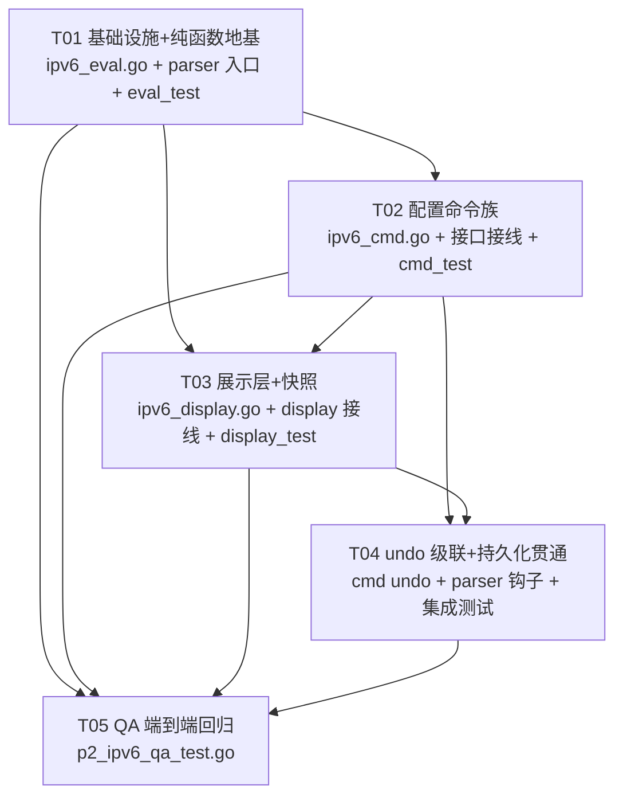
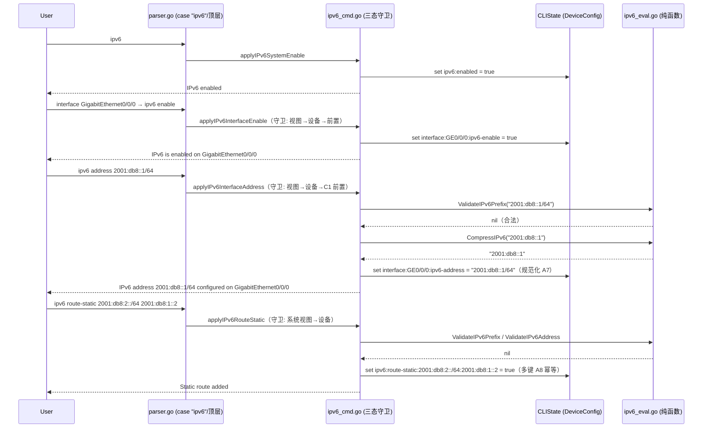
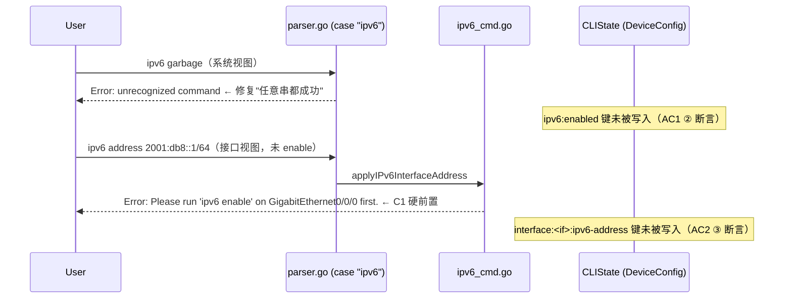
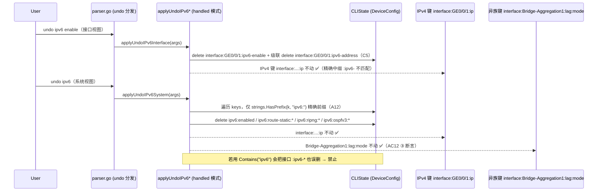
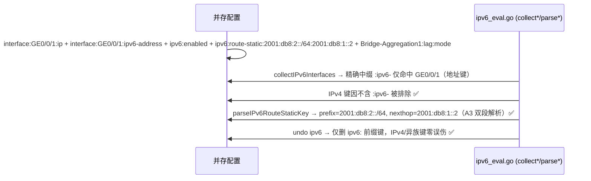
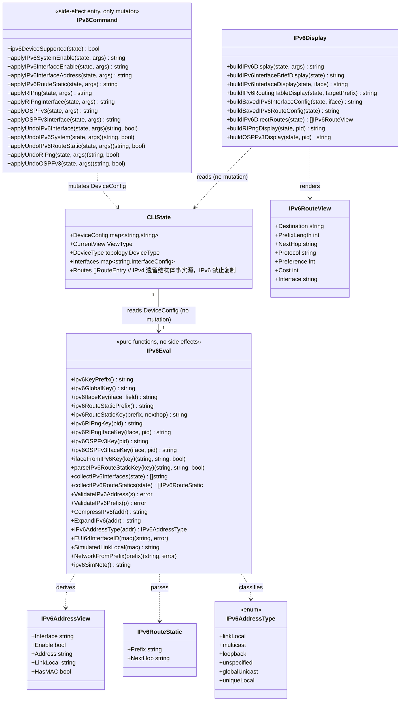

# ensp-lab P2 第九项：IPv6 基础与 IPv6 路由（华为 VRP 课程 43/44）增量设计 + 任务分解

> 本文档据 `docs/p2-ipv6-prd.md`（PRD，493 行）落地；C1–C10 已由主理人全部拍板（§0），设计据此收敛，不再议。
> 文档结构**严格镜像** `docs/p2-aaa-design.md`（§0 拍板汇总 → §0.1 架构裁决 → §1 背景现状 → §2 改动点表 → §3 任务分解 → §4 精确签名/键约定/常量 → §5 时序图/类图 → §6 依赖 → §7 共享知识 → §8 风险 → §9 待明确）。
> **核心范式**：Go CLI 三件套 `ipv6_eval.go`（纯函数评估器，无副作用）/ `ipv6_cmd.go`（副作用唯一出口）/ `ipv6_display.go`（渲染 + 快照），零新增第三方依赖（用标准库 `net/netip`）、零改 `sim` 引擎、不 import `internal/protocol`、`capabilities.go` 零改动。
> 单一事实源 = `DeviceConfig` 键（`ipv6:` 全局命名空间 + `interface:<if>:ipv6-` 接口命名空间 + `ipv6:route-static:` 多键静态路由命名空间）；**严禁在 `CLIState` 新增任何 IPv6 内嵌结构体**（对照 GRE 删 `state.GRE`、AAA 删 `state.LocalUsers`；IPv4 `state.Routes` 遗留结构体**禁止复制**）。
> **本期性质**：纠错型重构 + 纯函数核心新增。IPv6 基线为「系统视图任意串都成功 + 接口视图零校验存串 + 缺 display/静态路由/undo/快照」的半截形态（`parser.go:2120-2130`），需**重构该 case 而非新增**；同时新增地址/前缀纯函数核心（课程 43 教学重点）与 `ipv6 route-static` 多键静态路由（C2 拍板，ECMP 前瞻）。

---

## 0. 拍板汇总（不可再议的前提，设计据此落地）

> 以下 10 项为 PRD §8 待确认项，主理人已逐条拍板。设计**直接落地，不再议**。

| 项 | 待确认问题 | 拍板结论（据以设计） |
|----|-----------|---------------------|
| **C1** | `ipv6 address` 是否要求先 `ipv6 enable`？ | **(a) 硬前置**。未使能配地址 → `Error: Please run 'ipv6 enable' on <if> first.`，**不写任何键、不做隐式自动使能**（保留教学点，对齐 GRE「未 tunnel-protocol 配 source 硬拒绝」）。 |
| **C2** | `ipv6 route-static` 命令形态与键形态？ | **(a) 命令 CIDR 一段式 `<prefix>/<len> <nexthop>` P0，三段式 P1-6**；**键 P0 即定多键 `ipv6:route-static:<prefix>:<nexthop>` = `true`**（ECMP 前瞻，P0 保持到 P2 不得中途改键）。 |
| **C3** | `link-local address` 如何呈现？ | **(a) 有真实 MAC 键 → EUI-64 真实计算显示 `fe80::<EUI64>`（真实推导非伪造）；无 MAC 键 → 恒 `-` + 注记**；严禁任何确定性伪 MAC。 |
| **C4** | `Joined group address(es)`？ | **(a) P0 恒 `-`，P1 渲染协议常量 + solicited-node 推导**（静态可计算数据，控本期体量）。 |
| **C5** | `undo ipv6 enable` 是否级联清 `ipv6-address`？ | **(a) 级联清理**。`undo ipv6 enable` 清 `interface:<if>:ipv6-enable` **并级联清 `interface:<if>:ipv6-address`**（避免幽灵配置）。 |
| **C6** | 系统视图 `undo ipv6` 的清理范围？ | **(a) 仅清全局 `ipv6:` 精确前缀键**（`ipv6:enabled` + `ipv6:route-static:*` + 全局 ripng/ospfv3 键），**不动接口 `:ipv6-*` / `:ripng-*` / `:ospfv3-*` 键**（真机仅关全局能力，接口配置保留）。 |
| **C7** | 🔴 课程冲突：RIPng 命令形态？ | **(a) 按华为 VRP 真机（主理人修正撤回 Cisco 转述）**：系统视图 `ripng [<pid>]`，接口视图 `ripng <pid> enable`。**严禁加 Cisco 别名**（`ipv6 router rip` → `Error: unrecognized command`）。 |
| **C8** | 🔴 课程冲突：OSPFv3 接口使能命令形态？ | **(a) 按华为 VRP 真机**：系统视图 `ospfv3 [<pid>]`，接口视图 `ospfv3 <pid> area <area-id>`（**必带 area，接口裸 `ospfv3` 不合法**）。 |
| **C9** | EUI-64 的 MAC 输入格式？ | **(a) 接受 `00e0-fc12-0aaa`（连字符）与 `00e0fc120aaa`（无分隔）两种**，大小写不敏感，输出统一小写冒号分段（`02e0:fcff:fe12:0aaa`）。 |
| **C10** | `display ipv6 neighbors` 占位展示是否做？ | **(a) 本期不做**，留 P2 候选（P2-4）。 |

---

## 0.1 架构裁决（A1–A13，对拍板未覆盖细节的收敛，非推翻拍板）

- **A1（🔴 键碰撞红线 · 本期最高危）**：**严禁 `strings.Contains(k, "ip")` / `strings.Contains(k, "ipv6")` 模糊匹配**。实证——既有 IPv4 键 `interface:<if>:ip`（`parser.go:516`、`:880`）与新增 `interface:<if>:ipv6-address` **共享 `:ip` 子串**：`Contains(k, ":ip")` 会把两者同时命中（幽灵 IPv6 地址 / 幽灵 IPv4 地址），级联清理会**误删 IPv4 配置**；`Contains(k, "ipv6")` 会把全局 `ipv6:enabled` 与接口 `:ipv6-*` 混为一谈（不同命名空间语义不同）。与 GRE 轮 `Bridge-Aggregation` 含 `gre`、AAA 轮 `00e0-fc12-0aaa` 含 `aaa` 同源同险。全部键解析走 §4.2 精确 helper（精确前缀 `ipv6:` / 精确中缀 `:ipv6-` / 精确前缀 `ipv6:route-static:` + 双段解析）。
- **A2（顶层 token 冲突 · 最高危代码冲突）**：`case "ipv6"`（`parser.go:2120`）已存在 → **本期重构该 case 而非新增**（Go 编译期 duplicate）。`case "ip"`（`:442`）与 display 内 `case "ip"`（`:2657`）不受影响、不得改动。`ripng` / `ospfv3` 顶层**无既有 case**（grep 核过）→ 可安全新增。display switch 内新增 `case "ipv6"`（参照 `case "ip"` 结构），`normalizeDisplaySubCmd2` 增加 parent `"ipv6"` 分支（`int`→`interface`、`rt`/`route`→`routing-table`，零回归——仅新增分支）。
- **A3（🔴 多键形态静态路由键解析）**：键 `ipv6:route-static:<prefix>:<nexthop>` 中 **prefix 与 nexthop 都是 IPv6 地址、均含冒号**，`strings.Split(key, ":")` 不可用。解析算法：① `TrimPrefix(k, "ipv6:route-static:")`；② 定位首个 `/`（prefix 地址段不含 `/`，nexthop 也不含 `/`）→ 前缀地址段；③ 尾部按**首个冒号**切分 → 前缀长度段（纯十进制数字）与 nexthop 段（IPv6 地址，可含冒号）；④ 值必须 `== "true"`。AC12 ② 专项断言。
- **A4（诚实占位红线）**：运行态字段**类型恒 `string` 且值恒 `-`**（从类型层面杜绝填数字）；`ipv6SimNote()` 严格对齐 `greSimNote()` / `aaaSimNote()`（读 `sim.EngineModeName()`，lite/full 两态）；**严禁输出伪造 `fe80::`、假邻居数、假时间**。有真实 MAC 键时 `fe80::<EUI64>` 为真实推导（C3 例外）。
- **A5（capabilities.go 零改动）**：`capabilities.go:129` 已有 `"ipv6": hostsAndL3()`，本期**保持零改动**；`ripng` / `ospfv3` 未在矩阵 → `isCommandSupported` 默认放行；配置命令设备守卫做在**分支内部**复用 `l3Devices()`（`:174-181`，严禁重定义）。display 只读任意设备可读（AC11b）。
- **A6（接口名解析复用）**：`parseInterface` / `sortInterfaceNames` / `interfaceKeys`（`parser.go:5874+`）复用；display 输出确定性（接口名升序）。
- **A7（规范化存储）**：`ipv6 address` 键存 `CompressIPv6(addr) + "/" + prefix`（RFC 5952 规范化缩写）；`route-static` 键前缀段亦为规范化后的 `<prefix>/<len>`。
- **A8（幂等与多键追加语义）**：同前缀同下一跳重复配置 → **幂等**（键已存在不报错不覆盖）；同前缀不同下一跳为 ECMP 前瞻多键（命令面追加语义 P2-1，本期不实现）；`undo ipv6 route-static <prefix>` → **精确前缀 `ipv6:route-static:<prefix>:` 级联清全部键**（多下一跳形态）。
- **A9（前置条件守卫顺序）**：`ipv6_cmd.go` 三态守卫**顺序固定：视图 → 设备 → 前置条件**（对齐 GRE `greTunnelViewGuard` 范式）。前置条件仅 C1 一条（address 前须 enable）。**本期不加**「接口 enable 前须全局 ipv6」守卫（PRD 未拍板，见 §9 待明确 ③）。
- **A10（IPv4-mapped/compat 拒绝策略）**：`netip.ParseAddr` 会接受 `::ffff:1.2.3.4`（IPv4-mapped）与 zone（`fe80::1%eth0`）。教学口径下 **zone 一律拒绝**（AC3 断言）；**IPv4-mapped / IPv4-compatible（`::ffff:0:0/96`、`::/96`）拒绝**（避免 IPv4 内嵌写法歧义，AC3 未断言、属收敛）。
- **A11（系统视图 `ipv6 enable` 引导）**：系统视图 `ipv6 enable` → `Error: Please run 'ipv6' in system view to enable IPv6 globally, or 'ipv6 enable' in interface view.`（P0-1，直击「任意串都成功」）；系统视图 `ipv6 address ...` → `Error: must be in interface view`（AC1 ④）。
- **A12（系统 undo ipv6 精确前缀）**：`applyUndoSystemFeature` 的 `case "ipv6"`（`:5142-5144`）由「只删 `ipv6:enabled`」扩展为**遍历清 `strings.HasPrefix(k, "ipv6:")` 全部键**（含 `ipv6:route-static:*` / `ipv6:ripng:*` / `ipv6:ospfv3:*`），**绝不触碰 `interface:` 命名空间任何键**（C6/AC10③）。
- **A13（`display ipv6 interface` 无参语义）**：`display ipv6 interface`（无 brief 无接口名）→ **等价 `display ipv6 interface brief`**（输出已规格化、确定性；避免渲染未规格化的多块详情，控 AC 面）。见 §9 待明确 ④。

---

## 1. 背景与现状（缺陷说明 + 键碰撞实证 + 半截形态定位）

### 1.1 总体定位：纠错型重构 + 纯函数核心新增，不是从零新建

与 GRE/AAA 两轮同构但严重度略低：无结构体死状态（对比 AAA 删 `state.LocalUsers`）、无跨包死代码（对比 GRE 的 protocol 包死代码），是「命令识别不完整 + 数据不校验 + 展示缺失」。**新增两块内容**：① 地址/前缀纯函数核心（课程 43 教学重点，可单测资产）；② `:ip` 键碰撞风险（AC12 专项）。

### 1.2 缺陷① 系统视图 `ipv6 任意串` 都"成功"（`parser.go:2121-2123`）

现状系统视图分支**不校验参数**：`ipv6 garbage` 也写 `DeviceConfig["ipv6:enabled"]="true"` 并回显 `IPv6 enabled`——命令面不严谨。真机全局使能命令就是裸 `ipv6`（系统视图），无子参数。

### 1.3 缺陷② 接口视图 `ipv6 address <x>` 零校验存串（`parser.go:2124-2128`）

非法地址、无 `/prefix`、非规范化书写全部"成功"，且**不要求先 `ipv6 enable`**。接口视图**没有** `ipv6 enable` 命令。

### 1.4 缺陷③ display / 静态路由 / undo / 快照全部缺失

- `display` switch（`parser.go:2490+`）无 `case "ipv6"`（`:2657` 的 `case "ip"` 为 IPv4 display 范式）；
- `case "ipv6"` 内无 `route-static` 分支；IPv4 侧 `ip route-static` 为**遗留结构体事实源** `state.Routes`（`parser.go:555-571`、`state.go:65`）——**IPv6 禁止复制该模式**；
- 接口级无 `undo ipv6 address` / `undo ipv6 enable`；系统级 `undo ipv6`（`:5142-5144`）只删全局键；
- 接口 `ipv6 address` 不进 `buildSavedConfigSnapshot`（接口块循环 `:5458+` 无 IPv6 行）；系统级块区（`:5392-5395`）无 IPv6 路由块。`ipv6:enabled` 已由 `formatProtocolBlocks`（`:5040-5042`）输出，保留不改。

### 1.5 🔴 键碰撞核查（A1 的实证依据，AC12 专项）

- IPv4 键实存写法 `interface:<if>:ip`（`parser.go:516`、`:880`），与新增 `interface:<if>:ipv6-address` **共享 `:ip` 子串**。
- 若接口扫描用 `strings.Contains(k, ":ip")` → IPv4 键与 IPv6 键**同时命中**（幽灵 IPv6 地址 / 幽灵 IPv4 地址）；若级联清理用 `Contains(k, "ipv6")` → 全局 `ipv6:enabled` 与接口 `:ipv6-*` 混为一谈。
- **结论**：接口键用**精确中缀 `:ipv6-`**（含前导冒号与后置连字符）解析——IPv4 键 `:ip` 不含字面 `:ipv6-`，天然隔离；全局键用**精确前缀 `ipv6:`**；静态路由键用**精确前缀 `ipv6:route-static:` + A3 双段解析**。禁任何子串匹配。

### 1.6 复用基线（正面范式，已 grep 复核）

- `greSimNote()`（`gre_eval.go:583-588`）、`aaaSimNote()`（`aaa_eval.go:593`）—— `ipv6SimNote()` 照此实现（两态，读 `sim.EngineModeName()`）。
- 三件套范式 `gre_cmd.go` / `gre_display.go` / `gre_eval.go`；键 helper 精确常量段范式 `gre_eval.go:75-95`（`greKeyInfix = ":gre-"`——本期对偶为 `:ipv6-`）。
- IPv4 路由表渲染范式 `formatRoutingTable` / `buildDirectRoutes`（`tools.go:337`、`:406`）—— **只参照渲染结构，不复制 `state.Routes` 事实源**。
- undo handled 钩子范式 `applyUndoGREInterface`（`parser.go:866`、`gre_cmd.go:388`，返回 `(string, bool)`，未命中交回既有分支）。
- 持久化：`SerializeToDeviceConfigData` ↔ `LoadFromDeviceConfigData`（`parser.go:5206`、`:5237`）全量拷贝 `DeviceConfig` → IPv6 键自动往返，**零新增持久化代码**。

### 1.7 框架 / 库选型

| 维度 | 选型 | 理由 |
|------|------|------|
| 语言 | Go（既有，1.26.5） | 不引入新语言 |
| CLI 引擎 | 既有 `internal/cli` `parser.go` 分发 + `CLIState.DeviceConfig` | 复用既有三件套范式 |
| IPv6 解析 | **标准库 `net/netip`**（Go 1.26.5 内置） | 零第三方依赖；`ParseAddr`/`ParsePrefix`/`Addr.String()` 已实现 RFC 5952 压缩、`Prefix.Masked()` 实现网络推导 |
| 评估层 | 纯函数 `ipv6_eval.go` | 无副作用、不 import `internal/protocol`、可单测 |
| 渲染层 | `ipv6_display.go` | 输出确定性、诚实占位 |
| 持久化 | 复用 Serialize/Load | 零新增持久化代码 |
| 测试 | `testing` 标准库 | 工程师单测 + QA 端到端 |
| **新增第三方依赖** | **无** | 全部改动在既有依赖内 |

---

## 2. 改动点表（每点含 file:line 落点、现状缺陷、改动内容、归属任务）

> 行号据 PRD §附 grep 复核（本设计已复验）；落地时以 `Grep` 复验最新行号为准。

| # | 落点（file:line） | 现状缺陷 | 改动内容 | 归属任务 | 优先级 |
|---|------------------|---------|---------|---------|-------|
| #1 | `parser.go:2120-2130` `case "ipv6"` | 系统视图任意串成功 + 接口视图零校验存串 + 兜底 `IPv6 configuration` | 重构为视图分派：系统视图裸 `ipv6` ✅ / `ipv6 enable` 引导 / `ipv6 address` 引导接口视图；接口视图 `ipv6 enable`/`ipv6 address` 调 `ipv6_cmd.go` apply 函数；其它视图按守卫矩阵 | T01/T02 | P0 |
| #2 | `parser.go:2490+` display switch | 无 `case "ipv6"` | 新增 `case "ipv6"` 调 `buildIPv6Display`；新增 `case "ripng"` / `case "ospfv3"` | T03 | P0 |
| #3 | `tools.go:92` `normalizeDisplaySubCmd2` | 仅 parent `"ip"` 有映射 | 增加 parent `"ipv6"` 分支（`int`→`interface`、`rt`/`route`→`routing-table`），零回归 | T03 | P0 |
| #4 | `parser.go:2657` `case "ip"`（display 内） | IPv4 display 范式 | **参照不改** | — | — |
| #5 | `parser.go:5040-5042` `formatProtocolBlocks` | `ipv6:enabled` → ` ipv6 enable` | **保留不改**（零回归） | — | — |
| #6 | `parser.go:5142-5144` `applyUndoSystemFeature` `case "ipv6"` | 只删 `ipv6:enabled` | 扩展为遍历清 `strings.HasPrefix(k, "ipv6:")` 全部键（C6/A12），不碰接口键 | T04 | P0 |
| #7 | `parser.go:5458+` 接口块循环 | 无 IPv6 行 | 挂 `buildSavedIPv6InterfaceConfig`（输出 ` ipv6 enable` / ` ipv6 address <addr>/<prefix>`，位置对齐 GRE 块 `:5527` 之后） | T03 | P0 |
| #8 | `parser.go:5392-5395` 系统级块区 | 无 IPv6 路由块 | STP/AAA 块之后挂 `buildSavedIPv6RouteConfig`（输出 ` ipv6 route-static <prefix> <nexthop>`） | T03 | P0 |
| #9 | `parser.go:838-917` undo 分发 | 接口视图 undo 无 IPv6 handled | `ViewInterface` 分支加 `applyUndoIPv6Interface` handled 钩子（对齐 `applyUndoGREInterface`，未命中交回既有分支）；`ViewSystem` 走 `applyUndoSystemFeature` 扩展 | T04 | P0 |
| #10 | `parser.go:516` / `:880` `interface:<if>:ip` | IPv4 键，含 `:ip` 子串 | **对偶键不改**（AC12 实证素材） | — | — |
| #11 | `parser.go:5206` / `:5237` Serialize/Load | 全量拷贝 DeviceConfig | **零改动**（IPv6 键自动往返） | — | — |
| #12 | `capabilities.go:129/141-152/174-181` | `"ipv6": hostsAndL3()` | **零改动**（A5，仅文档注明） | T05（仅确认） | P0 |
| #13 | `internal/cli/ipv6_eval.go`（新） | 无纯函数评估器 | 键 helper + 解析 helper + 收集器 + 7 个核心纯函数 + `ipv6SimNote` + 只读 View 类型 | T01 | P0 |
| #14 | `internal/cli/ipv6_cmd.go`（新） | 无副作用出口 | apply 配置命令族 + undo handled 族 + 三态守卫（视图→设备→前置） | T02/T04 | P0 |
| #15 | `internal/cli/ipv6_display.go`（新） | 无渲染层 | display ipv6 三命令 + RIPng/OSPFv3 display + 快照 helper + 直连路由推导 | T03 | P0 |

### ★ 改动点 #11 补充论证：为什么持久化零改动（对照 AAA 设计 A9）

`SerializeToDeviceConfigData` 复制 `DeviceConfig` **全部**键（`:5219-5221`），`LoadFromDeviceConfigData` 全量还原。IPv6 键属 `DeviceConfig` 子集 → `save`→`reload` 自动持久化，**无需**在任一函数加 IPv6 特例。仅 `buildSavedConfigSnapshot`（文本展示）需挂 IPv6 块（#7/#8），且该文本**不可回灌**（与 STP/GRE/AAA 快照定位一致）。

---

## 3. 任务分解（T01–T05，含依赖关系与实现顺序，映射 P0/P1/P2）

> 任务按**实现依赖顺序**排列；每个任务标注承载的 PRD 需求 ID 与 AC。T05 为 QA 验收测试（QA 另写，工程师确认可测性）。
> 约束：**≤ 5 任务**（架构团队硬性上限）、每任务 ≥ 3 相关文件、按功能层分组、T01 为项目基础设施（新文件骨架 + 纯函数地基 + parser 入口接线 + 单测）。

### 3.1 文件列表（相对路径 + 职责 + 新增/修改标记）

| 文件 | 职责 | 标记 |
|------|------|------|
| `internal/cli/ipv6_eval.go` | 纯函数评估器：键 helper、键解析、收集器、7 个核心纯函数、IPv6AddressType、只读 View 类型、ipv6SimNote | **新增** |
| `internal/cli/ipv6_cmd.go` | 副作用唯一出口：系统/接口使能、接口地址、静态路由、RIPng、OSPFv3、undo handled 族、三态守卫 | **新增** |
| `internal/cli/ipv6_display.go` | 渲染：display ipv6 interface [brief]、display ipv6 routing-table、display ripng、display ospfv3、快照 helper、直连路由推导 | **新增** |
| `internal/cli/parser.go` | case "ipv6" 重构、display switch 接线、normalizeDisplaySubCmd2 扩展、undo 分发钩子、applyUndoSystemFeature 扩展、buildSavedConfigSnapshot 挂载 | **修改** |
| `internal/cli/capabilities.go` | 能力矩阵 | **零改动**（A5，仅文档注明） |
| `internal/cli/state.go` | IPv6 配置 | **零改动**（严禁新增内嵌结构体，AC12 ⑤ 静态断言） |
| `internal/cli/ipv6_eval_test.go` | 工程师纯函数单测（AC3 golden、键 helper 精确匹配、AC12 静态断言辅助） | **新增** |
| `internal/cli/ipv6_cmd_test.go` | 工程师命令族 + 守卫集成单测（AC1/AC2/AC6/AC11） | **新增** |
| `internal/cli/ipv6_display_test.go` | 工程师 display + 快照单测（AC4/AC5/AC7/AC8 渲染断言） | **新增** |
| `internal/cli/p2_ipv6_integration_test.go` | 工程师集成：undo 级联矩阵 + save→reload 贯通 + AC12 键碰撞专项 | **新增** |
| `internal/cli/p2_ipv6_qa_test.go` | QA 端到端回归（独立于工程师，含 AC9 诚实占位红线） | **新增**（QA 另写） |

### 3.2 `parser.go` 改动点明细（已 grep 复核行号）

- `case "ipv6"`（`:2120-2130`）：改为视图分派骨架（T01 先落系统视图语义 + 报错引导；T02 接口视图分支接 apply 函数）。
- display switch（`:2490+`）：`case "ipv6"` / `case "ripng"` / `case "ospfv3"`（T03）。
- `normalizeDisplaySubCmd2`（`tools.go:92`）：parent `"ipv6"` 分支（T03）。
- undo 分发（`:838-917`）：`ViewInterface` 加 `applyUndoIPv6Interface` handled 钩子（T04）。
- `applyUndoSystemFeature` `case "ipv6"`（`:5142-5144`）：扩展清 `ipv6:` 精确前缀全部键（T04）。
- `buildSavedConfigSnapshot`（`:5438+`）：系统级块区挂 `buildSavedIPv6RouteConfig`（STP `:5451`/AAA `:5458` 之后）；接口块循环内挂 `buildSavedIPv6InterfaceConfig`（GRE 块 `:5527` 之后）（T03）。

### T01 ｜ 项目基础设施 + 纯函数地基（`ipv6_eval.go` 全量 + parser 入口接线）

- **承载需求**：P0-3（纯函数核心）、P0-4（键命名空间）、P0-1（系统视图语义修正入口）、P0-7（ipv6SimNote）、AC3、AC12（静态断言辅助）、AC13（纯函数无副作用）。
- **源文件**：`ipv6_eval.go`（#13 新增，全部纯函数）、`parser.go`（#1 系统视图分支 + 常量接线）、`ipv6_eval_test.go`（新增）。
- **依赖**：无（最先）。
- **优先级**：P0。
- **内容**：
  - `ipv6_eval.go`：全部键 helper（§4.2）、A3 双段解析 helper（`parseIPv6RouteStaticKey`）、`ifaceFromIPv6Key` 精确中缀解析、收集器（`collectIPv6Interfaces` / `collectIPv6RouteStatics`）、7 个核心纯函数（`ValidateIPv6Address` / `ValidateIPv6Prefix` / `CompressIPv6` / `ExpandIPv6` / `IPv6AddressType` / `EUI64InterfaceID` / `NetworkFromPrefix`）、`ipv6SimNote()`、只读 View 类型（§4.3）。**零副作用**：不写 state、不碰 sim 引擎实例、不 import internal/protocol、零新增依赖。
  - `parser.go` `case "ipv6"`：先落**系统视图**分支——裸 `ipv6` → 写 `ipv6:enabled` + `IPv6 enabled`；`ipv6 enable` → A11 引导文案；`ipv6 address ...` → `must be in interface view`；`ipv6 <其它>` → `Error: unrecognized command`。**接口视图分支暂保留旧行为占位**，T02 接 apply 函数。
  - `ipv6_eval_test.go`：AC3 逐条 golden 断言（`2001:db8::gg` 拒绝、`%eth0` zone 拒绝、压缩幂等、`::` 仅一次、EUI-64 双格式、NetworkFromPrefix）；键 helper 精确匹配（`interface:GE0/0/1:ip` 与 `interface:GE0/0/1:ipv6-address` 互不误判）；A3 双段解析（含 nexthop 冒号用例 `2001:db8:2::/64:2001:db8:1::2`）；纯函数调用前后 `DeviceConfig` deep-equal。
- **验收**：`go build ./...` 通过；AC3 全绿；AC12 ④ 静态断言（`ipv6_*.go` 零 `Contains(k,"ip")` / `Contains(k,"ipv6")`）；AC13 纯函数无副作用断言。

### T02 ｜ 配置命令族（`ipv6_cmd.go` 副作用出口 + 接口视图接线 + 静态路由 + RIPng/OSPFv3 识别存取）

- **承载需求**：P0-1（接口视图部分）、P0-2（接口使能 + 地址 + C1 前置）、P0-8（route-static）、P0-11（分支内设备守卫）、P0-13（RIPng 识别存取）、P0-14（OSPFv3 识别存取）、C1/C2/C7/C8、AC1/AC2/AC6/AC11a/AC13（RIPng/OSPFv3 键写入）。
- **源文件**：`ipv6_cmd.go`（#14 新增）、`parser.go`（#1 接口视图分支接 apply + 顶层 `ripng`/`ospfv3` case）、`ipv6_cmd_test.go`（新增）。
- **依赖**：T01。
- **优先级**：P0。
- **内容**：
  - `ipv6_cmd.go`：`applyIPv6InterfaceEnable`（接口 `ipv6 enable` → `interface:<if>:ipv6-enable`）、`applyIPv6InterfaceAddress`（C1 硬前置 + `ValidateIPv6Prefix` 校验 + 规范化存储 A7）、`applyIPv6RouteStatic`（CIDR 一段式 + 双端校验 + 多键幂等 A8）、`applyRIPng` / `applyRIPngInterface`（`ipv6:ripng:<pid>:enabled` / `interface:<if>:ripng-<pid>-enable`）、`applyOSPFv3` / `applyOSPFv3Interface`（`ipv6:ospfv3:<pid>:enabled` / `interface:<if>:ospfv3-<pid>-area`）、`ipv6DeviceSupported`（复用 `l3Devices()`）。
  - 三态守卫顺序：视图 → 设备（`l3Devices()` 拒绝 PC/Server/Client/AC/AP/二层 Switch）→ 前置（C1）。
  - `parser.go`：接口视图分支调 apply；顶层 `case "ripng"` / `case "ospfv3"` 按视图分派（系统/接口）；`ipv6 router rip`（Cisco 别名）→ `Error: unrecognized command`（C7）。
  - `ipv6_cmd_test.go`：AC1 ①–④、AC2 ①–⑤、AC6 ①–⑤、AC11a、AC13 RIPng/OSPFv3 键写入断言。
- **验收**：AC1/AC2/AC6/AC11a 全绿；非法地址/前缀不写任何键；同前缀同下一跳幂等；RIPng/OSPFv3 键写入正确、Cisco 别名拒绝且不写键。

### T03 ｜ 展示层 + 快照（`ipv6_display.go` 渲染 + display 接线 + current-config 挂载）

- **承载需求**：P0-5（brief）、P0-6（接口详情 + C3/C4）、P0-9（routing-table）、P0-12（current-config 块）、P1-1（路由表目标过滤）、P1-2（已使能未配地址统计行）、P1-4（joined group，P1）、AC4/AC5/AC7/AC8/AC11b。
- **源文件**：`ipv6_display.go`（#15 新增）、`parser.go`（#2 display case + #3 normalize 扩展 + #7/#8 快照挂载）、`ipv6_display_test.go`（新增）。
- **依赖**：T01、T02（display 需真实配置态数据）。
- **优先级**：P0（P1 项标注）。
- **内容**：
  - `buildIPv6Display`（分发入口，A13）、`buildIPv6InterfaceBriefDisplay`（P0-5 + P1-2 统计行）、`buildIPv6InterfaceDisplay`（P0-6，C3 双分支 link-local）、`buildIPv6RoutingTableDisplay`（P0-9 + P1-1 过滤）、`buildIPv6DirectRoutes`（NetworkFromPrefix 推导直连）、`buildSavedIPv6InterfaceConfig` / `buildSavedIPv6RouteConfig`（P0-12）、`buildRIPngDisplay` / `buildOSPFv3Display`（诚实占位）。
  - `parser.go`：display switch `case "ipv6"` 调 `buildIPv6Display`；`case "ripng"`/`case "ospfv3"` 调对应 build；`normalizeDisplaySubCmd2` parent `"ipv6"` 分支；快照两处挂载。
  - `ipv6_display_test.go`：AC4（确定性 10 次字节级一致 + Protocol 恒 `-`）、AC5（运行态恒 `-` + link-local 双分支）、AC7（Static/Direct 各一 + 无动态条目 + 升序）、AC8（快照字节级一致）。
- **验收**：AC4/AC5/AC7/AC8 全绿；display 只读任意设备可读（AC11b）；输出末尾恒附 `ipv6SimNote()`。

### T04 ｜ undo 级联矩阵 + 持久化贯通 + 集成（handled 钩子 + applyUndoSystemFeature 扩展）

- **承载需求**：P0-10（undo 语义完整）、P1-8（undo route-static 无参）、C5/C6、AC10、AC12（键碰撞专项）、AC8（save→reload）。
- **源文件**：`ipv6_cmd.go`（#14 undo handled 族）、`parser.go`（#6 applyUndoSystemFeature 扩展 + #9 undo 分发钩子）、`p2_ipv6_integration_test.go`（新增）。
- **依赖**：T02、T03。
- **优先级**：P0。
- **内容**：
  - `applyUndoIPv6Interface`（接口视图 handled：`undo ipv6 enable` 级联清地址 C5；`undo ipv6 address` 清单键）、`applyUndoIPv6System`（系统 `undo ipv6` 清 `ipv6:` 精确前缀 C6/A12）、`applyUndoIPv6RouteStatic`（`undo ipv6 route-static <prefix>` 精确前缀级联 A8；无参清全部 `ipv6:route-static:` 前缀 P1-8）、`applyUndoRIPng` / `applyUndoOSPFv3`（精确前缀清对应命名空间）。
  - 接口 undo 钩子**未命中交回既有分支**（零回归，对齐 `applyUndoGREInterface`）；系统 `case "ipv6"` 扩展不动其它 case。
  - `p2_ipv6_integration_test.go`：AC10 ①–⑤（含既有 undo 逐字不变断言）、AC8（save→reload 键集逐键一致 + 快照字节级一致 + 改造前丢失对照）、AC12 ①–⑤（键碰撞专项：`interface:...:ip`、`interface:...:ipv6-address`、`ipv6:enabled`、`ipv6:route-static:2001:db8:2::/64:2001:db8:1::2`、`interface:Bridge-Aggregation1:lag:mode` 并存；undo ipv6 不误伤 IPv4/异族键；`state.go` 无 IPv6 结构体静态断言）。
- **验收**：AC8/AC10/AC12 全绿；既有 undo 分支零回归。

### T05 ｜ QA 端到端回归验收（独立于工程师，QA 另写）

- **承载需求**：PRD §4 主操作流端到端、AC 全量（重点 AC9 诚实占位红线）、跨特性（GRE/AAA/VRRP/LAG/STP/DHCP 中继/端口安全）同存零回归。
- **源文件**：`p2_ipv6_qa_test.go`（新增，QA 写）、`ipv6_eval_test.go`（扩展，若 QA 补充断言）、`ipv6_cmd_test.go`（扩展）。
- **依赖**：T01–T04。
- **优先级**：P0。
- **内容**：课程 43/44 主线操作流端到端；AC9 正则断言（运行态字段恒 `-`、无伪造 `fe80::`、无假数字）；AC11c（capabilities.go 零改动静态断言）；跨特性回归；`go test ./internal/cli/ -run 'IPv6|Ipv6' -v`。
- **验收**：AC1–AC13 全绿；构建走 `./build.ps1`（Windows）/ `make build`。

### 3.3 需求 → 任务映射表（P0-1..P0-14 / P1-1..P1-8 / P2-1..P2-5）

| 需求 ID | 标题 | 归属任务 |
|---------|------|---------|
| P0-1 | 系统视图全局使能命令语义修正 | T01/T02 |
| P0-2 | 接口视图 `ipv6 enable` + `ipv6 address`（视图分派 + C1） | T02 |
| P0-3 | IPv6 地址/前缀纯函数核心 | T01 |
| P0-4 | IPv6 键命名空间（精确匹配，防碰撞） | T01 |
| P0-5 | `display ipv6 interface brief` | T03 |
| P0-6 | `display ipv6 interface <if>` 详情（C3/C4） | T03 |
| P0-7 | `ipv6SimNote()` 诚实占位 | T01/T03 |
| P0-8 | `ipv6 route-static`（C2 多键形态） | T02 |
| P0-9 | `display ipv6 routing-table` | T03 |
| P0-10 | `undo` 语义完整（C5/C6） | T04 |
| P0-11 | 能力矩阵与分支内守卫（capabilities 零改动） | T02/T05 |
| P0-12 | current-config IPv6 块 + save→reload 贯通 | T03/T04 |
| P0-13 | RIPng 命令识别 + 存取 + display 占位（C7） | T02/T03 |
| P0-14 | OSPFv3 命令识别 + 存取 + display 占位（C8） | T02/T03 |
| P1-1 | display ipv6 routing-table <prefix> 目标过滤 | T03 |
| P1-2 | brief 增加已使能未配地址接口 + 统计行 | T03 |
| P1-3 | uniqueLocal / anycast 类型判定（类型判定入 P0 实现） | T01 |
| P1-4 | Joined group address(es) 渲染（协议常量 + solicited-node） | T03 |
| P1-5 | 多 IPv6 地址支持 | 后置（键形态 §9 ①） |
| P1-6 | route-static 三段式 `<address> <len> <nexthop>` | T02（若纳入） |
| P1-7 | routing-table verbose 模式 | 后置 |
| P1-8 | 系统级 undo route-static 无参级联 | T04 |
| P2-1 | route-static 多下一跳（ECMP）命令面 | 后置（键已多键） |
| P2-2 | 接口 anycast / link-local 显式配置 | 本期不实现 |
| P2-3 | route-static preference / tag | 本期不实现 |
| P2-4 | display ipv6 neighbors（C10 本期不做） | 后置候选 |
| P2-5 | 前端无变更 | 确认 |

### 3.4 任务依赖图（Mermaid）



---

## 4. 精确类型签名、键约定与常量（工程师可直接照抄，仅签名不含实现）

### 4.1 最终键名（单一事实源，A1 红线：精确匹配专用）

```
全局使能：  ipv6:enabled                                     // 值 "true"（既有，P0-1 语义修正）
静态路由：  ipv6:route-static:<prefix>:<nexthop>             // 值 "true"（C2 多键形态，ECMP 前瞻；prefix 为规范化 <addr>/<len>，nexthop 为规范化 IPv6 地址）
RIPng：     ipv6:ripng:<pid>:enabled                         // 值 "true"（P0-13）
OSPFv3：    ipv6:ospfv3:<pid>:enabled                        // 值 "true"（P0-14）
接口使能：  interface:<if>:ipv6-enable                       // 值 "true"
接口地址：  interface:<if>:ipv6-address                      // 值 "<规范地址>/<prefix>"（A7）
接口RIPng： interface:<if>:ripng-<pid>-enable                // 值 "true"（P0-13）
接口OSPFv3：interface:<if>:ospfv3-<pid>-area                 // 值 "<area-id>"（P0-14）
```
> **精确匹配口径**：全局扫描 `strings.HasPrefix(k, "ipv6:")`；接口扫描精确中缀 `:ipv6-`（前导冒号 + 后置连字符，IPv4 键 `:ip` 不匹配）；静态路由扫描 `strings.HasPrefix(k, "ipv6:route-static:")` + A3 双段解析 + 值 `== "true"`。**禁 `Contains("ip")` / `Contains("ipv6")`**（A1）。

### 4.2 键 helper 与解析 helper（纯函数层 `ipv6_eval.go`）

```go
package cli

// —— 键构造 helper（A1，全仓拼键/解键唯一素材）——
func ipv6KeyPrefix() string                        // "ipv6:"
func ipv6GlobalKey() string                        // "ipv6:enabled"
func ipv6IfaceKey(iface, field string) string      // "interface:"+iface+":ipv6-"+field；field ∈ {enable, address}（用 ipv6Field* 常量）
func ipv6RouteStaticPrefix() string                // "ipv6:route-static:"
func ipv6RouteStaticKey(prefix, nexthop string) string // "ipv6:route-static:"+prefix+":"+nexthop
func ipv6RIPngKey(pid string) string               // "ipv6:ripng:"+pid+":enabled"
func ipv6RIPngIfaceKey(iface, pid string) string   // "interface:"+iface+":ripng-"+pid+"-enable"
func ipv6OSPFv3Key(pid string) string              // "ipv6:ospfv3:"+pid+":enabled"
func ipv6OSPFv3IfaceKey(iface, pid string) string  // "interface:"+iface+":ospfv3-"+pid+"-area"

// —— 键解析 helper（A1/A3，精确匹配）——
func ifaceFromIPv6Key(key string) (iface, field string, ok bool) // 精确中缀 ":ipv6-" 解析；字段段不得含 ':'；IPv4 键 ":ip" 不匹配
func parseIPv6RouteStaticKey(key string) (prefix, nexthop string, ok bool) // A3 双段解析（详见注释）

// —— 收集器（确定性升序，禁 map 随机遍历）——
func collectIPv6Interfaces(state *CLIState) []string             // 存在 :ipv6- 键的接口名升序去重（含 enable/address）
func collectIPv6RouteStatics(state *CLIState) []IPv6RouteStatic  // 精确前缀 ipv6:route-static: + 值=="true"，按 prefix 升序
func collectRIPngPIDs(state *CLIState) []string                  // 精确前缀 ipv6:ripng:，pid 升序
func collectOSPFv3PIDs(state *CLIState) []string                 // 精确前缀 ipv6:ospfv3:，pid 升序
```

> **A3 双段解析算法**（工程师照抄）：`rest := strings.TrimPrefix(key, ipv6RouteStaticPrefix())`；`slash := strings.Index(rest, "/")`（无 `/` → 非路由键）；`addrPart := rest[:slash]`；`tail := rest[slash+1:]`；`colon := strings.Index(tail, ":")`（无 `:` → 非路由键）；`lenPart := tail[:colon]`（须全为十进制数字，1–3 位）；`nexthop := tail[colon+1:]`；`prefix := addrPart + "/" + lenPart`。正确性依据：prefix 地址段与 nexthop 均为 IPv6 地址（无 `/`）、prefix 长度段为纯数字（无 `:`）、nexthop 为 IPv6 地址（可含 `:`）。AC12 ② 专项断言此解析。

### 4.3 纯函数签名与类型（`ipv6_eval.go`）

```go
// —— 地址类型枚举 ——
type IPv6AddressType string
const (
    IPv6AddrLinkLocal     IPv6AddressType = "linkLocal"      // fe80::/10
    IPv6AddrMulticast     IPv6AddressType = "multicast"      // ff00::/8
    IPv6AddrLoopback      IPv6AddressType = "loopback"       // ::1
    IPv6AddrUnspecified   IPv6AddressType = "unspecified"    // ::
    IPv6AddrGlobalUnicast IPv6AddressType = "globalUnicast"  // 其余非特殊
    IPv6AddrUniqueLocal   IPv6AddressType = "uniqueLocal"    // fc00::/7（P1-3 类型判定，本期实现；anycast 配置命令不实现）
)

// —— 核心纯函数（P0-3，零副作用：不写 state、不碰 sim 实例、不 import internal/protocol、零新增依赖，用 net/netip）——
func ValidateIPv6Address(s string) error                       // 入参: 地址串；出参: error；职责: netip.ParseAddr 校验 + 拒绝 zone（A10）+ 拒绝 IPv4-mapped/compat（A10）
func ValidateIPv6Prefix(prefix string) error                   // 入参: "<addr>/<len>"；出参: error；职责: 校验形态 + len 0–128 + 地址合法
func CompressIPv6(addr string) string                          // 入参: 任意合法 IPv6 地址串；出参: RFC 5952 规范化压缩串（netip.Addr.String()，幂等）
func ExpandIPv6(addr string) string                            // 入参: IPv6 地址串；出参: 8 组各 4 位十六进制全展开（Addr.As16() 格式化）
func IPv6AddressType(addr string) IPv6AddressType              // 入参: IPv6 地址串；出参: 地址类型（linkLocal/multicast/loopback/unspecified/globalUnicast/uniqueLocal）
func EUI64InterfaceID(mac string) (string, error)              // 入参: MAC（"00e0-fc12-0aaa" 或 "00e0fc120aaa"，大小写不敏感，C9）；出参: "02e0:fcff:fe12:0aaa"（插入 ff:fe + 翻转 U/L 位）
func SimulatedLinkLocal(mac string) string                     // 入参: MAC；出参: "fe80::"+EUI64（仅接口有真实 MAC 键时调用，C3；无 MAC 一律不调用）
func NetworkFromPrefix(prefix string) (string, error)          // 入参: "<addr>/<len>"；出参: 网络地址（netip.Prefix.Masked().Addr()，直连路由用）

// —— 诚实占位注记 ——
func ipv6SimNote() string                                      // 读 sim.EngineModeName()；lite/full 两态（对齐 greSimNote/aaaSimNote，P0-7）

// —— 只读 View 类型（即时派生、不缓存、不双写，严禁进 state.go）——
type IPv6AddressView struct {
    Interface string // 接口名（规范大小写）
    Enable    bool   // 是否 ipv6 enable（读 :ipv6-enable）
    Address   string // 规范地址/前缀 或 ""（读 :ipv6-address）
    LinkLocal string // "fe80::<EUI64>"（有 MAC 键真实计算）或 "-"（无 MAC，C3）
    HasMAC    bool   // 接口是否存在真实 MAC 键（interface:<if>:mac）
}
type IPv6RouteStatic struct {
    Prefix  string // 规范化 "<addr>/<len>"
    NextHop string // 规范化 IPv6 地址
}
type IPv6RouteView struct {
    Destination  string // 网络地址（NetworkFromPrefix 结果）
    PrefixLength int
    NextHop      string // Static=下一跳 / Direct=接口地址
    Protocol     string // "Static" | "Direct"
    Preference   int    // Static=60 / Direct=0
    Cost         int    // 恒 0
    Interface    string // Static="NULL0" / Direct=接口名
}
```

### 4.4 副作用层 / 渲染层签名（`ipv6_cmd.go` / `ipv6_display.go`，仅签名）

```go
// ipv6_cmd.go —— 副作用唯一出口（三态守卫顺序：视图 → 设备 → 前置条件）
func ipv6DeviceSupported(state *CLIState) bool                    // 复用 l3Devices()（capabilities.go:174），禁重定义（A5）
func applyIPv6SystemEnable(state *CLIState, args []string) string // 系统视图裸 ipv6 → 写 ipv6:enabled + "IPv6 enabled"（P0-1）
func applyIPv6InterfaceEnable(state *CLIState, args []string) string // 接口 ipv6 enable → 写 :ipv6-enable + 回显（P0-2）
func applyIPv6InterfaceAddress(state *CLIState, args []string) string // 接口 ipv6 address <a>/<p>：C1 前置 + ValidateIPv6Prefix + 规范化存 A7（P0-2）
func applyIPv6RouteStatic(state *CLIState, args []string) string  // 系统 ipv6 route-static <p>/<l> <nh>：双端校验 + 多键幂等 A8（P0-8）
func applyRIPng(state *CLIState, args []string) string            // 系统 ripng [<pid>] → 写 ipv6:ripng:<pid>:enabled（C7，P0-13）
func applyRIPngInterface(state *CLIState, args []string) string   // 接口 ripng <pid> enable → 写 :ripng-<pid>-enable（C7，P0-13）
func applyOSPFv3(state *CLIState, args []string) string           // 系统 ospfv3 [<pid>] → 写 ipv6:ospfv3:<pid>:enabled（C8，P0-14）
func applyOSPFv3Interface(state *CLIState, args []string) string  // 接口 ospfv3 <pid> area <id> → 写 :ospfv3-<pid>-area（裸 ospfv3 不合法，C8，P0-14）
// undo（handled 模式，未命中交回既有分支，零回归）
func applyUndoIPv6Interface(state *CLIState, args []string) (string, bool) // 接口 undo ipv6 enable（级联清地址 C5）/ undo ipv6 address
func applyUndoIPv6System(state *CLIState, args []string) (string, bool)    // 系统 undo ipv6：清 ipv6: 精确前缀全部键（C6/A12）
func applyUndoIPv6RouteStatic(state *CLIState, args []string) (string, bool) // 系统 undo ipv6 route-static <prefix> 精确前缀级联；无参清全部（P1-8）
func applyUndoRIPng(state *CLIState, args []string) (string, bool)          // 系统 undo ripng [<pid>] 精确前缀
func applyUndoOSPFv3(state *CLIState, args []string) (string, bool)         // 系统 undo ospfv3 [<pid>] 精确前缀

// ipv6_display.go —— 渲染 + 快照（只读，任意设备可读 AC11b）
func buildIPv6Display(state *CLIState, args []string) string                // display ipv6 分发入口（interface/routing-table；A13 无参 brief）
func buildIPv6InterfaceBriefDisplay(state *CLIState) string                 // display ipv6 interface brief（P0-5 + P1-2 统计行）
func buildIPv6InterfaceDisplay(state *CLIState, iface string) string        // display ipv6 interface <if>（P0-6，C3/C4）
func buildIPv6RoutingTableDisplay(state *CLIState, targetPrefix string) string // display ipv6 routing-table [<prefix>]（P0-9 + P1-1 过滤）
func buildSavedIPv6InterfaceConfig(state *CLIState, iface string) string    // 接口块内 ipv6 enable / ipv6 address 行（P0-12）
func buildSavedIPv6RouteConfig(state *CLIState) string                      // 系统级 ipv6 route-static 行（P0-12，prefix 升序）
func buildIPv6DirectRoutes(state *CLIState) []IPv6RouteView                 // 由接口地址 + NetworkFromPrefix 推导直连路由（P0-9）
func buildRIPngDisplay(state *CLIState, pid string) string                  // display ripng [<pid>]：配置态真实 + 运行态恒 "-" + 注记（P0-13）
func buildOSPFv3Display(state *CLIState, pid string) string                 // display ospfv3 [<pid>]：配置态真实 + 运行态恒 "-" + 注记（P0-14）
```

### 4.5 常量与规格（工程师照抄）

```go
// 键字段常量（ipv6IfaceKey 的 field 入参，避免裸串）
const (
    ipv6FieldEnable  = "enable"
    ipv6FieldAddress = "address"
)

// 规格
const (
    IPv6PrefixMaxLen = 128
    IPv6StatPlaceholder         = "-" // 运行态恒 "-"（A4 红线，类型 string）
    IPv6NotConfiguredPlaceholder = "-"
    IPv6StaticPreference = 60  // 静态路由 Preference（对齐 IPv4）
    IPv6DirectPreference = 0   // 直连路由 Preference
)

// 错误文案常量（QA 逐字断言）
const (
    ErrIPv6Unrecognized         = "Error: unrecognized command"
    ErrIPv6MustBeInterfaceView  = "Error: must be in interface view"
    ErrIPv6SystemViewEnableGuide = "Error: Please run 'ipv6' in system view to enable IPv6 globally, or 'ipv6 enable' in interface view."
    ErrIPv6EnableFirst          = "Error: Please run 'ipv6 enable' on %s first."          // C1
    ErrIPv6InvalidAddress       = "Error: Invalid IPv6 address %s"
    ErrIPv6InvalidPrefix        = "Error: Invalid IPv6 prefix %s"
    ErrIPv6InvalidPrefixLen     = "Error: Invalid IPv6 prefix length %s (0-128)"
    ErrIPv6InvalidInterface     = "Error: invalid interface '%s'"
    ErrIPv6RouteStaticUsage     = "Error: usage: ipv6 route-static <prefix>/<len> <nexthop>"
    ErrRIPngUsage               = "Error: usage: ripng [<process-id>]"
    ErrRIPngIfaceUsage          = "Error: usage: ripng <process-id> enable"
    ErrOSPFv3Usage              = "Error: usage: ospfv3 [<process-id>]"
    ErrOSPFv3IfaceUsage         = "Error: usage: ospfv3 <process-id> area <area-id>"
    InfoNoIPv6Address           = "Info: No IPv6 address configured."
    InfoNoIPv6Route             = "Info: No IPv6 route."
)
```

---

## 5. 时序图（Mermaid）

### 5.1 课程 43/44 主线配置流（P0-1/2/8，AC1/2/6）



### 5.2 错误路径（C1 前置 + P0-1 命令面修正，AC1 ②/AC2 ③）



### 5.3 undo 级联清理流（C5/C6，AC10，键碰撞红线 A1/A12）



### 5.4 键碰撞隔离流（AC12 专项实证）



### 5.5 类图（classDiagram，数据结构与接口）



---

## 6. 依赖包与运行环境

- **语言/运行时**：Go（既有 1.26.5，无升级）。
- **新增第三方依赖**：**无**（IPv6 解析用标准库 `net/netip`）。
- **复用既有包**：`internal/cli`（parser/state/capabilities/tools）、`internal/sim`（`sim.EngineModeName()`，仅读，零改）、`topology`（`DeviceType`、`l3Devices()` 复用）。
- **不引入**：`internal/protocol`（IPv6 无协议状态机，C7/C8 边界）、任何 i18n 框架、前端框架（P2-5）。
- **测试**：标准库 `testing`，无新测试框架。

---

## 7. 共享知识（给工程师的硬性约定）

### 7.1 键命名约定（唯一事实源）

- 全部 IPv6 配置落 `DeviceConfig` 键（§4.1 三个命名空间）；**严禁**在 `CLIState` 新增任何 IPv6 内嵌结构体/字段（对照 GRE/AAA，AC12 ⑤ 静态断言 `grep -n "IPv6\|Ipv6" internal/cli/state.go` 零命中）。
- **严禁复制 IPv4 `state.Routes` 结构体事实源**（`state.go:65`）；静态路由走 `ipv6:route-static:` 多键（C2，P0 保持到 P2 不得中途改键）。
- 拼键/解键**唯一**走 §4.2 helper，禁止裸串拼接；`ipv6IfaceKey` 的 field 用 `ipv6Field*` 常量。

### 7.2 错误文案清单（QA 逐字断言用，见 §4.5 常量）

`ErrIPv6Unrecognized` / `ErrIPv6MustBeInterfaceView` / `ErrIPv6SystemViewEnableGuide` / `ErrIPv6EnableFirst` / `ErrIPv6InvalidAddress` / `ErrIPv6InvalidPrefix` / `ErrIPv6InvalidPrefixLen` / `ErrIPv6InvalidInterface` / `ErrIPv6RouteStaticUsage` / `ErrRIPngUsage` / `ErrRIPngIfaceUsage` / `ErrOSPFv3Usage` / `ErrOSPFv3IfaceUsage`。文案统一 `Error:` / `Info:` 英文前缀；诚实注记用中文括注（对齐 `greSimNote()`）。

### 7.3 诚实占位红线（CRITICAL，P0-7 / AC9）

- 所有运行态字段**类型恒 `string` 且值恒 `-`**（`Line protocol` / `DAD attempts` / `ND reachable time` / `ND retransmit interval` / `InReceives` / `OutRequests` / `RelayNextHop` / `TunnelID` / RIPng 邻居与路由计数 / OSPFv3 邻居与 LSA 计数）。
- `ipv6SimNote()` 两态注记必须附在 `display ipv6 interface [brief]` / `display ipv6 routing-table` / `display ripng` / `display ospfv3` 末尾。
- **严禁输出伪造 `fe80::` 假地址**（无真实 MAC 键时恒 `-`）；**有真实 MAC 键（`interface:<if>:mac`）时 `fe80::<EUI64>` 为真实推导，属 C3 例外**。
- 不得声称「ND 邻居存在」「DAD 已执行」「RIPng/OSPFv3 邻居 UP」「动态路由已学习」等任何运行态。

### 7.4 复用 helper 清单（禁止重定义，否则编译冲突）

- `l3Devices()`（`capabilities.go:174-181`）—— 分支内设备守卫**复用**，严禁重定义（A5）。
- `applyUndoGREInterface` 的 handled 模式（`parser.go:866` / `gre_cmd.go:388`，返回 `(string, bool)`）—— undo 分发复用同款，未命中交回既有分支（T04）。
- `parseInterface` / `sortInterfaceNames` / `interfaceKeys`（`parser.go:5874+`）—— display 与配置接口名校验复用。
- `sim.EngineModeName()` —— `ipv6SimNote()` 只读调用，零改 sim 引擎。
- `net/netip` —— `netip.ParseAddr` / `netip.ParsePrefix` / `Addr.String()`（RFC 5952）/ `Prefix.Masked()` / `Addr.As16()`。
- 键 helper 范式对齐 `gre_eval.go:75-95`（精确中缀 `:gre-` → 本期 `:ipv6-`）。

### 7.5 undo 级联矩阵（P0-10 / C5 / C6 / P1-8，工程师按此实现）

| 命令 | 视图 | 清理范围（精确匹配） | 依据 |
|------|------|---------------------|------|
| `undo ipv6 enable` | 接口 | 清 `interface:<if>:ipv6-enable` **+ 级联清 `interface:<if>:ipv6-address`** | C5 |
| `undo ipv6 address` | 接口 | 清 `interface:<if>:ipv6-address` | P0-10 |
| `undo ipv6` | 系统 | 清 `strings.HasPrefix(k, "ipv6:")` 全部键（enabled + route-static:* + ripng:* + ospfv3:*）——**不动 interface: 任何键** | C6/A12 |
| `undo ipv6 route-static <prefix>` | 系统 | 清 `strings.HasPrefix(k, "ipv6:route-static:<prefix>:")` 全部键（多下一跳级联） | A8/C2 |
| `undo ipv6 route-static`（无参） | 系统 | 清 `strings.HasPrefix(k, "ipv6:route-static:")` 全部键 | P1-8 |
| `undo ripng [<pid>]` | 系统 | 清 `ipv6:ripng:<pid>:enabled`（无 pid → 清 `ipv6:ripng:` 前缀） | P0-13 |
| `undo ospfv3 [<pid>]` | 系统 | 清 `ipv6:ospfv3:<pid>:enabled`（无 pid → 清 `ipv6:ospfv3:` 前缀） | P0-14 |
| `undo ripng <pid> enable` | 接口 | 清 `interface:<if>:ripng-<pid>-enable` | P0-13 |
| `undo ospfv3 <pid> area` | 接口 | 清 `interface:<if>:ospfv3-<pid>-area` | P0-14 |

### 7.6 守卫矩阵（视图 × 设备类型，T02 落地）

| 命令 | 系统视图 | 接口视图 | 其它视图 | 设备守卫（分支内 `l3Devices()`） |
|------|---------|---------|---------|-------------------------------|
| 裸 `ipv6` | ✅ 写 `ipv6:enabled` | ❌ `unrecognized` | ❌ `unrecognized`（用户视图引导系统视图） | ✅ 拒绝 PC/Server/Client/AC/AP/二层 Switch |
| `ipv6 enable` | ❌ A11 引导文案 | ✅ 写 `:ipv6-enable` | ❌ `must be in interface view` | ✅ |
| `ipv6 address <a>/<p>` | ❌ `must be in interface view`（AC1 ④） | ✅ C1 前置 + 校验 | ❌ `must be in interface view` | ✅ |
| `ipv6 route-static ...` | ✅ P0-8 | ❌ `unrecognized` | ❌ | ✅ |
| `ipv6 <其它>` | ❌ `unrecognized`（AC1 ②） | ❌ `unrecognized` | ❌ `unrecognized` | —（先视图守卫） |
| `undo ipv6 ...` | ✅ 见 7.5 | ✅ 见 7.5（handled） | ❌ 既有报错 | ✅ |
| `display ipv6 ...` | ✅ **只读任意设备可读**，空态 `Info:` | ✅ | ✅ | ❌ 无守卫（AC11b） |
| `ripng [<pid>]` | ✅ P0-13 | ❌ `unrecognized` | ❌ | ✅ |
| `ripng <pid> enable` | ❌ | ✅ P0-13 | ❌ | ✅ |
| `ospfv3 [<pid>]` | ✅ P0-14 | ❌ `unrecognized` | ❌ | ✅ |
| `ospfv3 <pid> area <id>` | ❌ | ✅ P0-14（裸 `ospfv3` 不合法） | ❌ | ✅ |
| `display ripng` / `display ospfv3` | ✅ 只读任意设备 | ✅ | ✅ | ❌ 无守卫 |
| `ipv6 router rip`（Cisco 别名） | ❌ `unrecognized`（C7，不写键） | ❌ | ❌ | — |

> **前置条件**（三态守卫第 3 层）：仅 C1 一条——`ipv6 address` 前须 `ipv6 enable`；不做隐式自动使能（A9）。

### 7.7 持久化挂载点（P0-12）

- 接口块：`buildSavedConfigSnapshot` 接口循环（`parser.go:5458+`）内，GRE 块（`:5527`）之后挂 `buildSavedIPv6InterfaceConfig`（输出 ` ipv6 enable` / ` ipv6 address <addr>/<prefix>`，缺省值不冗余）。
- 系统级块：STP（`:5451`）/ AAA（`:5458`）之后挂 `buildSavedIPv6RouteConfig`（输出 ` ipv6 route-static <prefix> <nexthop>`，prefix 升序确定性）。
- `ipv6:enabled` 已由 `formatProtocolBlocks`（`:5040-5042`）输出，**保留不改**。
- IPv6 键随 `SerializeToDeviceConfigData` ↔ `LoadFromDeviceConfigData` 全量拷贝自动往返（`:5206`/`:5237`），**零新增持久化代码**；快照文本不可回灌。

### 7.8 回显与幂等口径

- 配置成功回显按 PRD §4.1（`IPv6 enabled` / `IPv6 is enabled on <if>` / `IPv6 address <a>/<p> configured on <if>` / `Static route added`）；**不得自造欢快文案**。
- `ipv6 route-static` 同前缀同下一跳重复配置 → 幂等（不报错不覆盖，A8）。
- `display` 输出确定性（接口/前缀升序，禁 map 随机遍历）；空态 `Info:`。

---

## 8. 风险登记

| 风险 | 等级 | 缓解 / 回滚 |
|------|------|------------|
| 🔴 键碰撞误删 IPv4 键（`interface:<if>:ip` 与 `:ipv6-address` 共享 `:ip` 子串） | 🔴 最高 | A1 精确 helper + AC12 专项断言；**回滚**：T01/T04 独立提交，键解析异常时 revert 对应提交，键命名空间已定（P0 到 P2 不改），数据不动 |
| 🔴 `case "ipv6"` 重构零回归（系统视图 `ipv6 garbage` 从"成功"变报错是**预期行为变更**，但 `ipv6` 裸命令、`display ip routing-table`、`ip route-static` 必须逐字不变） | 🔴 高 | T01 独立提交可单独 revert；AC1 ② 专项断言直击缺陷；`case "ip"`（`:442`/`:2657`）不得触碰 |
| 🔴 undo handled 钩子未命中误吞既有分支 | 🔴 高 | 对齐 `applyUndoGREInterface`（`parser.go:866`）返回 `(string, bool)`；未命中交回既有 `switch sub`（零回归）；AC10 ⑤ 断言既有 undo 逐字不变 |
| 🔴 多键形态静态路由键解析（prefix/nexthop 均含冒号） | 🔴 高 | A3 双段解析（`/` 定位 + 前缀长度段 + 首个冒号）+ 值 `== "true"` 校验；AC12 ② 专项断言 `2001:db8:2::/64:2001:db8:1::2` 正确解析 |
| 🔴 诚实占位被违反（伪造 `fe80::`、假数字、假时间） | 🔴 高 | A4 运行态字段类型 string 恒 `-` + `ipv6SimNote()` 强制 + AC9 正则断言；AC9 失败即视为违反核心价值观，不得放行 |
| RIPng/OSPFv3 误加 Cisco 别名（`ipv6 router rip`） | 🟡 中 | C7 主理人已拍板按华为真机；AC13 断言 `ipv6 router rip` → `unrecognized` 且不写键 |
| capabilities.go 被误改导致矩阵回归 | 🟡 中 | A5 零改动；AC11c 静态断言；设备守卫分支内复用 `l3Devices()` |
| `state.go` 被误加 IPv6 结构体 | 🟡 中 | AC12 ⑤ 静态断言 `grep -n "IPv6\|Ipv6" state.go` 零命中（对照 GRE/AAA） |
| `normalizeDisplaySubCmd2` 扩展误伤 `display ip` 分支 | 🟡 中 | 仅新增 parent `"ipv6"` 分支，既有 parent `"ip"` 逻辑不动；AC4/AC7 回归断言 |
| 接口地址前置校验误拦合法用例（zone/IPv4-mapped 判定过严） | 🟡 中 | A10 策略文档化；AC3 golden 断言锁定；如有争议按 §9 待明确 ① 上报 |

---

## 9. 待明确事项（仅列本期确实无法闭合的）

1. **IPv4-mapped/compat 拒绝策略（A10）**：`netip` 接受 `::ffff:1.2.3.4`（IPv4-mapped）与 zone。本期设计**拒绝**二者（教学口径），AC3 仅锁定 zone 拒绝断言。若产品侧希望接受 IPv4-mapped，需在 T01 前拍板，改动仅限 `ValidateIPv6Address` 一行判定。
2. **多 IPv6 地址（P1-5）键形态**：v1 单地址 `:ipv6-address`；P1 若支持多地址，建议 `:ipv6-address-2` 等多键（P1 决策，本期不做）。
3. **接口 `ipv6 enable` 是否要求全局 `ipv6` 已使能**：PRD 未拍板。本期设计**不加**该前置（仅 C1 一条前置），教学流程自然先全局后接口。若 QA 发现 `ipv6 enable` 在未全局使能时仍"成功"属不可接受，需在 T02 前补守卫。
4. **`display ipv6 interface` 无参语义（A13）**：设计按等价 `brief` 收敛（输出规格化、确定性）。若希望按真机"全部接口详情块"渲染，需扩 AC 面（QA 先确认）。
5. **RIPng/OSPFv3 进程视图**：本期仅"识别 + 存取 + display 占位"，`ripng 1` / `ospfv3 1` 是否进入进程子视图（prompt `[R1-ripng-1]`）未拍板；设计按**不进子视图、仅写全局进程键 + 回显**处理（最小面，C7/C8 边界内）。若需子视图，属 P1+ 扩展。

---

## 附录：与 GRE / AAA 同族对照速查

| 维度 | GRE（P2 第七项） | AAA（P2 第八项） | **IPv6（P2 第九项）** |
|------|----------------|-----------------|---------------------|
| 三件套 | `gre_eval/cmd/display.go` | `aaa_eval/cmd/display.go` | **`ipv6_eval/cmd/display.go`** |
| 事实源 | 删 `state.GRE` → DeviceConfig 键 | 删 `state.LocalUsers` → `aaa:` 键 | **DeviceConfig 键（`ipv6:` / `interface:<if>:ipv6-` / `ipv6:route-static:`）；`state.Routes` 遗留不复制** |
| 键碰撞红线 | 禁 `Contains("gre")`（Bridge-Ag·gre·gation） | 禁 `Contains("aaa")`（`0aaa` MAC） | **禁 `Contains("ip")` / `Contains("ipv6")`（`interface:<if>:ip` 与 `:ipv6-address` 共享 `:ip`）** |
| 诚实占位 | `greSimNote()` | `aaaSimNote()` | **`ipv6SimNote()`（同两态）** |
| undo 模式 | `applyUndoGREInterface` handled | `applyUndoAAA*` handled | **`applyUndoIPv6Interface` / `applyUndoIPv6System` / `applyUndoIPv6RouteStatic` handled 同款** |
| 持久化 | Serialize/Load 自动往返 | 同 | **同（零新增）** |
| 能力矩阵 | 零改动，分支内 `l3Devices()` | 同 | **同（A5，`"ipv6": hostsAndL3()` 保留）** |
| 纯函数 | 端点校验 / key 规范化 | 脱敏 / 引用完整性 | **地址/前缀校验 + RFC 5952 压缩 + EUI-64 + 类型判定 + 网络推导（`net/netip`）** |

---

## 文档状态

- **✅ 决策状态**：C1–C10 已全部拍板（§0），A1–A13 架构裁决已闭合（§0.1）；键命名（§4.1）、函数签名（§4.2–4.4）、undo 矩阵（§7.5）、守卫矩阵（§7.6）、持久化挂载点（§7.7）均已落到可抄写粒度。
- **核心结论**：本期 = **纠错型重构（半截 case "ipv6"）+ 纯函数核心新增（地址/前缀/EUI-64/类型）+ 多键静态路由（C2 前瞻）**；`capabilities.go` 零改动、持久化零新增、`state.go` 零新增结构体。
- **最高危技术点**：① `:ip` 键碰撞（AC12 专项）；② `case "ipv6"` 重构零回归（AC1/AC10 ⑤）；③ 多键形态静态路由键解析（A3，nexthop 含冒号）；④ undo handled 钩子未命中交回（AC10 ⑤）。
- 需求池 27 条（P0 14 / P1 8 / P2 5）映射见 §3.3；AC1–AC13 全部落到 T01–T05 验收。
- 工程师落地时以 `Grep` 复验最新行号为准；构建入口 `./build.ps1`（Windows）/ `make build`（禁止直接 go build）；测试入口 `go test ./internal/cli/ -run 'IPv6|Ipv6' -v`。

_Last updated: 2026-08-09 · 架构师 齐巧（Qi）_
