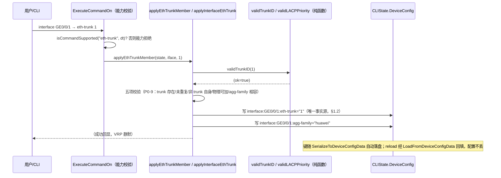
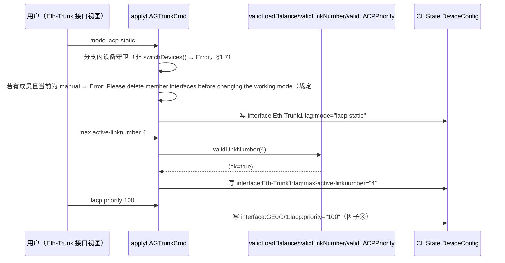
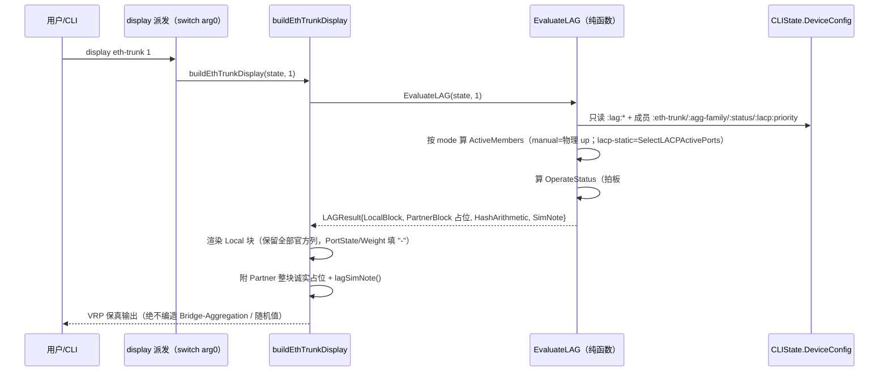
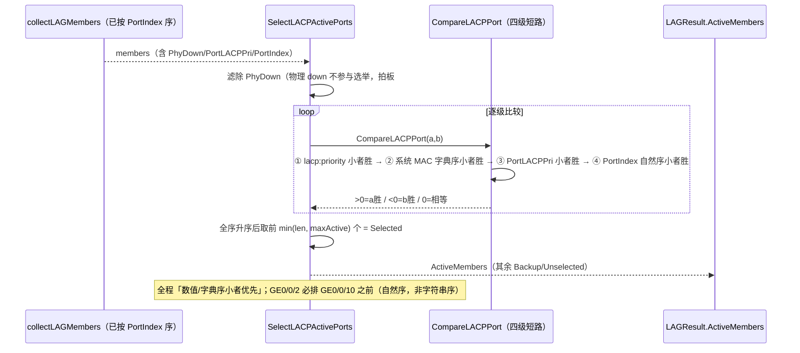
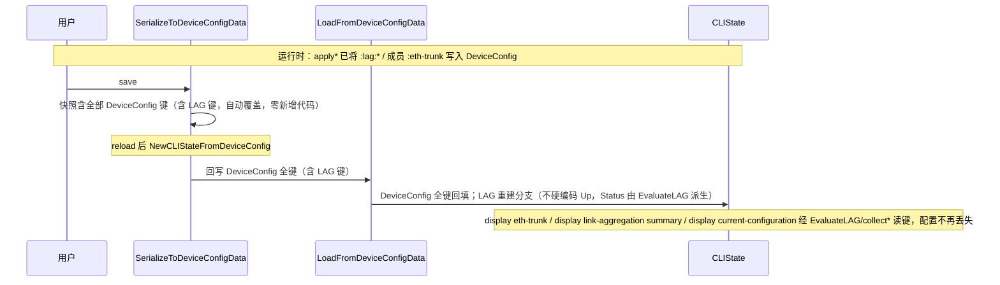
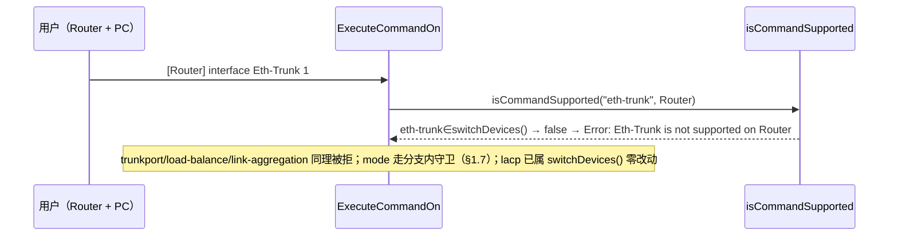
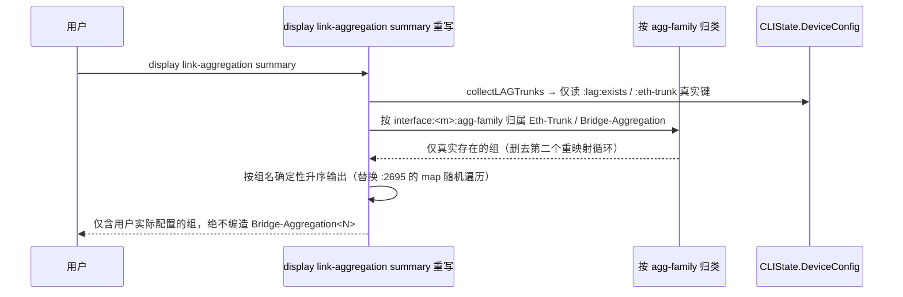
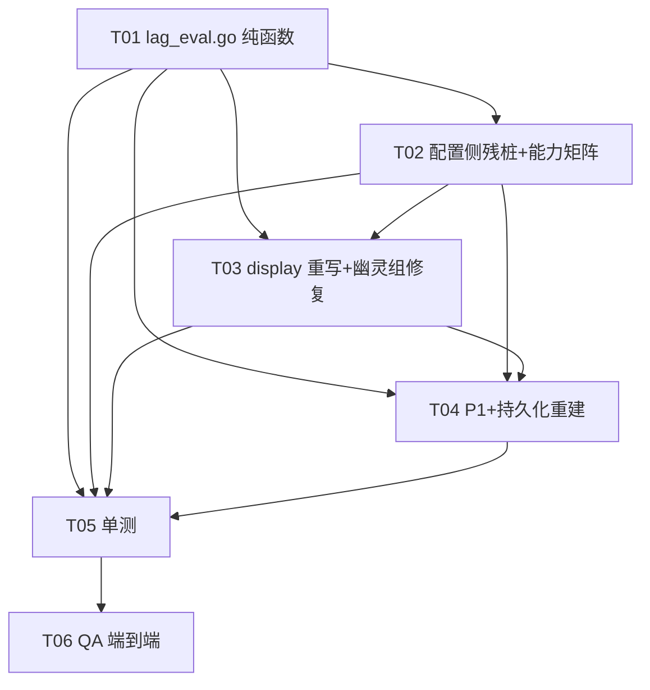

# ensp-lab P2 第五项：链路聚合 Eth-Trunk / LACP（华为 VRP 课程 63）增量设计 + 任务分解

> 文档类型：实现前技术设计（架构师 高见远 / Gao）
> 关联输入：`docs/p2-lag-prd.md`（许清楚）、`docs/p2-stp-design.md` / `docs/p2-vrrp-design.md`（结构与详略对齐基准）、`internal/cli/parser.go` / `state.go` / `capabilities.go` / `stp_eval.go` / `vrrp_eval.go`（已逐条 grep 核验代码基线）
> 基线：P1-C / P1-F / NAT / 端口安全 / VRRP / STP「CLIState 层纯函数、单一事实源 `DeviceConfig`、诚实占位、零改动 `sim` 引擎、零新增第三方依赖」——本期**完全沿用**，链路聚合仅作为 `cli` 包内增量
> 语言：中文。仅含类型/函数签名与伪代码，**不含实现代码**（实现是工程师下一阶段）。

---

## 0. 拍板汇总（不可再议的前提，设计据此落地）

主理人已对 PRD §6 拍板，以下 4 条为**已决事项**，设计严格照此执行，不再开放讨论。

### 拍板 #1：LACP 静态模式 active/backup 选举因子（**方向写死：全部「数值小者优先」**）

接受本地视图简化方案。选举比较链**逐级短路**，四级**全部为「数值小者优先」**：

| 级别 | 比较因子 | 方向 | 缺省值 | 本地视图是否具有区分度 |
|---|---|---|---|---|
| ① | 系统 LACP 优先级（`lacp priority`，系统视图） | **数值小者优先** | 32768 | ❌ 全体成员同属一系统，恒相等 |
| ② | 系统 MAC | **字典序小者优先** | 本地派生 | ❌ 同上，恒相等 |
| ③ | 端口 LACP 优先级（`lacp priority`，接口视图） | **数值小者优先** | 32768 | ✅ 主区分因子 |
| ④ | 端口号 | **小者优先**，**按接口名解析出的数字自然序**（非字符串序），例如 `GE0/0/2` < `GE0/0/10` | — | ✅ tie-break |

> **上一期 STP 曾因比较方向误写「大者胜」返工，本期严禁重蹈。** §5.4 给出 `CompareLACPPort` 的返回值语义与逐级伪代码，`stp_eval.go:260 CompareBridgeID` 的既有实现（`return 1` = a 胜）为方向基准。

必须在 `display` 输出中附诚实备注：**「对端未接入 LACPDU 交互，以下按本地视图选举」**。

**明确 out-of-scope**：不做「对端状态可手动配置输入」。本期范围收敛，不设计进来。

### 拍板 #2：trunk up/down 阈值与 active member 定义（**主理人纠正 PM 建议，以此为准**）

PM 建议「active member 只看物理状态、不看选举」——手工模式下正确，**LACP 静态模式下不准确**。正确口径按模式区分：

| 模式 | active member 定义 |
|---|---|
| `mode manual load-balance`（手工） | **所有物理 up 的成员口**均为活动口（手工模式无选举） |
| `mode lacp-static` | **由拍板 #1 选举产生的活动口（Selected）**，且该口物理 up；活动口数量上限受 `max active-linknumber`（缺省 **8**）约束，超出者为 **Backup / Unselect** |

**trunk Operate status 判定（两模式统一）**：

```
Operate up  ⟺  active member 数 ≥ least active-linknumber（缺省 1）
否则 Operate down
```

成员口物理 down 必须**实时反映**到 trunk 状态（AC4 核心 / PRD AC3）。

### 拍板 #3：display 列裁剪 / 诚实占位边界（**主理人调整 PM 建议，以此为准**）

PM 建议「删除不可产出列」，**主理人不同意删列**——这是教学工具，学习者需要认识真机输出的字段名，删掉会损失教学价值。改为：

- **Local 块**：**保留官方列名**。可真实产出的填真值（`PortName` / `Status` / `PortType` / `PortPri` / `PortNo` / `PortKey`——Key 可由 trunk id 推导）；确实不可产出的（`PortState` 位图、`Weight`、流量/报文计数）填 **`-`**，并在块尾附统一诚实备注。
- **Partner 块**：**整块显示诚实占位**，说明「对端未接入 LACPDU 交互，Partner 信息不可知」，**不列伪造行**。
- **铁律**：任何位置都**绝不填随机数或编造值**。

> 该拍板**推翻 PRD §4 的 LACP 输出样例**（PRD 样例按 PM 方案 (a) 整列略去 `PortType`/`PortNo`/`PortKey`/`PortState`）。**以本拍板为准**，§6.3 给出更正后的 golden 样例。

### 拍板 #4：`display link-aggregation summary` 幽灵组缺陷 **P1-10 提级为 P0**

主理人独立核实并提级，理由：**直接违反项目核心价值观「诚实占位、绝不编造」，比任何功能增强都优先**。

**已核实的确切情况（本设计再次 grep 复核，确认无误）**：`parser.go:2648-2665`（第一个循环）与 `parser.go:2667-2689`（第二个循环）使用**完全相同的过滤条件**（`strings.HasPrefix(k, "interface:")` + `strings.HasSuffix(k, ":eth-trunk")`），第二个循环把同一批键重映射成 `Bridge-Aggregation<id>`。第二循环内的 `if _, ok := aggMap[bridgeName]; !ok` 守卫**永不生效**（首循环建的键名是 `Eth-Trunk<id>`，与 `Bridge-Aggregation<id>` 不同名）。后果：用户只配了 `Eth-Trunk1`，输出会凭空多出一个**根本不存在的 `Bridge-Aggregation1`**。

**同时修复**：该函数末尾 `parser.go:2695 for name, info := range aggMap` 直接遍历 map 输出，**顺序不确定**，每次调用输出顺序可能不同——必须改为**确定性排序输出**（可测试性前提）。

---

## 0.1 架构师补充裁定（对 PRD §6 未拍板项的收敛，非推翻拍板）

主理人 4 条拍板闭合了 PRD §6 的 #1/#2/#3 与 P1-10 提级。PRD §6 尚有 6 项未显式拍板，为使工程师可直接执行，架构师按「与 4 条拍板一致、范围收敛、诚实优先」原则裁定如下（§10 列出唯一需主理人复核项）：

| PRD §6 项 | 裁定 | 理由 |
|---|---|---|
| #4 负载均衡是否做哈希模拟器 | **仅记录配置态 + 映射 `Hash arithmetic` 展示串**（PM 方案 a）。`simulate eth-trunk ... frame` 记入 Roadmap，本期不做 | 范围收敛；无 L2 数据面 |
| #5 `mode` 切换成员约束 | **强制**：LACP→手工且存在成员 → `Error: Please delete member interfaces before changing the working mode` | 真机会拒绝，学员踩到才学得到 |
| #6 手工模式下 `max active-linknumber` | **允许配置但不生效**（PM 方案 b），display 手工模式仍显示 `Max Bandwidth-affected-linknumber` | 与拍板 #2「手工模式无选举、所有物理 up 均为活动口」自洽 |
| #7 H3C 变体 | **保留但降级 + 消歧**（PM 方案 a）：新增 `interface:<member>:agg-family` = `h3c`\|`huawei`（缺省 `huawei`） | **这是拍板 #4 的必然实现前提**——不区分来源就无法判断某成员该归 `Eth-Trunk` 还是 `Bridge-Aggregation` |
| #8 旧键迁移 | **直接改名，不做旧键兼容**（PM 方案 a） | 本地单用户工具、零测试覆盖、无历史配置包袱；STP 已有「直接移除 `state.STP`」先例 |
| #9 `trunkport` 范围展开 | **仅末段可变**，前段不同 → `Error: invalid interface range`；单次展开 ≤ 8 | 官方 `to` 后只给接口号 |
| #10 `display eth-trunk` 无参数 | **对齐官方，按 trunk-id 升序逐组输出完整块** | 不自造摘要表 |

---

## 1. 实现方案 + 方案选型理由

### 1.1 总体定位

在 `cli` 包内**就地重写**配置侧 6 处残桩（`parser.go:675/743/782/793/819/829`）与 display 侧 2 处残桩（`parser.go:2579/2639`），把链路聚合从「只记键值、无聚合行为判定、成员事实源双写、display 非 VRP 保真、无诚实占位、无能力守卫」升级为一条**可对学员实验产生可观测反馈**的二层链路捆绑链路。严格遵循既有架构基线：

- **不修改 `sim` 引擎**（engine 零改动，聚合语义在 CLIState 层做，引擎不感知）。
- **纯函数 `EvaluateLAG`** 与 `EvaluateSTP` / `EvaluateVRRP` / `EvaluatePortSecurity` 同一契约：只读 `DeviceConfig` / `Interfaces`，无副作用、不写引擎、**不 import `internal/protocol`**、可单测。
- **副作用一律由命令处理器执行**：`applyEthTrunkMember` / `applyLAGTrunkCmd` 解析后写 `DeviceConfig` 键；`buildEthTrunkDisplay` 读键渲染并调纯函数拿选举结果。

### 1.2 配置单一事实源 = `DeviceConfig`（架构铁律 1）

**严禁在 `CLIState` 新增内嵌协议结构体字段（如 `state.LAG`）。** 已核实 `state.go` 现无任何 LAG/Eth-Trunk 结构体（仅有正交的 `ViewMLAG` / `MLAG`），本期**保持**。理由与 STP 方案 A 完全同构：

- `SerializeToDeviceConfigData` / `LoadFromDeviceConfigData` 遍历**全部** `state.DeviceConfig` 键往返，**凡存于 DeviceConfig 的配置自动 roundtrip**，故本期对 LAG 键**零新增序列化代码**，从根上根治 save→reload 丢配置。
- 内嵌结构体 = 双写事实源 = 结构体漂移根因（STP 曾有 `state.STP`，已在上期移除）。

**本期额外消除一处既有双写**：废弃 `interface:<trunk>:members` 逗号串，**成员归属唯一事实源** = `interface:<member>:eth-trunk`。现状 `trunkport` 写 `:members` 而 `display eth-trunk` 只读 `:eth-trunk`，导致经 `trunkport` 加入的成员在 display 中**完全不可见**（P0-1/P0-7）。

### 1.3 新增「trunk 存在标记键」——设计过程中识别的必需项（PRD 未覆盖）

**问题**：若成员归属是唯一事实源，则「已创建但尚无成员的 Eth-Trunk」将无任何键可依，`interface Eth-Trunk 1` 后 `display eth-trunk 1` 会报「不存在」，且 save→reload 后空 trunk 消失——与 P0-4「新建 Eth-Trunk 真机为 Down（存在但 Down）」、AC11「`undo interface Eth-Trunk 1` 后才报不存在」矛盾。

**方案**：新增 `interface:Eth-Trunk<id>:lag:exists` = `"true"`，由 `interface Eth-Trunk <id>` 创建时写入，`undo interface Eth-Trunk <id>` 删除。`collectLAGTrunks` 以「`:lag:exists` 键存在 **或** 有成员指向」为存在判据（后者用于兼容仅经 `eth-trunk <id>` 隐式建组的路径）。

> 与 VRRP「组存在标记 = `:virtual-ip` 键存在」、STP「实例存在 = 对应键存在」同构。

### 1.4 聚合口状态**不落键、恒派生**（诚实占位关键点）

现状三处把聚合口状态**硬编码写 `Up`**：`parser.go:363-364`（通用 `interface` 命令）、`:762`（成员口 `eth-trunk <id>`）、`:695`（H3C 变体）。这是**编造状态**（无成员的 Eth-Trunk 真机为 Down）。

**裁定**：Eth-Trunk 逻辑口**不写 `interface:<trunk>:status` 键**，状态一律由 `EvaluateLAG` 按拍板 #2 实时派生。具体：

- `interface` 命令（`parser.go:363`）增加判定：若接口名为 Eth-Trunk 族（`Eth-Trunk*` / `Bridge-Aggregation*`），**跳过** `:status` 键写入。
- 成员口 `eth-trunk <id>`（`:762`）与 H3C（`:695`）**删除** `:status` 写入与 `:members` 写入。
- `state.Interfaces[trunkName].Status` 仅作 display 兼容字段，在 `display interface` / 快照路径按 `EvaluateLAG` 结果**即时刷新**，不作事实源（P1-8）。

**选型理由**：若保留该键，一个 stale 的 `Up` 会随 `SerializeToDeviceConfigData` 落盘并在 reload 后复活，`display eth-trunk` 与 `display interface` 将出现「两处说法不一」，且违反诚实占位铁律。

### 1.5 框架 / 库选型

- **不引入任何新依赖**：仅 Go 标准库（`fmt`、`strings`、`strconv`、`sort`）+ 仓库内既有 `internal/cli`、`internal/sim`（仅读 `EngineModeName()` 决定 lite/full 注记）。
- **明确不新增 `cli → protocol` 依赖**：`lag_eval.go` 只消费 `state.DeviceConfig`，不 import `internal/protocol`。
- **复用既有 helper（重要：同包内严禁重复定义，否则编译冲突）**：

| 既有符号 | 位置 | 本期用途 |
|---|---|---|
| `isPortDown(state, iface)` | `stp_eval.go:175` | 成员 up/down 唯一判定源（**直接复用，不得重定义**） |
| `stpDeviceMAC(state)` / `deriveMACFromName(name)` | `stp_eval.go:164/153` | 拍板 #1 因子②系统 MAC 来源（**直接复用**） |
| `normalizeMACHex(mac)` | `stp_eval.go:249` | MAC 字典序比较归一化（**直接复用**） |
| `sortedInterfaceNames(state)` | `stp_eval.go:304` | ⚠️ **仅可用于 display 的接口名排序，不可用于拍板 #1 因子④**（见 §1.6） |
| `switchDevices()` | `capabilities.go:191` | 能力矩阵集合 |
| `buildSavedVRRPConfig` + `vrrpInterfaces` 独立输出通道 | `parser.go:5529-5541` | P0-2 reload 后补齐 Eth-Trunk 块的**范式模板** |

### 1.6 ⚠️ 拍板 #1 与 PRD 的一处冲突及解决（工程师必读）

**冲突**：PRD P0-13 / AC4 写的是「接口名**字典序**升序 tie-break」，并建议复用 `sortedInterfaceNames`（其实现为 `sort.Strings`，纯字符串序）。但**拍板 #1 因子④明确要求**：「按接口名解析出的**数字自然序**比较，**不是字符串序**；例如 `GE0/0/2` < `GE0/0/10`」。

**字符串序下 `GigabitEthernet0/0/10` < `GigabitEthernet0/0/2`（因为 `'1' < '2'`），与拍板直接矛盾。**

**解决（拍板优先）**：新增 `parsePortIndex(iface) []int` 纯函数，把接口名尾部的 `a/b/c` 段解析为整数切片，`comparePortIndex` 按段逐级数值比较。`sortedInterfaceNames` **仅**用于 display 侧成员列表排序场景……

> **进一步收敛**：为避免「选举用数字序、display 用字符串序」造成 `display` 列表顺序与 Selected 判定顺序不一致的困惑，**本期 display 侧成员列表也统一按 `comparePortIndex` 自然序输出**（同类型接口按数字序，不同类型先按类型名字典序）。即 `collectLAGMembers` 返回的顺序即 display 顺序即选举输入顺序，**全链路单一排序口径**，确定性由 `comparePortIndex` 的全序性保证（AC5 要求连续 10 次字节级一致）。

### 1.7 设备能力矩阵收敛（架构铁律 4）

现状 `isCommandSupported`（`capabilities.go:133-145`）对**未声明命令默认返回 true 放行**，而 `eth-trunk` / `trunkport` / `mode` / `load-balance` / `link-aggregation` **五条全部未声明** → PC/Router 也能配聚合。

**`mode` 的副作用评估（主理人要求）**：已 grep 全仓核实，顶层 `case "mode"` **仅有一处**（`parser.go:782`，即 Eth-Trunk 的 mode）；`parser.go:3924` 的 `case "mode"` 位于 `applySTPInSystem` 内部，是 `stp mode ...` 的**嵌套子命令**，顶层 token 为 `stp`，**不受 `"mode"` 矩阵条目影响**。故当前加入矩阵在技术上安全。

**但仍裁定 `mode` 不入顶层矩阵**，采用**规避方案**：

| 命令 | 处置 | 位置 |
|---|---|---|
| `eth-trunk` | **入矩阵** `switchDevices()` | `capabilities.go` |
| `trunkport` | **入矩阵** `switchDevices()` | 同上 |
| `load-balance` | **入矩阵** `switchDevices()` | 同上 |
| `link-aggregation` | **入矩阵** `switchDevices()` | 同上 |
| `mode` | ❌ **不入顶层矩阵**，改为 `case "mode"` **分支内**设备类型守卫（非 `switchDevices()` → `Error: Eth-Trunk is not supported on <DeviceType>`） | `parser.go:782` 分支内 |
| `lacp` | 已有 `switchDevices()`，**零改动** | `capabilities.go:78` |

**理由**：`mode` 是通用词，顶层矩阵是**全局命名空间**，一旦占位，未来任何设备类型新增顶层 `mode` 命令都会被静默拒绝（爆炸半径大且难排查）。分支内守卫对用户可见行为**完全等效**（同样返回能力拒绝），但爆炸半径为零。此裁定与 PRD P0-17、AC8「尤其 `mode` 未进顶层矩阵，Router 上其他 `mode` 类命令行为不变」一致。

---

## 2. 文件列表（相对路径 + 职责 + 新增/修改标记）

| 文件 | 操作 | 责任（一行） | 归属任务 |
|---|---|---|---|
| `internal/cli/lag_eval.go` | **新增（核心纯函数）** | ① `LAGMember` / `LAGResult` 类型；② `EvaluateLAG(state, trunkID) LAGResult`；③ `collectLAGTrunks(state) []int`、`collectLAGMembers(state, trunkID) []LAGMember`；④ `SelectLACPActivePorts(members, maxActive) []LAGMember`、`CompareLACPPort(a, b) int`；⑤ `lagSimNote()`；⑥ 键 helper `lagTrunkKey` / `lagMemberKey` / `lagSysKey` + 全部缺省常量；⑦ `parsePortIndex` / `comparePortIndex`（拍板 #1 因子④自然序）；⑧ `hashArithmetic(lb)` 映射；⑨ 校验纯函数 `validTrunkID` / `validLoadBalance` / `validLinkNumber` / `validLACPPriority` | T01 |
| `internal/cli/parser.go` | **修改（9 处，分属 T02/T03/T04）** | 见下方「parser.go 改动点明细」 | T02/T03/T04 |
| `internal/cli/capabilities.go` | **修改（T02，新增 4 行）** | 新增 `"eth-trunk"` / `"trunkport"` / `"load-balance"` / `"link-aggregation"` = `switchDevices()`；`"lacp"`（:78）零改动；**`"mode"` 不加**（§1.7） | T02 |
| `internal/cli/state.go` | **不改（架构铁律 1）** | **严禁新增 `state.LAG` 或任何 LAG 内嵌结构体**；保持现状（仅正交的 `ViewMLAG` / `MLAG`） | — |
| `internal/cli/lag_eval_test.go` | **新增（T05，单测）** | `CompareLACPPort` 四级比较链方向、`SelectLACPActivePorts`、`EvaluateLAG` 两模式、`comparePortIndex`（`GE0/0/2` < `GE0/0/10`）、`lagSimNote`、纯函数无副作用 | T05 |
| `internal/cli/p2_lag_test.go` | **新增（T05，单元/集成）** | AC1/AC2/AC3/AC7/AC11/AC12（命令解析、单一事实源、save→reload、联动、拒错、undo、缺省值） | T05 |
| `internal/cli/p2_lag_qa_test.go` | **新增（T06，QA 验收）** | AC4/AC5/AC6/AC8/AC9/AC10（LACP 选举、输出确定性、诚实占位、能力矩阵、纯函数契约、幽灵组修复） | T06 |

### parser.go 改动点明细（已 grep 复核行号）

| # | 位置 | 现状缺陷 | 改动 | 任务 |
|---|---|---|---|---|
| 1 | `:363-364`（`interface` 命令） | 新建接口无条件写 `:status="Up"`，对 Eth-Trunk 是编造 | Eth-Trunk 族**跳过** `:status` 写入；`interface Eth-Trunk <id>` 校验 0~63 + 写 `:lag:exists` | T02 |
| 2 | `:675-705`（H3C `port link-aggregation group`） | 与华为共用 `:eth-trunk` 键却映射两种聚合口名（幽灵组根因）；写 `:status`/`:members` | 增写 `interface:<m>:agg-family="h3c"`；删除 `:status`/`:members` 写入 | T02 |
| 3 | `:743-781`（成员口 `eth-trunk <id>`） | 硬编码 `:status="Up"`；双写 `:members`；无任何校验 | 重写为 `applyEthTrunkMember`：五项校验（P0-9）+ 仅写 `:eth-trunk` + `agg-family="huawei"`；**新增 `undo eth-trunk`** | T02 |
| 4 | `:782-792`（`mode`） | 只取 `Args[0]`（丢 `load-balance`）；无枚举校验；键未命名空间化 | 重写：两 token 整体识别 + 枚举校验 + 写 `:lag:mode`；分支内设备守卫（§1.7）；LACP→手工成员约束（裁定 #5） | T02 |
| 5 | `:793-818`（`trunkport`） | `to` 语法与官方不符；写 `:members` 双写；不展开范围 | 重写：官方 `to <num>` 语法 + 范围展开为逐个成员 + 复用 P0-9 校验器；**新增 `undo trunkport`** | T02 |
| 6 | `:819-828`（`load-balance`） | 任意串入库 | 六值枚举校验 + 写 `:lag:load-balance` | T02 |
| 7 | `:829-840`（H3C `link-aggregation mode`） | 无视图/取值校验 | 最小规整 + `agg-family` 消歧 | T02 |
| 8 | `:2579-2637`（`display eth-trunk`） | map 双重随机序；字段非官方；状态无联动；读错事实源；成员空值默认 `Up`；无诚实占位；仅守 `isHost/isCloudHub` | **重写**为 `buildEthTrunkDisplay`（读 `EvaluateLAG`）；新增 `load-balance` / `verbose` / `interface` 子命令 | T03 |
| 9 | `:2639-2703`（`display link-aggregation summary`） | **幽灵 `Bridge-Aggregation` 编造数据**（`:2667-2689`）；`:2695` map 随机序 | **删除第二个循环**；改按 `agg-family` 归类；**按组名排序输出**（拍板 #4） | T03 |
| 10 | `:5463-5541`（`buildSavedConfigSnapshot`） | 全文无 Eth-Trunk 段 | 新增 `buildSavedLAGConfig` / `buildSavedLAGInterfaceConfig` + **复用 VRRP 独立输出通道范式**（`:5529-5541`） | T04 |
| 11 | `LoadFromDeviceConfigData` | 不重建 `state.Interfaces` → reload 后 Eth-Trunk 逻辑口消失 | 新增 LAG 重建分支（**不硬编码 Up**，Status 由 `EvaluateLAG` 派生） | T04 |
| 12 | `:5131`（`applyUndoSystemFeature`） | 无 `interface` 分支 | 新增 `undo interface Eth-Trunk <id>`（有成员则拒绝） | T04 |
| 13 | `:1489`（`lacp` M-LAG） | 仅认 `lacp m-lag ...` | 扩展分派：`lacp priority <n>`（系统视图）/ 接口视图 `lacp priority`、`lacp preempt`、`lacp timeout`；**与 M-LAG 共存不冲突** | T04 |

> 说明：`internal/protocol` **零改动、不 import**；`sim` 引擎零改动；`state.go` 零改动；`tools.go:78-80` 既有 `display` 缩写已支持 `eth-trunk`/`et`/`eth`，仅 T03 视需要补 `trunkmembership`。

---

## 3. DeviceConfig 键名表（完整，单一事实源）

### 3.1 聚合口级：`interface:Eth-Trunk<id>:lag:<field>`

| 键 | 含义 | 取值域 | 缺省值 |
|---|---|---|---|
| `interface:Eth-Trunk<id>:lag:exists` | **trunk 存在标记**（§1.3） | `"true"` | 键不存在 = 未创建 |
| `interface:Eth-Trunk<id>:lag:mode` | 工作模式 | `manual load-balance` \| `lacp-static` | `manual load-balance` |
| `interface:Eth-Trunk<id>:lag:load-balance` | 负载分担算法 | `dst-ip`\|`dst-mac`\|`src-ip`\|`src-mac`\|`src-dst-ip`\|`src-dst-mac` | **`src-dst-ip`**（现状 display 默认 `src-dst-mac` 是错误缺省，须改） |
| `interface:Eth-Trunk<id>:lag:least-active-linknumber` | 活动接口数下限 | `1`~`8` | `1` |
| `interface:Eth-Trunk<id>:lag:max-active-linknumber` | 活动接口数上限（仅 LACP 生效） | `1`~`8` | `8` |
| `interface:Eth-Trunk<id>:lag:preempt` | LACP 抢占开关 | `enable`\|`disable` | `disable` |
| `interface:Eth-Trunk<id>:lag:preempt-delay` | 抢占延时（秒） | `0`~`180` | `30` |
| `interface:Eth-Trunk<id>:lag:lacp-timeout` | LACPDU 收发周期 | `fast`\|`slow` | `slow` |

### 3.2 成员口级

| 键 | 含义 | 取值域 | 缺省值 |
|---|---|---|---|
| `interface:<member>:eth-trunk` | **成员归属唯一事实源**（键名不变，兼容历史） | `"0"`~`"63"` | 键不存在 = 未加入 |
| `interface:<member>:agg-family` | 聚合族消歧（拍板 #4 实现前提） | `huawei`\|`h3c` | `huawei` |
| `interface:<member>:lacp:priority` | 端口 LACP 优先级（拍板 #1 因子③） | `0`~`65535` | `32768` |
| `interface:<member>:status` | 成员物理状态（**既有键，唯一 Down 判定源**，由 `shutdown`/`undo shutdown` 写） | `Up`\|`Down` | `Up` |

### 3.3 系统级

| 键 | 含义 | 取值域 | 缺省值 |
|---|---|---|---|
| `lacp:priority` | 系统 LACP 优先级（拍板 #1 因子①） | `0`~`65535` | `32768` |
| `lacp:m-lag:priority` / `lacp:m-lag:system-id` | **既有 M-LAG 键，本期不动**（正交） | — | — |

### 3.4 废弃键（本期停止写入，不做迁移——裁定 #8）

| 废弃键 | 原因 | 替代 |
|---|---|---|
| `interface:<trunk>:members` | **双写事实源**，display 不读它 | `interface:<member>:eth-trunk` 反查 |
| `interface:<trunk>:mode` | 未命名空间化 | `interface:<trunk>:lag:mode` |
| `interface:<trunk>:load-balance` | 未命名空间化 | `interface:<trunk>:lag:load-balance` |
| `interface:Eth-Trunk<id>:status` | **编造状态**（硬编码 Up） | 不落键，由 `EvaluateLAG` 派生（§1.4） |

---

## 4. 数据结构与接口（类型定义 + 函数签名，含返回值语义）

> 落点文件 `internal/cli/lag_eval.go`（**新增**）。均**仅签名，不写实现**。纯函数契约与 `stp_eval.go` / `vrrp_eval.go` 完全一致：只读 `DeviceConfig` / `Interfaces`，无副作用、不写引擎、**不 import `internal/protocol`**。

```go
// —— 核心类型 ——

// LAGMode 工作模式（§3.1 键 interface:Eth-Trunk<id>:lag:mode 的取值）
type LAGMode string // "manual load-balance" | "lacp-static"

// LAGMember 成员口评估结构（既是评估输入，也承载输出派生字段）
type LAGMember struct {
    Name        string  // 接口名，如 "GE0/0/1" / "GigabitEthernet0/0/10"
    TrunkID     int     // 归属 trunk id（来自 interface:<member>:eth-trunk 键）
    AggFamily   string  // "huawei" | "h3c"（§0.1 裁定 #7，拍板 #4 实现前提）
    PhyDown     bool    // 物理 down（来自 interface:<member>:status=="Down"，复用 isPortDown）
    PortLACPPri int     // 端口 LACP 优先级（:lacp:priority，缺省 32768，拍板 #1 因子③）
    PortIndex   []int   // parsePortIndex(Name) 解析出的数字段（因子④，自然序）
    Selected    bool    // lacp-static 下由选举判定：是否 Selected（活动）
    Role        string  // "Selected" | "Unselected" | "Backup"
    Status      string  // "Up" | "Down"（派生，非键，= PhyDown?"Down":"Up"）
}

// LAGResult 聚合口评估结果（display 渲染唯一数据源）
type LAGResult struct {
    TrunkID       int
    Mode          LAGMode
    LoadBalance   string // 已校验取值（§3.1）
    Exists        bool   // 来自 :lag:exists 键 或 有成员指向（§1.3）
    OperateStatus string // "Up" | "Down"（拍板 #2 实时派生）
    LeastLink     int    // least active-linknumber（缺省 1）
    MaxActiveLink int    // max active-linknumber（缺省 8，仅 LACP 生效）
    Members       []LAGMember
    ActiveMembers []LAGMember // 活动口（拍板 #2 定义，display "Actor" 风格）
    HashArithmetic string     // hashArithmetic(LoadBalance) 展示串
    SimNote       string      // lagSimNote()（lite/full 诚实注记）
    LocalBlock    []LAGMember // Local 块（保留全部官方列，不可产出填 "-"）
    PartnerBlock  string      // Partner 块诚实占位文案（整块占位，不列伪造行）
}
```

```go
// —— 评估器与查询（纯函数） ——

// EvaluateLAG 给定 trunk id，返回完整评估结果（纯函数，只读 DeviceConfig）。
//   流程：判存在 → 读 mode/load-balance/least/max → collectLAGMembers →
//         按 mode 算 ActiveMembers（manual=所有物理 up；lacp-static=SelectLACPActivePorts）→
//         算 OperateStatus（拍板 #2）→ 填 HashArithmetic / PartnerBlock 占位 / SimNote。
//   不做任何写操作；缺省值合并在读取时完成（§3.1）。
func EvaluateLAG(state *CLIState, trunkID int) LAGResult

// collectLAGTrunks 返回已配置 trunk id 升序列表（纯函数）。
//   存在判据（§1.3）：interface:Eth-Trunk<id>:lag:exists=="true" 或有成员指向该 id。
func collectLAGTrunks(state *CLIState) []int

// collectLAGMembers 返回归属 trunkID 的成员列表，按 comparePortIndex 自然序升序（纯函数）。
//   成员来源：遍历 DeviceConfig 的 interface:<m>:eth-trunk==<id> 键（唯一事实源，§1.2）。
//   每成员填 Name/AggFamily/PhyDown（isPortDown）/PortLACPPri/PortIndex。
func collectLAGMembers(state *CLIState, trunkID int) []LAGMember

// SelectLACPActivePorts 在 lacp-static 下选举活动口（纯函数，拍板 #1/#2）。
//   输入 members（已按 PortIndex 序），先滤物理 up；再按 CompareLACPPort 全序升序排列；
//   取前 min(len, maxActive) 个为 Selected（ActiveMembers），其余为 Backup/Unselected。
//   成员不足 maxActive 时全部 Selected；活动数 ≥ least 才 Operate up（由 EvaluateLAG 判定）。
func SelectLACPActivePorts(members []LAGMember, maxActive int) []LAGMember

// CompareLACPPort 比较两成员决定选举胜负的纯函数（拍板 #1，四级全「数值/字典序小者优先」）。
//   返回语义（与 stp_eval.go:260 CompareBridgeID 同基准：>0 = a 胜）：
//     >0  → a 胜（a 排在 b 之前 / a 优先成为 Selected）
//     <0  → b 胜
//      0  → 完全相等（确定性 tie-break，不应发生：端口号唯一）
//   逐级短路（任一阶段分出胜负即返回）：
//     ① 系统 LACP 优先级 lacp:priority 小者胜（全体成员同系统，恒相等，仅占位）
//     ② 系统 MAC（stpDeviceMAC 派生）normalizeMACHex 后字典序小者胜（同上恒相等，占位）
//     ③ 端口 LACP 优先级 PortLACPPri 小者胜            ← 主区分因子
//     ④ 端口号 PortIndex 自然序小者胜（comparePortIndex，非字符串序）
func CompareLACPPort(a, b LAGMember) int

// lagSimNote 返回 LACP「诚实占位」注记（lite/full 两态，口径同 *SimNote）。
//   lite → "（LACP 为本地视图选举，对端未接入 LACPDU 交互，以下按本地视图选举）"
//   full → "（LACP 选举为本地视图模拟，非真实对端协商）"
func lagSimNote() string

// parsePortIndex 把接口名尾段 a/b/c 解析为整数切片（拍板 #1 因子④）。
//   例："GE0/0/2"→[0,0,2]；"GigabitEthernet0/0/10"→[0,0,10]；非数字段忽略/补 0。
func parsePortIndex(name string) []int

// comparePortIndex 按段逐级数值比较（纯函数）。
//   返回 >0 表示 a 数字序更小（a 胜）、<0 表示 b 更小、0 表示相等；长度不同则短者优先。
//   ⚠️ 保证 GE0/0/2([0,0,2]) < GE0/0/10([0,0,10])（段内数值比较，非字符串比较）。
func comparePortIndex(a, b []int) int

// —— 键名 helper（§3 表） ——
func lagTrunkKey(trunkID int, field string) string  // "interface:Eth-Trunk<id>:lag:<field>"
func lagMemberKey(iface string, field string) string // "interface:<m>:<field>"
func lagSysKey(field string) string                  // "lacp:<field>"

// —— 常量（§3 缺省值） ——
const (
    LAGModeManual    = "manual load-balance"
    LAGModeLACP      = "lacp-static"
    DefaultLAGMode   = LAGModeManual
    DefaultLoadBalance = "src-dst-ip"   // 修正现状 display 误用的 src-dst-mac（§9 O1）
    DefaultLeastLink = 1
    DefaultMaxActiveLink = 8
    DefaultLACPSysPri   = 32768
    DefaultLACPPortPri  = 32768
    DefaultPreempt      = "disable"
    DefaultPreemptDelay = 30
    DefaultLACPTtimeout = "slow"
)

// —— 展示串映射 ——
// hashArithmetic 把 load-balance 值映射为 display 展示串（裁定 #4，仅配置态+展示）。
//   例：src-dst-ip→"SA 源 IP 与目的 IP"，src-mac→"SMAC" 等；纯查表，不模拟哈希。
func hashArithmetic(lb string) string

// —— 校验纯函数（供 apply 拒错，拍板 #5/#6/#9） ——
// 越界/非法返回 (ok=false, errMsg)，errMsg 为可回显的 VRP 风格错误。
func validTrunkID(id int) (bool, string)              // 0~63
func validLoadBalance(lb string) (bool, string)       // 六值枚举
func validLinkNumber(n int) (bool, string)            // 1~8（least/max active-linknumber）
func validLACPPriority(p int) (bool, string)          // 0~65535
```

### 4.3 `display eth-trunk` / `display link-aggregation summary` 输出范式与**更正后的 LACP golden 样例**

> 本样例**推翻 PRD §4 的 LACP 输出样例**（PRD 按 PM 方案删列）。**以拍板 #3 为准**：保留官方列名、不可产出填 `-`、Partner 整块诚实占位。

```
< 官方 display eth-trunk 1 输出（lacp-static 模式，2 成员，本地视图选举）>
Eth-Trunk1's state information is:
Local:
LAG ID: 1                  WorkingMode: LACP
Preempt Delay Time: 30     Hash arithmetic: SA 源 IP 与目的 IP
System Priority: 32768     System ID: xxxx-xxxx-xxxx
Least Active-linknumber: 1 Max Active-linknumber: 8
Operate status: up         Number Of Up Port In Trunk: 2
--------------------------------------------------------------------------------
ActorPortName          Status   PortType   PortPri   PortNo   PortKey   PortState
GE0/0/1                Selected Up       32768     1        1         -
GE0/0/2                Selected Up       32768     2        1         -
（注：PortState 位图 / Weight / 流量计数等真机由 LACPDU 协商得出，本工具仅本地视图，以下列填 `-`）
Partner:
（对端未接入 LACPDU 交互，Partner 信息不可知，不列伪造行）
（LACP 为本地视图选举，对端未接入 LACPDU 交互，以下按本地视图选举）

< 官方 display link-aggregation summary 输出（仅 Eth-Trunk，绝不编造 Bridge-Aggregation）>
Flags:  A - LAG Active        B - LAG Backup        C - LAG Configured
        S - LAG Standingby
--------------------------------------------------------------------------------
Bundle         Mode       Eth-Trunk       Member             Status
A              LACP       Eth-Trunk1      GE0/0/1            Selected
A              LACP       Eth-Trunk1      GE0/0/2            Selected
（若用户仅配了 Eth-Trunk1，输出**只允许**出现 Eth-Trunk1，绝不出现任何 Bridge-Aggregation<N>）
```

> **铁律（拍板 #3）**：任何位置都绝不填随机数或编造值；PortState/Weight/计数列统一 `-`；Partner 整块占位。该 golden 的精确列宽以课程视频 63 逐帧核对后补 golden 测试（§9 O2，非阻塞）。

---

## 5. 程序调用流程（时序图）

### 5.1 `interface Eth-Trunk 1` + `eth-trunk 1` 成员加入 → DeviceConfig 写入（AC1 + 单一事实源）



### 5.2 `mode lacp-static` / `max active-linknumber` / `lacp priority`（T02/T04）



### 5.3 `display eth-trunk 1` 选举渲染（AC3 / AC4 / 拍板 #2/#3）



### 5.4 LACP 选举链（SelectLACPActivePorts + CompareLACPPort，拍板 #1）



### 5.5 持久化往返（修掉残桩丢配置缺陷，AC2）



### 5.6 设备能力矩阵守卫（AC8 / 拍板 #4）



### 5.7 幽灵 `Bridge-Aggregation` 修复（拍板 #4 / P0）



---

## 6. 任务列表（有序、含依赖、按实现顺序，末条为 QA）

> 共 6 个任务。核心逻辑在 `lag_eval.go`（T01）与 `parser.go`（T02/T03/T04），`capabilities.go` 加 4 行（T02），`state.go` 零改动，`sim`/`protocol` 零改动；单测 T05、QA T06。与 STP/VRRP T01-T06 团队约定对齐。

### T01 ｜ `lag_eval.go` 纯函数评估器（地基，无依赖）

- **涉及文件**：`internal/cli/lag_eval.go`（**新增**）；`internal/cli/lag_eval_test.go`（**新增**，T05 前骨架可占位）。
- **依赖**：无（地基任务，先行）。
- **内容（对齐 AC4 / AC5 / 拍板 #1/#2/#3）**：
  1. 类型 `LAGMember` / `LAGResult` / `LAGMode`；全部默认常量（§3.1 / §4 常量表）。
  2. `EvaluateLAG(state, trunkID)`、`collectLAGTrunks`、`collectLAGMembers`、`SelectLACPActivePorts`。
  3. **`CompareLACPPort(a, b)` 四级短路比较（返回值语义写入注释：>0=a 胜 / <0=b 胜 / 0=相等，全「小者优先」）**——方向锚定 `stp_eval.go:260 CompareBridgeID`（`return 1`=a 胜），严禁重蹈 STP「大者胜」返工。
  4. `parsePortIndex` / `comparePortIndex`（因子④自然序，**保证 GE0/0/2 < GE0/0/10**）。
  5. `lagSimNote()`（lite/full）、`hashArithmetic`、`lagTrunkKey` / `lagMemberKey` / `lagSysKey`。
  6. 校验纯函数 `validTrunkID` / `validLoadBalance` / `validLinkNumber` / `validLACPPriority`。
  7. **复用既有 helper（严禁重定义）**：`isPortDown`（`stp_eval.go:175`）、`stpDeviceMAC`/`deriveMACFromName`（`stp_eval.go:164/153`）、`normalizeMACHex`（`stp_eval.go:249`）。
- **行数估计**：约 +320 行。
- **优先级**：P0。

### T02 ｜ 配置侧 9 处残桩重写 + 能力矩阵（parser.go #1-#7 + capabilities.go）

- **涉及文件**：`internal/cli/parser.go`（改动点 1-7：`:363`/`interface`、`675`/H3C、`743`/成员 `eth-trunk`、`782`/`mode`、`793`/`trunkport`、`819`/`load-balance`、`829`/H3C `link-aggregation`）；`internal/cli/capabilities.go`（新增 `eth-trunk`/`trunkport`/`load-balance`/`link-aggregation` = `switchDevices()`，4 行；`lacp` 零改动；`mode` 不入顶层矩阵，§1.7）。
- **依赖**：T01（消费 `lagTrunkKey`/`lagMemberKey`/`lagSysKey` 键名约定 + 全部 `valid*` 校验函数 + `CompareLACPPort`/`SelectLACPActivePorts` 语义基准）。
- **内容（对齐 AC1 / P0-9 / 拍板 #2 模式约束 / 裁定 #5/#6/#7/#9）**：
  1. `interface` 命令（`:363`）：Eth-Trunk 族**跳过** `:status` 写入（§1.4）；`interface Eth-Trunk <id>` 校验 0~63 + 写 `:lag:exists`（§1.3）。
  2. `applyEthTrunkMember`（重写 `:743`）：五项校验（P0-9）+ 仅写 `:eth-trunk` + `agg-family="huawei"`；新增 `undo eth-trunk`（移键）。**删 `__status`/`__members` 双写**。
  3. `mode`（`:782`）：两 token 整体识别 + 枚举校验 + 写 `:lag:mode`；分支内设备守卫（§1.7）；LACP→手工且存在成员 → `Error: Please delete member interfaces...`（裁定 #5）。
  4. `trunkport`（`:793`）：官方 `to <num>` 语法 + 范围展开为逐个成员（仅末段可变、单次 ≤8，裁定 #9）+ 复用 P0-9 校验；新增 `undo trunkport`。
  5. `load-balance`（`:819`）：六值枚举校验 + 写 `:lag:load-balance`。
  6. H3C 变体（`:675`/`829`）：增写 `agg-family="h3c"`，删除 `:status`/`:members` 双写（拍板 #4 根因消除）。
- **行数估计**：约 +260 / -120 行。
- **优先级**：P0。

### T03 ｜ display 侧重写（display eth-trunk + display link-aggregation summary + 幽灵组修复，parser.go #8/#9）

- **涉及文件**：`internal/cli/parser.go`（改动点 8 `:2579` `display eth-trunk` → `buildEthTrunkDisplay`；改动点 9 `:2639` `display link-aggregation summary` 幽灵组修复）。
- **依赖**：T01（读 `EvaluateLAG`/`collectLAGTrunks`/`collectLAGMembers`/`lagSimNote`/`hashArithmetic`）、T02（键已正确写入）。
- **内容（对齐 AC3 / AC4 / 拍板 #3/#4）**：
  1. `buildEthTrunkDisplay(state, trunkID)`：读 `EvaluateLAG`；Local 块保留全部官方列（PortType/PortPri/PortNo/PortKey 填真值，PortState/Weight/计数填 `-`）；Partner 整块诚实占位；末尾 `lagSimNote()`；新增 `load-balance` / `verbose` / `interface` 子命令；无参数按 trunk-id 升序逐组完整块（裁定 #10）。**确定性顺序由 `collectLAGMembers` 的 `comparePortIndex` 保证**。
  2. `display link-aggregation summary`（修复 #9）：**删除第二个重映射循环**（幽灵组根因）；按 `agg-family` 归类；**按组名确定性升序输出**（替换 `:2695` map 随机遍历）；绝不出现 `Bridge-Aggregation<N>` 除非用户真配 H3C 组（拍板 #4）。
- **行数估计**：约 +280 / -80 行。
- **优先级**：P0。

### T04 ｜ P1 增强 + 持久化重建（parser.go #10-#13）

- **涉及文件**：`internal/cli/parser.go`（改动点 10 `:5463` `buildSavedConfigSnapshot` + LAG 独立通道；11 `LoadFromDeviceConfigData` LAG 重建分支；12 `:5131` `applyUndoSystemFeature` 的 `undo interface Eth-Trunk`；13 `:1489` `lacp` 扩展 `priority`/`preempt`/`timeout`）。
- **依赖**：T01、T02、T03（复用 EvaluateLAG + 键约定 + display 通道）。
- **内容（对齐 P1-1~P1-10 / AC2 / AC11）**：
  1. `buildSavedLAGConfig` / `buildSavedLAGInterfaceConfig`：复用 VRRP 独立输出通道范式（`parser.go:5529-5541`），把 `:lag:*`、`interface:<m>:eth-trunk`/`agg-family`/`lacp:priority` 输出为 VRP 合规 `interface Eth-Trunk <id>` / `mode` / `load-balance` / `trunkport` / `eth-trunk` / `lacp priority` 行，保证 save→reload→`display current-configuration` 完整复现（AC2）。
  2. `LoadFromDeviceConfigData` 新增 LAG 重建分支：**不硬编码 Up**，逻辑口 Status 由 `EvaluateLAG` 派生（§1.4）。
  3. `undo interface Eth-Trunk <id>`：有成员则拒绝 `Error: Please delete member interfaces...`（AC11）。
  4. `lacp` 扩展（与 M-LAG 共存不冲突）：系统视图 `lacp priority <n>` → `lacp:priority`；接口视图 `lacp priority <n>` → `interface:<m>:lacp:priority`、`lacp preempt enable|disable`、`lacp timeout fast|slow`。
- **行数估计**：约 +200 行。
- **优先级**：P1。

### T05 ｜ 单元 / 集成单测

- **涉及文件**：`internal/cli/lag_eval_test.go`（新增）、`internal/cli/p2_lag_test.go`（新增）。
- **依赖**：T01、T02、T03、T04（测试前述全部实现）。
- **内容（对齐 AC1/AC2/AC3/AC7/AC11/AC12）**：
  - `lag_eval_test.go`：`CompareLACPPort` 四级链方向（③ PortLACPPri 小者胜、④ `GE0/0/2` < `GE0/0/10` 自然序）、`SelectLACPActivePorts`（maxActive 截断、物理 down 排除）、`EvaluateLAG` 两模式（manual 全物理 up=活动 / lacp-static 选举+max 截断）、`comparePortIndex`、`lagSimNote`（lite/full）、纯函数无副作用（连续两次一致、不改写 state）。
  - `p2_lag_test.go`：AC1（mode 枚举/trunk id 越界/非接口视图/能力拒绝/成员重复加入/成员加入 trunk 自身）；AC2（**save→reload 后 `display eth-trunk`/`display current-configuration` 复现**，验证丢配置缺陷修复）；AC3（`display eth-trunk` 渲染 + 诚实占位）；AC7（单一事实源：经 `trunkport` 加入的成员在 `display eth-trunk` 可见）；AC11（`undo interface Eth-Trunk` 有成员拒绝、无成员才删）；AC12（缺省值：mode=manual、load-balance=src-dst-ip、least=1、max=8）。
- **行数估计**：约 +360 行。
- **优先级**：P0。

### T06 ｜ QA 端到端验收

- **涉及文件**：`internal/cli/p2_lag_qa_test.go`（新增）。
- **依赖**：T05（单测通过后做端到端）。
- **内容（对齐 AC4/AC5/AC6/AC8/AC9/AC10）**：
  - AC4：LACP 选举 + 注释「对端未接入 LACPDU 交互」+ 活动口数量受 `max active-linknumber` 约束。
  - AC5：连续 10 次 `display eth-trunk` / `display link-aggregation summary` **字节级一致**（确定性排序，无 map 随机序）。
  - AC6：纯函数无副作用契约（不 `import protocol`、零新依赖、连续两次一致）；能力矩阵外设备执行聚合命令被拒绝。
  - AC8：Router/PC 上 `eth-trunk`/`trunkport`/`load-balance`/`link-aggregation` 被拒；**`mode` 分支内守卫等效拒绝且不影响其他顶层 `mode` 类命令**（§1.7）。
  - AC9：诚实占位铁律——`PortState`/`Weight`/计数填 `-`、Partner 整块占位、**绝不出现编造 `Bridge-Aggregation<N>`**（拍板 #4）。
  - AC10：lite 引擎下 `lagSimNote()` 注记存在且口径正确。
- **行数估计**：约 +240 行 QA 测试。
- **优先级**：P1（验收收口）。

### 6.1 任务依赖图（Mermaid）



> **关键路径（critical path）**：T01 → T02 → T03 → T04 → T05 → T06（线性最长链，约 6 个阶段串行）。T03 在 T01 完成后即可并行于 T02 的收尾，但不改变最长链。

---

## 7. 依赖包列表

- **无新增第三方依赖**。仅用 Go 标准库（`fmt`、`strings`、`strconv`、`sort`、`strconv`）+ 仓库内既有 `internal/cli`、`internal/sim`（仅读 `EngineModeName()` 决定 lite/full 注记）。
- **明确不新增** `cli → protocol` 依赖：LAG 评估器只消费 `state.DeviceConfig`，与 `protocol.MLAG` / 引擎聚合实现无关，绝不新建对其调用（`internal/protocol` 本期零改动）。

---

## 8. 共享知识（跨文件约定）

1. **键名单一事实源**：所有 LAG 状态存于 `state.DeviceConfig["interface:Eth-Trunk<id>:lag:<field>"]`（聚合口级）、`state.DeviceConfig["interface:<member>:<field>"]`（成员级）、`state.DeviceConfig["lacp:<field>"]`（系统级）（§3 完整表）。trunk 存在标记 = `:lag:exists=="true"` 或 有成员指向（§1.3）。新增键一律以 `:lag:` / `:lacp:` 前缀，避免冲突。
2. **纯函数契约（架构基线）**：`EvaluateLAG` / `collectLAGTrunks` / `collectLAGMembers` / `SelectLACPActivePorts` / `CompareLACPPort` / `lagSimNote` / `parsePortIndex` / `comparePortIndex` / `hashArithmetic` / `valid*` **只读** `DeviceConfig` / `Interfaces`，**不写**任何 state 字段（不写 `DeviceConfig`、不 `import protocol` 引擎实例、不碰 `sim`）；副作用（写 `DeviceConfig` 键）由 `apply*` 依据解析结果落地。与 `applyNAT` / `EvaluateSTP` / `EvaluateVRRP` 同构。
3. **不引入 `state.LAG`**：`cli` 包内不得新增 `state.LAG` 或任何 LAG 内嵌结构体（架构铁律 1）；已核实 `state.go` 现无此类结构（仅正交 `ViewMLAG`/`MLAG`），本期保持。`SerializeToDeviceConfigData`/`LoadFromDeviceConfigData` 自动往返全部 DeviceConfig 键，**LAG 零新增序列化代码**（方案 A 红利，同 STP 移除 `state.STP`）。
4. **聚合口状态不落键、恒派生（诚实边界，§1.4，已核实）**：`:762`（华为 `eth-trunk <id>` 成员口）、`:695`（H3C `port link-aggregation group`）两处 **trunk 专属** `:status="Up"` **删除**；`:363-364`（通用 `interface` 命令）**不得整段删除**——该分支变量为通用 `ifName`，删之会误伤所有普通接口的默认 up 状态（已验证 `go build` 全绿但语义回归）。正确做法：在 `:363-364` 增加 trunk 族判定（接口名前缀 `Eth-Trunk`/`ET`/`Bridge-Aggregation`/`BAGG`，命中则**跳过** `:status` 写入），非 trunk 族保持原 `:status="Up"` 初始化。Eth-Trunk 逻辑口 Status 一律由 `EvaluateLAG` 按拍板 #2 派生，`state.Interfaces[trunk].Status` 仅 display 兼容字段、即时刷新，不作事实源。`display eth-trunk` 与 `display interface` 说法必须一致。
5. **单一排序口径（AC5 确定性，§1.6）**：选举输入、display 成员列表、summary 输出**全链路统一用 `comparePortIndex` 自然序**。`sortedInterfaceNames` 仅用于非 LAG 接口的通用排序，**禁止用于拍板 #1 因子④**（否则 `GE0/0/10` 会错误排在 `GE0/0/2` 前）。`GE0/0/2` 必须 `<` `GE0/0/10`。
6. **诚实占位铁律（拍板 #3，铁律）**：`display eth-trunk` 保留官方列名；`PortState` 位图 / `Weight` / 流量·报文计数真机由 LACPDU 协商得出，本工具仅本地视图 → 统一填 `-`；**Partner 整块诚实占位，不列伪造行**；任何位置绝不填随机数或编造值。末尾附 `lagSimNote()`（lite：「对端未接入 LACPDU 交互，以下按本地视图选举」）。
7. **模式语义（拍板 #2）**：`manual load-balance` = 所有物理 up 的成员均为活动口（无选举）；`lacp-static` = `SelectLACPActivePorts` 选举出的 Selected 且物理 up，活动数上限受 `max active-linknumber`（缺省 8）约束。Operate up ⟺ 活动口数 ≥ `least active-linknumber`（缺省 1）；成员物理 down **实时**反映到 trunk 状态。
8. **默认值（§3.1）**：mode=`manual load-balance`、load-balance=`src-dst-ip`（**修正现状误用 `src-dst-mac`**，见 §9 O1）、least=1、max=8、系统/端口 LACP 优先级=32768、preempt=`disable`、preempt-delay=30、lacp-timeout=`slow`。键缺失即取默认值（读取时合并）。
9. **能力矩阵（架构铁律 4，§1.7）**：`eth-trunk`/`trunkport`/`load-balance`/`link-aggregation` 入 `switchDevices()`；`lacp` 已属 `switchDevices()` 零改动；**`mode` 不入顶层矩阵**（分支内设备守卫等效拒绝，爆炸半径为零）；`state.go`/`sim`/`protocol` 零改动。
10. **H3C 变体消歧（裁定 #7，拍板 #4 实现前提）**：成员经华为路径加 `agg-family="huawei"`、经 H3C `port link-aggregation group` 加 `agg-family="h3c"`；`display link-aggregation summary` 据此归类到 `Eth-Trunk` / `Bridge-Aggregation`，**仅真实配置的组才出现**（幽灵组根因在 §0 拍板 #4 已定位并修复）。

---

## 9. 待明确事项 + 拍板结论

### 9.1 拍板结论（显式闭合 PRD §6 的 #1/#2/#3 与 P1-10 提级）

全部 4 条已由主理人拍板闭合（§0），设计据此落地，无悬而未决的 PRD 级待确认项。重点复述：**LACP 静态本地视图选举、四级全「数值小者优先」**（端口号按自然序非字符串序）、`display` 附「对端未接入 LACPDU 交互」诚实备注；active member 定义按模式区分、Operate 阈值 `least`（缺省 1）；display **保留官方列、不可产出填 `-`、Partner 整块占位、绝不编造**；`display link-aggregation summary` **幽灵 `Bridge-Aggregation` 缺陷 P1-10 提级 P0** 并已定位根因修复。架构师补充裁定闭合 PRD §6 的 #4/#5/#6/#7/#8/#9/#10（§0.1）。

### 9.2 新发现的开放项（设计过程中识别，供主理人复核 / 团队知悉）

- **O1（默认 `load-balance` 取值）— 需主理人确认（非阻塞）**：现状 `display eth-trunk` 残桩把缺省展示为 `src-dst-mac`，但 VRP 63 课程与华为官方缺省为 **`src-dst-ip`**。本设计将缺省改为 `src-dst-ip`（§3.1 / §4 常量 `DefaultLoadBalance`）。若主理人确认课程视频 63 实为 `src-dst-mac`，改 §4 常量一行即可，**不影响任何逻辑**。
- **O2（golden 列宽待课程核对）— 非阻塞**：§4.3 的更正后 golden 样例列宽/列序以官方 `display eth-trunk` / `display link-aggregation summary` 为基准，精确逐行 golden 待课程视频 63 逐帧核对后补进 `p2_lag_qa_test.go`（与 STP O8 同策略 `🟡 待校验`）。
- **O3（对端 Peer 状态手动输入）— 已显式 out-of-scope（拍板 #1）**：本期不做「对端 LACPDU 状态可手动配置」，Partner 块恒为诚实占位；跨设备真实协商归后续 P2，不进本期。
- **O4（哈希数据面模拟）— 已显式 out-of-scope（裁定 #4）**：`hashArithmetic` 仅配置态 + 展示串，`simulate eth-trunk ... frame` 记入 Roadmap，本期不实现无 L2 数据面。
- **O5（已核实安全，非阻塞）**：`mode` 不入顶层矩阵的技术安全性已 grep 全仓核实（顶层 `case "mode"` 仅 `parser.go:782` 一处，`:3924` 为 `stp` 嵌套子命令），分支内守卫对用户可见行为等效且零爆炸半径（§1.7）。
- **O6（已核实安全，非阻塞）**：`state.go` 现无任何 LAG 结构体引用（仅正交 `ViewMLAG`/`MLAG`），`lag_eval.go` 不新增 `state.LAG`，移除/新增风险为零（架构铁律 1）。

> 仅 **O1** 属「建议主理人复核」级（一行常量默认值），其余均为非阻塞设计已决项或已核实安全项。

---

## 附：关键 file:line 证据索引（供实现直接定位，已 grep 核验）

- `internal/cli/state.go`：**无任何 `LAG`/`Eth-Trunk` 结构体**（仅正交 `ViewMLAG`/`MLAG`）——本期保持，**严禁新增 `state.LAG`**（架构铁律 1）。
- `internal/cli/parser.go:363-364` `interface` 命令无条件写 `:status="Up"`（**T02 改动点1**：Eth-Trunk 族跳过 + 写 `:lag:exists`）。
- `internal/cli/parser.go:675-705` H3C `port link-aggregation group`（**T02 改动点2**：增 `agg-family="h3c"`、删 `:status`/`:members` 双写）。
- `internal/cli/parser.go:743-781` 成员口 `eth-trunk <id>`（**T02 改动点3**：重写为 `applyEthTrunkMember` + 五校验 + 仅写 `:eth-trunk` + `undo`）。
- `internal/cli/parser.go:782-792` `mode`（**T02 改动点4**：两 token 识别 + 枚举 + `:lag:mode` + 分支内守卫 + LACP→manual 约束）。
- `internal/cli/parser.go:793-818` `trunkport`（**T02 改动点5**：官方 `to` 语法 + 范围展开 + `undo`）。
- `internal/cli/parser.go:819-828` `load-balance`（**T02 改动点6**：六值枚举 + `:lag:load-balance`）。
- `internal/cli/parser.go:829-840` H3C `link-aggregation mode`（**T02 改动点7**：最小规整 + `agg-family`）。
- `internal/cli/parser.go:2579-2637` `display eth-trunk`（**T03 改动点8**：重写为 `buildEthTrunkDisplay`，读 `EvaluateLAG`，确定性序，诚实占位）。
- `internal/cli/parser.go:2639-2703` `display link-aggregation summary`（**T03 改动点9**：删除第二个重映射循环——幽灵 `Bridge-Aggregation` 根因——按 `agg-family` 归类 + 确定性升序）。
- `internal/cli/parser.go:5463-5541` `buildSavedConfigSnapshot`（**T04 改动点10**：新增 LAG 段 + 复用 VRRP 独立输出通道 `:5529-5541`）。
- `internal/cli/parser.go` `LoadFromDeviceConfigData`（**T04 改动点11**：新增 LAG 重建分支，不硬编码 Up）。
- `internal/cli/parser.go:5131` `applyUndoSystemFeature`（**T04 改动点12**：新增 `undo interface Eth-Trunk`）。
- `internal/cli/parser.go:1489` `lacp`（**T04 改动点13**：扩展 `priority`/`preempt`/`timeout`，与 M-LAG 共存）。
- `internal/cli/capabilities.go:78` `"lacp": switchDevices()`（**零改动**）；其余 `eth-trunk`/`trunkport`/`load-balance`/`link-aggregation` 新增 = `switchDevices()`（**T02**，4 行）；`mode` **不加**（§1.7）。
- `internal/cli/stp_eval.go:175` `isPortDown` / `:164` `stpDeviceMAC` / `:153` `deriveMACFromName` / `:249` `normalizeMACHex` / `:260` `CompareBridgeID`（方向基准 **`return 1`=a 胜**）/ `:304` `sortedInterfaceNames`（⚠️ 禁用于因子④）——**T01 一律复用，严禁重定义**。
- `internal/cli/vrrp_eval.go` / `portsec_eval.go` / `acl_eval.go`：`EvaluateVRRP`/`*SimNote()`/`*Key` 契约基准（**零改动，仅对齐范式**）。
- `internal/protocol/protocol.go`：真实引擎 MLAG 等（**本期零改动、不 import**）。

## 文档状态

- PRD §6 的 #1/#2/#3 与 P1-10 提级已由主理人拍板闭合（§0），架构师补充裁定闭合 #4/#5/#6/#7/#8/#9/#10（§0.1），设计据此落地。
- 关键架构决策已固化：**单一事实源 = `DeviceConfig` 键（方案 A，移除/禁止 `state.LAG`，零序列化改动，彻底修掉 reload 丢配置）**；**纯函数 `EvaluateLAG`/`CompareLACPPort`/`SelectLACPActivePorts`/`lagSimNote` 落 `lag_eval.go`**；聚合口状态不落键、恒派生（删除 3 处硬编码 Up）；诚实占位铁律（保留官方列、不可产出填 `-`、Partner 整块占位、绝不编造 `Bridge-Aggregation`）；能力矩阵 `eth-trunk`/`trunkport`/`load-balance`/`link-aggregation` 入 `switchDevices()`、`mode` 走分支内守卫；LACP 选举四级全「数值小者优先」、端口号自然序（GE0/0/2 < GE0/0/10）。
- 文件改动清单确认：必改 `parser.go`（T02/T03/T04 共 13 处）、`capabilities.go`（T02 +4 行）；新增 `lag_eval.go`（T01）+ 3 个测试文件（T05/T06）；`state.go` / `sim` 引擎 / `protocol` 包零改动。
- 任务共 6 个（T01 纯函数 / T02 配置侧残桩+能力矩阵 / T03 display 重写+幽灵组修复 / T04 P1 增强+持久化重建 / T05 单测 / T06 QA），均不触碰 `sim` 引擎、不 `import protocol`、不引入新依赖、保持纯函数。**关键路径 T01→T02→T03→T04→T05→T06**。
- 待主理人复核项：**仅 O1（默认 `load-balance` 应为 `src-dst-ip` 还是 `src-dst-mac`，建议 `src-dst-ip`，一行可改）**；O2 golden 列宽待课程视频 63 核对（非阻塞）；O3/O4 显式 out-of-scope；O5/O6 已核实安全。


