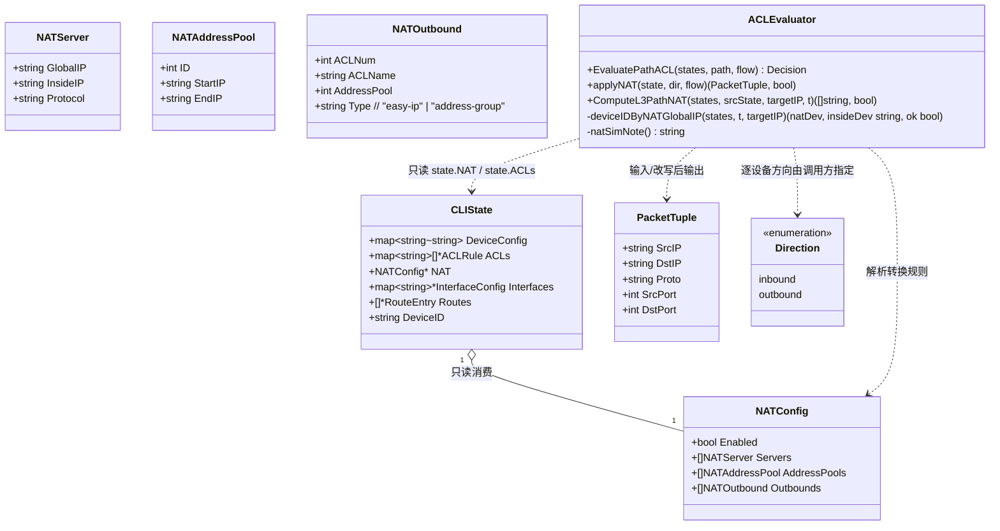
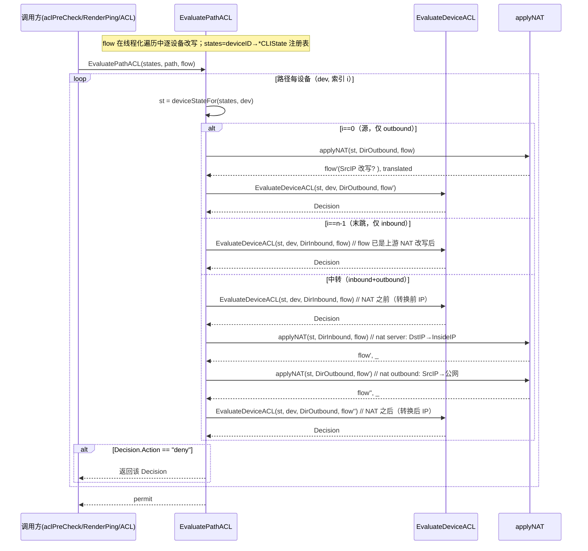
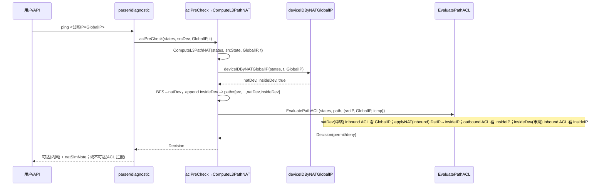
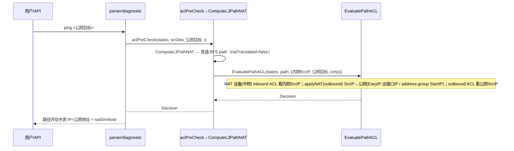

# ensp-lab P2 第一项：NAT 真实过滤（增量设计 + 任务分解）

> 文档类型：实现前技术设计（架构师 高见远 / Gao）
> 关联输入：`docs/p2-nat-prd.md`（许清楚）、`docs/p1c-firewall-design.md` §5(P2)/§7(约定)/§9(拍板)、`docs/reference/huawei-vrp-course.md` 课 38
> 基线：P1-C「CLIState 层纯函数 ACL 评估器、不碰 sim 引擎、诚实占位」——本期**完全沿用**，NAT 仅作为同一评估器内的纯函数地址转换增量
> 语言：中文。仅含类型/函数签名与伪代码，不含实现代码。

---

## 1. 实现方案 + 框架选型

### 1.1 总体定位

在 `cli` 包内**就地扩展** P1-C 的 ACL 评估器，把 `acl_eval.go:469` 的 `evaluateNATACL` 空桩落地为**真实地址转换**纯函数 `applyNAT`，并在 `EvaluatePathACL` 的 `// TODO(P2)` 调用点（acl_eval.go:183-184）接线。NAT 与 ACL 的协同严格遵循「CLIState 层纯函数、只读 state、无副作用、不写引擎」基线。

- **不修改 `sim` 引擎**（engine 零改动，NAT 在基础层语义做，引擎不感知 NAT——与 P1-C 一致）。
- **不重做 NAT 数据结构 / 命令行解析 / `display nat*` 输出**（state.go NAT 模型与 parser.go 的 `nat address-group`/`nat outbound`/`nat server` 已就绪，本期只读消费）。
- **lite / full 通用**：纯 Go 逻辑，仅依赖 `cli.CLIState` + 拓扑图 + 现有 `sim.EngineModeName()`。

### 1.2 为什么仍是纯函数

`applyNAT(state *CLIState, dir Direction, flow PacketTuple) (PacketTuple, bool)`：

- 无副作用：只读 `state.NAT`（Servers/AddressPools/Outbounds）与 `state.ACLs`（判断 outbound ACL 命中域），不写 state、不碰引擎，可单测、可回归、多次调用结果一致。
- **返回改写后的 `PacketTuple` 而非 `Decision`**：NAT 的本质是「改写报文地址并向下游传递」，不是「拦截」。下游 ACL 评估需要拿**转换后的 IP** 继续判定，因此必须返回新 tuple；拦截（deny）仍由 `EvaluateDeviceACL` 负责（见 §3 / §4）。这正是 PRD「返回改写后的 PacketTuple + 是否发生转换」的要求。

### 1.3 框架 / 库选型

- **不引入任何新依赖**：仅用 Go 标准库（`net`、`strings`、`strconv`）+ 仓库内既有 `internal/cli`、`internal/sim`、`internal/topology`。
- 复用：P1-C 的 `EvaluateDeviceACL` / `deviceStateFor` / `matchACLRule` / `matchIP` / `wildcardToMask` / `aclSimNote` / `ResolveSourceIP` / `longestPrefixEgressIP`；`deviceIDByIP`（acl_eval.go:270）。

### 1.4 NAT 与 ACL 的方向/顺序模型（落地 PRD 待确认 #1、#2）

> 采用 PRD 建议的业界通用简化模型，已在 VRP 语义下校验合理（详见 §8 拍板 #1、#2）。

对路径上**任一 NAT 设备**（按 `state.NAT != nil && state.NAT.Enabled` 识别），在该设备的 inbound / outbound 处理之间插入地址转换：

| 设备位置 | 处理顺序（flow 在该设备内被就地改写并向下游传递） |
|---|---|
| 源 `i==0`（仅 outbound） | 先 `applyNAT(DirOutbound)`（源即 NAT 设备时改写 SrcIP）→ 再评估 outbound ACL（**NAT 之后**，见转换后 SrcIP） |
| 中转 `0<i<n-1`（inbound+outbound） | ① 评估 inbound ACL（**NAT 之前**，见转换前 IP）<br>② `applyNAT(DirInbound)`：命中 nat server 则改写 DstIP→InsideIP<br>③ `applyNAT(DirOutbound)`：命中 nat outbound 则改写 SrcIP→公网<br>④ 评估 outbound ACL（**NAT 之后**，见转换后 IP） |
| 末跳 `i==n-1`（仅 inbound） | 评估 inbound ACL，使用**上游 NAT 设备已改写**的 flow（DstIP 已是 InsideIP / SrcIP 已是公网） |

核心：**入向 ACL 在 NAT 之前（看原始目的 IP）；出向 ACL 在 NAT 之后（看转换后源 IP）**。flow 作为可变值在线程化遍历中逐设备改写，天然覆盖「NAT 设备作为中转」时 inbound+outbound 双方向都要走一遍。

---

## 2. 文件列表及相对路径（逐一确认）

| 文件 | 操作 | 责任（一行） |
|---|---|---|
| `internal/cli/acl_eval.go` | **修改（必改，核心）** | ① 新增 `applyNAT`（替代 `evaluateNATACL` 空桩，返回 `(PacketTuple,bool)`）；② 改造 `EvaluatePathACL` 在 `// TODO(P2)` 点按 §1.4 线程化 flow 并调用 `applyNAT`；③ 新增 `ComputeL3PathNAT`（**不改**现有 `ComputeL3Path` 签名，避免破坏 diagnostic_handlers.go:227 与 3 个测试文件）+ `deviceIDByNATGlobalIP` + `insideDeviceByIP`；④ 新增 `natSimNote`（诚实占位）；⑤ `aclPreCheck` / `RenderPingWithACL` 改调 `ComputeL3PathNAT`。 |
| `internal/cli/traceroute.go` | **修改（显示）** | ① `RenderTracerouteWithACL` 增加 `t *topology.Topology` 形参并新增 NAT 分支：当 target 命中某 NAT GlobalIP 时，用 `ComputeL3PathNAT` 推导路径、在 NAT 跳渲染 `NAT→InsideIP` 与 `natSimNote`、对 NAT 路径做 ACL 评估；② `RenderPingWithACL` 对存在 NAT 转换的路径追加 `natSimNote` 注记（不改动其既有 `t` 形参与 ComputeL3Path 调用点语义，仅改调 `ComputeL3PathNAT`）。 |
| `internal/cli/parser.go` | **不改逻辑；仅 1 处传参** | `tracert` 调用点（parser.go:1159 / 1161）向 `RenderTracerouteWithACL` 多传已存在的 `t` 实参（单行改动，无 NAT 逻辑/命令新增）。`nat` 命令、ACL 判断、ping 预判（aclPreCheck）均不动。 |
| `internal/api/cli_handlers.go` | **大概率不改；仅 1 处传参** | `renderEngineTraceroute`（cli_handlers.go:347）向 `RenderTracerouteWithACL` 多传已存在的 `t` 实参（单行改动）。`renderEnginePing`（:325）签名与调用不变（NAT 在 `RenderPingWithACL` 内部处理）。 |
| `internal/cli/acl_eval_test.go` | **新增/扩展** | 覆盖 `applyNAT`（Easy IP / address-group 首 IP / nat server DstIP / 无匹配不改写 / 纯函数无副作用）+ `ComputeL3PathNAT`（外网 ping 公网 IP 解析到内网设备并追加 inside 设备）+ `EvaluatePathACL` 在 NAT 设备处 flow 改写后 ACL 仍正确（AC5）。 |

> 说明：`state.go` 的 `NATConfig`/`NATServer`/`NATAddressPool`/`NATOutbound`（`state.go:186-212`）与 `parser.go` 的 NAT 命令（`parser.go:976/1009/1047`）、`display nat*`（:3036-3080）**本期只读消费，零改动**。`internal/api/diagnostic_handlers.go:227` 的 `ComputeL3Path` 调用**保持原样**（诊断端点不在 PRD 范围内，PRD §4 明确前端/诊断响应体不扩展）。

---

## 3. 数据结构和接口（类图 + 签名）

### 3.1 类图（Mermaid）



### 3.2 核心类型与函数签名（落在 `acl_eval.go` / `traceroute.go`）

```go
// —— 复用既有类型（state.go / acl_eval.go），不重定义 ——
// PacketTuple / Direction / Decision / DefaultACLTerminalAction 沿用 P1-C。
// NATConfig / NATServer / NATAddressPool / NATOutbound 取自 state.go:186-212（只读）。

// applyNAT 在「一台 NAT 设备上、某一方向」对 flow 做地址转换（纯函数，无副作用）。
//   dir == DirInbound：检查 nat server，若 flow.DstIP 等于某 NATServer.GlobalIP
//     （精确匹配；协议/端口本期忽略）→ 改写 flow.DstIP = server.InsideIP。
//   dir == DirOutbound：检查 nat outbound，若 flow.SrcIP 命中该 outbound ACL 的
//     permit 域（或 ACL 缺失=permit any）→ 改写 flow.SrcIP：
//       - "easy-ip"  → longestPrefixEgressIP(state, flow.DstIP)（朝目标出接口 IP；
//                       空则回退首个接口 IP）；
//       - "address-group" → 对应 AddressPool.StartIP（首 IP，多 IP 取首，诚实占位）。
// 返回改写后的 flow 与 translated 标记；未命中任何转换规则则原样返回、translated=false。
// 注意：返回 PacketTuple 而非 Decision——NAT 是改写而非拦截，下游 ACL 需拿转换后 IP 续判。
func applyNAT(state *CLIState, dir Direction, flow PacketTuple) (PacketTuple, bool)

// EvaluatePathACL（改造，接 TODO(P2) 点）沿「源→目的」有序设备路径逐跳评估，
// 在每一 NAT 设备处按 §1.4 顺序线程化改写 flow 后继续评估。任一 deny 即停。
// 改造要点（对比 P1-C 原循环）：
//   - flow 在循环内为可变变量，跨设备传递改写结果；
//   - 中转设备：inbound ACL(转换前) → applyNAT(inbound) → applyNAT(outbound)
//     → outbound ACL(转换后)；
//   - 源设备：applyNAT(outbound) → outbound ACL(转换后)；
//   - 末跳：inbound ACL(已是上游 NAT 改写后的 flow)。
func EvaluatePathACL(states map[string]*CLIState, path []string, flow PacketTuple) Decision

// ComputeL3PathNAT 是「NAT 感知」的路径解析（新增，不改动既有 ComputeL3Path 签名）。
//   1) 先 deviceIDByIP(t, targetIP)：命中普通拓扑接口 IP → 直接委托 ComputeL3Path，
//      返回 (path, false)（natTranslated=false，向后兼容）。
//   2) 否则 deviceIDByNATGlobalIP(states, t, targetIP)：扫描各设备 CLIState.NAT.Servers，
//      找到 GlobalIP == targetIP 的 NAT 设备 natDev 及其 InsideIP；
//      - BFS 算到 natDev（复用 ComputeL3Path 的 BFS，仅 dstDev=natDev）；
//      - insideDev = deviceIDByIP(t, server.InsideIP)（内网真实服务器，其接口 IP 是真实拓扑 IP）；
//      - 路径 append insideDev 作为最后一跳：[src,...,natDev, insideDev]；
//      - 返回 (path, true)（natTranslated=true）。
//   不破坏 BFS 语义：BFS 仍是最短路径，insideDev 仅作为 NAT 设备之后的「真实终点」追加，
//   不参与 BFS 队列（NAT 设备已是 BFS 终点；inside 设备与 NAT 设备拓扑相连，是 NAT 映射的真实终点）。
func ComputeL3PathNAT(states map[string]*CLIState, srcState *CLIState, targetIP string, t *topology.Topology) ([]string, bool)

// deviceIDByNATGlobalIP 扫描 states 注册表，返回拥有 targetIP 作为 GlobalIP 的
// NAT 设备 ID 与对应内网设备 ID（InsideIP → deviceIDByIP）。
func deviceIDByNATGlobalIP(states map[string]*CLIState, t *topology.Topology, targetIP string) (natDev, insideDev string, ok bool)

// natSimNote 返回 NAT 诚实占位注记（落点见 §7 约定 #8 / §8 拍板 #4）：
//   lite → "（NAT 为模拟转换（lite 引擎），非内核级真实 NAT）"
//   full → "（NAT 为模拟转换）"
func natSimNote() string

// —— traceroute.go 改动签名 ——
// RenderTracerouteWithACL 增加 t 形参；新增 NAT 分支：
//   若 targetIP 命中某 NAT GlobalIP（经 ComputeL3PathNAT 的 natTranslated=true），
//   用 ComputeL3PathNAT 推导路径，逐跳渲染并在 NAT 设备那一跳显示
//   "NAT→<InsideIP>" + natSimNote；对该路径调 EvaluatePathACL 评估 ACL。
func RenderTracerouteWithACL(states map[string]*CLIState, state *CLIState, res *sim.TracerouteResult, target string, maxTTL int, t *topology.Topology) string
```

> `aclPreCheck`（acl_eval.go:197）与 `RenderPingWithACL`（traceroute.go:162）内部将 `ComputeL3Path(...)` 改为 `ComputeL3PathNAT(states, ...)`（二者本就持有 `states` 与 `t`，签名不变 → 其调用方 parser.go:87 / cli_handlers.go:325 无需改动）。

---

## 4. 程序调用流程（时序图）

### 4.1 EvaluatePathACL 在 NAT 设备处线程化 flow（核心接线契约）



### 4.2 入向 nat server：外网 ping 公网 IP → 解析内网 + 跨 NAT ACL（AC1）



### 4.3 出向 nat outbound：内网 ping 公网 → 源 IP 改写（AC2/AC3）



### 4.4 ComputeL3PathNAT 的 NAT 感知解析（PRD 关键集成点方案）

- **不改动** `ComputeL3Path(state, targetIP, t)` 签名（保护 diagnostic_handlers.go:227 与 3 个测试文件），新增 `ComputeL3PathNAT`。
- `deviceIDByNATGlobalIP` 扫描 `states` 注册表（`map[deviceID]*CLIState`），对每台设备读 `state.NAT.Servers`，精确比对 `GlobalIP == targetIP`，命中即返回 `natDev` 与该 server 的 `InsideIP`→`deviceIDByIP(t, InsideIP)` 得到的 `insideDev`。
- **BFS 语义保持**：BFP 仍从 `src` 跑到 `natDev`（最短路径），`natDev` 是 BFS 终点；`insideDev` 仅以「真实终点」身份 append 在 `natDev` 之后，**不进入 BFS 队列**，因此不破坏最短路径性质，只是把 NAT 映射的真实内网终点补到路径末尾。
- 若该 NAT 设备无法从 src 经 BFS 到达（不连通），则 `ComputeL3Path` 返回 nil → `ComputeL3PathNAT` 返回 (nil, true)，调用方退化为基础可达性判定（AC1 退化场景，诚实标注）。

---

## 5. 任务列表（有序、含依赖、按实现顺序）

> 共 4 个任务（≤5）。核心逻辑集中在 `acl_eval.go`（T01），显示层在 `traceroute.go`（T03），单测 T02，集成核对 T04。

### T01 ｜ NAT 转换核心 + EvaluatePathACL 接线 + NAT 感知路径（acl_eval.go）
- **涉及文件**：`internal/cli/acl_eval.go`（修改）；只读复用 `state.go` NAT 模型、`acl_eval.go` 既有 ACL 纯函数。
- **依赖**：无（地基任务）。
- **内容**：
  1. 新增 `applyNAT(state, dir, flow) (PacketTuple, bool)`（替代 `evaluateNATACL` 空桩：删除旧 Decision 返回签名，改为返回 tuple+flag）。
  2. 改造 `EvaluatePathACL`：按 §1.4 / §4.1 在线程化遍历中改写 `flow` 并在 `// TODO(P2)` 点调用 `applyNAT`。
  3. 新增 `ComputeL3PathNAT` + `deviceIDByNATGlobalIP` + `insideDeviceByIP`（helper 内联）。
  4. 新增 `natSimNote()`（lite/full 两态文案）。
  5. `aclPreCheck` 改调 `ComputeL3PathNAT(states, srcState, targetIP, t)`。
- **行数估计**：约 +160 / -25 行（替换空桩 + 新增函数 + 循环改造）。
- **优先级**：P0。

### T02 ｜ NAT 转换与 NAT 路径单测（acl_eval_test.go）
- **涉及文件**：`internal/cli/acl_eval_test.go`（新增/扩展）；复用 T01 的 `applyNAT` / `ComputeL3PathNAT` / `EvaluatePathACL`。
- **依赖**：T01。
- **内容（对齐 AC5）**：
  - `applyNAT`：Easy IP 改写（SrcIP→出接口 IP）、address-group 首 IP 改写、nat server DstIP 改写、无匹配不改写；
  - 纯函数无副作用：连续两次调用结果一致、`state.NAT` 不被修改（可比对指针/字段）；
  - `ComputeL3PathNAT`：外网 IP 命中 GlobalIP → 返回 `[...,natDev, insideDev]` 且 `natTranslated=true`；普通 IP → 委托 `ComputeL3Path` 且 `natTranslated=false`；
  - `EvaluatePathACL` 跨 NAT：NAT 设备 inbound ACL 看 GlobalIP、outbound ACL 看 InsideIP；NAT 改写后下游 ACL 基于转换后 IP 判定 deny/permit 正确。
- **行数估计**：约 +120 行。
- **优先级**：P0。

### T03 ｜ tracert/ping NAT 显示 + 诚实占位落点（traceroute.go + 2 处传参）
- **涉及文件**：`internal/cli/traceroute.go`（修改 `RenderTracerouteWithACL` 加 `t` 形参 + NAT 分支、`RenderPingWithACL` 追加 `natSimNote`）；`internal/cli/parser.go:1159/1161`（多传 `t`）；`internal/api/cli_handlers.go:347`（多传 `t`）。
- **依赖**：T01（依赖 `ComputeL3PathNAT` / `natSimNote` / `applyNAT` 语义）。
- **内容**：
  1. `RenderTracerouteWithACL` 增加 `t` 形参；新增 NAT 分支：`natTranslated` 为真时以 `ComputeL3PathNAT` 推导路径，逐跳渲染并在 NAT 设备跳显示 `NAT→<InsideIP>` + `natSimNote()`，对该路径调 `EvaluatePathACL`；非 NAT 目标保持 `res.Hops` 现有行为不变。
  2. `RenderPingWithACL` 将 `ComputeL3Path` 改调 `ComputeL3PathNAT`，并在路径存在 NAT 转换时于输出追加 `natSimNote()`（源/目的地址已转换注记，对齐 AC2/AC6）。
  3. parser.go / cli_handlers.go 仅单行补 `t` 实参（无 NAT 逻辑）。
- **行数估计**：traceroute.go 约 +70 / -5；parser.go +2；cli_handlers.go +1。
- **优先级**：P1（显示层，依赖核心）。

### T04 ｜ 集成验证与 PRD 验收 AC1–AC6 联通性核对
- **涉及文件**：`internal/cli/acl_eval_qa_test.go`（或新建 `p2_nat_qa_test.go`）；必要时手测 CLI 场景。
- **依赖**：T02、T03。
- **内容**：端到端核对 AC1（外网 ping/tracert 公网 IP 可达内网并显示 InsideIP）、AC2（出向 Easy IP 源 IP=公网）、AC3（address-group 首 IP）、AC4（NAT 设备 ACL 按拍板顺序 permit/deny）、AC6（lite 下带「模拟转换，非内核级真实 NAT」注记）；确认无新 `protocol` 依赖、评估器仍为纯函数、未触碰 `sim` 引擎。
- **行数估计**：约 +90 行 QA 测试 + 手测清单。
- **优先级**：P1。

---

## 6. 依赖包列表

- **无新增第三方依赖**。仅用 Go 标准库（`net`、`strings`、`strconv`）+ 仓库内既有 `internal/cli`、`internal/sim`、`internal/topology`。
- **明确不新增** `cli → protocol` 依赖（延续 P1-C §7 约定 #6）：NAT 转换只消费 `state.NAT` 与 `state.ACLs`，与 `protocol.Firewall` / `protocol.MatchACL` 无关，绝不新建对其调用。

---

## 7. 共享知识（跨文件约定）

1. **NAT / ACL 顺序规则（拍板 #1）**：入向 ACL 在 NAT 之前（看转换前 IP）；出向 ACL 在 NAT 之后（看转换后 IP）。由 `EvaluatePathACL` 在每 NAT 设备处先 eval inbound → `applyNAT(inbound)` → `applyNAT(outbound)` → eval outbound 实现；flow 逐设备线程化改写。
2. **方向触发条件（拍板 #2）**：`nat server` 在 `DirInbound` 触发，判定 `flow.DstIP == 某 NATServer.GlobalIP`（精确匹配；协议/端口本期忽略）→ 改写 `DstIP→InsideIP`；`nat outbound` 在 `DirOutbound` 触发，判定 `flow.SrcIP` 命中该 outbound ACL 的 permit 域（ACL 缺失=permit any）→ 改写 `SrcIP`（easy-ip=出接口 IP，address-group=Pool.StartIP 首 IP）。
3. **NAT 设备识别**：`state.NAT != nil && state.NAT.Enabled`，且仅 L3 设备（router/L3Switch/firewall，与 `nat` 能力白名单 `capabilities.go:63` 一致）参与；无 NAT 配置的设备 `applyNAT` 原样返回。
4. **地址池多 IP（拍板 #3）**：address-group 一律取 `AddressPool.StartIP`（首 IP），不模拟轮询；诚实占位由 `natSimNote` 体现（本期仅为「取首 IP」语义标注，非端口级会话）。
5. **诚实占位落点（拍板 #4）**：NAT 改写发生的 CLI 输出统一追加 `natSimNote()`——① tracert 的 NAT 设备跳：`deviceLabel` 后补 ` (NAT→<InsideIP>)` + `natSimNote()`；② ping 路径存在 NAT 转换时于统计/不可达摘要后追加 `natSimNote()`。文案：lite「（NAT 为模拟转换（lite 引擎），非内核级真实 NAT）」/ full「（NAT 为模拟转换）」。
6. **返回语义契约**：`applyNAT` 返回 `(PacketTuple, bool)` 而非 `Decision`；拦截（deny）仍由 `EvaluateDeviceACL` 负责，NAT 只改写地址并向下游传递。
7. **NAT 设备作为中转的双方向处理**：中转 NAT 设备同时经历 inbound+outbound 评估，inbound（转换前）与 outbound（转换后）之间由 `applyNAT` 改写；nat server 改写作用于 inbound 步、nat outbound 改写作用于 outbound 步，二者可独立发生（本期不处理 hairpin 同时改写）。
8. **NAT 感知目标解析约定**：`ComputeL3PathNAT` 优先 `deviceIDByIP`（普通 IP）；仅当失败才走 `deviceIDByNATGlobalIP`（公网 GlobalIP）；`insideDev` 经 `deviceIDByIP(t, InsideIP)` 解析并追加到 `natDev` 之后。普通目标路径零行为变化（`natTranslated=false`）。
9. **不破坏既有接口**：`ComputeL3Path` 原签名不动；`RenderPingWithACL` / `aclPreCheck` 调用方签名不变（内部改调 `ComputeL3PathNAT`）；仅 `RenderTracerouteWithACL` 新增 `t` 形参（2 处生产调用 + 1 处测试单行补参）。

---

## 8. 待明确事项 + 拍板结论

### 8.1 拍板结论（显式回答 PRD §6 的 4 个待确认问题）

**待确认 #1（NAT 与 traffic-filter ACL 先后顺序）— 结论：采纳 PRD 建议模型。**
入向 ACL 在 NAT 之前（看原始目的 IP），出向 ACL 在 NAT 之后（看转换后源 IP）。在 `EvaluatePathACL` 中对 NAT 设备落地为「inbound ACL(转换前) → `applyNAT(inbound)` → `applyNAT(outbound)` → outbound ACL(转换后)」。`nat server` 改写发生在 inbound 步、`nat outbound` 改写发生在 outbound 步，符合 VRP 实际（server 在入接口先翻译、outbound 在出接口后翻译），且实现足够简洁。

**待确认 #2（nat server / nat outbound 方向触发条件）— 结论：采纳 PRD 建议。**
- `nat outbound`：设备 `DirOutbound` 且 `flow.SrcIP` 命中该 outbound ACL 的 permit 域（或 ACL 缺失=permit any）时改写 `SrcIP→公网`；Easy IP 取 `longestPrefixEgressIP(state, flow.DstIP)`（朝目标出接口 IP，空则回退首个接口 IP），address-group 取 `AddressPool.StartIP`。
- `nat server`：设备 `DirInbound` 且 `flow.DstIP == 某 NATServer.GlobalIP`（精确匹配，协议/端口本期忽略）时改写 `DstIP→InsideIP`。
- 命中判定依据：`outbound.ACLNum/ACLName` 对应的 `state.ACLs[acl]` 中是否存在 permit 规则匹配 `flow.SrcIP`（用 `matchIP` 比对 `rule.SrcIP/rule.SrcWildcard`，忽略 DstIP）；ACL 不存在视为 permit any（命中）。

**待确认 #3（地址池多 IP 策略）— 结论：本期取首 IP（StartIP）。**
address-group 一律取 `StartIP`，不模拟轮询；以 `natSimNote()` 诚实标注「模拟转换」。若后续需轮询/端口级 PAT，再下期扩展。

**待确认 #4（诚实占位口径）— 结论：沿用口径，新增 NAT 专属注记。**
文案与 `aclSimNote()` 风格一致但区分 NAT 语义：lite「（NAT 为模拟转换（lite 引擎），非内核级真实 NAT）」/ full「（NAT 为模拟转换）」。落点：① tracert 的 NAT 跳 `deviceLabel` 后补 ` (NAT→<InsideIP>)` + 注记；② ping 路径存在 NAT 转换时在输出追加注记（详见 §7 约定 #5）。

### 8.2 新发现的开放项（设计过程中识别，供团队知悉）

- **O1（tracert NAT 需 `t` 形参）**：为交付 AC1（tracert 经过 NAT 设备并显示 InsideIP），`RenderTracerouteWithACL` 必须能推导 NAT 路径，需 `t`。已确认最小代价为 2 处生产调用（parser.go:1159/1161、cli_handlers.go:347）+ 1 处测试单行补 `t` 实参；无 NAT 逻辑新增。若团队坚持「parser.go / cli_handlers.go 零改动」，则退化为：NAT 目标 tracert 仅显示「NAT 设备跳 + InsideIP 注记」而不做完整 BFS 中间跳（路径残缺），AC1 的「经过 NAT 设备并显示 InsideIP」部分满足。
- **O2（NAT 设备出接口 IP 推导）**：Easy IP 取 `longestPrefixEgressIP(state, flow.DstIP)`，依赖 `state.Routes` 完整性；若 NAT 设备路由表缺失，回退首个接口 IP（诚实近似，非精准出接口）。属已知简化，不影响 deny 判定（通常覆盖整段）。
- **O3（inside 设备拓扑连通性假设）**：`ComputeL3PathNAT` 假设 `InsideIP` 所属设备与 NAT 设备拓扑相连（标准 nat server 部署）。若不连通，insideDev 被追加但路径在 NAT 设备处「断裂」——属错误配置，诚实呈现即可，不强行补链。
- **O4（diagnostic_handlers NAT 不感知）**：`diagnostic_handlers.go:227` 的 `ComputeL3Path` 本期保持原样（PRD §4 界定前端/诊断响应体不扩展），故 `diagnosticPing` 对公网 GlobalIP 仍走基础可达性、不解析到内网。如需 diagnostic 也支持 NAT，列为下期。
- **O5（hairpin / 双向同时 NAT）**：本期同一报文不同时对 SrcIP 与 DstIP 做 NAT（如内网互访经同一 NAT 设备的 server+outbound 组合），超出范围，留待下期。

---

## 附：关键 file:line 证据索引（供实现直接定位）

- `internal/cli/acl_eval.go:167-192` `EvaluatePathACL`（含 :183-184 `// TODO(P2)` 接线点）；`:197-207` `aclPreCheck`（改调 `ComputeL3PathNAT`）；`:209-267` `ComputeL3Path`（**不改签名**，新增 `ComputeL3PathNAT` 复用其 BFS）；`:270-285` `deviceIDByIP`（NAT 感知解析复用）；`:465-472` `evaluateNATACL` 空桩（**被 `applyNAT` 替代**）；`:458-463` `aclSimNote`（新增 `natSimNote` 同风格）。
- `internal/cli/state.go:186-212` `NATConfig`/`NATServer`/`NATAddressPool`/`NATOutbound`（只读消费，零改动）。
- `internal/cli/parser.go:976/1009/1047` NAT 命令（零改动）；`:1159/1161` `RenderTracerouteWithACL` 调用点（仅补 `t`）；`:87` `aclPreCheck` 调用（签名不变）。
- `internal/cli/traceroute.go:131` `RenderTracerouteWithACL`（加 `t` + NAT 分支）；`:162-175` `RenderPingWithACL`（改调 `ComputeL3PathNAT` + `natSimNote`）。
- `internal/api/cli_handlers.go:325` `renderEnginePing`（不变）；`:347` `renderEngineTraceroute`（补 `t`）。
- `internal/api/diagnostic_handlers.go:227` `ComputeL3Path`（保持原样，见 O4）。
- `internal/topology/model.go:131-145` `Device.Interfaces[].IPAddress`（insideDev 解析依赖）；`:169-189` `Link`（BFS 不变）。
- `internal/cli/capabilities.go:63` NAT 能力白名单（router/L3Switch/firewall）。

## 文档状态

- 4 个拍板问题（PRD §6）已全部闭合（§8.1）。
- 关键集成点（NAT 感知目标解析）方案已给出（§4.4 / §3.2 `ComputeL3PathNAT`）。
- 文件改动清单确认：必改 `acl_eval.go`；显示改 `traceroute.go`；`parser.go`/`cli_handlers.go` 仅单行补 `t`；`diagnostic_handlers.go`/`state.go`/`parser.go` NAT 命令与 `display nat*` 零改动。
- 任务共 4 个（T01 核心 / T02 单测 / T03 显示 / T04 集成核对），均不触碰 `sim` 引擎、不引入新依赖、保持纯函数。
