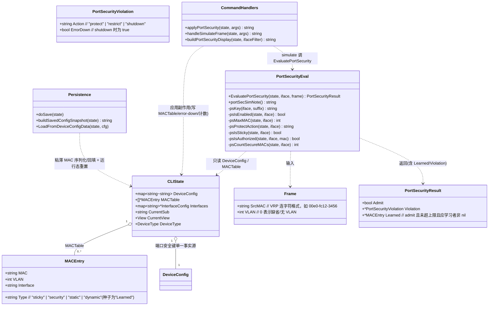
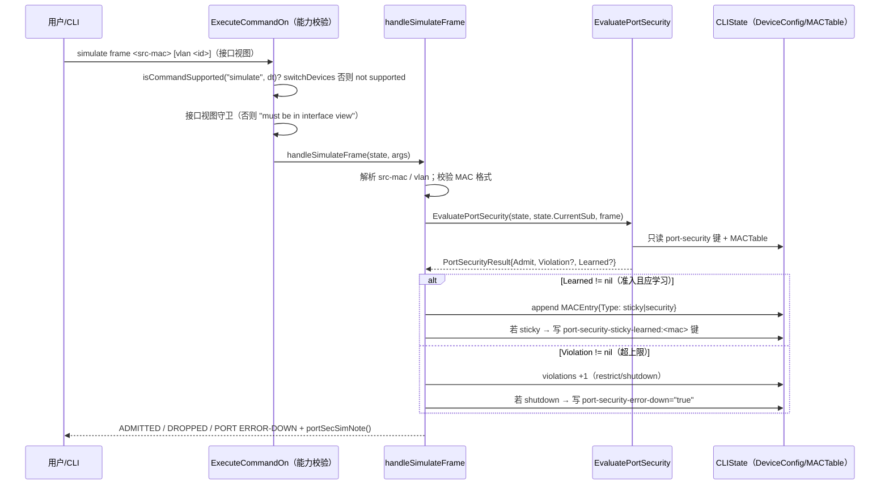
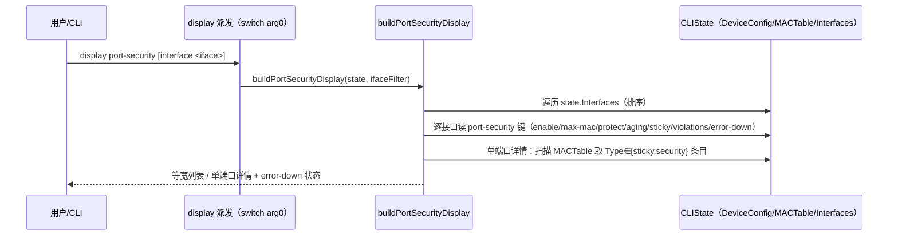
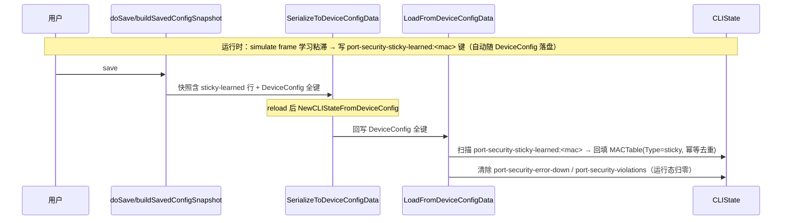

# ensp-lab P2 第二项：端口安全（Port Security）真实准入（增量设计 + 任务分解）

> 文档类型：实现前技术设计（架构师 高见远 / Gao）
> 关联输入：`docs/p2-portsec-prd.md`（许清楚）、`docs/p2-nat-design.md`（NAT 增量设计，结构对齐基准）、`docs/p1f-cli-design.md`（端口安全顶层分支）、`internal/cli/parser.go` / `state.go` / `capabilities.go`（已核查代码基线）
> 基线：P1-C / P1-F / NAT「CLIState 层纯函数、只读 state、无副作用、不写 sim 引擎、诚实占位」——本期**完全沿用**，端口安全仅作为 `cli` 包内增量
> 语言：中文。仅含类型/函数签名与伪代码，不含实现代码（实现是工程师下一阶段）。

---

## 0. 拍板结论（已取代 PRD §6 待确认，设计据此落地）

主理人已对 PRD §6 的 6 项待确认逐一拍板，设计严格照此执行：

1. **力度（#1）**：P0 = **方案 A + 方案 B-lite 一起交付**。一次性交付完整端口安全：命令集解析 + 配置持久化 + `display port-security` + `display mac-address` Type 标注 + 新增诊断命令 `simulate frame` + 纯函数 `EvaluatePortSecurity` + MACTable 运行态填充 + error-down 状态 + 诚实占位注记。
2. **触发点（#2）**：**不介入** L3 ping/tracert 路径；`simulate frame` 是端口安全准入判定的**唯一触发点**。
3. **粘滞 MAC 持久化（#3）**：手动绑定（`port-security mac-address sticky <mac> vlan <id>`）P0 即随 `DeviceConfig` 持久化；运行时自动学习的粘滞 MAC（由 `simulate frame` 触发、写入 MACTable Type=`sticky`）**随 B-lite 持久化**（写 saved_config 快照 + reload 后回填 MACTable）。
4. **合法范围（#4）**：`max-mac-num` 合法范围 **1–4096**（0/超界/非数字均非法）；`aging-time` 合法范围 **1–1440 分钟**（0/超界/非数字均非法）。
5. **默认动作（#5）**：`protect-action` 默认 **restrict**；`display port-security` 未显式配置时如实显示 `restrict`（或标注 `restrict (default)`）。
6. **能力归属（#6）**：`simulate frame` 命令限定 `switchDevices()`（Switch/L3Switch/VTEP），与 `port-security` 能力矩阵一致；非交换机执行回显 `not supported`。

---

## 1. 实现方案 + 框架选型

### 1.1 总体定位

在 `cli` 包内**就地扩展** P1-F 已有的 `port-security` 命令解析，并把端口安全从「仅写 `DeviceConfig` 启用标记」升级为**可配置、可持久化、可忠实展示、可真实触发违规动作**的 L2 接入控制特性。严格遵循既有架构基线：

- **不修改 `sim` 引擎**（engine 零改动，端口安全在 CLIState 层语义做，引擎不感知）。
- **L2 帧学习仅由 `simulate frame` 模拟注入**，不建设真实 L2 转发引擎（PRD §7 不在范围）。
- **纯函数 `EvaluatePortSecurity`** 与 NAT 的 `applyNAT` 同一契约：只读 `DeviceConfig` 中 port-security 键 + `state.MACTable`，无副作用、不写引擎、不 `import sim`、可单测。
- **副作用（写 MACTable / 置 error-down / 计数）一律由 `simulate frame` 命令处理器执行**，依据纯函数返回结果落地——与 `EvaluatePathACL` 消费 `applyNAT` 返回值的模式一致。

> **设计要点（澄清 PRD/拍板表述中的一处张力）**：主理人拍板文案中 `EvaluatePortSecurity` 提到「合法新 MAC 未达上限→准入且（sticky 开）写入 MACTable」，但其显式签名为「无副作用、只读、可单测」。二者冲突处，本设计**以纯函数为上限**：`EvaluatePortSecurity` 不写 `MACTable`，而是返回一个 `Learned *MACEntry` 字段；「写入 MACTable」由 `simulate frame` 处理器在收到 `Learned != nil` 时执行。这既满足 AC5「纯函数无副作用（连续两次调用结果一致、不改写无关 state）」，又保持与 `applyNAT` 的架构同构。**此点为架构层决策，若主理人坚持纯函数内部直接改 MACTable，请于评审时指出，工程师将相应调整（但会牺牲纯函数可重入性）。**

### 1.2 配置单一事实源 = `DeviceConfig`

端口安全全部状态以 `interface:<iface>:port-security[-...]` 键存于 `state.DeviceConfig`（沿用 P1-F 既有约定，仅新增键名）。`DeviceConfig` 经既有 `SerializeToDeviceConfigData` / `LoadFromDeviceConfigData` 自动往返持久化，P0 配置（含 protect-action / aging-time / 手动 sticky-mac）**零新增持久化代码**。运行态（error-down / violations / 自动学习粘滞 MAC）同样落 `DeviceConfig` 键，由 T05 增加「粘滞 MAC 回填」与「运行态重置」分支。

### 1.3 框架 / 库选型

- **不引入任何新依赖**：仅用 Go 标准库（`fmt`、`strings`、`strconv`）+ 仓库内既有 `internal/cli`、`internal/sim`（仅读 `EngineModeName()` 决定 lite/full 注记）、`internal/topology`。
- 复用：P1-F 的 `applyPortSecurity`（就地扩展）、`ExecuteCommandOn` 能力校验（parser.go:245）、`capabilities.go` 的 `switchDevices()`、`state.MACTable` / `MACEntry`、`doSave` / `buildSavedConfigSnapshot` / `LoadFromDeviceConfigData` 持久化链路。

### 1.4 设备能力矩阵（沿用）

| 命令 | 能力集合 | 守卫位置 |
|---|---|---|
| `port-security <...>` | `switchDevices()`（Switch/L3Switch/VTEP） | `capabilities.go:79`（既有）+ `ExecuteCommandOn` 通用校验（parser.go:245） |
| `display port-security [interface ...]` | 不强制能力门禁（仅读取 `DeviceConfig`，非交换机设备无对应键，自然显示 `disable`/默认） | 仅 `display` 派发内的 `isSwitch/isL3Switch` 设备语义检查（可选，见 §7 #4） |
| `simulate frame <...>` | `switchDevices()`（**新增**，拍板 #6） | `capabilities.go` 新增 `"simulate": switchDevices()`；非交换机 → `not supported` |

---

## 2. 文件列表及相对路径（逐一确认）

| 文件 | 操作 | 责任（一行） |
|---|---|---|
| `internal/cli/portsec_eval.go` | **新增（核心纯函数）** | ① `Frame` / `PortSecurityViolation` / `PortSecurityResult` 类型；② `EvaluatePortSecurity(state, iface, frame) PortSecurityResult`（纯函数，无副作用）；③ `portSecSimNote()`（诚实占位，lite/full 两态）；④ port-security 键名常量与 `psKey(iface, suffix)` helper；⑤ 内部 helper：`psIsEnabled` / `psMaxMAC` / `psProtectAction` / `psIsSticky` / `psIsAuthorized` / `psCountSecureMACs`（均只读 `DeviceConfig`/`MACTable`）。 |
| `internal/cli/parser.go` | **修改（4 处，分属 T01/T03/T04）** | ① **T01**：扩展 `applyPortSecurity`（parser.go:4085）新增 `protect-action` / `aging-time` / `mac-address sticky <mac> vlan <id>` 分支 + 拒错守卫；② **T03**：顶层新增 `case "simulate"`（接口视图守卫 + 解析 `frame <src-mac> [vlan <id>]` + 调 `EvaluatePortSecurity` + 应用副作用 + `portSecSimNote`）；③ **T04**：`display` 派发（parser.go:2644 `switch arg0`）新增 `case "port-security"`（建 `buildPortSecurityDisplay`）；④ **T04**：`display mac-address`（parser.go:3143）Type 列保持原样（已逐字渲染），仅在注释/测试层确认 `sticky`/`security`/`static`/`dynamic` 标签正确。 |
| `internal/cli/capabilities.go` | **修改（T03，1 行）** | 能力矩阵新增 `"simulate": switchDevices()`（拍板 #6，非交换机 `not supported`）。 |
| `internal/cli/parser.go`（持久化段） | **修改（T05，3 处）** | ① `doSave`/`buildSavedConfigSnapshot`（parser.go:4543/4550）：对 `port-security-sticky-learned:<mac>` 键补 VRP 风格快照行；② `LoadFromDeviceConfigData`（parser.go:4415）：扫描 `port-security-sticky-learned:<mac>` 键回填 `MACTable`（Type=`sticky`，幂等去重）；③ 同一分支**清除运行态键** `port-security-error-down` / `port-security-violations`（reload 后运行态归零，见 §7 #3）。 |
| `internal/cli/portsec_eval_test.go` | **新增（T06，单测）** | 覆盖 `EvaluatePortSecurity` 行为矩阵（AC5）：未启用→admit、授权/粘滞→admit、超 max-mac 按 protect-action 触发、纯函数无副作用（连续两次一致、不改写 MACTable/DeviceConfig）、合法新 MAC 返回 `Learned` 字段。 |
| `internal/cli/p2_portsec_test.go` | **新增（T06，单元/集成）** | 覆盖 AC1（命令接受 + 拒错：范围校验/能力拒绝/接口视图守卫）、AC2（配置持久化往返）、AC3（`display port-security` 列头与单端口详情、`display mac-address` Type 标签渲染）。扩展既有 `p1f_test.go:45-71` / `p1f_qa_test.go:57-133` 追加 protect-action/aging-time/sticky-mac 用例。 |
| `internal/cli/p2_portsec_qa_test.go` | **新增（T07，QA 验收）** | 端到端核对 AC4（`simulate frame` 三种 protect-action 效果 + 粘滞学习）、AC6（lite 诚实占位注记）、AC2（粘滞 MAC 持久化 reload 回填）。 |

> 说明：`state.go` 的 `MACTable []*MACEntry` / `MACEntry`（state.go:82,125-130）**只读消费，零改动**；`state.go:602` 构造器的种子 `MACTable` 条目（Type `Learned`/`Static`）保留不变（PRD §7 不重做 `display mac-address` 遍历）。`sim` 引擎零改动。

---

## 3. 数据结构和接口（类图 + 签名）

### 3.1 类图（Mermaid）



### 3.2 核心类型与函数签名（落在 `portsec_eval.go` / `parser.go`）

```go
// —— 复用既有类型（state.go），不重定义 ——
// MACEntry{MAC,VLAN,Interface,Type}（state.go:125-130）只读消费。

// Frame 是 simulate frame 注入的 L2 帧（仅关心源 MAC 与 VLAN，目的/载荷本期无关）。
type Frame struct {
    SrcMAC string // VRP 连字符格式，如 "00e0-fc12-3456"
    VLAN   int    // 0 = 缺省 / 无 VLAN
}

// PortSecurityViolation 描述一次违规动作。
type PortSecurityViolation struct {
    Action    string // "protect" | "restrict" | "shutdown"
    ErrorDown bool   // shutdown 时为 true（端口 error-down 置位）
}

// PortSecurityResult 是 EvaluatePortSecurity 的纯函数返回。
//   - Admit=false 且 Violation!=nil：触发违规（按 Action 处置，命令处理器落地）。
//   - Admit=true 且 Learned!=nil：应学习该 MAC；命令处理器将其 append 到 MACTable
//     （Type 由 sticky 标志决定 sticky/security），并（若 sticky）写持久化键。
//   - Admit=true 且 Learned==nil：授权 MAC 准入，不学习不计数。
type PortSecurityResult struct {
    Admit     bool
    Violation *PortSecurityViolation
    Learned   *MACEntry
}

// EvaluatePortSecurity 端口安全准入判定纯函数（无副作用、不写引擎、可单测）。
//   1) 端口未 enable            → {Admit:true}（不介入 L2）。
//   2) 端口已 error-down        → {Admit:false}（shutdown 后后续帧一律丢弃，不再计数）。
//   3) 来源 MAC 属授权（手动绑定 / MACTable 中 Type∈{sticky,security}）
//                              → {Admit:true}（不学习不计数）。
//   4) 已占用安全 MAC 数(手动绑定+MACTable sticky/security) >= max-mac 且非授权
//                              → 触发 protect-action：protect=丢不记录；restrict=丢+violation；
//                                 shutdown=丢+error-down 置位+violation。
//   5) 未达上限                → {Admit:true, Learned:&MACEntry{...,Type: sticky?}}。
// 只读 state.DeviceConfig 中 port-security 键与 state.MACTable；不修改任何 state 字段。
func EvaluatePortSecurity(state *CLIState, iface string, frame Frame) PortSecurityResult

// portSecSimNote 返回端口安全诚实占位注记（落点见 §7 #5）：
//   lite → "（模拟帧注入（lite 引擎），非内核级真实 MAC 学习）"
//   full → "（模拟帧注入）"
func portSecSimNote() string

// —— 键名约定（portsec_eval.go 内常量，详见 §7 #1）——
//   interface:<iface>:port-security              = "enable"|"disable"   (既有)
//   interface:<iface>:port-security-max-mac      = "<1-4096>"           (既有)
//   interface:<iface>:port-security-sticky       = "enable"             (既有, 自动粘滞标志)
//   interface:<iface>:port-security-protect-action = "protect"|"restrict"|"shutdown"  (NEW)
//   interface:<iface>:port-security-aging-time   = "<1-1440>"           (NEW)
//   interface:<iface>:port-security-sticky-mac:<mac> = "<vlan>"          (NEW, 手动绑定, 多条)
//   interface:<iface>:port-security-error-down   = "true"               (NEW, 运行态)
//   interface:<iface>:port-security-violations   = "<n>"                (NEW, 运行态计数)
//   interface:<iface>:port-security-sticky-learned:<mac> = "<vlan>"      (NEW, 自动学习粘滞, 持久化)
```

```go
// —— parser.go 改动签名（仅签名，不写实现）——
// applyPortSecurity（扩展，T01）：在既有 enable/disable/max-mac-num/mac-address sticky
// 基础上新增三分支；所有写操作延续 fmt.Sprintf("interface:%s:port-security[-...]", state.CurrentSub)。
// 返回成功回显或 "Error: ..."。范围校验：max-mac 1-4096、aging-time 1-1440、protect-action 三选一、
// sticky-mac 格式须合法（VRP 连字符 MAC + 正整数 vlan）。
func applyPortSecurity(state *CLIState, args []string) string

// handleSimulateFrame（新增，T03）：解析 "frame <src-mac> [vlan <id>]"（state.CurrentSub 为目标端口）。
// 调 EvaluatePortSecurity → 按结果：
//   - Learned!=nil：append 到 state.MACTable；若 Type=="sticky" 另写 port-security-sticky-learned:<mac> 键。
//   - Violation!=nil：restrict/shutdown → violations 计数 +1；shutdown → 写 port-security-error-down="true"。
//   - 回显 ADMITTED / DROPPED(protect-action=...) / PORT ERROR-DOWN + portSecSimNote()。
func handleSimulateFrame(state *CLIState, args []string) string

// buildPortSecurityDisplay（新增，T04）：遍历 state.Interfaces（按名排序）。
//   ifaceFilter==""：表格式列出所有接口（Interface/Status/Max MAC/Protect-Action/Sticky/Aging/Violations）。
//   ifaceFilter!=""：单端口详情，附「已学安全/粘滞 MAC 列表」（取自 MACTable Type∈{sticky,security}）
//                    与 error-down 状态。
func buildPortSecurityDisplay(state *CLIState, ifaceFilter string) string
```

---

## 4. 程序调用流程（时序图）

### 4.1 `simulate frame` → `EvaluatePortSecurity` → 副作用落地（核心接线契约，AC4/AC6）



### 4.2 `display port-security` 渲染（AC3）



### 4.3 粘滞 MAC 持久化往返（拍板 #3，AC2）



---

## 5. 任务列表（有序、含依赖、按实现顺序）

> 共 7 个任务（对齐主理人建议 T01-T07；超出通用 ≤5 上限，因团队主理人明确枚举并要求保留「单测/QA」独立任务，且与 NAT 设计 T01-T04 + 测试拆分思路一致）。
> 核心逻辑集中在 `portsec_eval.go`（T02）与 `parser.go`（T01/T03/T04），持久化在 `parser.go` 持久化段（T05），单测 T06、QA 验收 T07。

### T01 ｜ `applyPortSecurity` 扩展（protect-action / aging-time / 手动 sticky-mac + 拒错守卫）
- **涉及文件**：`internal/cli/parser.go`（`applyPortSecurity` 函数，parser.go:4085）；只读复用 `capabilities.go:79` 既有 `switchDevices()` 守卫。
- **依赖**：无（地基任务）。
- **内容**：
  1. 新增 `protect-action {protect|restrict|shutdown}`：写 `interface:<iface>:port-security-protect-action`；校验仅三选一，非法 `Error:`。
  2. 新增 `aging-time <time>`：写 `interface:<iface>:port-security-aging-time`；范围 1–1440（拍板 #4），0/超界/非数字 `Error:`。
  3. 扩展 `mac-address sticky`：既有自动粘滞标志（无参）保留；新增**手动绑定**形态 `mac-address sticky <mac> vlan <id>`，写 `interface:<iface>:port-security-sticky-mac:<mac>`=`<vlan>`（多条并列）；MAC 格式 / vlan 合法性校验。
  4. 复用既有接口视图守卫（parser.go:2348）与 `capabilities.go` 能力校验；不新增守卫代码。
- **行数估计**：约 +60 / -2 行（`applyPortSecurity` switch 扩展 + 校验 helper）。
- **优先级**：P0。

### T02 ｜ `EvaluatePortSecurity` 纯函数（portsec_eval.go）
- **涉及文件**：`internal/cli/portsec_eval.go`（**新增**）；仅依赖 `CLIState` / `MACEntry`（state.go）。
- **依赖**：T01（键名/范围约定由 T01 落地，T02 消费同一套 `DeviceConfig` 键；逻辑上可并行，但为工程师执行顺序设为依赖）。
- **内容（对齐 AC5 / §3.2）**：
  1. `Frame` / `PortSecurityViolation` / `PortSecurityResult` 类型。
  2. `EvaluatePortSecurity(state, iface, frame) PortSecurityResult`：无副作用，只读 `DeviceConfig` + `MACTable`；实现 §3.2 行为矩阵 1)–5)；默认 max-mac=1（启用但未配）、默认 protect-action=`restrict`（拍板 #5）。
  3. `portSecSimNote()`（lite/full 两态）。
  4. 键名常量 + `psKey` helper + 只读 helper（`psIsEnabled`/`psMaxMAC`/`psProtectAction`/`psIsSticky`/`psIsAuthorized`/`psCountSecureMACs`）。
- **行数估计**：约 +150 行。
- **优先级**：P0。

### T03 ｜ `simulate frame` 诊断命令（唯一触发点）
- **涉及文件**：`internal/cli/parser.go`（顶层新增 `case "simulate"` + `handleSimulateFrame`）；`internal/cli/capabilities.go`（新增 `"simulate": switchDevices()`）。
- **依赖**：T02（调用 `EvaluatePortSecurity` + `portSecSimNote`）。
- **内容（对齐 AC4 / AC6 / 拍板 #2/#6）**：
  1. `capabilities.go` 加 `"simulate": switchDevices()`（非交换机 → `not supported`）。
  2. `case "simulate"`：仅 `frame` 子命令；接口视图守卫（否则 `must be in interface view`）；解析 `<src-mac> [vlan <id>]`，MAC 格式校验。
  3. `handleSimulateFrame`：调 `EvaluatePortSecurity(state, state.CurrentSub, frame)`；按结果应用副作用——`Learned`→append `MACTable`（sticky 另写 `port-security-sticky-learned:<mac>` 键）；`Violation`→`restrict`/`shutdown` 计数 +1，`shutdown` 置 `port-security-error-down="true"`。
  4. 回显 `ADMITTED` / `DROPPED (protect-action=...)` / `PORT ERROR-DOWN (protect-action=shutdown)` + `portSecSimNote()`（lite 注记）。
- **行数估计**：capabilities.go +1 行；parser.go 约 +70 行。
- **优先级**：P0。

### T04 ｜ `display port-security` + `display mac-address` Type
- **涉及文件**：`internal/cli/parser.go`（`display` 派发新增 `case "port-security"` + `buildPortSecurityDisplay`；`display mac-address` 仅确认 Type 渲染）。
- **依赖**：T01（读 port-security 键渲染）。
- **内容（对齐 AC3）**：
  1. `display` 派发（parser.go:2644）新增 `case "port-security"`：`display port-security`（全接口表）与 `display port-security interface <iface>`（单端口详情 + 已学 MAC 列表 + error-down 状态）。
  2. 列头对齐 PRD §4：`Interface / Status / Max MAC / Protect-Action / Sticky / Aging(min) / Violations`；未配置列显示 `-`，protect-action 缺省显示 `restrict`（或 `restrict (default)`）。
  3. `display mac-address`（parser.go:3143）Type 列已逐字渲染，无需改逻辑；通过 T06 单测确认 `sticky`/`security`/`static`/`dynamic` 标签正确（§8 O2 提及种子 Type=`Learned` 归一化待定）。
- **行数估计**：约 +90 行。
- **优先级**：P0。

### T05 ｜ 粘滞 MAC 持久化分支（B-lite）
- **涉及文件**：`internal/cli/parser.go`（`doSave`/`buildSavedConfigSnapshot` parser.go:4543/4550；`LoadFromDeviceConfigData` parser.go:4415）。
- **依赖**：T03（自动学习粘滞由 `simulate frame` 写入 `port-security-sticky-learned:<mac>` 键后才需持久化）。
- **内容（对齐 AC2 / 拍板 #3）**：
  1. `buildSavedConfigSnapshot`：对每个 `port-security-sticky-learned:<mac>` 键，在对应 `interface <iface>` 块追加 ` port-security mac-address sticky <mac> vlan <vlan>` 行（提升 `display saved-configuration` 保真度）。
  2. `LoadFromDeviceConfigData`：恢复 `DeviceConfig` 全键后，扫描 `port-security-sticky-learned:<mac>` 键，回填 `MACTable` 条目 `{MAC, VLAN, iface, Type:"sticky"}`（**幂等去重**：按 MAC+Interface 去重，避免 reload 重复追加）。
  3. 同一分支**清除运行态键** `port-security-error-down` / `port-security-violations`（reload 后运行态归零；§7 #3）。
- **行数估计**：约 +40 行。
- **优先级**：P0（B-lite 范围，随本项一并交付）。

### T06 ｜ 单元/集成单测（工程师）
- **涉及文件**：`internal/cli/portsec_eval_test.go`（新增）；`internal/cli/p2_portsec_test.go`（新增）；扩展 `internal/cli/p1f_test.go:45-71` / `internal/cli/p1f_qa_test.go:57-133`。
- **依赖**：T01、T02、T03、T04、T05（测试前述全部实现）。
- **内容（对齐 AC1/AC2/AC3/AC5）**：
  - `portsec_eval_test.go`：`EvaluatePortSecurity` 行为矩阵全覆盖（未启用→admit、授权/粘滞→admit、超 max-mac 三种 protect-action、纯函数无副作用——连续两次调用结果一致且 `MACTable`/`DeviceConfig` 未被改写、合法新 MAC 返回 `Learned`）。
  - `p2_portsec_test.go`：AC1（protect-action/aging-time/sticky-mac 接受 + 范围拒错 + Router `not supported` + 非接口视图 `interface view`）；AC2（`save`→`NewCLIStateFromDeviceConfig`→`display port-security` 复现）；AC3（`display port-security` 列头/单端口详情、`display mac-address` Type 标签渲染——手工插入 `MACEntry` 验证）。
  - 扩展既有 `p1f_test.go` / `p1f_qa_test.go`：追加 protect-action/aging-time/sticky-mac 用例，保持既有守卫/能力测试不退化。
- **行数估计**：约 +220 行。
- **优先级**：P0。

### T07 ｜ QA 端到端验收（AC4/AC6 + 持久化）
- **涉及文件**：`internal/cli/p2_portsec_qa_test.go`（新增）。
- **依赖**：T06（单测通过后做端到端）。
- **内容（对齐 AC4/AC6 + 拍板 #2/#3）**：
  - AC4：`enable`+`max-mac-num 1`+`protect-action protect` → 第 2 个非授权 MAC `simulate frame` 丢弃无告警；`restrict`→丢弃+violations+1（`display port-security` 可见）；`shutdown`→error-down 置位且后续帧被拒；合法/粘滞 MAC 注入→准入且 sticky 开启时进入 `MACTable`（Type=`sticky`）。
  - AC6：lite 引擎下 `simulate frame` 输出带「模拟帧注入（lite 引擎），非内核级真实 MAC 学习」注记。
  - 粘滞持久化：学习粘滞 → `save` → reload → `display mac-address` 仍见该 `sticky` 条目；error-down/violations 归零。
- **行数估计**：约 +130 行 QA 测试。
- **优先级**：P1（验收收口）。

---

## 6. 依赖包列表

- **无新增第三方依赖**。仅用 Go 标准库（`fmt`、`strings`、`strconv`）+ 仓库内既有 `internal/cli`、`internal/sim`（仅读 `EngineModeName()` 决定 lite/full 注记）、`internal/topology`。
- **明确不新增** `sim` 引擎改动：端口安全纯函数与命令处理器在 `cli` 包内完成，引擎零改动；`EvaluatePortSecurity` 不 `import sim`（仅 `portSecSimNote` 借助既有 `sim.EngineModeName()` 判定引擎模式，与 `natSimNote` 同口径）。

---

## 7. 共享知识（跨文件约定）

1. **键名单一事实源（保持 P1-F 约定）**：所有端口安全状态存于 `state.DeviceConfig["interface:<iface>:port-security[-...]"]`。完整键名见 §3.2。新增键一律以 `port-security-` 前缀，避免与既有 `port-security`(enable)/`port-security-max-mac`/`port-security-sticky` 冲突。
2. **纯函数契约（架构基线）**：`EvaluatePortSecurity` **只读** `DeviceConfig` + `MACTable`，**不写**任何 state 字段（包括不 append `MACTable`、不改 `DeviceConfig`、不 `import sim`、不碰引擎）；副作用（写 MACTable / error-down / 计数 / 持久化键）由 `handleSimulateFrame` 依据返回的 `Learned` / `Violation` 落地。与 `applyNAT` 同构（返回新值，调用方应用）。
3. **运行态 vs 配置态（reload 行为）**：`protect-action` / `aging-time` / 手动 `sticky-mac` / 自动学习 `sticky`（经 `port-security-sticky-learned:<mac>` 键）属**配置/持久态**，reload 后保留；`error-down` / `violations` 属**运行态**，reload 后由 `LoadFromDeviceConfigData` **清除归零**（§5 T05-3）。
4. **`display port-security` 能力门禁**：`display` 为非变更只读命令，不对 `port-security` 子命令做 `switchDevices()` 硬性拒绝（非交换机设备无对应键，自然显示 `disable`/默认）。若团队要求与配置命令严格一致（非交换机也回 `not supported`），可在 `display` 派发内对 `arg0=="port-security"` 加 `switchDevices()` 守卫——本设计默认**不加**，以保持 `display` 只读体验一致；如主理人要求加，T04 一行补守卫。
5. **诚实占位落点**：`simulate frame` 输出统一追加 `portSecSimNote()`——lite「（模拟帧注入（lite 引擎），非内核级真实 MAC 学习）」/ full「（模拟帧注入）」。口径复用 `natSimNote()` 风格，明确「lite 引擎、非内核级真实 MAC 学习」。
6. **error-down 表示方式**：以 `DeviceConfig["interface:<iface>:port-security-error-down"]="true"` 表示端口 error-down；`EvaluatePortSecurity` 在 `error-down=="true"` 时直接返回 `{Admit:false}`（shutdown 后后续帧一律丢弃，不再计数）；`display port-security` 单端口详情中展示 `Error-Down: yes`。
7. **max-mac 计数口径**：`psCountSecureMACs` = 手动绑定 `port-security-sticky-mac:<mac>` 条数 + `MACTable` 中本端口 `Type∈{sticky,security}` 条数（即「已占用安全 MAC 数」含手动绑定，贴近 VRP）。详见 §8 O1。
8. **protect-action 默认**：键缺省即 `restrict`（拍板 #5）。`display` 显示 `restrict`；如需标注未显式配置，显示 `restrict (default)`（由 `display` 渲染判断键是否存在决定）。
9. **不破坏既有接口**：`display mac-address` 遍历逻辑零改动（仅 Type 逐字渲染）；`applyPortSecurity` 既有 4 子命令行为不变；`sim` 引擎、`state.go` 结构体零改动；新增 `simulate` 能力条目不影响其他命令。

---

## 8. 待明确事项 + 拍板结论

### 8.1 拍板结论（显式闭合 PRD §6 的 6 项，见 §0）

全部 6 项已由主理人拍板，设计据此落地，无悬而未决的 PRD 级待确认项。重点复述：一次性交付 A+B-lite；`simulate frame` 唯一触发点；粘滞 MAC 手动配置态 + 自动学习态均持久化；max-mac 1–4096 / aging 1–1440；默认 restrict；`simulate frame` 限 `switchDevices()`。

### 8.2 新发现的开放项（设计过程中识别，供团队知悉）

- **O1（max-mac 计数口径是否含手动绑定）— 设计取「含」，建议确认**：`psCountSecureMACs` 当前设计把手动 `sticky-mac` 绑定计入「已占用安全 MAC 数」（贴近 VRP，手动绑定同样占槽位）。若教学上希望「手动绑定不占 max-mac 名额、仅限制动态学习数」，则改为只数 `MACTable` 中 `Type∈{sticky,security}`。属语义细节，建议 PM 在评审时确认；当前默认「含」。
- **O2（种子 MACTable 的 Type 归一化）— 建议保持，待定**：`state.go:602` 构造器种子条目 Type 为 `Learned`/`Static`，而 VRP/PRD §4 期望标签为 `dynamic`/`static`/`sticky`/`security`。`display mac-address` 逐字渲染，故种子会显示 `Learned`。本设计**不改种子**（PRD §7 不重做遍历），仅保证 `simulate frame` 写入 `sticky`/`security`。是否把种子 `Learned`→`dynamic`、`Static`→`static` 归一化属独立小改，建议单独立项或纳入本项 T04 一处小修——若主理人同意，T04 顺带归一化种子 Type。
- **O3（运行态 reload 归零的副作用）— 已决策，列此备忘**：`error-down`/`violations` 在 `LoadFromDeviceConfigData` 清除（§7 #3）。代价是 reload 后「曾发生违规」不可见；收益是符合 VRP 运行态语义、避免快照污染。已写入 T05-3，无需再议。
- **O4（并发访问 MACTable）— 低风险，注明即可**：CLI 为单 goroutine 交互模型，`MACTable` 无并发写竞争；`simulate frame` 与 `display mac-address` 不会并发。若未来引入并发诊断，需对 `MACTable` 加锁。本期不处理（与既有 `ARPTable`/`NATTable` 同待遇）。
- **O5（aging-time 是否真实计时生效）— 仅配置态，待定**：本期 `aging-time` 仅作为配置项持久化与 `display` 展示，**不启动真实计时器**（无 L2 学习引擎，粘滞/安全 MAC 不会因 aging 自动老化）。PRD §7 不在范围。若要求「aging 后自动清 MACTable 条目」，需引入定时器（下期）。当前诚实标注为「配置态」。
- **O6（shutdown error-down 的恢复）— 超出范围，注明**：VRP 中 error-down 端口需 `restart` 或 `undo shutdown` 恢复；本期不提供恢复命令，`display port-security` 仅展示 `Error-Down: yes`。建议下期补 `port-security restart` 或 `undo port-security` 复位逻辑。

---

## 附：关键 file:line 证据索引（供实现直接定位）

- `internal/cli/parser.go:4085-4113` `applyPortSecurity`（**T01 扩展点**，写 `interface:<iface>:port-security[-...]` 键）。
- `internal/cli/parser.go:2346-2354` 顶层 `port-security` 分支（接口视图守卫 + 委托 `applyPortSecurity`）；`:735-738` `port security` 子命令委托。
- `internal/cli/parser.go:2644` `display` 派发 `switch arg0`（`**T04**` 在此新增 `case "port-security"`）；`:3143-3152` `display mac-address`（Type 逐字渲染，零改动）。
- `internal/cli/capabilities.go:79` `port-security: switchDevices()`；`:128-142` `isCommandSupported`；`**T03**` 新增 `"simulate": switchDevices()`。
- `internal/cli/state.go:82` `MACTable []*MACEntry`；`:125-130` `MACEntry{MAC,VLAN,Interface,Type}`；`:602` 构造器种子条目（Type `Learned`/`Static`，见 O2）。
- `internal/cli/parser.go:4384-4411` `SerializeToDeviceConfigData`（遍历 `DeviceConfig` 落盘，`**T05**` 自动覆盖新增键）；`:4415-` `LoadFromDeviceConfigData`（`**T05**` 回填粘滞 MAC + 清运行态）；`:4543/4550` `doSave`/`buildSavedConfigSnapshot`（`**T05**` 补粘滞快照行）。
- `internal/cli/p1f_test.go:45-71` / `p1f_qa_test.go:57-133` 既有 port-security 测试（`**T06**` 扩展 protect-action/aging-time/sticky-mac 用例）。

## 文档状态

- PRD §6 的 6 项待确认已由主理人拍板闭合（§0 / §8.1），设计据此落地。
- 关键架构决策已固化：`EvaluatePortSecurity` 纯函数（副作用外置到 `handleSimulateFrame`）、`DeviceConfig` 键单一事实源、`simulate frame` 唯一触发点、粘滞 MAC 持久化往返。
- 文件改动清单确认：必改 `parser.go`（T01/T03/T04/T05 共 4 处）、`capabilities.go`（T03 一行）；新增 `portsec_eval.go`（T02）+ 3 个测试文件（T06/T07）；`state.go` / `sim` 引擎零改动。
- 任务共 7 个（T01 命令扩展 / T02 纯函数 / T03 simulate frame / T04 display / T05 持久化 / T06 单测 / T07 QA），均不触碰 `sim` 引擎、不引入新依赖、保持纯函数。
- 仍待团队澄清的开放项：O1（计数口径）、O2（种子 Type 归一化，建议顺带）、O5（aging 计时）、O6（error-down 恢复）——均非阻塞，可按建议默认继续。

_Last updated: 2026-08-09 · 架构师 高见远（Gao）_
