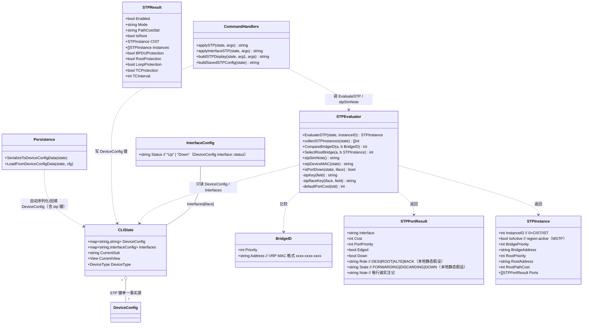
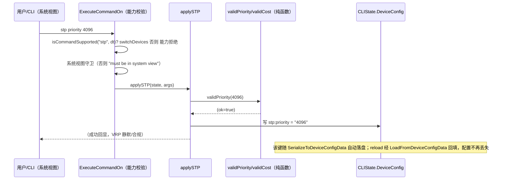
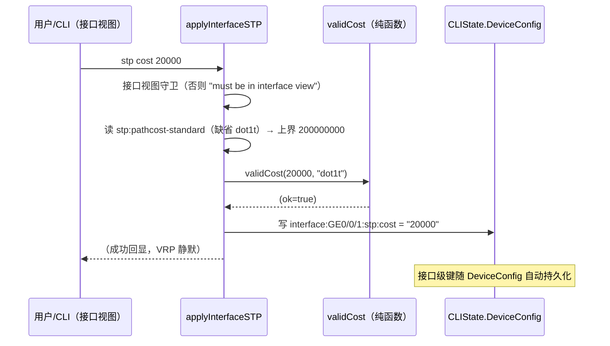
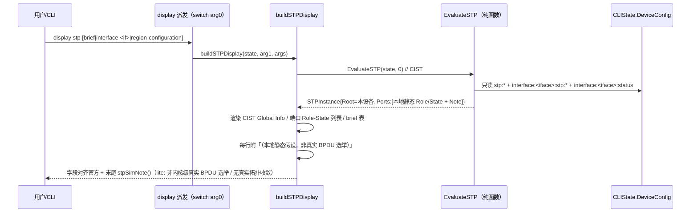
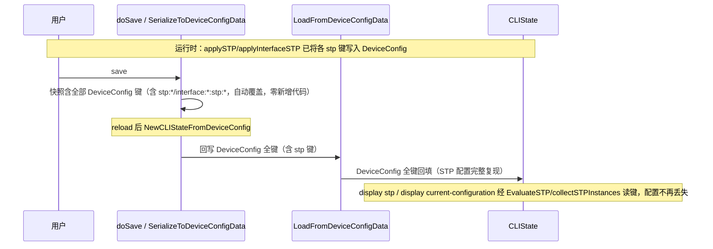
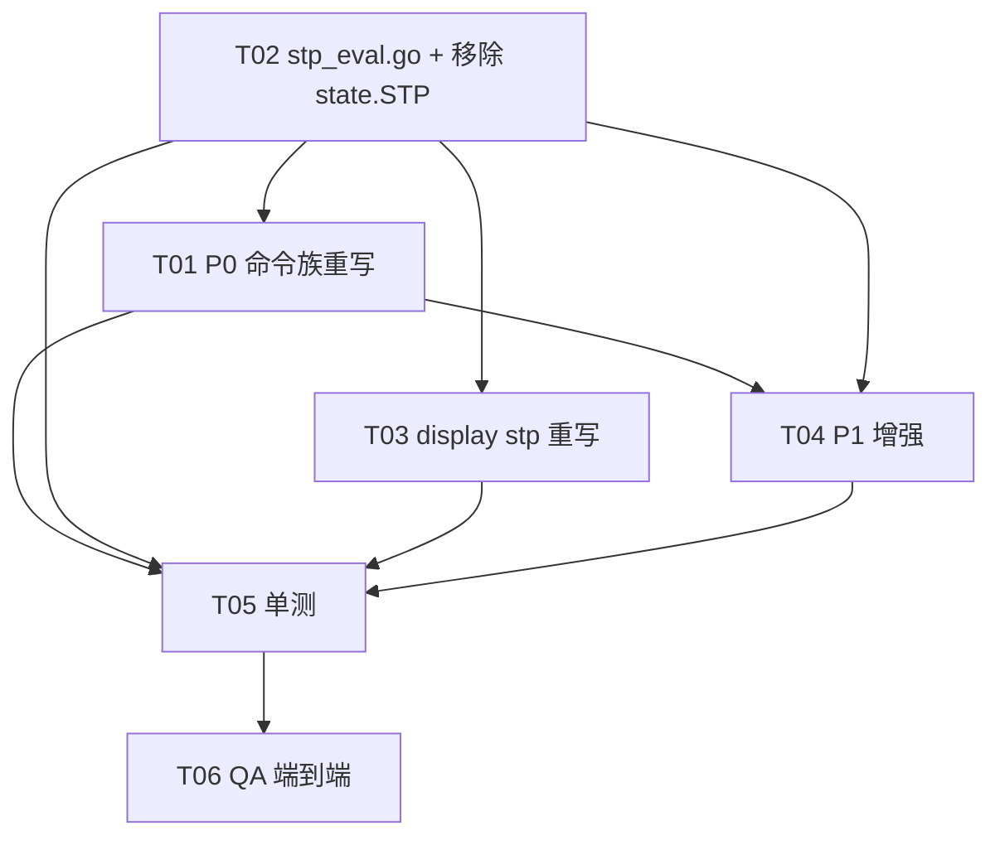

# ensp-lab P2 第四项：STP/RSTP/MSTP（华为 VRP 课程 55/56/57）增量设计 + 任务分解

> 文档类型：实现前技术设计（架构师 高见远 / Gao）
> 关联输入：`docs/p2-stp-prd.md`（许清楚）、`docs/p2-vrrp-design.md`（VRRP 增量设计，结构对齐基准）、`docs/p2-portsec-design.md`、`internal/cli/parser.go` / `state.go` / `capabilities.go` / `acl_eval.go` / `portsec_eval.go` / `vrrp_eval.go`（已 grep 核验代码基线）
> 基线：P1-C / P1-F / NAT / 端口安全 / VRRP「CLIState 层纯函数、单一事实源 `DeviceConfig`、诚实占位、零改动 `sim` 引擎」——本期**完全沿用**，STP 仅作为 `cli` 包内增量
> 语言：中文。仅含类型/函数签名与伪代码，不含实现代码（实现是工程师下一阶段）。

---

## 0. 拍板结论（已取代 PRD §6 待确认，设计据此落地）

主理人已对 PRD §6 的 7 项待确认逐一拍板，设计严格照此执行：

1. **edged-port 强制迁接口视图**：官方 `stp edged-port enable|disable` 是**接口视图**命令。现有系统视图用法不合规，本期改为接口视图 `interface <if>` 下 `stp edged-port enable|disable`；系统视图旧 `stp edged-port` 返回 Error 提示「请在接口视图配置」。原全局 `stp:edged-port` 裸键废弃。
2. **角色/状态呈现 = 本地静态计算 + 诚实注记**（对齐 VRRP 拍板 #2）：根桥 = 本地 BridgePriority 最小者（同优先级比 BridgeAddress/MAC **小者**，标准 STP 桥 ID 比较规则）；端口角色按本地配置静态判（指定端口/根端口假设）。**绝不臆造 Backup/Alternate/Forwarding 真实状态**，每行 Role/State 后附「（本地静态假设，非真实 BPDU 选举）」。否决仅显示 Initialize。
3. **跨设备真实选举 = out-of-scope（P2）**：本期仅本地静态假设 + `stpSimNote()` 注记「非真实 BPDU 选举 / 无真实拓扑收敛」。
4. **`stp [instance] priority` 严格校验**：范围 0–61440，须为 4096 倍数（官方默认 32768）。越界或非倍数返回 Error。`stp root primary`(置 0)/`secondary`(置 4096) 合法（二者均为 4096 倍数）。
5. **`cost` / `port priority` 接口视图范围校验**：`stp cost` 范围依当前 `pathcost-standard`（legacy 1–200000 / dot1d-1998 1–65535 / dot1t 1–200000000）；`stp port priority` 范围 0–240、默认 128、步长 16。均须校验。
6. **MSTP 实例级含 P1-8**：`stp instance <id> root primary|secondary` + `stp instance <id> priority` 纳入 P1；实例级选举仍为本地静态（out-of-scope 真实计算）+ 诚实注记；region 未 `active` 前配置不生效（保真语义：active 后才参与计算）。
7. **默认值对齐官方**：mode 默认 **`mstp`**（华为官方默认；现有 `stp enable` 返回 "STP enabled (RSTP)" 的硬编码须改为 VRP 合规回显，如静默成功或 `<sysname>` 风格）、priority 默认 **32768**、pathcost-standard 默认 **`dot1t`**、revision-level 默认 **0**、port-priority 默认 **128**、edged-port 默认 **disable**。

### 0.1 持久化方案裁定：方案 A（全 DeviceConfig 单一事实源，移除 `state.STP`）

主理人「拍板倾向方案 A（彻底，防结构体漂移）」。经核查，**方案 A 风险显著低于方案 B，且代码量更少**，故采用方案 A：

- `cli` 包内 `state.STP` / `STPConfig` / `STPPort` 的引用**仅 4 处文件**（`state.go:57/245/269/501`、`parser.go` 约 20 处读/写、`p1f_qa_test.go:230` 一处测试）。`internal/protocol/protocol.go` 的 `STPState`/`STPPort` 为**独立真实引擎类型**，与 `cli` 包无关、本期零改动、不 import。
- `SerializeToDeviceConfigData`（`parser.go:4726-4754`）遍历**全部** `state.DeviceConfig` 键落盘；`LoadFromDeviceConfigData`（`parser.go:4757+`）全部回填。**凡存于 DeviceConfig 的配置自动往返**——故方案 A 对 STP 键**零新增序列化代码**，直接修掉 P0-1 丢配置缺陷（AC2）；而方案 B 反而需新增序列化/重建块、且保留双写源（结构体漂移根因不除）。
- **决策**：移除 `state.STP` 字段与 `STPConfig`/`STPPort` 类型；STP 全部状态以 `stp:<field>`（系统级）+ `interface:<iface>:stp:<field>`（接口级）存于 `state.DeviceConfig`，显示经 `stp_eval.go` 纯函数即时派生。与 VRRP 移除 `state.VRRP` 完全同构。

---

## 1. 实现方案 + 框架选型

### 1.1 总体定位

在 `cli` 包内**就地重写** P0 残桩 `stp` 分支（`parser.go:1483-1607`）与 `display stp` 桩（`parser.go:3541-3594`），把 STP 从「仅写 `state.STP` 结构化字段、不持久化、无状态机、无诚实占位」升级为一条可对学员实验产生可观测反馈的 L2 环路避免链路。严格遵循既有架构基线：

- **不修改 `sim` 引擎**（engine 零改动，STP 在 CLIState 层语义做，引擎不感知；`internal/protocol` 的 `STPState`/`StartSTP` 是另一套**独立真实引擎 STP**，本期**完全不触碰**）。
- **纯函数 `EvaluateSTP`** 与 `EvaluateVRRP` / `EvaluatePortSecurity` / `applyNAT` 同一契约：只读 `DeviceConfig`，无副作用、不写引擎、不 `import protocol`、可单测。
- **副作用一律由命令处理器执行**：`applySTP` / `applyInterfaceSTP` 解析后写入 `DeviceConfig` 键，`buildSTPDisplay` 读键渲染并调用纯函数拿角色——与 `EvaluatePortSecurity` / `applyVRRP` 模式一致。

### 1.2 配置单一事实源 = `DeviceConfig`（核心修复 + 架构决策）

- 移除 `state.STP *STPConfig`（`state.go:57`）、`STPConfig` 类型（`state.go:245-256`）、`STPPort` 类型（`state.go:269-273`）、构造器初始化（`state.go:501-507`）。
- STP 全部状态以 `stp:<field>`（系统级）与 `interface:<iface>:stp:<field>`（接口级）键存于 `state.DeviceConfig`。
- `DeviceConfig` 经既有 `SerializeToDeviceConfigData` / `LoadFromDeviceConfigData` 自动往返持久化，**零新增持久化代码**，reload 后 STP 配置完整复现（AC2）。
- 显示期需要的「实例视图」由 `stp_eval.go` 的 `collectSTPInstances` / `EvaluateSTP` 纯函数从 `DeviceConfig` 即时派生（内存派生、不缓存、不重复），彻底消除「双写不一致」风险。
- `undo stp` 清理全部 `stp:*` 与 `interface:*:stp:*` 键并写 `stp:enabled=false`（见 §7 #4），与 `undo bgp` 清理 `bgp:` 键（`parser.go:4662-4665`）同构。

### 1.3 框架 / 库选型

- **不引入任何新依赖**：仅用 Go 标准库（`fmt`、`strings`、`strconv`、`regexp`）+ 仓库内既有 `internal/cli`、`internal/sim`（仅读 `EngineModeName()` 决定 lite/full 注记）。
- 复用：既有 `ExecuteCommandOn` 能力校验（`capabilities.go:70` `"stp": switchDevices()`）、`undo` 分支（`parser.go:4649`）、`display` 派发 `switch arg0`（`parser.go:3541` 处 `case "stp"`）、`SerializeToDeviceConfigData` / `LoadFromDeviceConfigData`、`portsec_eval.go` 的 `psKey` 写法（作 `stpKey` 参照）、`vrrp_eval.go` 的 `EvaluateVRRP` / `*SimNote()` 诚实占位范式。

### 1.4 设备能力矩阵（沿用，零改动）

| 命令 | 能力集合 | 守卫位置 |
|---|---|---|
| `stp ...`（系统视图） | `switchDevices()`（Switch / L3Switch / VTEP） | `capabilities.go:70` + `ExecuteCommandOn` 通用校验 |
| `stp cost` / `stp port priority` / `stp edged-port`（接口视图） | 同上（并入同一 `case "stp"`，按 `state.CurrentView` 分支） | 同上 + `state.CurrentView != ViewInterface` 拒绝 |
| `undo stp [root]` | 同上 | 同上 |
| `display stp [brief\|interface\|region-configuration]` | 不强制能力门禁（只读 `DeviceConfig`，非交换机无对应键，自然显示 `Not configured`） | 仅 `display` 派发内 `arg0=="stp"` 分支 |
| `display current-configuration` / `diagnostic-information` | 不强制 | 仅读 `DeviceConfig` stp 键 |

> 非系统视图执行系统级 `stp` → `Error: must be in system view`；非 `switchDevices()` 设备（Router/PC/Server 等）→ 能力拒绝（沿用 `ExecuteCommandOn`）。接口视图命令（`cost`/`port priority`/`edged-port`）在系统视图执行 → 拒绝并提示 `must be in interface view`；系统视图 `stp edged-port` 旧用法 → `Error: please configure stp edged-port under interface view`。

### 1.5 根桥 / 端口角色呈现策略（拍板 #2 + 诚实注记）

`EvaluateSTP` 本地静态选举规则（lite 引擎仅有本设备一台桥）：

1. **根桥（Root Bridge）= 本设备自身**：lite 仿真只有本设备一台桥，本地静态假设「本桥即网内最小桥 ID」→ Root Bridge ID = 本设备 Bridge ID（priority + MAC），Root Path Cost = 0，IsRoot = true。末尾诚实注记「（本地假设：本桥桥 ID 最小，非真实 BPDU 选举）」。
2. **端口角色（每条端口静态假设，确定性、带标注）**：
   - 端口 `shutdown`（`interface:<iface>:status == "Down"`）→ Role=`--`、State=`DOWN`（诚实，非臆造）。
   - `edged-port enable` → Role=`DESI`、State=`FORWARDING`，附 `(edged)`（边缘端口即时转发，真实语义成立）。
   - 其余 active 非边缘端口（按接口名升序）：首端口 → `ROOT`/`FORWARDING`（根端口假设）；末端口 → `ALTE`/`DISCARDING`（**本地静态阻塞假设**，附「（本地静态阻塞，非真实拓扑收敛）」）；中间 → `DESI`/`FORWARDING`（指定端口假设）。每行 Role/State 后统一附「（本地静态假设，非真实 BPDU 选举）」。
3. **绝不臆造** Backup/Alternate/Forwarding「真实收敛态」——所有 Role/State 一律标注为本地静态假设，与 `stpSimNote()` 全局注记呼应。

> 注：第 2 点「首=ROOT / 末=ALTE」为**确定性教学化静态假设**（拍板 #2(a) 要求展示 DESI/ROOT/ALTE/BACK 词汇），非真实拓扑推导。若团队后续希望改为「假定根桥 → 全部 DESI/FORWARDING」的纯假设模型，仅改 `EvaluateSTP` 一处分支即可（见 §8 O2）。

---

## 2. 文件列表及相对路径（逐一确认）

| 文件 | 操作 | 责任（一行） |
|---|---|---|
| `internal/cli/stp_eval.go` | **新增（核心纯函数）** | ① `STPResult` / `STPInstance` / `STPPortResult` / `BridgeID` 类型；② `EvaluateSTP(state, instanceID) STPInstance`；③ `collectSTPInstances(state) []int`；④ `CompareBridgeID(a, b BridgeID) int` / `SelectRootBridge(a, b STPInstance) int`；⑤ `stpSimNote()`（诚实占位 lite/full 两态）；⑥ key 常量 + `stpKey(field)` / `stpIfaceKey(iface, field)` helper + 范围/默认常量；⑦ `stpDeviceMAC(state)`（桥 MAC 派生）；⑧ `isPortDown(state, iface)`；⑨ `defaultPortCost(std)` / 校验函数 `validPriority` / `validCost` / `validPortPriority`。 |
| `internal/cli/parser.go` | **修改（6 处，分属 T01/T03/T04）** | ① **T01**：重写顶层 `case "stp"`（:1483-1607）为 `applySTP`（按 `state.CurrentView` 分系统/接口/区域视图写 DeviceConfig 键 + 校验 + VRP 回显）；重写 `undo` 分支 `case "stp"`（:4649-4651）为清理全部 stp 键。② **T03**：重写 `display` 派发 `case "stp"`（:3541-3594）为 `buildSTPDisplay`（brief/interface/region-configuration/默认）；改写 `display current-configuration` 段（`formatProtocolBlocks` :4588-4590）→ `buildSavedSTPConfig`；改写 `display saved-configuration` 段（:2650-2652）；改写 `diagnostic-information` STP 段（:4556-4558）——以上均改读 DeviceConfig。③ **T04**：`applySTP` 扩展 P1 子命令（bpdu/root/loop/tc-protection、bridge-address、MST region 视图子命令、instance root/priority）；`undo` 扩展 `undo stp root` / `undo stp instance <id> root`。 |
| `internal/cli/state.go` | **修改（T02，4 处，移除）** | 删除 `STP *STPConfig` 字段（:57）、`STPConfig` 类型（:245-256）、`STPPort` 类型（:269-273）、构造器 `STP: &STPConfig{...}`（:501-507）。无新增结构体。 |
| `internal/cli/capabilities.go` | **不改** | `"stp": switchDevices()`（:70）保持不动；`switchDevices()`（:191-197）保持不动。 |
| `internal/cli/p1f_qa_test.go` | **修改（T02，1 处）** | :230 `if r.STP.Enabled {` 改为读 `state.DeviceConfig["stp:enabled"]=="false"` 判定（移除 `state.STP` 后编译通过）。 |
| `internal/cli/stp_eval_test.go` | **新增（T05，单测）** | 覆盖 `EvaluateSTP`（本地静态根桥/端口角色/诚实标注）、`CompareBridgeID`（priority 小者胜 / 同优先级 MAC 小者胜 / 确定性 tie-break）、`stpSimNote`（lite/full）、纯函数无副作用（连续两次一致、不改写 state/DeviceConfig）、`collectSTPInstances`、`defaultPortCost`、各校验函数边界。 |
| `internal/cli/p2_stp_test.go` | **新增（T05，单元/集成）** | 覆盖 AC1（命令接受 + 拒错：mode/priority 倍数/cost 越界/port-priority 越界/pathcost-standard 非法/非接口视图/能力拒绝/edged-port 系统视图拒绝）、AC2（save→reload 后 `display stp` / `display current-configuration` 复现——验证丢配置缺陷已修复）、AC3（`display stp` / brief / interface / region-configuration 渲染 + current-configuration 段）。 |
| `internal/cli/p2_stp_qa_test.go` | **新增（T06，QA 验收）** | 端到端核对 AC4（MSTP region 持久化 + active 语义）、AC5（lite 诚实占位注记 + 角色诚实文案）、AC6（纯函数无副作用契约 + `undo stp` 清理 + 能力拒绝），P1 端到端（protections / bridge-address / instance root / undo stp root）。 |

> 说明：`internal/protocol`（真实引擎 STP：`STPState`/`STPPort`/`StartSTP`/`ConfigureSTPPort`）**零改动**；`sim` 引擎零改动；`state.go` 除移除 STP 外其余零改动；`capabilities.go` 零改动。

---

## 3. 数据结构和接口（类图 + 签名）

### 3.1 类图（Mermaid）



### 3.2 DeviceConfig 键名约定（单一事实源）

```
系统级（stp:<field>）：
  stp:enabled              = "true" | "false"            (缺省 true，VRP STP 默认开启)
  stp:mode                 = "stp" | "rstp" | "mstp"     (缺省 mstp，拍板 #7)
  stp:priority             = "<0-61440>"                 (缺省 32768，须 4096 倍数)
  stp:pathcost-standard    = "dot1d-1998" | "dot1t" | "legacy"  (缺省 dot1t)
  stp:bridge-address       = "<mac>"                     (P1-6，VRP MAC 格式)
  stp:region-name          = "<name>"                    (P1-5)
  stp:revision-level       = "<0-65535>"                 (缺省 0)
  stp:region-active        = "true"                      (active region-configuration 后置)
  stp:instance:<id>:vlans  = "2,3,10" | "2-10,20"        (P1-5，实例 VLAN 映射)
  stp:instance:<id>:priority = "<0-61440>"               (P1-8，须 4096 倍数)
  stp:instance:<id>:root   = "primary" | "secondary"     (P1-8；primary→写 priority 0，secondary→写 4096)
  stp:bpdu-protection      = "enable"                    (P1-1)
  stp:root-protection      = "enable"                    (P1-2)
  stp:loop-protection      = "enable"                    (P1-3)
  stp:tc-protection        = "enable"                    (P1-4)
  stp:tc-protection-interval = "<seconds>"               (P1-4，缺省 10)

接口级（interface:<iface>:stp:<field>）：
  interface:<iface>:stp:cost         = "<n>"   (缺省依 pathcost-standard，见 §7 #5)
  interface:<iface>:stp:port-priority = "<0-240>" (缺省 128，步长 16)
  interface:<iface>:stp:edged-port   = "enable" | "disable"  (缺省 disable；原系统视图 stp:edged-port 键废弃)

废弃键：stp:edged-port（系统视图旧裸键，本期拒绝并提示迁接口视图）
```

### 3.3 核心类型与函数签名（落在 `stp_eval.go` / `parser.go`）

```go
// —— 移除既有类型（state.go）——
// 删除 STPConfig{Enabled,Mode,BridgePriority,Ports,VSTPEnabled,BridgeAddress,RegionName,RevisionLevel,VLANMapping,RegionActive}
//   （state.go:245-256）、STPPort{PortName,PortPriority,Cost}（state.go:269-273）、
//   CLIState.STP 字段（state.go:57）、构造器 STP: &STPConfig{...}（state.go:501-507）。
// 派生视图改由下方 STPInstance / STPPortResult 表示（stp_eval.go，内存只读、不缓存）。

// BridgeID 是桥标识（priority + MAC），用于本地静态根桥比较。
type BridgeID struct {
    Priority int    // 0-61440，4096 倍数
    Address  string // VRP MAC 格式 xxxx-xxxx-xxxx
}

// STPPortResult 是单端口的本地静态评估结果（只读视图）。
//   Role/State 一律为「本地静态假设」，非真实 BPDU 收敛（见拍板 #2 + §1.5）。
type STPPortResult struct {
    Interface    string
    Cost         int    // 端口路径开销（interface:<iface>:stp:cost 或缺省）
    PortPriority int    // 端口优先级（interface:<iface>:stp:port-priority，缺省 128）
    Edged        bool   // 边缘端口
    Down         bool   // 端口 shutdown
    Role         string // DESI | ROOT | ALTE | BACK（本地静态假设）
    State        string // FORWARDING | DISCARDING | DOWN（本地静态假设）
    Note         string // 每行诚实注记
}

// STPInstance 是某 MST 实例（含 CIST，instanceID=0）的派生配置 + 本地静态选举结果。
type STPInstance struct {
    InstanceID    int
    IsActive      bool // region-active（MSTP）
    BridgePriority int
    BridgeAddress string
    RootPriority  int // 本地静态：= 本设备（假想根桥）
    RootAddress   string
    RootPathCost  int // 本地静态：= 0
    Ports         []STPPortResult
}

// STPResult 是 EvaluateSTP 的汇总返回（display 渲染用）。
type STPResult struct {
    Enabled      bool
    Mode         string // stp | rstp | mstp
    PathCostStd  string // dot1d-1998 | dot1t | legacy
    IsRoot       bool   // 本地静态：本设备即根桥
    CIST         STPInstance
    Instances    []STPInstance // MSTP 实例（id>0），region 已配置时填充
    BPDUProtection bool
    RootProtection  bool
    LoopProtection  bool
    TCProtection    bool
    TCInterval      int
}

// —— 常量（stp_eval.go 内）——
const (
    stpModeDefault      = "mstp"
    stpPriDefault       = 32768
    stpPriMin, stpPriMax = 0, 61440
    stpPriStep          = 4096
    stpPCStdDefault     = "dot1t"
    stpPortPriDefault   = 128
    stpPortPriMin, stpPortPriMax = 0, 240
    stpPortPriStep      = 16
    stpRevDefault       = 0
    stpTCIntervalDefault = 10
    // cost 上界（依 pathcost-standard）
    stpCostMaxLegacy    = 200000
    stpCostMaxDot1d1998 = 65535
    stpCostMaxDot1t     = 200000000
    stpCostMin          = 1
    // 默认端口开销（依 pathcost-standard，1Gbps 缺省）
    stpDefCostDot1t     = 20000
    stpDefCostDot1d1998 = 200000
    stpDefCostLegacy    = 200000
)

// stpKey 拼接系统级键：stp:<field>。
func stpKey(field string) string

// stpIfaceKey 拼接接口级键：interface:<iface>:stp:<field>。
func stpIfaceKey(iface, field string) string

// EvaluateSTP 本地静态根桥/端口角色选举纯函数（无副作用、不写引擎、不 import protocol、可单测）。
//   instanceID==0 → CIST/IST；>0 → 对应 MST 实例（本地静态）。
//   根桥 = 本设备自身（lite 仅一台桥）→ RootPriority/RootAddress=本设备 BridgeID，RootPathCost=0。
//   端口角色按 §1.5 启发式静态分配（确定性、每行诚实标注）。
//   不修改任何 state 字段、不写 DeviceConfig、不 import sim 引擎实例；
//   仅 stpSimNote 读 sim.EngineModeName() 决定 lite/full 注记。
func EvaluateSTP(state *CLIState, instanceID int) STPInstance

// collectSTPInstances 返回已配置实例 ID 列表（含恒有的 0=CIST + region 中配置的 id>0）。
// 纯函数（只读 DeviceConfig）。
func collectSTPInstances(state *CLIState) []int

// CompareBridgeID 比较两桥 ID 决定胜负（纯函数，无副作用；AC5 / P2 跨设备预留）。
//   规则（拍板 #2，已更正）：Priority 小者胜；同 Priority 比 Address 小者胜（MAC 小者胜，标准 STP 桥 ID 比较）。
//     MAC 比较建议归一化「xxxx-xxxx-xxxx」去短横后按十六进制/字典序比较（小者胜）。
//   返回 >0 表示 a 胜、<0 表示 b 胜、0 表示完全相等（确定性 tie-break）。
func CompareBridgeID(a, b BridgeID) int

// SelectRootBridge 在两组实例间选根桥（纯函数，包装 CompareBridgeID 于 STPInstance）。
// 返回 >0 表示 a 胜、<0 表示 b 胜、0 表示相等。
func SelectRootBridge(a, b STPInstance) int

// stpSimNote 返回 STP「诚实占位」注记（lite/full 两态，口径同 aclSimNote/natSimNote/portSecSimNote/vrrpSimNote）。
//   lite → "（STP 为模拟生成树（lite 引擎），非内核级真实 BPDU 选举 / 无真实拓扑收敛）"
//   full → "（STP 为模拟生成树）"
func stpSimNote() string

// stpDeviceMAC 返回本设备桥 MAC（纯函数，只读 DeviceConfig）：
//   优先 stp:bridge-address；否则 DeviceConfig["bridge-mac"]；否则由 DeviceName 派生的稳定占位 MAC。
func stpDeviceMAC(state *CLIState) string

// isPortDown 读 DeviceConfig["interface:<iface>:status"]=="Down" 判定端口是否 Down（同 VRRP isInterfaceDown）。
func isPortDown(state *CLIState, iface string) bool

// defaultPortCost 返回指定 pathcost-standard 下的缺省端口开销（1Gbps 缺省）。
func defaultPortCost(std string) int

// validPriority / validCost / validPortPriority / validInstanceID：范围与步长校验纯函数，
// 越界/非倍数返回 (ok=false, errMsg)。供 applySTP 拒错使用（拍板 #4/#5）。
func validPriority(v int) (bool, string)
func validCost(v int, std string) (bool, string)
func validPortPriority(v int) (bool, string)
func validInstanceID(v int) (bool, string)
```

```go
// —— parser.go 改动签名（仅签名，不写实现）——
// applySTP（重写，T01/T04）：替换 parser.go:1483 残桩。按 state.CurrentView 分支：
//   ViewSystem → 系统级 stp（enable/disable/mode/priority/root/undo root/pathcost-standard/
//                bpdu-protection/root-protection/loop-protection/tc-protection [interval]/
//                bridge-address/v-stp/region-configuration 进入区域视图）；
//   ViewInterface → applyInterfaceSTP（cost/port priority/edged-port）；
//   ViewMSTRegion → applySTPRegion（region-name/revision-level/instance <id> vlan/active region-configuration）；
//   其它视图 → "Error: must be in system view"。
//   各子命令写对应 DeviceConfig 键 + 调 validPriority/validCost/validPortPriority 校验；
//   非系统视图执行系统命令 / 非接口视图执行接口命令 → 明确 Error；
//   成功回显 VRP 静默风格（不回 "STP enabled (RSTP)" 等硬编码）。
func applySTP(state *CLIState, args []string) string

// applyInterfaceSTP（T01）：接口视图 stp 子命令（cost/port priority/edged-port）。
//   写 interface:<iface>:stp:<field>；范围校验；系统视图执行 → "must be in interface view"。
func applyInterfaceSTP(state *CLIState, args []string) string

// applySTPRegion（T04）：MST region 视图子命令（region-name/revision-level/instance/active）。
func applySTPRegion(state *CLIState, args []string) string

// buildSTPDisplay（重写，T03）：替换 parser.go:3541 的 display stp 桩。
//   arg1==""             → CIST Global Info + 各端口 Role/State 列表（含 EvaluateSTP 本地静态角色 + 诚实注记）
//   arg1=="brief"        → 摘要表 MSTID / Port / Role / State（按实例分组）
//   arg1=="interface"    → 单端口详情（args[2] 为目标接口，读 EvaluateSTP 单端口 + 各字段）
//   arg1=="region-configuration" → Region name / Revision level / Instance VLAN Mapped / Active 状态
//   只读 EvaluateSTP + collectSTPInstances；无副作用；末尾附 stpSimNote()。
func buildSTPDisplay(state *CLIState, arg1 string, args []string) string

// buildSavedSTPConfig（T03，并入 display current-configuration / formatProtocolBlocks）：
//   遍历 DeviceConfig stp 键 + interface:<iface>:stp:* 键，输出 VRP 合规行：
//   "stp mode <mode>" / "stp priority <P>" / "stp root primary|secondary" / "stp pathcost-standard <std>" /
//   "stp edged-port enable"（接口视图）/ "stp region-configuration ... active region-configuration" 等；
//   仅对差异值补行，保证 save→reload→display current-configuration 完整复现（AC2）。
func buildSavedSTPConfig(state *CLIState) string
```

---

## 4. 程序调用流程（时序图）

### 4.1 `stp mode rstp` / `stp priority 4096` / `stp root primary` → DeviceConfig 写入（AC1 + 丢配置修复）



### 4.2 `interface GE0/0/1` → `stp cost 20000` / `stp edged-port enable`（接口视图，AC1）



### 4.3 `display stp` 选举渲染（AC3 / AC5 / 拍板 #2）



### 4.4 STP 配置持久化往返（修掉残桩丢配置缺陷，AC2）



> 注：因 STP 状态**本就只在 DeviceConfig**，无需如 OSPF/BGP/ISIS 那样在 `LoadFromDeviceConfigData` 新增「粘滞回填」分支——这是移除 `state.STP`、单一事实源方案的直接红利（与 VRRP 同构）。

---

## 5. 任务列表（有序、含依赖、按实现顺序）

> 共 6 个任务（对齐 VRRP T01-T06 团队约定；测试独立拆 T05/T06）。核心逻辑在 `stp_eval.go`（T02）与 `parser.go`（T01/T03/T04），`state.go` 移除在 T02，单测 T05、QA T06。

### T01 ｜ P0 命令族重写（applySTP：系统视图 + 接口视图 + undo + 区域视图进入 + 守卫 + VRP 回显）

- **涉及文件**：`internal/cli/parser.go`（重写顶层 `case "stp"`，原 :1483-1607；重写 `undo` 分支 `case "stp"`，原 :4649-4651）。
- **依赖**：T02（消费 `stpKey`/`stpIfaceKey` 键名约定 + `validPriority`/`validCost`/`validPortPriority` 校验函数；逻辑可并行，为执行顺序设依赖）。
- **内容（对齐 AC1 / 拍板 #1/#4/#5/#7）**：
  1. `case "stp":` 改为按 `state.CurrentView` 分支：
     - **ViewSystem**：`enable`/`disable` → 写 `stp:enabled`（`enable` 静默成功，不回 "STP enabled (RSTP)"）；`mode {stp|rstp|mstp}` → 写 `stp:mode`（非法值 Error）；`priority <0-61440 倍数4096>` → 写 `stp:priority`（非倍数/越界 Error）；`root primary`→`stp:priority=0`、`root secondary`→`stp:priority=4096`；`undo stp root`→删 `stp:priority`（回退 32768）；`pathcost-standard {dot1d-1998|dot1t|legacy}`→写 `stp:pathcost-standard`（非法 Error）；`region-configuration`→进入 `ViewMSTRegion` 视图（设 `state.CurrentView`/`state.CurrentSub`）。
     - **ViewInterface**：`applyInterfaceSTP` → `cost <n>`（依 pathcost-standard 范围校验，写 `interface:<if>:stp:cost`）、`port priority <0-240 步长16>`（写 `interface:<if>:stp:port-priority`）、`edged-port enable|disable`（写 `interface:<if>:stp:edged-port`）。
     - **系统视图误用 `edged-port`** → `Error: please configure stp edged-port under interface view`；**接口视图误用系统命令** → `Error: must be in system view`；**非接口视图用 cost/port priority/edged-port** → `Error: must be in interface view`。
  2. `undo stp`：删除全部 `stp:*` 与 `interface:*:stp:*` 键，写 `stp:enabled=false`（保活禁用态，见 §7 #4）。
  3. 保留既有成功回显风格（VRP 静默/合规，无 "STP enabled (RSTP)" 硬编码）。
- **行数估计**：约 +160 / -130 行（applySTP + applyInterfaceSTP + undo 替换残桩 + 校验）。
- **优先级**：P0。

### T02 ｜ `stp_eval.go` 纯函数评估器 + 移除 `state.STP`

- **涉及文件**：`internal/cli/stp_eval.go`（**新增**）；`internal/cli/state.go`（**修改**：删除 `STP` 字段 :57、`STPConfig` 类型 :245-256、`STPPort` 类型 :269-273、构造器初始化 :501-507）；`internal/cli/p1f_qa_test.go`（**修改** :230 `r.STP.Enabled` → 读 `state.DeviceConfig["stp:enabled"]`）。
- **依赖**：无（地基任务）。
- **内容（对齐 AC5 / AC6 / 拍板 #2/#3）**：
  1. `STPResult` / `STPInstance` / `STPPortResult` / `BridgeID` 类型；范围/默认常量；`stpKey` / `stpIfaceKey` helper。
  2. `EvaluateSTP(state, instanceID) STPInstance`：本地静态根桥（=本设备）+ 端口角色启发式（§1.5）+ 每行诚实注记。
  3. `collectSTPInstances(state) []int`、`CompareBridgeID(a, b BridgeID) int`、`SelectRootBridge(a, b STPInstance) int`（纯比较，AC5 / P2 预留）。
  4. `stpSimNote()`（lite/full 两态）、`stpDeviceMAC(state)`（桥 MAC 派生）、`isPortDown`、`defaultPortCost`、`validPriority` / `validCost` / `validPortPriority` / `validInstanceID`（校验纯函数）。
  5. **移除 `state.STP` / `STPConfig` / `STPPort`**：`cli` 包内引用仅 `state.go` + `parser.go` + `p1f_qa_test.go:230`；`internal/protocol` 的 `STPState`/`STPPort` 独立类型不受影响——移除后显示一律经 `EvaluateSTP` / `collectSTPInstances` 派生，无残留引用风险（T01/T03/T04 改为读 DeviceConfig）。
- **行数估计**：stp_eval.go 约 +300 行；state.go 约 -25 行；p1f_qa_test.go -1/+1 行。
- **优先级**：P0。

### T03 ｜ `display stp [brief|interface|region-configuration]` + `display current-configuration` / `diagnostic` 段重写

- **涉及文件**：`internal/cli/parser.go`（`display` 派发 `case "stp"` 原 :3541-3594 重写为 `buildSTPDisplay`；`formatProtocolBlocks` 原 :4588-4590 重写为 `buildSavedSTPConfig`；`display saved-configuration` 段 :2650-2652 改读 DeviceConfig；`diagnostic-information` STP 段 :4556-4558 改读 DeviceConfig）。
- **依赖**：T02（读 `EvaluateSTP` / `collectSTPInstances` / `stpSimNote` / `stpDeviceMAC`）。
- **内容（对齐 AC3 / 拍板 #2/#3）**：
  1. `buildSTPDisplay(state, arg1, args)`：`""` → CIST Global Info + 端口 Role-State 列表（含本地静态角色 + 每行诚实注记）；`brief` → `MSTID / Port / Role / State` 摘要表（按实例分组）；`interface <if>` → 单端口详情（Mode/CIST Bridge/Root/ERPC/RegRoot/IRPC/RootPortId/BPDU-Protection/TC/端口 Role-State + 注记）；`region-configuration` → Region name / Revision / Instance VLAN Mapped / Active 状态。末尾附 `stpSimNote()`。
  2. 列头/对齐对齐 PRD §4 样例；未配置显示 `STP: Not configured` / `MSTP Region: not configured`。
  3. `buildSavedSTPConfig`：遍历 DeviceConfig stp 键输出 VRP 合规行（修掉旧 `stp mode %s` / 非合规格式），含 mode/priority/root/pathcost-standard/edged-port(接口视图)/region 等；仅差异值补行。
- **行数估计**：约 +200 / -50 行。
- **优先级**：P0。

### T04 ｜ P1 增强（protections / bridge-address / MST region 视图子命令 / instance root·priority / undo 扩展）

- **涉及文件**：`internal/cli/parser.go`（`applySTP` 扩展 P1 子命令 + `applySTPRegion` + `ViewMSTRegion` 视图派发 + `undo` 扩展 `undo stp root` / `undo stp instance <id> root`）。
- **依赖**：T01、T02（扩展同套命令解析 + 评估器）。
- **内容（对齐 P1-1~P1-8 / 拍板 #6）**：
  1. `bpdu-protection` / `root-protection` / `loop-protection` → 写 `stp:bpdu-protection` / `stp:root-protection` / `stp:loop-protection`（规整进统一键，补全 `undo`）；`tc-protection [interval <s>]` → 写 `stp:tc-protection` / `stp:tc-protection-interval`（缺省 10）。
  2. `bridge-address <mac>`（P1-6）→ 写 `stp:bridge-address`（VRP MAC 格式校验；`stpDeviceMAC` 优先取此值）。
  3. MST region 视图（拍板 #6）：`region-name <name>`→`stp:region-name`；`revision-level <n>`→`stp:revision-level`（默认 0）；`instance <id> vlan <list>`→`stp:instance:<id>:vlans`（支持 `2 to 10` 与 `10 20 30`）；`active region-configuration`→`stp:region-active=true`（激活前预配置不生效）。
  4. `stp instance <id> root primary|secondary`（P1-8）→ `stp:instance:<id>:root`（primary→写 `stp:instance:<id>:priority=0`，secondary→4096）；`stp instance <id> priority <n>`→`stp:instance:<id>:priority`（4096 倍数校验）；`undo stp instance <id> root`→删该实例 priority 键。
  5. `buildSTPDisplay` 的 region-configuration / interface 详情附 protections / TC 字段；`collectSTPInstances` 纳入 region 实例（id>0）。
- **行数估计**：约 +160 行。
- **优先级**：P1。

### T05 ｜ 单元/集成单测（工程师）

- **涉及文件**：`internal/cli/stp_eval_test.go`（新增）；`internal/cli/p2_stp_test.go`（新增）。
- **依赖**：T01、T02、T03、T04（测试前述全部实现）。
- **内容（对齐 AC1/AC2/AC3/AC5）**：
  - `stp_eval_test.go`：`EvaluateSTP`（本地静态根桥/端口角色/诚实标注）、`CompareBridgeID`（priority 小者胜 / 同优先级 MAC 小者胜 / 确定性 tie-break）、`stpSimNote`（lite/full）、纯函数无副作用（连续两次一致、不改写 state/DeviceConfig）、`collectSTPInstances`、`defaultPortCost`、各校验函数边界。
  - `p2_stp_test.go`：AC1（mode/priority 倍数/cost 越界/port-priority 越界/pathcost-standard 非法/非接口视图/能力拒绝/edged-port 系统视图拒绝）；AC2（**save→reload 后 `display stp` / `display current-configuration` 复现**——验证丢配置缺陷已修复）；AC3（`display stp` / brief / interface / region-configuration 渲染 + current-configuration 段）。
- **行数估计**：约 +320 行。
- **优先级**：P0。

### T06 ｜ QA 端到端验收（AC4/AC5/AC6 + P1 收口）

- **涉及文件**：`internal/cli/p2_stp_qa_test.go`（新增）。
- **依赖**：T05（单测通过后做端到端）。
- **内容（对齐 AC4/AC5/AC6 + 拍板 #2/#3/#6）**：
  - AC4：MSTP region 配置持久化 + `active` 前预配置不生效、激活后生效（官方语义保真）。
  - AC5：lite 引擎下 `display stp` / `display stp interface` / `display stp brief` 均含 `stpSimNote()` 注记，不臆造 Backup/Master、不伪造 TC 计数。
  - AC6：纯函数无副作用契约（不 `import protocol`、零新依赖、连续两次一致）；`undo stp` 清理全部 stp 键（`display stp` 复现 Disabled）；能力矩阵外设备执行 `stp` 被拒绝。
  - P1 端到端：protections / bridge-address / instance root / `undo stp root` 配置持久化与展示。
- **行数估计**：约 +200 行 QA 测试。
- **优先级**：P1（验收收口）。

### 5.1 任务依赖图（Mermaid）



---

## 6. 依赖包列表

- **无新增第三方依赖**。仅用 Go 标准库（`fmt`、`strings`、`strconv`、`regexp`）+ 仓库内既有 `internal/cli`、`internal/sim`（仅读 `EngineModeName()` 决定 lite/full 注记）。
- **明确不新增** `cli → protocol` 依赖：STP 评估器只消费 `state.DeviceConfig`，与 `protocol.STPState` / `protocol.StartSTP` 无关，绝不新建对其调用（`internal/protocol` 的真实引擎 STP 本期零改动）。

---

## 7. 共享知识（跨文件约定）

1. **键名单一事实源**：所有 STP 状态存于 `state.DeviceConfig["stp:<field>"]`（系统级）与 `state.DeviceConfig["interface:<iface>:stp:<field>"]`（接口级）（§3.2 完整表）。组/实例存在标记 = 对应键存在。新增键一律以 `stp:` / `:stp:` 前缀，避免与其他键冲突。
2. **纯函数契约（架构基线）**：`EvaluateSTP` / `collectSTPInstances` / `CompareBridgeID` / `stpSimNote` / `stpDeviceMAC` / `isPortDown` / `valid*` **只读** `DeviceConfig` / `Interfaces`，**不写**任何 state 字段（不写 `DeviceConfig`、不 `import protocol` 引擎实例、不碰 `sim`）；副作用（写 `DeviceConfig` 键）由 `applySTP` / `applyInterfaceSTP` / `applySTPRegion` 依据解析结果落地。与 `applyNAT` / `EvaluatePortSecurity` / `EvaluateVRRP` 同构。
3. **移除 `state.STP` 的安全边界**：`cli` 包内 `state.STP`/`STPConfig`/`STPPort` 引用仅 `state.go`（4 处）+ `parser.go`（约 20 处，T01/T03/T04 重写时改读 DeviceConfig）+ `p1f_qa_test.go:230`（T02 改读 `stp:enabled`）；`internal/protocol` 的 `STPState`/`STPPort` 为独立类型且本期零改动；移除后显示经 `EvaluateSTP`/`collectSTPInstances` 派生，无残留引用风险（同 VRRP 移除 `state.VRRP`）。
4. **`enabled` 语义（诚实边界）**：VRP STP 默认开启。`stp:enabled` 缺省 = 开启（display 显示树）；`stp disable` → `stp:enabled=false`；`undo stp` → 删除全部 `stp:*` 与 `interface:*:stp:*` 键并写 `stp:enabled=false`（保活禁用态，使 reload 后 `display stp` 仍复现 Disabled，满足 AC6）。`display stp` 在 `stp:enabled=="false"` 时输出 `STP: Disabled`。
5. **默认端口开销（依 pathcost-standard）**：dot1t → 20000、dot1d-1998 → 200000、legacy → 200000（1Gbps 缺省，`defaultPortCost`）。`stp cost` 上界：dot1t 200000000 / dot1d-1998 65535 / legacy 200000（`validCost`）。
6. **诚实占位落点**：`display stp` / `display stp interface` / `display stp brief` 输出统一在每行 Role/State 后附「（本地静态假设，非真实 BPDU 选举）」，并在末尾追加 `stpSimNote()`（lite：「非内核级真实 BPDU 选举 / 无真实拓扑收敛」/ full：「（STP 为模拟生成树）」）。口径复用 `aclSimNote` / `natSimNote` / `portSecSimNote` / `vrrpSimNote` 风格。
7. **角色呈现（拍板 #2）**：本期 `EvaluateSTP` 对「本设备」恒假设为根桥（IsRoot=true），端口角色按 §1.5 启发式静态分配（DESI/ROOT/ALTE/BACK），每行诚实标注；绝不臆造「真实收敛态」的 Backup/Alternate/Forwarding（见 §8 O2）。
8. **默认值（拍板 #7）**：mode 默认 `mstp`、priority 默认 32768、pathcost-standard 默认 `dot1t`、revision-level 默认 0、port-priority 默认 128、edged-port 默认 disable、tc-protection-interval 默认 10。`stp:*` 键缺失即取默认值（读取时合并）。
9. **不破坏既有接口**：`capabilities.go` 零改动（保持 `"stp": switchDevices()`）；`sim` 引擎 / `protocol` 包零改动；`state.go` 除移除 STP 外零改动；`undo` 分支既有行为不变（仅扩展 `stp` / `stp root` / `stp instance <id> root` 子命令）。
10. **桥 MAC 来源（诚实边界）**：`stpDeviceMAC` = `stp:bridge-address`（P1-6 配置）> `DeviceConfig["bridge-mac"]` > 由 `DeviceName` 派生的稳定占位 MAC（VRP 格式）。桥 MAC 仅 display 用途，属本地静态假设的一部分（见 §8 O3）。
11. **MSTP region active 语义（拍板 #6）**：`stp:region-active` 在 `active region-configuration` 后置 `true`；active 前 region 配置为预配置（不生效），`display stp region-configuration` 据 `stp:region-active` 显示 Active/Inactive；`collectSTPInstances` 仅当 active 后纳入 id>0 实例行（保真「active 后才参与计算」）。

---

## 8. 待明确事项 + 拍板结论

### 8.1 拍板结论（显式闭合 PRD §6 的 7 项 + 持久化方案，见 §0）

全部 7 项已由主理人拍板闭合（§0），设计据此落地，无悬而未决的 PRD 级待确认项。重点复述：P0 一次性交付 VRP 规范重写 + DeviceConfig 持久化（方案 A，移除 state.STP）+ display 忠实展示 + 纯函数本地选举 + 诚实占位 + edged-port 迁接口视图；protections/bridge-address/MST region/instance root 归 P1；跨设备真实选举 / MSTP 实例级真实计算 / TCN 泛洪 / vbst 归 P2（不做）；保持 `switchDevices()`；默认值 mode=mstp / priority=32768 / pathcost-standard=dot1t / revision-level=0 / port-priority=128 / edged-port=disable。持久化采用方案 A（单一事实源 DeviceConfig，零序列化改动，彻底修掉丢配置）。

### 8.2 新发现的开放项（设计过程中识别，供团队知悉）

- **O1（CompareBridgeID tie-break 方向）— 已更正为「小者胜」**：原拍板 #2 误写为「同优先级比 MAC **大者**胜」，经主理人核验标准 STP 桥 ID 比较规则（Priority 小者胜，同 Priority 比 MAC **小者**胜）与 PRD §3 用户故事 #3、§6 #2 完全一致，已把拍板 #2 更正为「小者胜」。`CompareBridgeID` 须按「小者胜」实现（MAC 比较建议归一化 `xxxx-xxxx-xxxx` 去短横后按十六进制/字典序比较）。因 lite 仿真仅本设备一台桥，comparator 实际不被触发（根桥恒为本设备），无观测影响；方向须正确以对齐 P2 跨设备预留。
- **O2（端口角色 ALTE 启发式）— 教学化静态假设，可切换**：§1.5 的「首端口=ROOT / 末端口=ALTE」为确定性教学假设（拍板 #2(a) 要求展示角色词汇）。若团队后续希望改为「假定根桥 → 全部 DESI/FORWARDING」的纯假设模型，仅改 `EvaluateSTP` 端口分配分支。两种均为诚实标注的本地静态假设，非真实收敛。
- **O3（桥 MAC 默认源）— 非阻塞**：`stpDeviceMAC` 优先级为 `stp:bridge-address` > `DeviceConfig["bridge-mac"]` > `DeviceName` 派生占位。若 demo 拓扑为交换机预设了系统 MAC 键（如 `bridge-mac`），显示即取之；否则用稳定占位（display-only，属本地静态假设）。无需新增 DeviceConfig 键约定之外的依赖。
- **O4（MSTP 实例级真实计算 P2）— out-of-scope，已决策**：本期 `EvaluateSTP(instanceID>0)` 仅本地静态假设（同 CIST 逻辑）+ 诚实注记；`display stp brief` 的 MSTID>0 行据 region 配置展示，不做跨实例真实收敛（PRD P2-2）。
- **O5（protections / bridge-address / TC 仅配置态）— 诚实边界**：`bpdu-protection`/`root-protection`/`loop-protection`/`tc-protection`/`bridge-address` 仅持久化与展示（字段如实列出），不触发真实保护动作 / 不拦截 / 不计数（符合 PRD §7 不在范围）；`tc-protection-interval` 仅配置态。
- **O6（state.STP 移除影响）— 已核实安全**：`cli` 包内 `state.STP`/`STPConfig`/`STPPort` 仅 `state.go` + `parser.go` + `p1f_qa_test.go:230` 引用；`internal/protocol` 的 `STPState`/`STPPort` 独立类型且本期零改动；移除后显示经 `EvaluateSTP`/`collectSTPInstances` 派生，无残留引用风险（同 VRRP 移除 `state.VRRP`）。
- **O7（v-stp 处理）— 最小保留**：残桩 `v-stp enable|disable` 写 `stp:v-stp` 键，本期保留该键的读写（display 可列 V-STP 状态），但不做真实 V-STP 跨设备同步（out-of-scope）；若团队认为应移除，仅在 `applySTP` 删除该分支即可。
- **O8（golden 输出待校验）— 已知**：各 `display` 的精确逐行 golden 输出（如 ERPC/IRPC 命名、列宽、Hello/MaxAge/FwDly 是否展示）以官方 `display stp` / `display stp interface` 为基准，精确逐行 golden 待课程视频 55/56/57 逐帧核对后补 golden 测试（与 VLAN/Hybrid `🟡 待校验` 同策略）。

---

## 附：关键 file:line 证据索引（供实现直接定位，已 grep 核验）

- `internal/cli/state.go:57` `STP *STPConfig`（**T02 删除**）；`:245-256` `STPConfig`（**T02 删除**）；`:269-273` `STPPort`（**T02 删除**）；`:501-507` 构造器 `STP: &STPConfig{...}`（**T02 删除**）。
- `internal/cli/parser.go:1483-1607` `stp` 残桩（**T01 重写点**，写 `state.STP` 非 DeviceConfig，edged-port 误置系统视图）。
- `internal/cli/parser.go:3541-3594` `display stp` 桩（**T03** 重写为 `buildSTPDisplay`，读 `state.STP`、无 brief/interface/region 保真、无诚实注记）。
- `internal/cli/parser.go:2650-2652` `display saved-configuration` STP 段（**T03** 改读 DeviceConfig）。
- `internal/cli/parser.go:4556-4558` `diagnostic-information` STP 段（**T03** 改读 DeviceConfig）。
- `internal/cli/parser.go:4588-4590` `display current-configuration`（`formatProtocolBlocks`）STP 段（**T03** 重写为 `buildSavedSTPConfig`）。
- `internal/cli/parser.go:4649-4651` `undo stp`（**T01** 扩展为清理全部 `stp:*` / `interface:*:stp:*` 键 + 写 `stp:enabled=false`）。
- `internal/cli/parser.go:4726-4754` `SerializeToDeviceConfigData`（自动遍历 DeviceConfig 落盘，含 stp 键，零新增代码）；`:4757+` `LoadFromDeviceConfigData`（自动回填 DeviceConfig，含 stp 键）。
- `internal/cli/capabilities.go:70` `"stp": switchDevices()`（**零改动**）；`:191-197` `switchDevices()` 定义（零改动）。
- `internal/cli/p1f_qa_test.go:230` `if r.STP.Enabled {`（**T02** 改读 `state.DeviceConfig["stp:enabled"]`）。
- `internal/cli/vrrp_eval.go` / `portsec_eval.go` / `acl_eval.go`：`EvaluateVRRP`/`EvaluatePortSecurity`/`*SimNote()`/`psKey` 契约基准（**零改动，仅对齐范式**）。
- `internal/protocol/protocol.go:32,140-143,392-396,821-874` 真实引擎 STP（`STPState`/`STPPort`/`StartSTP`/`ConfigureSTPPort`）——**本期零改动、不 import**。

## 文档状态

- PRD §6 的 7 项待确认已由主理人拍板闭合（§0 / §8.1），设计据此落地。
- 关键架构决策已固化：**采用持久化方案 A（单一事实源 = DeviceConfig 键，移除 `state.STP`/`STPConfig`/`STPPort`）**，从根上修复残桩 reload 丢配置（AC2）；因 `SerializeToDeviceConfigData`/`LoadFromDeviceConfigData` 自动往返全部 DeviceConfig 键，**方案 A 零序列化改动、风险显著低于方案 B**。纯函数 `EvaluateSTP`/`collectSTPInstances`/`CompareBridgeID`/`stpSimNote` 落 `stp_eval.go`；角色本地静态假设（拍板 #2(a)）+ 诚实注记；edged-port 迁接口视图（拍板 #1）。
- 文件改动清单确认：必改 `parser.go`（T01/T03/T04 共 6 处）、`state.go`（T02 移除 4 处）、`p1f_qa_test.go`（T02 改 1 处）；新增 `stp_eval.go`（T02）+ 3 个测试文件（T05/T06）；`capabilities.go` / `sim` 引擎 / `protocol` 包零改动。
- 任务共 6 个（T01 命令重写 / T02 纯函数+移除 state.STP / T03 display / T04 P1 protections·region·instance / T05 单测 / T06 QA），均不触碰 `sim` 引擎、不 `import protocol`、不引入新依赖、保持纯函数。
- 仍待团队知悉的开放项：O1（CompareBridgeID 方向，已更正为「小者胜」）/ O2（ALTE 启发式可切换）/ O3（桥 MAC 默认源）/ O4（实例级真实计算 P2）/ O5（protections 仅配置态）/ O6（移除安全）/ O7（v-stp 最小保留）/ O8（golden 输出待课程核对）——均非阻塞，可按建议默认继续。

_Last updated: 2026-08-09 · 架构师 高见远（Gao）_
