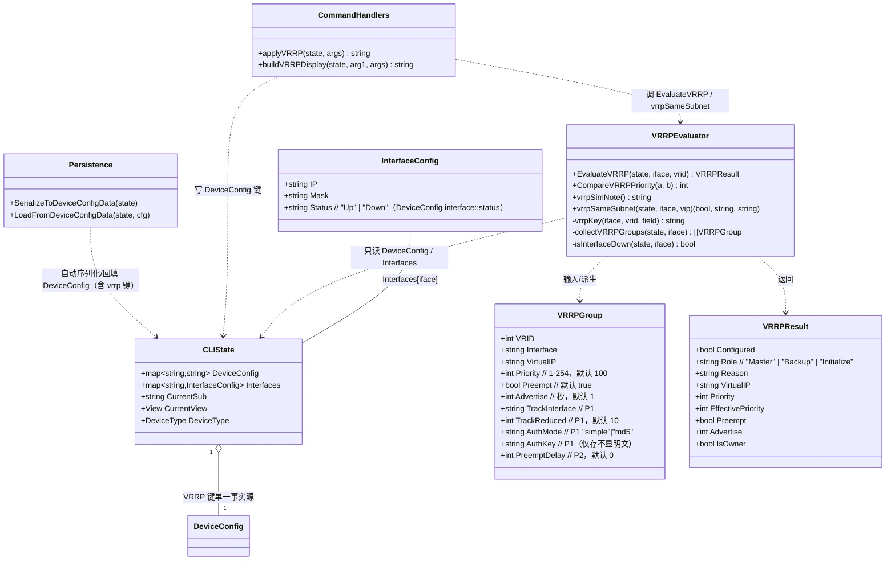
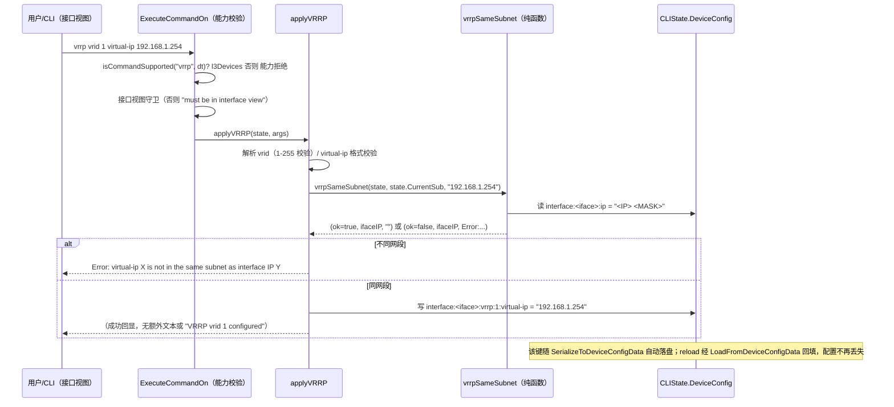
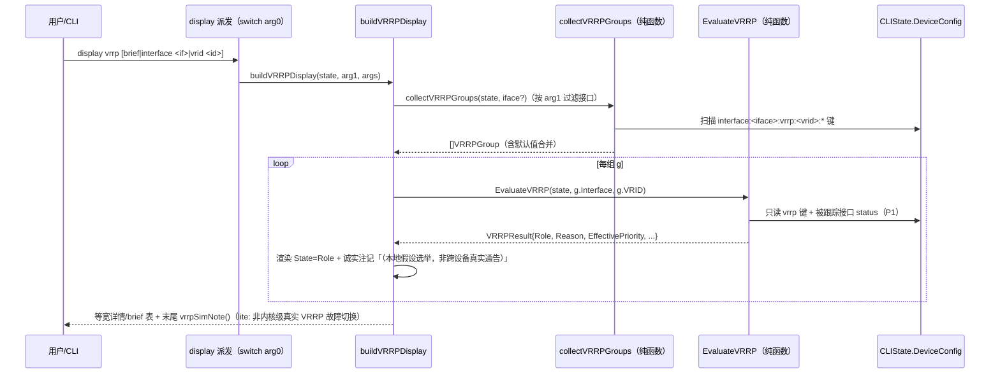
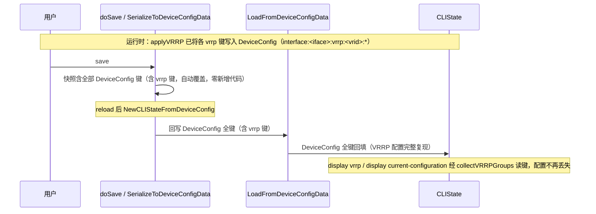

# ensp-lab P2 第三项：VRRP（华为 VRP 实训课程 60/61）增量设计 + 任务分解

> 文档类型：实现前技术设计（架构师 高见远 / Gao）
> 关联输入：`docs/p2-vrrp-prd.md`（许清楚）、`docs/p2-portsec-design.md`（端口安全增量设计，结构对齐基准）、`docs/p2-nat-design.md`（NAT 增量设计）、`internal/cli/parser.go` / `state.go` / `capabilities.go` / `acl_eval.go` / `portsec_eval.go`（已核查代码基线）
> 基线：P1-C / P1-F / NAT / 端口安全「CLIState 层纯函数、单一事实源 `DeviceConfig`、诚实占位、零改动 `sim` 引擎」——本期**完全沿用**，VRRP 仅作为 `cli` 包内增量
> 语言：中文。仅含类型/函数签名与伪代码，不含实现代码（实现是工程师下一阶段）。

---

## 0. 拍板结论（已取代 PRD §6 待确认，设计据此落地）

主理人已对 PRD §6 的 6 项待确认逐一拍板，设计严格照此执行：

1. **力度（#1）**：P0 = **VRP 规范格式重写 + `DeviceConfig` 持久化（修掉残桩 save/reload 丢配置）+ `display` 忠实展示 + 纯函数选举（本地假设）+ 诚实占位**。track / auth / undo 归 P1；抢占延迟 timer、跨设备真实选举归 P2（本期不做）。**virtual-ip 同网段校验纳入 P0。**
2. **主备角色呈现（#2）**：采用 **(a) + 诚实注记**——按本地配置静态算 Master（virtual-ip 拥有者 / priority 255 直接 Master；否则假设本设备即最高优先级 → Master），标注「本地静态假设选举，非跨设备真实 VRRP 通告」。否决仅 Initialize。
3. **跨设备真实选举（#3）**：本期 **out-of-scope**，仅本地静态选举 + 诚实注记；未来若建设拓扑 peer 选举再接（见 P2 / §8 O1）。
4. **同网段校验（#4）**：P0 做**语法同网段校验**（借接口 IP 掩码判定）。失败回显 `Error: virtual-ip X is not in the same subnet as interface IP Y`，诚实说明仅静态掩码校验、非真实 ARP 代理。
5. **能力归属（#5）**：保持现有 `l3Devices()`（Router / L3Switch / Firewall / VTEP），最小改动（`capabilities.go:57` 已为 `"vrrp": l3Devices()`，不碰）。
6. **默认值（#6）**：priority 默认 **100**、preempt 默认**开启**（disable 才关）、advertise 默认 **1s**。

---

## 1. 实现方案 + 框架选型

### 1.1 总体定位

在 `cli` 包内**就地重写** P1 残桩 `vrrp` 分支（`parser.go:1793-1838`），把 VRRP 从「仅写入 `state.VRRP` 结构化 map、不持久化、无状态机、无诚实占位」升级为一条可对学员实验产生可观测反馈的 L3 网关冗余链路。严格遵循既有架构基线：

- **不修改 `sim` 引擎**（engine 零改动，VRRP 在 CLIState 层语义做，引擎不感知；`internal/protocol` 的 `VRRPState`/`VRRPGroup`/`StartVRRP` 是另一套**独立真实引擎 VRRP**，本期**完全不触碰**）。
- **纯函数 `EvaluateVRRP`** 与 `EvaluatePortSecurity` / `applyNAT` 同一契约：只读 `DeviceConfig` 中 vrrp 键，无副作用、不写引擎、不 `import protocol`、可单测。
- **副作用一律由命令处理器执行**：`applyVRRP` 解析后写入 `DeviceConfig` 键，`buildVRRPDisplay` 读键渲染并调用纯函数拿角色——与 `EvaluatePortSecurity` / `handleSimulateFrame` 模式一致。

### 1.2 配置单一事实源 = `DeviceConfig`（核心修复 + 架构决策）

**移除 `state.VRRP` 字段与 `VRRPConfig` 类型**（`state.go:58`、`state.go:276-282`、`state.go:517` 构造器初始化）。经 grep 全仓核实，`cli` 包内对 `state.VRRP` / `VRRPConfig` 的引用**仅 6 处**（state.go 3 处 + parser.go 3 处：桩写入 :1831、display current-configuration :2689、display vrrp :3630），无测试或其他文件引用；`internal/protocol` 的 VRRP 为独立类型，不受影响。移除后：

- VRRP 全部状态以 `interface:<iface>:vrrp:<vrid>:<field>` 键存于 `state.DeviceConfig`（单一事实源）。
- `DeviceConfig` 经既有 `SerializeToDeviceConfigData` / `LoadFromDeviceConfigData`（`parser.go:4618` / `:4649`）自动往返持久化，**零新增持久化代码**，reload 后 VRRP 配置完整复现——直接修复残桩丢配置缺陷。
- 显示期需要的「组视图」由 `vrrp_eval.go` 的 `collectVRRPGroups(state, iface)` 纯函数从 `DeviceConfig` 即时派生为 `VRRPGroup` 结构（内存派生、不缓存、不重复），彻底消除「双写不一致」风险。

> **架构决策（重要）**：相比「保留 `state.VRRP` 作为内存派生缓存」，`移除` 是更干净、更贴合「单一事实源 = DeviceConfig」基线的方案——VRRP 无运行态表（不像端口安全需 `MACTable` 运行态），故无需保留独立内存结构。此决策使 reload 丢配置缺陷**从根上消除**。

### 1.3 框架 / 库选型

- **不引入任何新依赖**：仅用 Go 标准库（`fmt`、`strings`、`strconv`、`net`）+ 仓库内既有 `internal/cli`、`internal/sim`（仅读 `EngineModeName()` 决定 lite/full 注记）。
- 复用：既有 `ExecuteCommandOn` 能力校验（`parser.go:245`，`capabilities.go:57` `"vrrp": l3Devices()`）、`undo` 分支（`parser.go:860-907`）、`display` 派发 `switch arg0`（`parser.go:3628` 处 `case "vrrp"`）、`SerializeToDeviceConfigData` / `LoadFromDeviceConfigData`、`portsec_eval.go` 的 `psKey` 写法（作 `vrrpKey` 参照）。

### 1.4 设备能力矩阵（沿用，零改动）

| 命令 | 能力集合 | 守卫位置 |
|---|---|---|
| `vrrp vrid ...` | `l3Devices()`（Router / L3Switch / Firewall / VTEP） | `capabilities.go:57`（既有）+ `ExecuteCommandOn` 通用校验（`parser.go:245`） |
| `undo vrrp vrid ...` | 同上（并入 `undo` 分支） | 同上 |
| `display vrrp [brief\|interface\|vrid]` | 不强制能力门禁（只读 `DeviceConfig`，非 L3 设备无对应键，自然显示 `Not configured`） | 仅 `display` 派发内 `arg0=="vrrp"` 分支 |
| `display current-configuration` | 不强制 | 仅读 `DeviceConfig` vrrp 键 |

> 非接口视图执行 `vrrp` → `Error: must be in interface view`（沿用残桩守卫）；非 `l3Devices()` 设备（Switch / PC）→ 能力拒绝（沿用 `ExecuteCommandOn`）。

### 1.5 角色呈现策略（拍板 #2(a) + 诚实注记）

`EvaluateVRRP` 本地静态选举规则：
1. 该 `iface:vrid` 无 `virtual-ip` 键（组未配齐） → `Role="Initialize"`，Reason `VRRP group not configured`。
2. `Priority==255`（虚拟 IP 拥有者） → `Role="Master"`，Reason `Virtual IP owner (priority 255)`，`IsOwner=true`。
3. 其余 → `Role="Master"`，Reason `Local static assumption (highest priority); not a cross-device advertisement`（拍板 #2(a) 假设本设备即最高优先级）。

`display vrrp` 在每行 State 后追加诚实注记「（本地假设选举，非跨设备真实通告）」，并在输出末尾追加 `vrrpSimNote()`（lite：「非内核级真实 VRRP 故障切换」）。**本期任何情况下不会臆造 Backup**（Backup 仅在未来 P2 跨设备选举中出现，见 §8 O2）。

---

## 2. 文件列表及相对路径（逐一确认）

| 文件 | 操作 | 责任（一行） |
|---|---|---|
| `internal/cli/vrrp_eval.go` | **新增（核心纯函数）** | ① `VRRPGroup` / `VRRPResult` 类型；② `EvaluateVRRP(state, iface, vrid) VRRPResult`（纯函数本地静态选举）；③ `CompareVRRPPriority(a, b VRRPGroup) int`（纯比较，AC4 / P2 预留）；④ `vrrpSimNote()`（诚实占位 lite/full 两态）；⑤ `vrrpSameSubnet(state, iface, virtualIP) (bool, string, string)`（同网段校验纯函数，P0）；⑥ key 常量 + `vrrpKey(iface, vrid, field)` helper + 范围常量；⑦ `collectVRRPGroups(state, iface) []VRRPGroup`（从 DeviceConfig 派生组视图，合并默认值）；⑧ `isInterfaceDown(state, iface) bool`（P1 track 用，读 `interface:<iface>:status`）。 |
| `internal/cli/parser.go` | **修改（3 处，分属 T01/T03/T04）** | ① **T01**：重写顶层 `case "vrrp"`（:1793）为 `applyVRRP`，按 VRP 子命令写 `DeviceConfig` 键 + 调 `vrrpSameSubnet` 校验 + 范围/格式拒错；② **T03**：重写 `display` 派发 `case "vrrp"`（:3628）为 `buildVRRPDisplay`，支持 `brief` / `interface` / `vrid` 子命令；改写 `display current-configuration`（:2689）vrrp 行由 `ip %s` → 读 `DeviceConfig` 键按 VRP 格式输出 `virtual-ip`；③ **T04**：`undo` 分支（:860-907）扩展 `undo vrrp`；`applyVRRP` 增 P1 的 `track interface` / `authentication-mode` 子命令。 |
| `internal/cli/state.go` | **修改（T02，3 处，移除）** | 删除 `VRRP map[int]*VRRPConfig` 字段（:58）、`VRRPConfig` 类型定义（:276-282）、构造器 `VRRP: make(...)`（:517）。无新增结构体。 |
| `internal/cli/capabilities.go` | **不改** | `"vrrp": l3Devices()`（:57）保持不动；`l3Devices()`（:166-173）保持不动。 |
| `internal/cli/vrrp_eval_test.go` | **新增（T05，单测）** | 覆盖 `EvaluateVRRP`（Initialize / Owner-Master / 静态 Master）、`CompareVRRPPriority`（高优先级胜 / 同优先级比 IP / 255 拥有者胜 / 确定性 tie-break）、`vrrpSameSubnet`（同/不同网段）、纯函数无副作用（连续两次一致、不改写 state/DeviceConfig）、track 降优先级（P1）。 |
| `internal/cli/p2_vrrp_test.go` | **新增（T05，单元/集成）** | 覆盖 AC1（命令接受 + 拒错：vrid/priority/advertise 越界、非接口视图、能力拒绝、不同网段 `Error`）、AC2（save→reload 后 `display vrrp` / `display current-configuration` 复现——验证丢配置缺陷已修复）、AC3（`display vrrp` 列头/单组详情/brief/interface/vrid 渲染、`current-configuration` 输出 `virtual-ip`）。 |
| `internal/cli/p2_vrrp_qa_test.go` | **新增（T06，QA 验收）** | 端到端核对 AC4（选举 + tie-break）、AC5（lite 诚实占位注记 + 角色诚实文案）、AC6（纯函数无副作用契约），P1 track/auth/undo 端到端。 |

> 说明：`internal/protocol`（真实引擎 VRRP：`VRRPState`/`VRRPGroup`/`StartVRRP`/`SimulateVRRPFailover`）**零改动**；`sim` 引擎零改动；`state.go` 除移除 VRRP 外其余零改动。

---

## 3. 数据结构和接口（类图 + 签名）

### 3.1 类图（Mermaid）



### 3.2 核心类型与函数签名（落在 `vrrp_eval.go` / `parser.go`）

```go
// —— 移除既有类型（state.go）——
// 删除 VRRPConfig{GroupID,VirtualIP,Priority,Preempt,Delay}（state.go:276-282）
// 删除 CLIState.VRRP map[int]*VRRPConfig 字段（state.go:58）与构造器初始化（state.go:517）。
// 派生视图改由下方 VRRPGroup 表示（vrrp_eval.go，内存只读、不缓存）。

// VRRPGroup 是从 DeviceConfig 派生的单组配置视图（collectVRRPGroups 产出）。
type VRRPGroup struct {
    VRID            int
    Interface       string
    VirtualIP       string
    Priority        int    // 1-254，默认 100
    Preempt         bool   // 默认 true（enable）
    Advertise       int    // 秒，默认 1
    TrackInterface  string // P1：被跟踪上行口（"" 表示未配）
    TrackReduced    int    // P1：降优先级值，默认 10
    AuthMode        string // P1："simple" | "md5"（"" 表示未配）
    AuthKey         string // P1：仅存储，display 脱敏，不做真实认证
    PreemptDelay    int    // P2：抢占延迟秒，默认 0（仅配置态 + 诚实注记）
}

// VRRPResult 是 EvaluateVRRP 的纯函数返回。
//   - Configured=false → 组未配齐（无 virtual-ip 键），Role="Initialize"。
//   - Role="Master"（拍板 #2(a) 本地静态假设）或未来 P2 跨设备 "Backup"。
//   - EffectivePriority = Priority −（P1：被跟踪接口 Down 时 TrackReduced）。
//   - IsOwner=true 表示 Priority==255（虚拟 IP 拥有者）。
type VRRPResult struct {
    Configured        bool
    Role              string // "Master" | "Backup" | "Initialize"
    Reason            string // 选举原因/诚实文案
    VirtualIP         string
    Priority          int
    EffectivePriority int
    Preempt           bool
    Advertise         int
    IsOwner           bool
}

// —— DeviceConfig 键名约定（单一事实源，vrrp_eval.go 内常量）——
//   interface:<iface>:vrrp:<vrid>:virtual-ip    = "<ip>"
//   interface:<iface>:vrrp:<vrid>:priority      = "<1-254>"        (缺省 100)
//   interface:<iface>:vrrp:<vrid>:preempt       = "enable"|"disable" (缺省 enable)
//   interface:<iface>:vrrp:<vrid>:advertise     = "<1-255>"        (缺省 1)
//   interface:<iface>:vrrp:<vrid>:track-iface   = "<iface>"        (P1)
//   interface:<iface>:vrrp:<vrid>:track-reduced = "<1-255>"        (P1, 缺省 10)
//   interface:<iface>:vrrp:<vrid>:auth-mode     = "simple"|"md5"   (P1)
//   interface:<iface>:vrrp:<vrid>:auth-key      = "<key>"          (P1, 仅存不显明文)
//   interface:<iface>:vrrp:<vrid>:preempt-delay = "<0-3600>"       (P2, 仅配置态)
//   组存在标记：interface:<iface>:vrrp:<vrid>:virtual-ip 存在即视为一组已配。
const (
    vrrpVRIDMin, vrrpVRIDMax             = 1, 255
    vrrpPriMin, vrrpPriMax               = 1, 254
    vrrpAdvMin, vrrpAdvMax               = 1, 255
    vrrpPriDefault                       = 100
    vrrpAdvDefault                       = 1
    vrrpTrackReducedDefault              = 10
    vrrpPreemptDelayMin, vrrpPreemptDelayMax = 0, 3600
)

// vrrpKey 拼接 VRRP 键名：interface:<iface>:vrrp:<vrid>:<field>。
func vrrpKey(iface string, vrid int, field string) string

// EvaluateVRRP 本地静态主备选举纯函数（无副作用、不写引擎、不 import protocol、可单测）。
//   1) vrid 在 iface 下无 virtual-ip 键（未配齐）→ {Configured:false, Role:"Initialize", Reason:"VRRP group not configured"}
//   2) Priority==255（虚拟 IP 拥有者）→ {Role:"Master", Reason:"Virtual IP owner (priority 255)", IsOwner:true}
//   3) 否则（拍板 #2(a)）→ {Role:"Master", Reason:"Local static assumption (highest priority); not a cross-device advertisement"}
// EffectivePriority = Priority −（P1：TrackInterface 非空且 isInterfaceDown(TrackInterface) 时 TrackReduced，缺省 10）。
// 不修改任何 state 字段、不写 DeviceConfig、不 import sim 引擎实例；仅 vrrpSimNote 读 sim.EngineModeName()。
func EvaluateVRRP(state *CLIState, iface string, vrid int) VRRPResult

// CompareVRRPPriority 比较两组优先级决定胜负（纯函数，无副作用；AC4 / P2 跨设备预留）。
//   规则：Priority==255（虚拟 IP 拥有者）直接胜；否则高 Priority 胜；
//        同 Priority 比接口 IP 大者胜（a.Interface/b.Interface 的本设备接口 IP，
//        取自 DeviceConfig interface:<iface>:ip = "<IP> <MASK>"）；
//   返回 >0 表示 a 胜、<0 表示 b 胜、0 表示完全相等（确定性 tie-break）。
func CompareVRRPPriority(a, b VRRPGroup) int

// vrrpSimNote 返回 VRRP「诚实占位」注记（lite/full 两态，口径同 aclSimNote/natSimNote/portSecSimNote）。
//   lite → "（VRRP 为模拟选举（lite 引擎），非内核级真实 VRRP 故障切换）"
//   full → "（VRRP 为模拟选举）"
func vrrpSimNote() string

// vrrpSameSubnet 校验 virtual-ip 与接口 IP 同网段（纯函数，P0 同网段校验）。
//   读 DeviceConfig["interface:<iface>:ip"]（= "<IP> <MASK>"，见 parser.go:447/456）；
//   用 MASK 算 network(virtualIP) 与 network(ifaceIP) 比较是否相等。
//   返回 (ok, ifaceIP, errMsg)：失败时 errMsg = "Error: virtual-ip X is not in the same subnet as interface IP Y"，
//   并诚实说明仅静态掩码校验、非真实 ARP 代理。不依赖 sim 引擎、不写任何 state。
func vrrpSameSubnet(state *CLIState, iface, virtualIP string) (ok bool, ifaceIP, errMsg string)

// collectVRRPGroups 从 DeviceConfig 派生某接口下所有已配 VRRP 组（合并默认值）。
//   扫描 interface:<iface>:vrrp:<vrid>:virtual-ip 存在即视为一组；逐键回填字段；
//   Priority 缺省 100、Preempt 缺省 true、Advertise 缺省 1、TrackReduced 缺省 10。
//   只读 DeviceConfig，无副作用；返回按 vrid 升序。
func collectVRRPGroups(state *CLIState, iface string) []VRRPGroup

// isInterfaceDown 读 DeviceConfig["interface:<iface>:status"]=="Down" 判定被跟踪接口是否 Down（P1 track 用）。
func isInterfaceDown(state *CLIState, iface string) bool
```

```go
// —— parser.go 改动签名（仅签名，不写实现）——
// applyVRRP（重写，T01/T04）：替换 parser.go:1793 扁平残桩。state.CurrentSub 为目标接口。
// 解析 VRP 子命令并写对应 DeviceConfig 键：
//   vrrp vrid <1-255> virtual-ip <ip>          → 写 :virtual-ip；先调 vrrpSameSubnet 校验，失败回 Error
//   vrrp vrid <1-255> priority <1-254>         → 写 :priority
//   vrrp vrid <1-255> preempt-mode disable     → 写 :preempt="disable"（enable 可省略，默认开启）
//   vrrp vrid <1-255> timer advertise <1-255>  → 写 :advertise
//   [P1] vrrp vrid <1-255> track interface <iface> [reduced <1-255>]
//                                              → 写 :track-iface / :track-reduced（reduced 缺省 10）
//   [P1] vrrp vrid <1-255> authentication-mode {simple|md5} <key>
//                                              → 写 :auth-mode / :auth-key（仅存不显明文）
// 范围/格式非法 → "Error: ..."；非接口视图 → "Error: must be in interface view"；
// 能力校验沿用 ExecuteCommandOn 的 isCommandSupported（capabilities.go:57 已 "vrrp": l3Devices()）。
func applyVRRP(state *CLIState, args []string) string

// buildVRRPDisplay（重写，T03）：替换 parser.go:3628 的 display vrrp 分支。
//   arg1==""        → 遍历所有接口所有组，逐组详情（含 EvaluateVRRP 角色 + vrrpSimNote 诚实注记）
//   arg1=="brief"   → 摘要表：Interface / VRID / Virtual IP / Priority / Role
//   arg1=="interface" → 单接口所有组详情（args[2] 为目标接口名）
//   arg1=="vrid"    → 跨接口匹配该 vrid 的组详情（args[2] 为 vrid）
//   只读 collectVRRPGroups + EvaluateVRRP；无副作用。
func buildVRRPDisplay(state *CLIState, arg1 string, args []string) string

// buildSavedVRRPConfig（T03，并入 display current-configuration，parser.go:2689）——
// 遍历 DeviceConfig vrrp 键，对每组输出 VRP 合规行：
//   "vrrp vrid <vrid> virtual-ip <vip>"
//   [若 Priority!=100] "vrrp vrid <vrid> priority <P>"
//   [若 Preempt==false] "vrrp vrid <vrid> preempt-mode disable"
//   [若 Advertise!=1] "vrrp vrid <vrid> timer advertise <A>"
//   [P1 若配] "vrrp vrid <vrid> track interface <if> [reduced <n>]" / "vrrp vrid <vrid> authentication-mode <mode> <key>"
// 修掉旧 "vrrp vrid %d ip %s" 的非合规格式。
func buildSavedVRRPConfig(state *CLIState) string
```

---

## 4. 程序调用流程（时序图）

### 4.1 `vrrp vrid X virtual-ip Y` → DeviceConfig 写入（核心接线契约，AC1 + 丢配置修复）



### 4.2 `display vrrp` 选举渲染（AC3 / AC5）



### 4.3 VRRP 配置持久化往返（修掉残桩丢配置缺陷，AC2）



> 注：因 VRRP 状态**本就只在 DeviceConfig**，无需如端口安全那样在 `LoadFromDeviceConfigData` 新增「粘滞回填」分支——这是移除 `state.VRRP`、单一事实源方案的直接红利。

---

## 5. 任务列表（有序、含依赖、按实现顺序）

> 共 6 个任务（对齐端口安全 T01-T07 / NAT T01-T04 的团队约定；测试独立拆 T05/T06）。核心逻辑在 `vrrp_eval.go`（T02）与 `parser.go`（T01/T03/T04），`state.go` 移除在 T02，单测 T05、QA T06。

### T01 ｜ `vrrp` 命令族重写（applyVRRP：VRP 规范格式 + DeviceConfig 写入 + 同网段校验 + 拒错守卫）
- **涉及文件**：`internal/cli/parser.go`（重写顶层 `case "vrrp"`，原 :1793-1838 残桩）。
- **依赖**：T02（消费 `vrrpKey` 键名约定 + `vrrpSameSubnet` 纯函数做同网段校验；逻辑可并行，为执行顺序设依赖）。
- **内容（对齐 AC1）**：
  1. `applyVRRP(state, args)`：解析 `vrrp vrid <1-255> virtual-ip <ip>` → 写 `interface:<iface>:vrrp:<vrid>:virtual-ip`，并**先调 `vrrpSameSubnet` 校验**，失败回 `Error: virtual-ip X is not in the same subnet as interface IP Y`。
  2. `vrrp vrid <1-255> priority <1-254>` → 写 `:priority`（范围 1-254，越界 `Error:`）。
  3. `vrrp vrid <1-255> preempt-mode disable` → 写 `:preempt="disable"`（enable 可省略，默认开启）。
  4. `vrrp vrid <1-255> timer advertise <1-255>` → 写 `:advertise`（范围 1-255，默认 1，越界 `Error:`）。
  5. vrid 越界（非 1-255）/ virtual-ip 非法 / 非接口视图（`must be in interface view`）/ 能力拒绝（沿用 `ExecuteCommandOn`）均明确 `Error:`。
  6. 保留既有成功回显风格（如 `VRRP vrid 1 configured`）。
- **行数估计**：约 +90 / -45 行（`applyVRRP` 替换残桩 + 校验）。
- **优先级**：P0。

### T02 ｜ `vrrp_eval.go` 纯函数评估器 + 移除 `state.VRRP`
- **涉及文件**：`internal/cli/vrrp_eval.go`（**新增**）；`internal/cli/state.go`（**修改**：删除 `VRRP` 字段 :58、`VRRPConfig` 类型 :276-282、构造器初始化 :517）。
- **依赖**：无（地基任务）。
- **内容（对齐 AC4 / AC5 / AC6 / 拍板 #2+#4）**：
  1. `VRRPGroup` / `VRRPResult` 类型；范围常量；`vrrpKey` helper。
  2. `EvaluateVRRP(state, iface, vrid) VRRPResult`：本地静态选举（Initialize / Owner-Master / 静态 Master），计算 `EffectivePriority`（P1 track 降优先级）。
  3. `CompareVRRPPriority(a, b VRRPGroup) int`：纯比较（AC4 tie-break / P2 预留）。
  4. `vrrpSameSubnet(state, iface, vip) (bool, string, string)`：同网段校验纯函数。
  5. `vrrpSimNote()`（lite/full 两态）、`collectVRRPGroups`（派生组视图 + 默认值合并）、`isInterfaceDown`（P1 track）。
  6. **移除 `state.VRRP` / `VRRPConfig`**：确认 `cli` 包内仅 6 处引用（state.go 3 + parser.go 3），删除后 parser.go 的 :1831 / :2689 / :3630 由 T01/T03 改为读 `DeviceConfig`。
- **行数估计**：vrrp_eval.go 约 +220 行；state.go 约 -15 行。
- **优先级**：P0。

### T03 ｜ `display vrrp [brief|interface|vrid]` + `display current-configuration` 重写
- **涉及文件**：`internal/cli/parser.go`（`display` 派发 `case "vrrp"` 原 :3628 重写为 `buildVRRPDisplay`；`display current-configuration` 原 :2689 重写为 `buildSavedVRRPConfig`）。
- **依赖**：T02（读 `collectVRRPGroups` / `EvaluateVRRP` / `vrrpSimNote`）。
- **内容（对齐 AC3 / AC5）**：
  1. `buildVRRPDisplay(state, arg1, args)`：`arg1==""` 全接口逐组详情；`brief` 摘要表（Interface/VRID/VirtualIP/Priority/Role）；`interface <if>` 单接口详情；`vrid <id>` 跨接口匹配详情。每 State 后附「（本地假设选举，非跨设备真实通告）」，末尾附 `vrrpSimNote()`。
  2. 列头/对齐对齐 PRD §4 样例；未配置显示 `VRRP: Not configured`。
  3. `buildSavedVRRPConfig`：遍历 DeviceConfig vrrp 键输出 VRP 合规行（修掉旧 `ip %s`），含 priority/preempt/advertise（差异值才输出）。
- **行数估计**：约 +130 / -25 行。
- **优先级**：P0。

### T04 ｜ P1 增强（track interface / authentication-mode / undo vrrp）
- **涉及文件**：`internal/cli/parser.go`（`applyVRRP` 扩展 P1 子命令；`undo` 分支 :860-907 扩展 `undo vrrp`）。
- **依赖**：T01、T02（扩展同套命令解析 + 评估器）。
- **内容（对齐 P1 需求）**：
  1. `vrrp vrid <1-255> track interface <iface> [reduced <1-255>]` → 写 `:track-iface` / `:track-reduced`（reduced 缺省 10）；`EvaluateVRRP` 据 `isInterfaceDown(track-iface)` 降 `EffectivePriority`。
  2. `vrrp vrid <1-255> authentication-mode {simple|md5} <key>` → 写 `:auth-mode` / `:auth-key`（仅存不显明文，display 脱敏/不显 key）。
  3. `undo vrrp vrid <id> [virtual-ip <ip>]`：删对应 `interface:<iface>:vrrp:<id>:*` 键（指定 virtual-ip 则仅删该组全部键；否则按 vrid 删全部字段键），并入 `undo` 分支。
  4. `buildVRRPDisplay` 详情附 track 状态（被跟踪接口 / reduced / 有效优先级）、认证模式（仅模式，不显明文 key）。
- **行数估计**：约 +80 行。
- **优先级**：P1。

### T05 ｜ 单元/集成单测（工程师）
- **涉及文件**：`internal/cli/vrrp_eval_test.go`（新增）；`internal/cli/p2_vrrp_test.go`（新增）。
- **依赖**：T01、T02、T03、T04（测试前述全部实现）。
- **内容（对齐 AC1/AC2/AC3/AC4/AC5/AC6）**：
  - `vrrp_eval_test.go`：`EvaluateVRRP`（Initialize / Owner-Master / 静态 Master）、`CompareVRRPPriority`（高优先级胜 / 同优先级比 IP / 255 拥有者胜 / 确定性 tie-break）、`vrrpSameSubnet`（同/不同网段）、纯函数无副作用（连续两次一致、不改写 state/DeviceConfig）、track 降优先级（P1）。
  - `p2_vrrp_test.go`：AC1（vrid/priority/advertise 越界拒错、非接口视图 `interface view`、Switch/PC 能力拒绝、不同网段 `Error`）；AC2（**save→reload 后 `display vrrp` / `display current-configuration` 复现**——验证丢配置缺陷已修复）；AC3（`display vrrp` 列头/单组详情/brief/interface/vrid、`current-configuration` 输出 `virtual-ip`）。
- **行数估计**：约 +260 行。
- **优先级**：P0。

### T06 ｜ QA 端到端验收（AC4/AC5/AC6 + P1 收口）
- **涉及文件**：`internal/cli/p2_vrrp_qa_test.go`（新增）。
- **依赖**：T05（单测通过后做端到端）。
- **内容（对齐 AC4/AC5/AC6 + 拍板 #2/#4）**：
  - AC4：多组配置下 `EvaluateVRRP` 角色（Owner→Master、静态→Master）+ `CompareVRRPPriority` tie-break 确定性。
  - AC5：lite 引擎下 `display vrrp` 带「非内核级真实 VRRP 故障切换」注记 + 角色诚实文案；不臆造 Backup。
  - AC6：纯函数无副作用契约（不 `import protocol`、零新依赖、连续两次一致）。
  - P1 端到端：track 接口 shutdown 后 `display vrrp` 见降后有效优先级；`authentication-mode` 配置持久化与脱敏展示；`undo vrrp` 后配置消失且 reload 不复现。
- **行数估计**：约 +150 行 QA 测试。
- **优先级**：P1（验收收口）。

---

## 6. 依赖包列表

- **无新增第三方依赖**。仅用 Go 标准库（`fmt`、`strings`、`strconv`、`net`）+ 仓库内既有 `internal/cli`、`internal/sim`（仅读 `EngineModeName()` 决定 lite/full 注记）。
- **明确不新增** `cli → protocol` 依赖（延续 P1-C / 端口安全约定）：VRRP 评估器只消费 `state.DeviceConfig`，与 `protocol.VRRPState` / `protocol.StartVRRP` 无关，绝不新建对其调用（`internal/protocol` 的真实引擎 VRRP 本期零改动）。

---

## 7. 共享知识（跨文件约定）

1. **键名单一事实源**：所有 VRRP 状态存于 `state.DeviceConfig["interface:<iface>:vrrp:<vrid>:<field>"]`（§3.2 完整表）。组存在标记 = `:virtual-ip` 键存在。新增键一律以 `vrrp:<vrid>:` 前缀，避免与其他接口级键冲突。
2. **纯函数契约（架构基线）**：`EvaluateVRRP` / `CompareVRRPPriority` / `vrrpSameSubnet` **只读** `DeviceConfig` / `Interfaces`，**不写**任何 state 字段（不写 `DeviceConfig`、不 `import protocol` 引擎实例、不碰 `sim`）；副作用（写 `DeviceConfig` 键）由 `applyVRRP` 依据解析结果落地。与 `applyNAT` / `EvaluatePortSecurity` 同构（返回新值，调用方应用）。
3. **移除 `state.VRRP` 的安全边界**：`cli` 包内 `state.VRRP` / `VRRPConfig` 引用仅 6 处（state.go 3 + parser.go 3），`internal/protocol` 的 `VRRPState`/`VRRPGroup` 为独立类型且本期零改动；移除后显示一律经 `collectVRRPGroups` 派生，无内存缓存不一致风险。
4. **同网段校验语义（诚实边界）**：`vrrpSameSubnet` 仅借 `interface:<iface>:ip = "<IP> <MASK>"`（parser.go:447/456）做**静态掩码判定**，非真实 ARP 代理 / 引擎可达性验证；失败文案诚实说明「仅静态掩码校验」。接口未配 IP（`interface:<iface>:ip` 缺失）时视为校验失败（virtual-ip 无参照网段）→ 回 `Error: interface X has no IP address configured`。
5. **诚实占位落点**：`display vrrp` 输出统一在 State 后附「（本地假设选举，非跨设备真实通告）」并在末尾追加 `vrrpSimNote()`（lite：「（VRRP 为模拟选举（lite 引擎），非内核级真实 VRRP 故障切换）」/ full：「（VRRP 为模拟选举）」）。口径复用 `aclSimNote` / `natSimNote` / `portSecSimNote` 风格。
6. **角色呈现（拍板 #2(a)）**：本期 `EvaluateVRRP` 对「已配组」恒返回 `Master`（Owner 或本地静态假设）；`Initialize` 仅用于未配齐组。绝不臆造 `Backup`（Backup 留待 P2 跨设备选举，见 §8 O2）。
7. **默认值（拍板 #6）**：priority 默认 100、preempt 默认开启（键缺省即开启，`disable` 才写 `:preempt="disable"`）、advertise 默认 1s、track-reduced 默认 10、preempt-delay 默认 0。读取时键缺失即取默认值。
8. **display current-configuration 保真度**：输出仅对「非默认值」补行（priority!=100 / preempt 关闭 / advertise!=1），避免与旧 `ip %s` 格式冲突，且 `save`→`reload`→`display current-configuration` 可完整复现学员输入（AC2）。
9. **不破坏既有接口**：`capabilities.go` 零改动（保持 `"vrrp": l3Devices()`）；`sim` 引擎 / `protocol` 包零改动；`state.go` 除移除 VRRP 外零改动；`undo` 分支既有行为不变（仅扩展 `vrrp` 子命令）。
10. **track 被跟踪接口 Down 的来源（P1 诚实边界）**：`isInterfaceDown` 读 `interface:<iface>:status=="Down"`（parser.go:855/874 由 `shutdown`/`undo shutdown` 写入）；无真实链路事件自动触发，需学员显式 `shutdown` 被跟踪口——诚实占位，不臆造链路故障。

---

## 8. 待明确事项 + 拍板结论

### 8.1 拍板结论（显式闭合 PRD §6 的 6 项，见 §0）

全部 6 项已由主理人拍板闭合（§0），设计据此落地，无悬而未决的 PRD 级待确认项。重点复述：P0 一次性交付 VRP 规范重写 + DeviceConfig 持久化 + display 忠实展示 + 纯函数本地选举 + 诚实占位 + 同网段校验；track/auth/undo 归 P1；抢占延迟 / 跨设备选举归 P2（不做）；保持 `l3Devices()`；默认 priority 100 / preempt 开 / advertise 1s；角色 (a)+注记。

### 8.2 新发现的开放项（设计过程中识别，供团队知悉）

- **O1（跨设备真实选举 P2）— out-of-scope，已决策**：本期 `EvaluateVRRP` 仅本地静态选举（恒 Master + 诚实注记）。`CompareVRRPPriority` 已预留两组比较 + tie-break，未来 P2 若建设拓扑 peers 选举，只需给 `EvaluateVRRP` 增加 `peers []VRRPGroup` 入参、在规则 3 用 `CompareVRRPPriority` 与 peers 比较得出真实 Master/Backup——接口已留好扩展点，本期不加。
- **O2（Backup 角色本地不可见）— 诚实已知**：因拍板 #2(a) 本地静态假设恒为 Master，`display vrrp` 本期不会出现 Backup（除 Initialize）。这是诚实简化，已在输出注记说明；待 P2 跨设备选举后 Backup 将自然出现。
- **O3（authentication-mode 不做真实认证）— 仅配置态**：`auth-mode` / `auth-key` 仅持久化与展示（key 脱敏/不显明文），不做 md5 / simple 校验算法，不拦截任何「认证失败」——诚实占位，符合 PRD §7 不在范围。
- **O4（preempt timer delay 不计时）— P2 仅配置态**：`preempt-delay` 键仅配置态 + 诚实注记，无真实切换时序模拟（PRD P2）。
- **O5（track 依赖显式 shutdown）— 诚实边界**：被跟踪接口 Down 状态由学员显式 `shutdown` 触发（`interface:<iface>:status=="Down"`），无自动链路事件；诚实占位，不臆造故障。
- **O6（state.VRRP 移除影响）— 已核实安全**：`cli` 包内 `state.VRRP`/`VRRPConfig` 仅 6 处引用（state.go 3 + parser.go 3），`internal/protocol` 独立 VRRP 不触碰；移除后显示经 `collectVRRPGroups` 派生，无残留引用风险。
- **O7（同网段校验为静态掩码校验）— 诚实边界**：仅借接口 IP 掩码判定，非真实 ARP 代理 / 引擎可达性；失败文案已诚实说明。若接口无 IP 则视为校验失败（无参照网段）。
- **O8（多接口同 vrid 的归并）— 设计取舍**：`vrrp vrid <id>` 在每个接口独立成组（VRRP 组 per-interface），`display vrrp vrid <id>` 跨接口汇总同 vrid 组；不跨接口合并为单一「组」——贴合 VRP（VRRP 组绑定接口）。若团队要求「全局 vrid 唯一」，需加跨接口唯一性校验，本期默认 per-interface 独立。

---

## 附：关键 file:line 证据索引（供实现直接定位）

- `internal/cli/parser.go:1793-1838` `vrrp` 残桩（**T01 重写点**，扁平 `vrrp <id> <vip> [priority][preempt][delay]`，写 `state.VRRP` 非 DeviceConfig）。
- `internal/cli/parser.go:2689-2693` `display current-configuration` 旧 `vrrp vrid %d ip %s`（**T03** 改读 DeviceConfig 按 VRP 格式输出 `virtual-ip`）。
- `internal/cli/parser.go:3628-3647` `display vrrp` 分支（**T03** 重写为 `buildVRRPDisplay`，支持 brief/interface/vrid）。
- `internal/cli/state.go:58` `VRRP map[int]*VRRPConfig`（**T02 删除**）；`:276-282` `VRRPConfig`（**T02 删除**）；`:517` 构造器 `VRRP: make(...)`（**T02 删除**）。
- `internal/cli/capabilities.go:57` `"vrrp": l3Devices()`（**零改动**）；`:166-173` `l3Devices()` 定义（零改动）。
- `internal/cli/parser.go:245` `ExecuteCommandOn` 内 `isCommandSupported` 通用能力校验（复用，不碰）；`:860-907` `undo` 分支（**T04** 扩展 `undo vrrp`）。
- `internal/cli/parser.go:447/456` `interface:<iface>:ip = "<IP> <MASK>"` 写入（同网段校验读取源）；`:855/874` `interface:<iface>:status="Down"/"Up"`（track Down 读取源）。
- `internal/cli/parser.go:4618-4647` `SerializeToDeviceConfigData`（自动遍历 DeviceConfig 落盘，含 vrrp 键，零新增代码）；`:4649` 起 `LoadFromDeviceConfigData`（自动回填 DeviceConfig，含 vrrp 键）。
- `internal/cli/portsec_eval.go:7-10,45-69,179-244` 纯函数范式基准（`psKey` 写法、`EvaluatePortSecurity`、`portSecSimNote`）。
- `internal/cli/acl_eval.go:493-507` `aclSimNote` / `natSimNote`（lite/full 两态诚实占位口径基准）。
- `internal/protocol/protocol.go:151-164,882-938` 真实引擎 VRRP（`VRRPState`/`VRRPGroup`/`StartVRRP`/`SimulateVRRPFailover`）——**本期零改动、不 import**。

## 文档状态

- PRD §6 的 6 项待确认已由主理人拍板闭合（§0 / §8.1），设计据此落地。
- 关键架构决策已固化：**移除 `state.VRRP`/`VRRPConfig`、单一事实源改为 `DeviceConfig` 键**（从根上修复残桩 reload 丢配置）；纯函数 `EvaluateVRRP`/`CompareVRRPPriority`/`vrrpSameSubnet`/`vrrpSimNote` 落 `vrrp_eval.go`；角色本地静态假设恒 Master（拍板 #2(a)）+ 诚实注记；同网段校验纳入 P0。
- 文件改动清单确认：必改 `parser.go`（T01/T03/T04 共 3 处）、`state.go`（T02 移除 3 处）；新增 `vrrp_eval.go`（T02）+ 3 个测试文件（T05/T06）；`capabilities.go` / `sim` 引擎 / `protocol` 包零改动。
- 任务共 6 个（T01 命令重写 / T02 纯函数+移除 state.VRRP / T03 display / T04 P1 track-auth-undo / T05 单测 / T06 QA），均不触碰 `sim` 引擎、不 `import protocol`、不引入新依赖、保持纯函数。
- 仍待团队知悉的开放项：O1（跨设备选举 P2）/ O2（Backup 不可见）/ O3（auth 不校验）/ O4（preempt-delay 不计时）/ O5（track 需显式 shutdown）/ O6（移除安全）/ O7（静态掩码校验）/ O8（per-interface vrid 独立）——均非阻塞，可按建议默认继续。

_Last updated: 2026-08-09 · 架构师 高见远（Gao）_
